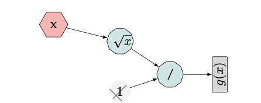
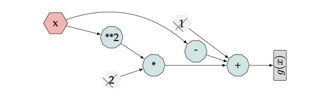
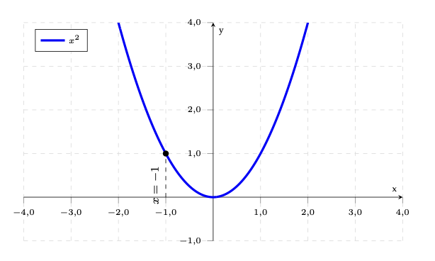
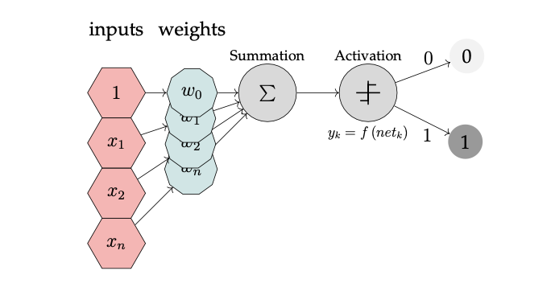
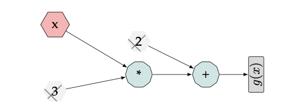
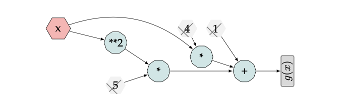
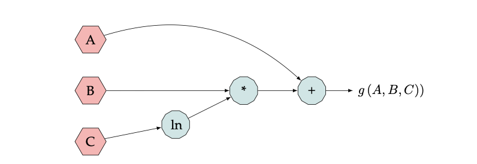

# Data Science Interview Questions And Answers


Topics
---

- [Calculus and Algorithmic Differentiation]()


## Calculus and Algorithmic Differentiation

Contents
----

- AD,Gradient descent and Backpropagation
- Numerical differentiation
- Directed Acyclic Graphs
- The chain rule  
- Taylor series expansion 
- Limits and continuity 
- Partial derivatives 
- Optimization 
- The Gradient descent algorithm 
- The Backpropagation algorithm
- Feed forward neural networks
- Activation functions, Autograd/JAX
- Dual numbers in AD
- Forward mode AD
- Forward mode AD table construction
- Symbolic differentiation
- Simple differentiation 
- The Beta-Binomial model

---

### AD, Gradient descent and Backpropagation


Q. Differentiable functions
1.  What does it mean when a function is differentiable?
1. Give an example of when a function doesn’t have a derivative at a point.
1. Give an example of non-differentiable functions that are frequently used in machine learning. How do we do backpropagation if those functions aren’t differentiable?

<details><summary><b>Answer</b></summary>
    
</details>

---

Q. Convexity
1. What does it mean for a function to be convex or concave? Draw it.
1. Why is convexity desirable in an optimization problem?
1. Show that the cross-entropy loss function is convex.

<details><summary><b>Answer</b></summary>
    
</details>

---

Q.  
1. Write the formulae for the finite difference rule used in numerical differentiation.
2. What is the main problem with this formulae?
3. Indicate one problem with software tools which utilize numerical differentiation and successive operations on floating point numbers.

<details><summary><b>Answer</b></summary>
    
</details>

---

Q.  
1. Given a function $f(x)$ and a point a, define the instantaneous rate of change of
$f(x)$ at $a$.
2. What other commonly used alternative name does the instantaneous rate of change have?
3. Given a function $f (x)$ and a point a, define the tangent line of $f (x)$ at a.

<details><summary><b>Answer</b></summary>
    
</details>

---

Q. 
1. State the definition of the derivative $f(c)$ of a function $f(x)$ at $x = c$.
2.  With respect to the DAG depicted in 5.3:
   
<table align='center'>
  <tr>
    <td align="center">
      
    </td>
  </tr>
  <tr>
    <td align="center"> An expression graph for g(x). Constants are shown in gray, crossed-out since derivatives should not be propagated to constant operands </td>
  </tr>
</table>
    
 - (a) Traverse the graph 5.3 and find the function g(x) it represents. 

- (b) Using the definition of the derivative, find g′(9).

<details><summary><b>Answer</b></summary>
    
</details>

---

Q. 
1. With respect to the expression graph depicted in 5.4, traverse the graph and find the function g(x) it represents.

<table align='center'>
<tr>
<td align="center">
    
</td>
</tr>
<tr>
<td align="center"> An expression graph for g(x). Constants are shown in gray, crossed-out since derivatives should not be propagated to constant operands </td>
</tr>
</table>
    
2. Using the definition of the derivative find the derivative of $g(x)$.

<details><summary><b>Answer</b></summary>
    
</details>

---

Q.  
1. The chain rule is key concept in differentiation. Define it.
2. Elaborate how the chain rule is utilized in the context of neural networks.

<details><summary><b>Answer</b></summary>
    
</details>

---

Q. Find the Taylor series expansion for:
1. $\frac{1}{1-x}$
2. $e^x$
3. $sin(x)$
4. $cos(x)$

<details><summary><b>Answer</b></summary>
    
</details>

---

Q. Find the Taylor series expansion for:

$$
\log(x)
$$

<details><summary><b>Answer</b></summary>
    
</details>

---

Q. Find the Taylor series expansion centered at $x = −3$ for:

$$
f(x) = 5x^2 − 11x + 1
$$

<details><summary><b>Answer</b></summary>
    
</details>

Q. Find the $101th$ degree Taylor polynomial centered at $x = 0$ for:

$$
f(x) = cos(x)
$$

<details><summary><b>Answer</b></summary>
    
</details>

---

Q. At $x = 1$, compute the first $7$ terms of the Taylor series expansion of:

$$
f (x) = ln 3x.
$$

<details><summary><b>Answer</b></summary>
    
</details>

---

Q. Find the following limits:
1. $\lim_{{x \to 3}}\frac{e^{x^3} - e^{27}}{3x - 9}$
2. $\lim_{{x \to 0}}\frac{e^{x^2} - x - 1}{3\cos x-x - 3}$
3. $\lim_{{x \to \inf}}\frac{x - ln x}{x^{1/100} + 4}$

<details><summary><b>Answer</b></summary>
    
</details>

---

Q. 
1. True or false: When applying a partial derivative, there are two variables considered constants - the dependent and independent variable.
2. Given $g(x, y)$, find its partial derivative with respect to x:

$$
g(x,y) = x^2y + yx + 8y
$$

<details><summary><b>Answer</b></summary>
    
</details>

---

Q. How can we use the Hessian (second derivative matrix) to test for critical points?

<details><summary><b>Answer</b></summary>
    
</details>

---

Q. The gradient of a two-dimensional function is given by

$$
∇f (x, y) = \frac{∂f}{∂x} i + \frac{∂f}{∂y}j
$$

1. Find the gradient of the function:

$$
f(x, y) = xy^2 - y^2 + x^3
$$

2. Given the function:

$$ 
g(x, y) = xy^2 − y − 1
$$

evaluate it at $(−1, 0)$, directed at $(1, 1)$.

<details><summary><b>Answer</b></summary>
    
</details>

---

Q. Find the partial derivatives of:

$$
f(x, y) = 3 sin^2(x − y)
$$

<details><summary><b>Answer</b></summary>
    
</details>

---

Q. Find the partial derivatives of:

$$
z = 2 sin(x) sin(y)
$$

<details><summary><b>Answer</b></summary>
    
</details>

---

Q. Consider $f(x) = \frac{x^2 + 1}{(x+2)^2}$
    1. Where is $f(x)$ well defined?
    2. Where is $f(x)$ increasing and decreasing?
    3. Where is $f(x)$ reaching minimum and maximum values.

<details><summary><b>Answer</b></summary>
    
</details>

---

Q. Consider $f(x) = 2x^3 − x$
1. Derive $f (x)$ and conclude on its behavior.
2. Derive once again and discuss the concavity of the function $f (x)$.

<details><summary><b>Answer</b></summary>
    
</details>

---

Q. Consider the function

$$
f(x,y)=2x^2 −xy + y^2
$$ 

and find maximum, minimum, and saddle points.

<details><summary><b>Answer</b></summary>
    
</details>

---

Q. The gradient descent algorithm can be utilized for the minimization of convex functions.
Stationary points are required in order to minimize a convex function. A very simple approach for finding stationary points is to start at an arbitrary point, and move along the gradient at that point towards the next point, and repeat until converging to a stationary point.
1. What is the term used to describe the vector of all partial derivatives for a function $f(x)$?
2. Complete the sentence: when searching for a minima, if the derivative is positive, the function is **increasing/decreasing.**
3. The function $x^2$ as depicted in 5.5, has a derivative of $f′(x) = 2x$. Evaluated at $x = −1$, the derivative equals $f′(x = −1) = −2$. $At x = −1$, the function is decreasing as $x$ gets larger. We will happen if we wish to find a minima using gradient descent, and increase (decrease) $x$ by the size of the gradient, and then again repeatedly keep jumping?
<table align='center'>
<tr>
<td align="center">
    
</td>
</tr>
<tr>
<td align="center"> x-squared Function </td>
</tr>
</table>

4. How this phenomena can be alleviated?
5. **True or False**: The gradient descent algorithm is guaranteed to find a local minimum if the learning rate is correctly decreased and a finite local minimum exists.

<details><summary><b>Answer</b></summary>
    
</details>

---

Q. 
1. Is the data linearly separable?

  <table align='center'>
    <tr>
      <th>X_1</th>
      <th>X_2</th>
      <th>Y</th>
    </tr>
    <tr>
      <td>1</td>
      <td>1</td>
      <td>+</td>
    </tr>
    <tr>
      <td>12</td>
      <td>12</td>
      <td>-</td>
    </tr>
    <tr>
      <td>4</td>
      <td>5</td>
      <td>-</td>
    </tr>
    <tr>
      <td>12</td>
      <td>12</td>
      <td>+</td>
    </tr>
  </table>

2. What is loss function for linear regression?
3. What is the gradient descent algorithm to minimize a function $f(x)$?

<details><summary><b>Answer</b></summary>
    
</details>

---

Q. Let $x∈R_n$ , $L=cross entropy(softmax(x),y)$ in which $y$  is a one-hot vector. Take the derivative of $L$  with respect to $x$.

<details><summary><b>Answer</b></summary>
    
</details>

---

Q. Given the function $f(x,y)=4x^2−y$  with the constraint $x^2+y^2=1$. Find the function’s maximum and minimum values.

<details><summary><b>Answer</b></summary>
    
</details>

---

Q. Given a logistic discriminant classifier:

$$
p(y=1|x)=σ(w^Tx)
$$

where the sigmoid function is given by:

$$
σ(z)=(1+exp(−z))^{−1}
$$

The logistic loss for a training sample $x_i$  with class label $y_i$  is given by $L(yi,xi;w)=−logp(y_i|x_i)$

1. Show that  $p(y=−1|x)=σ(−w^Tx)$.
1. Show that  $Δ_wL(y_i,x_i;w)=−y_i(1−p(y_i|x_i))x_i$.
1. Show that  $Δ_wL(y_i,x_i;w)$  is convex.

<details><summary><b>Answer</b></summary>
    
</details>

---

Q. Most ML algorithms we use nowadays use first-order derivatives (gradients) to construct the next training iteration.
1. How can we use second-order derivatives for training models?
1. Pros and cons of second-order optimization.
1. Why don’t we see more second-order optimization in practice?

<details><summary><b>Answer</b></summary>
    
</details>

---

Q. 
1. During the training of an ANN, a sigmoid layer applies the sigmoid function to every element in the forward pass, while in the backward pass the chain rule is being utilized as part of the backpropagation algorithm. With respect to the backpropagation algorithm, given a sigmoid $σ(x) = \frac{e^x}{1+e^x}$ activation function, and a J as the cost function, annotate each part of equation (5.21):

$$
dZ = \frac{dJ}{dσ(x)}\frac{dσ(x)}{dx} = dA·σ(x).(1−σ(x))
$$

2. Code snippet 5.6 provides a pure Python-based (e.g. not using Autograd) implementation of the forward pass for the sigmoid function. Complete the backward pass that directly computes the analytical gradients.


    ```python
    class Sigmoid:
        def forward(self,x):
            self.x = x
            return 1/(1+np.exp(-x)) 

        def backward(self, grad):
            grad_input = [???] 
            return grad_input

    ```

<details><summary><b>Answer</b></summary>
    
</details>

---

Q. This question deals with the effect of customized transfer functions. Consider a neural network with hidden units that use $x^3$ and output units that use $sin(2x)$ as transfer functions. Using the chain rule, starting from $∂E/∂yk$, derive the formulas for the weight updates $∆w_{jk}$ and $∆w_{ij}$. Notice - do not include partial derivatives in your final answer.

<details><summary><b>Answer</b></summary>
    
</details>

---

Q. 
1. **True or false**: InAutograd if any input tensor of an operation has *requires_grad=True*, the computation will be tracked. After computing the backward pass, a gradient w.r.t. this tensor is accumulated into *.grad* attribute
2. **True or false**: In Autograd, multiple calls to backward will sum up previously computed gradients if they are not zeroed. 

<details><summary><b>Answer</b></summary>
    
</details>

---

Q. Your friend, a veteran of the DL community wants to use logistic regression and implement custom activation functions using Autograd. Logistic regression is used when the variable y that we want to predict can only take on discrete values (i.e. classification). Considering a binary classification problem (y = 0 or y = 1), the hypothesis function could be defined so that it is bounded between [0, 1] in which we use some form of logistic function, such as the sigmoid function. Other, more efficient functions exist such as the ReLU (Rectified Linear Unit) which we discussed later. Note: The weights in (5.8) are only meant for illustration purposes and are not part of the solution.
    <table align='center'>
    <tr>
    <td align="center">
        
    </td>
    </tr>
    <tr>
    <td align="center"> A typical binary classification problem </td>
    </tr>
    </table>

1. Given the sigmoid function : $g(x)= \frac{1}{1 + e^{-z}} $ what is the expression for the corresponding hypothesis in logistic regression?
2. What is the decision boundary?
3. What does $h_Θ(x) = 0.8$ mean?
4. Using an Auto grad based Python program,implement both the forward and backward pass for the sigmoid activation function and evaluate it’s derivative at x = 1.
5. Using an Autograd based Python program,implement both the forward and backward pass for the ReLU activation function and evaluate it’s derivative at x = 1

<details><summary><b>Answer</b></summary>
    
</details>

---

Q. For real values, $−1 < x < 1$ the hyperbolic tangent function is defined as:

$$
\tanh^{-1}(x) = \frac{1}{2}[\ln(1+x) - ln(1-x)]
$$

On the other hand, the $artanh$ function, which returns the inverse hyperbolic tangent of its argument x, is implemented in numpy as $arctanh()$.
Its derivative is given by:

$$
(arctanh(x))′ =  \frac{1}{1 − x^2}
$$

Your friend, a veteran of the DL community wants to implement a custom activation function for the $arctanh$ function using Autograd. Help him in realize the method.

1. Use this numpy array as an input $[[0.37, 0.192, 0.571]]$ and evaluate the result using pure Python.
2. Use the PyTorch based $torch.autograd.Function$ class to implement a custom Function that implements the forward pass for the arctanh function in Python.
3. Use the PyTorch based $torch.autograd.Function$ class to implement a custom Function that implements the backward pass for the arctanh function in Python.
4. Name the class ArtanhFunction,and using the grad check method from $torch.autograd$, verify that your numerical values equate the analytical values calculated by gradcheck. Remember you must implement a method entitled $.apply(x)$ so that the function can be invoked by Autograd.

<details><summary><b>Answer</b></summary>
    
</details>

---

Q. 
1. Explain how AD uses floating point numerical rather than symbolic expressions. 
2. Explain the notion of DN as introduced by ([2]).
3. What arithmetic operations are possible on DN?.
4. Explain the relationship between a Taylor series and DN.

<details><summary><b>Answer</b></summary>
    
</details>

---

Q. 
1. Expand the following function using DN:

$$
\sin(x + \dot{x}d)
$$

2. With respect to the expression graph depicted in 5.9:
<table align='center'>
<tr>
<td align="center">
    
</td>
</tr>
<tr>
<td align="center"> An expression graph for g(x). Constants are shown in gray, crossed-out since derivatives should not be propagated to constant operands </td>
</tr>
</table>

- (a) Traverse the graph 5.9 and find the function $g(x)$ it represents. 

- (b) Expand the function $g(x)$ using DN.

3. Show that the general identity :

    $$
    g(x + \dot{x }d) = g(x) + g′(x)\dot{x}d
    $$ 

    holds in this particular case too.

4. Using the derived DN, evaluate the function $g(x)$ at $x = 2$.
5. Using an Autograd based Python program implement the function and evaluate it’s derivative at $x = 2$.

<details><summary><b>Answer</b></summary>
    
</details>

---

Q. With respect to the expression graph depicted in 5.10:
<table align='center'>
<tr>
<td align="center">
    
</td>
</tr>
<tr>
<td align="center"> An expression graph for g(x). Constants are shown in gray, crossed-out since derivatives should not be propagated to constant operands </td>
</tr>
</table>

1. Traverse the graph 5.10 and find the function $g(x)$ it represents.
2. Expand the function $g(x)$ using DN.
3. Using the derived DN, evaluate the function $g(x)$ at $x = 5$.
4. Using an AutoGrad based Python program implement the function and evaluate it’s derivative at $x = 5$.

<details><summary><b>Answer</b></summary>
    
</details>

---

Q. When differentiating a function using forward-mode AD, the computation of such an expression can be computed from its corresponding directed a-cyclical graph by propagating the numerical values.
1. Find the function, $g(A, B, C)$ represented by the expression graph in 5.11.
<table align='center'>
<tr>
<td align="center">
    
</td>
</tr>
<tr>
<td align="center"> A computation graph for g(x) </td>
</tr>
</table>

2. Find the partial derivatives for the function $g(x)$.

<details><summary><b>Answer</b></summary>
    
</details>

---

Q. Answer the following given that a computational graph of a function has N inputs and
M outputs.
1. True or False?

    (a) Forward and reverse mode AD always yield the same result.

    (b) In reverse mode AD there are fewer operations (time) and less space for intermediates (memory).

    (c) The cost for forward mode grows with N.

    (d) The cost for reverse mode grows with M.

<details><summary><b>Answer</b></summary>
    
</details>

---

Q. 
1. Given the function:

$f (x1, x2) = x1x2 + ln (x1)$  and the graph 5.1, annotate each vertex (edge) of the graph with the partial derivatives that would be propagated in forward mode AD.
2. Transform the graph into a table that computes the function:
$g(x1, x2)$ evaluated at $(x1; x2) = (e^2; π)$ using forward-mode AD.
3. Write and run a Python code snippet to prove your results are correct. 
4. Describe the role of seed values in forward-mode AD.
5. Transform the graph into a table that computes the derivative of $g(x1,x2)$ evaluated at $(x1; x2) = (e^2; π)$ using forward-mode AD for $x1$ as the chosen independent variable.
6. Write and run a Python code snippet to prove your results are correct.

<details><summary><b>Answer</b></summary>
    
</details>

---

Q. Answer the following questions:
1. Which differentiation method is inherently prone to rounding errors? 
2. Define the term symbolic differentiation.

<details><summary><b>Answer</b></summary>
    
</details>

---

Q. Answer the following questions:
1. Implement the sigmoid function $$σ(x) = 1$$ symbolically using a Python based 1+e−x
SymPy program.
2. Differentiate the sigmoid function using SymPy and compare it with the analytical
derivation $$σ′(x) = σ(x)(1 − σ(x))$$.
3. Using SymPy, evaluate the gradient of the sigmoid function at $x = 0$.
4. Using SymPy, plot the resulting gradient of the sigmoid function.

<details><summary><b>Answer</b></summary>
    
</details>

---

Q. You will most likely not be given such a long programming task during a face-to-face interview. Nevertheless, an extensive home programming assignment is typically given at many of the start-ups I am familiar with. You should allocate around approximately four to six hours to completely answer all questions in this problem.

We discussed the Beta-Binomial model extensively in chapter 3. Recall that the Beta- Binomial distribution is frequently used in Bayesian statistics to model the number of suc- cesses in n trials. We now employ SymPy to do the same; demonstrate computationally how a prior distribution is updated to develop into a posterior distribution after observing the data via the relationship of the Beta-Binomial distribution.

Provided the probability of success, the number of successes after n trials follows a binomial distribution. Note that the beta distribution is a conjugate prior for the parameter of the binomial distribution. In this case, the likelihood function is binomial, and a beta prior distribution yields a beta posterior distribution.
Recall that for the Beta-Binomial distribution the following relationships exist:
(5.27)
<table align='center'>
<tr>
<td align="center">
    
</td>
</tr>
<tr>
<td align="center"> A computation graph for g(x) </td>
</tr>
</table>

1. Likelihood: The starting point for our inference problem is the Likelihood, the probability of the observed data. Find the Likelihood function symbolically using sympy. Convert the SymPy representation to a purely Numpy based callable function with a Lambda expression. Evaluate the Likelihood function at $θ = 0.5$ with 50 successful trials out of 100.

2. Prior: The Beta Distribution. Define the Beta distribution which will act as our prior distribution symbolically using sympy. Convert the SymPy representation to a purely Numpy based callable function. Evaluate the Beta Distribution at $θ : 0.5, a : 2, b : 7$

3. Plot the Beta distribution, using the Numpy based function.

4. Posterior: Find the posterior distribution by multiplying our Beta prior by the Binomial Likelihood symbolically using sympy. Convert the SymPy representation to Prior of θ Likelihood Posterior of θ Posterior Mean $(a+x)/(a+b+n−x)$
Beta(a,b)
binomial (n, θ)
Beta (a + x, b + n − x)
a purely Numpy based callable function. Evaluate the Posterior Distribution at $θ : 0.5, a : 2, b : 7$
5. Plot the posterior distribution, using the Numpy based function.

6. Show that the posterior distribution has the same functional dependence on θ as the prior, and it is just another Beta distribution.

7. Given:
**Prior**:$Beta(θ|a=2,b=7)=56θ(−θ+1)^6$ and:
**Likelihood** : $Bin(r = 3|n = 6, θ) = 19600θ3 (−θ + 1)^{47}$ find the resulting posterior distribution and plot it.

<details><summary><b>Answer</b></summary>
    
</details>

---
