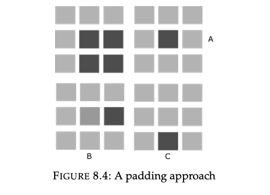
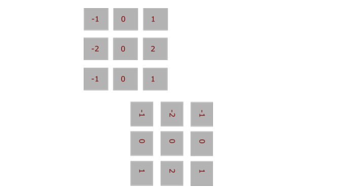
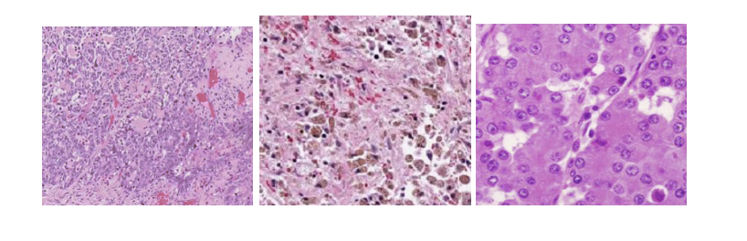
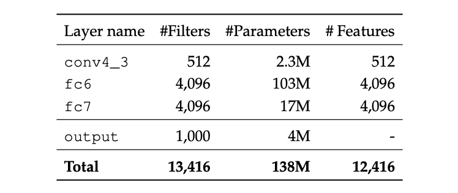
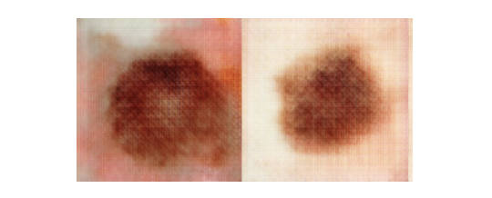
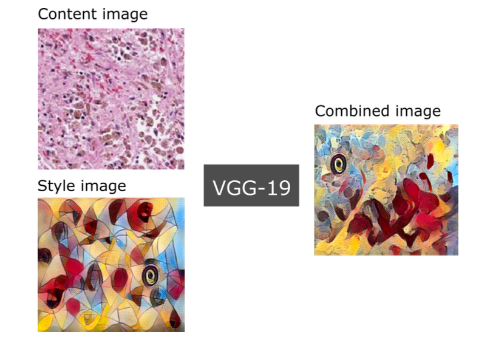

# Data Science Interview Questions And Answers


Topics
---

- [Convolution Neural Networks](#convolution-neural-networks)


## Convolution Neural Networks

Contents
----

1. [Convolution and Correlation](#convolution-and-correlation)
2. [CNN as Fixed Feature Extractor](#CNN-as-Fixed-Feature-Extractor)
3. [Fine-tuning CNNs](#Fine-Tuning-CNNs)
4. [Neural Style Transfer](#Neural-Style-Transfer)

### Convolution and Correlation

#### Contents


* The convolution operator
* The correlation operator
* Padding and stride
* Kernels and filters
* Convolution and correlation in python
* Separable convolutions

---

9. This Equation is commonly used in image processing:

$$
(f * g)(t) = \int_{-\infty}^{\infty} f(\tau)g(t - \tau)d\tau 
$$

1. What does the above equation represent?
2. What does $g(t)$ represent?

---

10. A data-scientis assumes that:
    1. A convolution operation is both linear and shift invariant.
    1. A convolution operation is just like correlation, except that we flip over the filter before applying the correlation operator.
    1. The convolution operation reaches a maximum, only in cases where the filter is mostly similar to a specific section of the input signal.

Is he right in assuming so? Explain in detail the meaning of these statements.

---

11. Mark the correct choice(s):
    1. The cross-correlation operator is used to find the location where two different signals are most similar.
    2. The autocorrelation operator is used to find when a signal is similar to a delayed version of itself.

---

12. A data-scientist provides you with a formulae for a discrete 2D convolution operation

$$
f(x,y) * h(x,y) = \sum_{m=0}^{M-1} \sum_{n=0}^{N-1} f(m,n)h(x - m, y - n)
$$

Using above, write the equivalent 2D correlation operation.

---

13.  When designing a convolutional neural network layer, one must also define how the filter or kernel slides through the input signal. This is controlled by what is known as the stride and padding parameters or modes. The two most commonly used padding approached in convolutions are the VALID and the SAME modes. Given an input stride of 1:
    1. Define SAME
    2. Define VALID

---

14. **True or False:** A valid convolution is a type of convolution operation that does not use any padding on the input.

---

15. You are provided with a $K × K$ input signal and a $θ × θ$ filter. The signal is subjected to the valid padding mode convolution. What are the resulting dimensions?

$$
\begin{equation}
A =
\begin{bmatrix}
  0 & 0 & \ldots & 0 \\
  \vdots & \vdots & \ddots & \vdots \\
  0 & 0 & \ldots & 0 \\
\end{bmatrix}
\tag{8.4}
\end{equation}
$$

---

16. As depicted in below figure, a filter is applied to a ×3 input signal. Identify the correct choice given a stride of 1 and Same padding mode.

<table align='center'>
  <tr>
    <td align="center">
      
    </td>
  </tr>
  <tr>
    <td align="center"> Figure 8.3: A padding approach </td>
  </tr>
</table>

---

17. As depicted in in (8.5), a filter is applied to a 3 × 3 input signal, mark the correct choices given a stride of 1.
    1. A represents a VALID convolution and B represents a SAME convolution 
    2. A represents a SAME convolution and B represents a VALID convolution
    3. Both A and B represent a VALID convolution 
    4. Both A and B represent a SAME convolution

<table align='center'>
  <tr>
    <td align="center">
      
    </td>
  </tr>
  <tr>
    <td align="center"> Figure 8.4: A padding approach </td>
  </tr>
</table>

---

18. In this question we discuss the two most commonly used padding approaches in convolutions; `VALID` and `SAME` . Below python code for generating an input signal arr001 and a convolution kernel filter001.

```python

import numpy
import scipy.signal
arr01 = numpy.zeros((6, 6),dtype=float)
print (arr01)
arr01[:,:3] = 3.0
arr01[:,3:] = 1.0
filter001 = numpy.zeros((3, 3), dtype=float)
filter001[:,0] = 2.0
filter001[:,2] = -2.0
output = scipy.signal.convolve2d(arr01, filter, mode='valid')

```
The input signal, arr001 is first initialized to all zeros as follows:

$$ arr001 = 
\begin{bmatrix}
0 & 0 & 0 & 0 & 0 & 0 \\
0 & 0 & 0 & 0 & 0 & 0 \\
0 & 0 & 0 & 0 & 0 & 0 \\
0 & 0 & 0 & 0 & 0 & 0 \\
0 & 0 & 0 & 0 & 0 & 0 \\
0 & 0 & 0 & 0 & 0 & 0 \\
\end{bmatrix}
$$

1. Without actually executing the code, determine what would be the resulting shape of the convolve2d() operation.
2. Manually compute the result of convolving the input signal with the provided filter.
3. Elaborate why the size of the resulting convolutions is smaller than the size of the input signal.

---

19.  Equation 8.6 is the discrete equivalent of equation 8.2 which is frequently used in image processing:

$$
\begin{equation}
f(x,y) * h(x,y) = \sum_{m=0}^{M-1} \sum_{n=0}^{N-1} f(m,n)h(x - m, y - n)
\tag{8.6}
\end{equation}
$$

1. Given the following discrete kernel in the X direction, what would be the equivalent Y direction?

$$
K = \frac{1}{2} \begin{bmatrix}
-1 & 1 \\
-1 & 1
\end{bmatrix}
$$

2. Identify the discrete convolution kernel presented in (8.6).*Kernels and Filters

<table align='center'>
  <tr>
    <td align="center">
      
    </td>
  </tr>
  <tr>
    <td align="center"> Figure 8.6: A 3 by 3 convolution kernel</td>
  </tr>
</table>

---

20. Given an image of size $w × h$, and a kernel with width $K$ , how many multiplications and additions are required to convolve the image?

---

21. Presents two built-in Python functions for the convolution and correlation operators.

```python
import nympy as np
np.convolve(A,B,"full") # for convolution
np.correlate(A,B,"full") # for cross correlation
```
1. Implement the convolution operation from scratch in Python. Compare it with the built-in numpy equivalent.
2. Implement the correlation operation using the implementation of the convolution op- eration. Compare it with the built-in numpy equivalent.

---

22. The Gaussian distribution in the 1D and 2D is shown in Equations 8.8 and 8.9.

$$
\begin{equation}
G(x) = \sqrt\frac{1}{2\pi\sigma^2}e^{-\frac{x^2}{2\sigma^2}}
\tag{8.8}
\end{equation}
$$

$$
\begin{equation}
G(x, y) = \sqrt\frac{1}{2\pi\sigma^2}e^{-\frac{x^2+y^2}{2\sigma^2}}
\tag{8.9}
\end{equation}
$$

The Gaussian filter, is an operator that is used to blur images and remove detail and noise while acting like a low-pass filter. This is similar to the way a mean filter works, but the Gaussian filter uses a different kernel. This kernel is represented with a Gaussian bell shaped bump.

Answer the following questions:
1. Can 8.8 be used directly on a 2D image?
2. Can 8.9 be used directly on a 2D image?
3. Is the Gaussian filter separable? if so, what are the advantages of separable filters.

---

### CNN as Fixed Feature Extractor

1.  **True or False**: While AlexNet used 11 × 11 sized filters, the main novelty presented in the VGG architecture was utilizing filters with much smaller spatial extent, sized $3 × 3$.

---

2. **True or False**: Unlike CNN architectures such as AlexNet or VGG, ResNet does not
have any hidden FC layers?

---

3. Assuming the VGG-Net has 138, 357, 544 floating point parameters, what is the physical size in Mega-Bytes (MB) required for persisting a trained instance of VGG-Net on permanent storage?

---

4. **True or False**: Most attempts at researching image representation using FE, focused
solely on reusing the activations obtained from layers close to the output of the CNN, and more specifically the fully-connected layers.

---

5.  **True or False**: FE in the context of deep learning is particularly useful when the target
problem does not include enough labeled data to successfully train CNN that generalizes well.

---

6.  Why is a CNN trained on the ImageNet dataset a good candidate for a source problem?

---

7. Complete the missing parts regarding the VGG19 CNN architecture: 

        1. The VGG19 CNN consists of [...] layers.
        2. It consists of [...] convolutional and 3 [...] layers.
        3. The input image size is [...].
        4. The number of input channels is [...].
        5. Every image has it’s mean RGB value [subtracted / added].
        6. Each convolutional layer has a [small/large] kernel sized [...].
        7. The number of pixels for padding and stride is [...].
        8. There are 5 [...] layers having a kernel size of [...] and a stride of [...] pixels. 9. For non-linearity a [rectified linear unit (ReLU [5])/sigmoid] is used.
        10. The [...] FC layers are part of the linear classifier.
        11. The first two FC layers consist of [...] features.
        12. The last FC layer has only [...] features.
        13. The last FC layer is terminated by a [...] activation layer. 
        14. Dropout [is / is not] being used between the FC layers.

---

8. The following question discusses the method of fixed feature extraction from layers of the
VGG19 architecture for the classification of pancreatic cancer. It depicts FE principles which are applicable with minor modifications to other CNNs as well. Therefore, if you happen to encounter a similar question in a job interview, you are likely be able to cope with it by utilizing the same logic. In Fig. (9.7) three different classes of pancreatic cancer are displayed: A, B and C, curated from a dataset of 4K Whole Slide Images (WSI) labeled by a board certified pathologist. Your task is to use FE to correctly classify the images in the dataset.
<table align='center'>
  <tr>
    <td align="center">
      
    </td>
  </tr>
  <tr>
    <td align="center">A dataset of 4K histopathology WSI from three severity classes: A, B and C </td>
  </tr>
</table>
Table (9.3) presents an incomplete listing of the of the VGG19 architecture. As depicted, for each layer the number of filters (i. e., neurons with unique set of parameters), learnable parameters (weights,biases), and FV size are presented.
<table align='center'>
  <tr>
    <td align="center">
      
    </td>
  </tr>
  <tr>
    <td align="center">Incomplete listing of the VGG19 architecture </td>
  </tr>
</table>

1. Describe how the VGG19 CNN may be used as fixed FE for a classification task. In your answer be as detailed as possible regarding the stages of FE and the method used for classification.

2. Referring to Table (9.3), suggest three different ways in which features can be extrac- ted from a trained VGG19 CNN model. In each case, state the extracted feature layer name and the size of the resulting FE.

3. After successfully extracting the features for the 4K images from the dataset, how can you now classify the images into their respective categories?

---

9. Still referring to Table (9.3), a data scientist suggests using the output layer of the
VGG19 CNN as a fixed FE. What is the main advantage of using this layer over using for instance, the fc7 layer? (Hint: think about an ensemble of feature extractors)

---

10. Still referring to Table (9.3) and also to the code snippet in Fig.(7.4), which represents a
new CNN derived from the VGG19 CNN:

        ```python
        import torchvision.models as models
        ...
        class VGG19FE(torch.nn.Module):
        def __init__(self):
        super(VGG19FE, self).__init__()
        original_model = models.VGG19(pretrained=[???])
        self.real_name = (((type(original_model).__name__)))
        self.real_name = "vgg19"
        self.features = [???]
        self.classifier = torch.nn.Sequential([???])
        self.num_feats = [???]
        def forward(self, x):
            f = self.features(x)
            f = f.view(f.size(0), -1)
            f = [???]
            print (f.data.size())
            return f
        ```
1. Complete line 6; what should be the value of `pretrained` ?
2. Complete line 10; what should be the value of `self.features` ?
3. Complete line 12; what should be the value of `self.num_feats` ? 
4. Complete line 17; what should be the value of `f` ?

---

11. We are still referring to Table (9.3) and using the skeleton code provided in Fig. (7.5)
to derive a new CNN entitled `ResNetBottom` from the ResNet34 CNN, to extract a 512- dimensional FV for a given input image. 
Complete the code as follows:

```python

import torchvision.models as models
res_model = models.resnet34(pretrained=True)
class ResNetBottom(torch.nn.Module):
 def __init__(self, original_model):
 super(ResNetBottom, self).__init__()
 self.features = [???]
 def forward(self, x):
    x = [???]
    x = x.view(x.size(0), -1)
    return x
    
```

1. The value of self.features in line 7. 
2. The forward method in line 11.

---

12. Still referring to Table (9.3), the PyTorch based pseudo code snippet in Fig. (7.6) returns
the 512-dimensional FV from the modified ResNet34 CNN, given a 3-channel RGB image as an input.

```python

import torchvision.models as models
from torchvision import transforms
...
test_trans = transforms.Compose([
transforms.Resize(imgnet_size),
transforms.ToTensor(),
transforms.Normalize([0.485, 0.456, 0.406],
[0.229, 0.224, 0.225])])

def ResNet34FE(image, model):
    f=None
    image = test_trans(image)
    image = Variable(image, requires_grad=False).cuda()
    image= image.cuda()
    f = model(image)
    f = f.view(f.size(1), -1)
    print ("Size : {}".format(f.shape))
    f = f.view(f.size(1),-1)
    print ("Size : {}".format(f.shape))
    f =f.cpu().detach().numpy()[0]
    print ("Size : {}".format(f.shape))
    return f

```

*PyTorch code skeleton for extracting a 512-dimensional FV from a pre-trained ResNet34 CNN model.*

Answer the following questions regarding the code in Fig. (7.6):

1. What is the purpose of `test_trans` in line 5?
2. Why is the parameter `requires_grad` set to False in line 14? 3. What is the purpose of `f.cpu()` in line 23?
4. What is the purpose of `detach()` in line 23?
5. What is the purpose of `numpy()[0]` in line 23?

---

13. Define the term fine-tuning (FT) of an ImageNet pre-trained CNN.

---

14. Describe three different methods by which one can fine-tune an ImageNet pre-trained CNN.

---

15. Melanoma is a lethal form of malignant skin cancer, frequently misdiagnosed as a benign
skin lesion or even left completely undiagnosed.
In the United States alone, melanoma accounts for an estimated 6, 750 deaths per annum. With a 5-year survival rate of 98%, early diagnosis and treatment is now more likely and possibly the most suitable means for melanoma related death reduction. Dermoscopy images, shown in Fig. (7.7) are widely used in the detection and diagnosis of skin lesions. Dermatologists, relying on personal experience, are involved in a laborious task of manually searching dermoscopy images for lesions.

Therefore, there is a very real need for automated analysis tools, providing assistance to clinicians screening for skin metastases. In this question, you are tasked with addressing some of the fundamental issues DL researchers face when building deep learning pipelines. As suggested in, you are going to use ImageNet pre-trained CNN to resolve a classification task.
<table align='center'>
  <tr>
    <td align="center">
      
    </td>
  </tr>
  <tr>
    <td align="center">Skin lesion categories. An exemplary visualization of melanoma</td>
  </tr>
</table>

1. Given that the skin lesions fall into seven distinct categories, and you are training using cross-entropy loss, how should the classes be represented so that a typical PyTorch training loop will successfully converge?
2. Suggest several data augmentation techniques to augment the data.
3. Write a code snippet in PyTorch to adapt the CNN so that it can predict 7 classes instead of the original source size of 1000.
4. In order to fine tune our CNN, the (original) output layer with $1000$ classes was removed and the CNN was adjusted so that the (new) classification layer comprised seven softmax neurons emitting posterior probabilities of class membership for each lesion type.

---

1. For neural networks that work with images like VGG-19, InceptionNet, you often see a visualization of what type of features each filter captures. How are these visualizations created?
2. Filter size.
    1. How are your model’s accuracy and computational efficiency affected when you decrease or increase its filter size?
    1. How do you choose the ideal filter size?
3. Convolutional layers are also known as “locally connected.” Explain what it means.
4. When we use CNNs for text data, what would the number of channels be for the first conv layer?
5. What is the role of zero padding?
6. Why do we need upsampling? How to do it?
7. What does a 1x1 convolutional layer do?
8. Pooling.
    1. What happens when you use max-pooling instead of average pooling?
    1. When should we use one instead of the other?
    1. What happens when pooling is removed completely?
    1. What happens if we replace a 2 x 2 max pool layer with a conv layer of stride 2?
9. When we replace a normal convolutional layer with a depthwise separable convolutional layer, the number of parameters can go down. How does this happen? Give an example to illustrate this.
10. Can you use a base model trained on ImageNet (image size 256 x 256) for an object classification task on images of size 320 x 360? How?
11. How can a fully-connected layer be converted to a convolutional layer?
12. Pros and cons of FFT-based convolution and Winograd-based convolution.


---

### Neural Style Transfer

16. Briefly describe how neural style transfer (NST) works?

---

17.  Complete the sentence: When using the VGG-19 CNN for neural-style transfer, there different images are involved. Namely they are: `[...]`, `[...]` and `[...]`

---

18. Refer to below figure and answer the following questions:

<table align='center'>
  <tr>
    <td align="center">
      
    </td>
  </tr>
  <tr>
    <td align="center">Artistic style transfer using the style of Francis Picabia’s Udnie painting</td>
  </tr>
</table>

1. Which loss is being utilized during the training process?
2. Briefly describe the use of activations in the training process.

---

19. Still referring to above image:
    1. How are the activations utilized in comparing the content of the content image to the content of the combined image?
    2. How are the activations utilized in comparing the style of the content image to the style of the combined image?

---

20. Still referring to the image in **Q18**. For a new style transfer algorithm, a data scientist extracts a
feature vector from an image using a pre-trained `ResNet34 CNN`.

```python

import torchvision.models as models
...
res_model = models.resnet34(pretrained=True)

```

He then defines the cosine similarity between two vectors:

$u = {u_1,u_2,....,u_N}$
$v = {v_1,v_2,....,v_N}$

as:

$$
sim(u, v) = \frac{u.v}{|u||v|} = \frac{\sum_{i=1}^Nu_iv_i}{\sqrt{(\sum_{i=1}^Nu_i^2)(\sum_{i=1}^Nv_i^2)}}
$$

Thus, the cosine similarity between two vectors measures the cosine of the angle between the vectors irrespective of their magnitude. It is calculated as the dot product of two numeric vectors, and is normalized by the product of the length of the vectors.

Answer the following questions:
1. Define the term *Gram matrix*.
2. Explain in detail how vector similarity is utilised in the calculation of the Gram matrix during the training of *NST*.

---