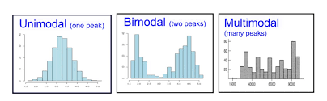
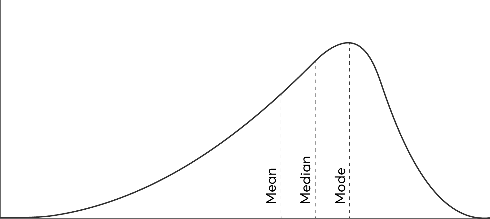
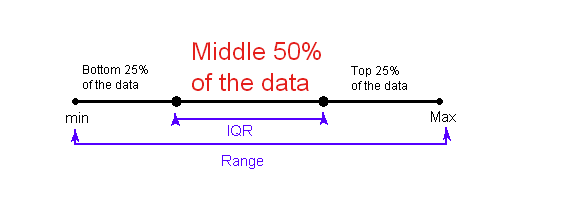
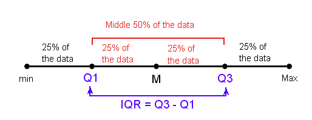
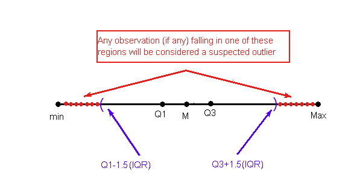
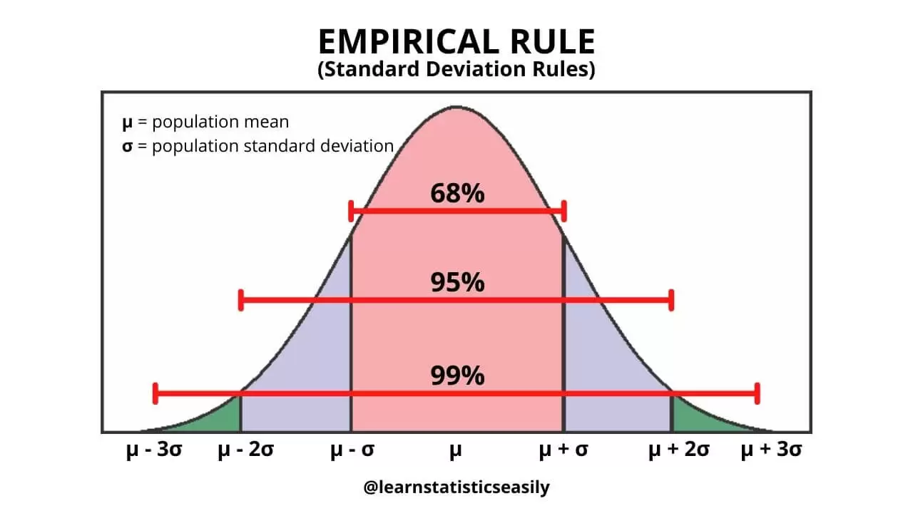
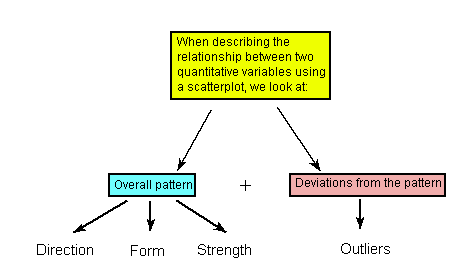

# Data Science Interview Questions And Answers

## Descriptive Statistics

Contents
----

- [Basics](#basics)
- [Examining Distribution - Univariate](#examining-distribution---univariate)
- [Examining Relationships - Multivariate](#examining-relationships---multivariate)
- [Sampling](#sampling)
- [Design Studies](#design-studies)

---

## Basics

Q. What do you mean by Data?

<b>Answer</b>

Data are pieces of information about individuals organized into variables.

---

Q. Define dataset.

<b>Answer</b>

A dataset is a set of data identified with particular circumstances. Datasets are typically displayed in tables, in which rows represent individuals and columns represent variables.

---

Q. What are the two main types of variables?

<b>Answer</b>

- Categorical/qualitative variables - It take category or label values and place an individual into one of several groups.
- Quantitative variables - It takes numerical values and represent some kind of measurement.

---

## Examining Distribution - Univariate

Q. How can we summarize distribution of categorical variable?

<b>Answer</b>

The distribution of a categorical variable is summarized using:
- Graphical display: pie chart or bar chart
- Numerical summaries: category counts and percentages

---

Q. State some methods for visualizing the numerical summaries of categorical data?

<b>Answer</b>

- Pie Chart
- Bar graph 
- Pictogram

---

Q. State the difference between pie chart and bar chart?

<b>Answer</b>

- Pie charts are used to show the proportion or percentage of categories as parts of a whole. They illustrate how each category contributes to the total.
- Bar charts are used to compare quantities across different categories. They show the magnitude of each category in a visual format.

---

Q. What are graphical methods to visualize the distribution of a quantitative variable?

<b>Answer</b>

- Histogram
- Stemplot
- Boxplot

---

Q. Define histogram?

<b>Answer</b>

The histogram is a graphical display of the distribution of a quantitative variable.

---

Q. Write the steps of plotting histogram?

<b>Answer</b>

- Collect and Organize Data: Sort the data into intervals or bins. Each bin will represent a range of values.
- Determine Bin Intervals: Decide the width of each bin, which depends on the range and distribution of your data. This step often involves balancing between having too many narrow bins or too few wide bins.
-  Count Frequencies: Count how many data points fall into each bin. This gives you the frequency of data points within each interval.
- Set Up the Axes: X-axis(bin intervals) and Y-axis(frequency or count of data points)
- Draw the Bars: For each bin, draw a bar that reaches up to the frequency count on the Y-axis. The width of each bar corresponds to the width of the bin interval, and the height corresponds to the frequency.
- Label the Histogram: Add title, axes labels and legends

---

Q. How can we numerically summarize a distribution represented by histogram?

<b>Answer</b>

We can using following features of the histogram to summarize it

- Overall pattern
   - Shape
   - Center
   - Spread
- Outliers

---

Q. What insights can be gained from examining the shape of a histogram?

<b>Answer</b>

- Symmetry/skewness of the distribution.
- Peakedness (modality) — The number of peaks (modes) the distribution has.

---

Q. What is the difference between a unimodal, a bimodal and a multimodal histogram?

<b>Answer</b>

- Unimodal histogram has only one peak or mode.
- A bimodal histogram has two distinct peaks or modes. 
- A multimodal histogram has more than two distinct peaks 

<table align='center'>
<tr>
<td align="center">
    
</td>
</tr>
<tr>
<td align="center"> Unimodal, Bimodal and Multimodal Histogram </td>
</tr>
</table>

---

Q. State the modality of an uniform distribution?

<b>Answer</b>

Uniform distributions has no modes i.e no values around which observations are concentrated.

---

Q. Under what conditions does a distribution become skewed to the right?

<b>Answer</b>

A distribution is said to be skewed right (or positively skewed) when the right tail (the higher value side) of the distribution is longer or fatter than the left tail.

---

Q. What does right skewed histogram indicates about the dataset?

<b>Answer</b>

It indicates that the bulk of the data values are clustered towards the lower end of the range, with a few extreme values stretching out towards the higher end.

---

Q. Can you draw a right skewed histogram?

<b>Answer</b>

<table align='center'>
<tr>
<td align="center">
    
</td>
</tr>
<tr>
<td align="center"> Skewed Right Distribution </td>
</tr>
</table>

---

Q. State the relationship between mean, median and mode in case of skewed right distributions?

<b>Answer</b>

For a right-skewed distribution, the general order is:

$$\text{Mode} < \text{Median} < \text{Mean}$$

---

Q. State a real-life scenario of a distribution which is skewed right?

<b>Answer</b>

Salary of workers across industries. Most people earn in the low/medium range of salaries, with a few exceptions (CEOs, professional athletes etc.) that are distributed along a large range (long "tail") of higher values.

---

Q. Under what conditions does a distribution become skewed to the left?

<b>Answer</b>

A distribution is said to be skewed left (or negatively skewed) when the left tail (the lower value side) of the distribution is longer or fatter than the right tail.

---

Q. What does left skewed histogram indicates about the dataset?

<b>Answer</b>

It indicates that the bulk of the data values are clustered towards the higher end of the range, with a few extreme values stretching out towards the lower end i.e outliers are on lower end of the distribution.

---

Q. Can you draw a left skewed histogram?

<b>Answer</b>

<table align='center'>
<tr>
<td align="center">
    
</td>
</tr>
<tr>
<td align="center"> Skewed Left Distribution </td>
</tr>
</table>

---

Q. State the relationship between mean, median and mode in case of skewed left distributions?

<b>Answer</b>

For a left-skewed distribution, the general order is:

$$\text{Mode} > \text{Median} > \text{Mean}$$

---

Q. State the relationship between mean, median and mode in case of symmetric distributions?

<b>Answer</b>

For a left-skewed distribution, the general order is:

$$\text{Mode} ~ \text{Median} ~ \text{Mean}$$

---

Q. State a real-life scenario of a distribution which is skewed left?

<b>Answer</b>

An example of a real life variable that has a skewed left distribution is age of death from natural causes (heart disease, cancer etc.). Most such deaths happen at older ages, with fewer cases happening at younger ages.

---

Q. What is a stemplot? What are benefits of using it?

<b>Answer</b>

The stemplot is a simple but useful visual display of quantitative data distribution.

Benefits of using it:
- Easy and quick to construct for small, simple datasets.
- Retains the actual data.
- Sorts (ranks) the data.

---

Q. State the main numerical measures of center of a quantitative variable distribution?

<b>Answer</b>

The three main numerical measures for the center of a distribution are:
- Mode
- Mean
- Median

---

Q. What is mode of a distribution?

<b>Answer</b>

Mode is the most commonly occurring value in a distribution.

---

Q. What is mean of a distribution?

<b>Answer</b>

The mean is the average of a set of observations (i.e., the sum of the observations divided by the number of observations). If the n observations are $x_1, x_2,..,x_n$ their mean, which we denote by $\bar{x}$

$$
\bar{x} = \frac{x_1 + x_2 + ... + x_n}{n}
$$

---

Q. What is median of a distribution? 

<b>Answer</b>

The median M is the midpoint of the distribution. It is the number such that half of the observations fall above, and half fall below.

---

Q. How can we calculate median of a distribution? 

<b>Answer</b>

To find the median:

- Order the data from smallest to largest.
- Consider whether $n$, the number of observations, is even or odd.
   - If $n$ is odd, the median $M$ is the center observation in the ordered list. This observation is the one "sitting" in the $(n + 1)/2$ spot in the ordered list.
   - If $n$ is even, the median $M$ is the mean of the two center observations in the ordered list. These two observations are the ones "sitting" in the $n/2$ and $n/2 + 1$ spots in the ordered list.

---

Q. How can we calculate median of a distribution? 

<b>Answer</b>

To find the median:

- Order the data from smallest to largest.
- Consider whether $n$, the number of observations, is even or odd.
   - If $n$ is odd, the median $M$ is the center observation in the ordered list. This observation is the one "sitting" in the $(n + 1)/2$ spot in the ordered list.
   - If $n$ is even, the median $M$ is the mean of the two center observations in the ordered list. These two observations are the ones "sitting" in the $n/2$ and $n/2 + 1$ spots in the ordered list.

---

Q. State the main difference between mean and median?

<b>Answer</b>

The mean is very sensitive to outliers (because it factors in their magnitude), while the median is resistant to outliers.

---

Q. How can we decide which measure should we choose as center of distribution?

<b>Answer</b>

The mean is an appropriate measure of center only for symmetric distributions with no outliers. In all other cases, the median should be used to describe the center of the distribution.

---

Q. What are commonly used measures of spread?

<b>Answer</b>

- Range
- Inter-quartile range (IQR)
- Standard deviation

---

Q. What do you mean by range of a distribution?

<b>Answer</b>

The range covered by the data is the most intuitive measure of variability. The range is exactly the distance between the smallest data point (min) and the largest one (Max).

$$
\text{Range} = \text{Max} - \text{Min}
$$

---

Q. What is IQR? How can we calculate it?

<b>Answer</b>

IQR measures the variability of a distribution by giving us the range covered by the middle $50%$ of the data.

<table align='center'>
<tr>
<td align="center">
    
</td>
</tr>
<tr>
<td align="center"> Inter Quartile Range(IQR) </td>
</tr>
</table>

IQR calculations:

- Arrange the data in increasing order, and find the median M. Recall that the median divides the data, so that 50% of the data points are below the median, and 50% of the data points are above the median.

- Find the median of the lower 50% of the data($Q1$) and upper 50% of the data $Q3$.

- The middle 50% of the data falls between $Q1$ and $Q3$, and therefore:

$$
\text{IQR} = Q3 - Q1
$$

<table align='center'>
<tr>
<td align="center">
    
</td>
</tr>
<tr>
<td align="center"> IQR calculations </td>
</tr>
</table>

---

Q. Can we use IQR to detect outliers?

<b>Answer</b>

Yes, we can use IQR as basis for a rule of thumb for identifying outliers. 

It is $1.5(IQR)$ criteria for outliers. An observation is considered a suspected outlier if it is:

- below Q1 - 1.5(IQR) or
- above Q3 + 1.5(IQR)

<table align='center'>
<tr>
<td align="center">
    
</td>
</tr>
<tr>
<td align="center"> IQR for outlier detection </td>
</tr>
</table>

---

Q. How to deal with outliers in the data?

<b>Answer</b>

We can handle outliers with following approach:
- Identifying the outlier
- Understanding the outlier
- Decide how to handle the outlier

---

Q. What are the five-number summary statistics of a distribution?

<b>Answer</b>

The five-number summary of a distribution consists of the median (M), the two quartiles (Q1, Q3) and the extremes (min, Max).

---

Q. What is a box-plot?

<b>Answer</b>

The boxplot graphically represents the distribution of a quantitative variable by visually displaying the five-number summary and any observation that was classified as a suspected outlier using the *1.5(IQR)* criterion.

<table align='center'>
<tr>
<td align="center">
    
</td>
</tr>
<tr>
<td align="center"> Box plot </td>
</tr>
</table>

---

Q. State one benefit of using box-plot?

<b>Answer</b>

Boxplots are most useful when presented side-by-side to compare and contrast distributions from two or more groups.

---

Q. What does the standard deviation represent in a distribution?

<b>Answer</b>

standard deviation quantifies the spread of a distribution by measuring how far the observations are from their mean $\bar{x}$. The standard deviation gives the average (or typical distance) between a data point and the mean $\bar{x}$.

$$\sigma = \sqrt{\frac{1}{N} \sum_{i=1}^{N} (x_i - \mu)^2}$$

where:
- $N$ is the number of observations in the population.
- $x_i$ represents each individual observation.
- $\mu$ is the mean of the population.

---

Q. What is the benefit of using IQR over SD for measure of spread?

<b>Answer</b>

The SD is strongly influenced by outliers in the data.

---

Q. Given the array $[1,5,3,2,4,4]$, find its mean, median, variance, and standard deviation.

<b>Answer</b>

Given:

$$arr = [1, 5, 3, 2, 4, 4]$$

Sort the above series in ascending order:

$$arr = [1, 2, 3, 4, 4, 5]$$

<b>Mean($\bar{x}$)</b>

$$\bar{x}= \frac{\sum_{i=1}^{n}arr}{n}$$

Here number of elements(n) = 6

$$\bar{x} = \frac{\sum_{i=1}^{6}arr}{6} = \frac{1+2+3+4+4+5}{6} = 3.166$$

<b>Median($M$)</b>

Since $n$ is even, we can use following expression:

$$\text{M} = \frac{x_{\frac{n}{2}} + x_{\frac{n}{2}+1}}{2}$$
$$\text{M} = \frac{3+4}{2} = 3.5$$

<b>Variance($\sigma^2$)</b>

$$\text{\sigma^2} = \frac{1}{n} \sum_{i=1}^{n} (x_i - \bar{x})^2$$
$$\text{\sigma^2} = \frac{1}{6} \sum_{i=1}^{n} (x_i - 3.166)^2$$
$$\text{\sigma^2} ≈ 1.47$$

<b>Standard deviation($\sigma$)</b>

$$\text{\sigma} = \sqrt{variance} = \sqrt{1.47}$$

$$\text{\sigma} = 1.2124$$

---

Q. How do we determine which numerical summaries to use for describing a distribution?

<b>Answer</b>

- Use $\bar{x}$ (the mean) and the standard deviation $\sigma$ as measures of center and spread only for reasonably symmetric distributions with no outliers.

- Use the five-number summary (which gives the median, IQR and range) for all other cases.

---

Q. State standard deviation rule?

<b>Answer</b>

For distributions having bell shaped (also known as the normal shape), the following rule applies:
- Approximately $68%$ of the observations fall within 1 standard deviation of the mean.
- Approximately $95%$ of the observations fall within 2 standard deviations of the mean.
- Approximately $99.7%$ (or virtually all) of the observations fall within $3$ standard deviations of the mean.

<table align='center'>
<tr>
<td align="center">
    
</td>
</tr>
<tr>
<td align="center"> Standard Deviation Rule </td>
</tr>
</table>

---

## Examining Relationships - Multivariate

Q. Define explanatory and response variable?

<b>Answer</b>

- The explanatory variable (also commonly referred to as the independent variable) — the variable that claims to explain, predict, or affect the response
- The response variable (also commonly referred to as the dependent variable) — the outcome of the study.

--- 

Q. How can we examine the relationship between a categorical explanatory variable and quantitative response variable?

<b>Answer</b>

We can use following techniques:
- Side by side boxplots
- Descriptive Statistics
   - Five Number summary for each categorical value

---

Q. How can we examine the relationship between a categorical explanatory variable and categorical response variable?

<b>Answer</b>

The relationship between two categorical variables is summarized using
- Data display: Two-way table, supplemented by
- Numerical summaries: Conditional percentages.

---

Q. How can we examine the relationship between a numerical explanatory variable and numerical response variable?

<b>Answer</b>

The relationship between two quantitative variables is visually displayed using the scatterplot, where each point represents an individual. We always plot the explanatory variable on the horizontal X axis, and the response variable on the vertical Y axis.

<table align='center'>
<tr>
<td align="center">
    Q relationship" style="max-width:70%;"/>
</td>
</tr>
<tr>
<td align="center"> Q -> Q relationship </td>
</tr>
</table>

---

Q. What is Simpsons Paradox?

<b>Answer</b>

Simpsons Paradox is a statistical phenomenon that occurs when you combine subgroups into one group. The process of aggregating data can cause the apparent direction and strength of the relationship between two variables to change.

---

Q. Why Does Simpson’s Paradox Occur?

<b>Answer</b>

Simpson’s Paradox occurs because a third variable can affect the relationship between a pair of variables.

---

## Sampling

## Design Studies
