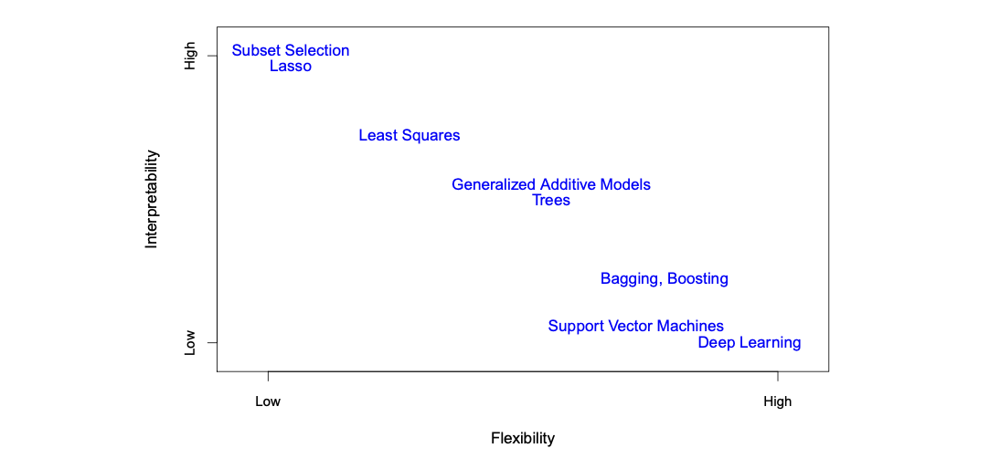
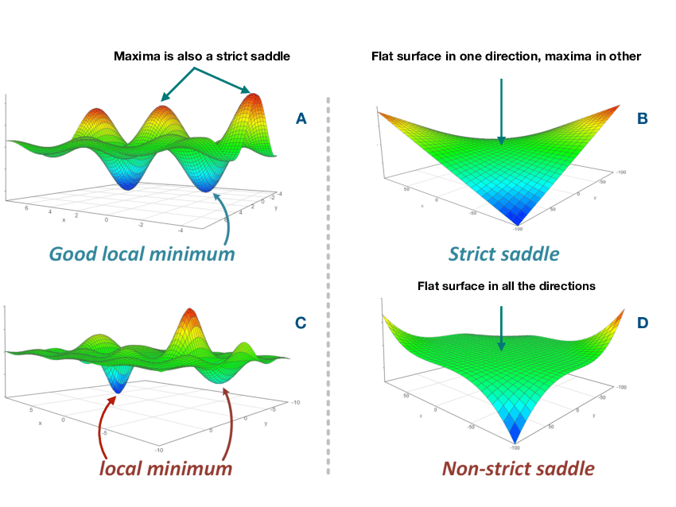
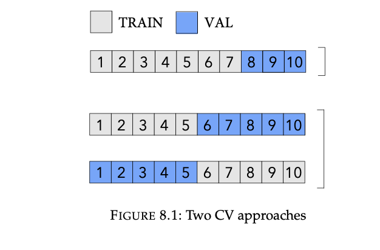
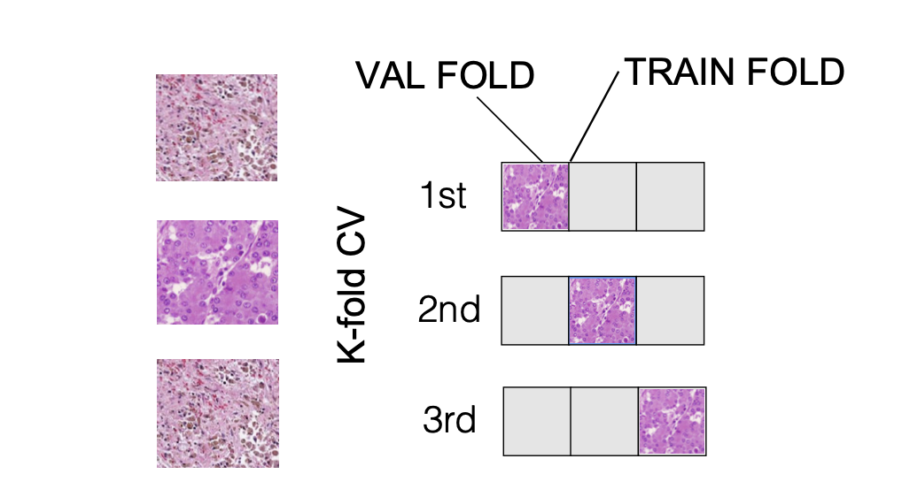
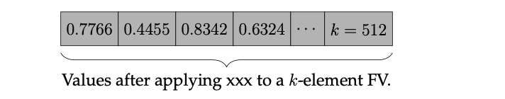
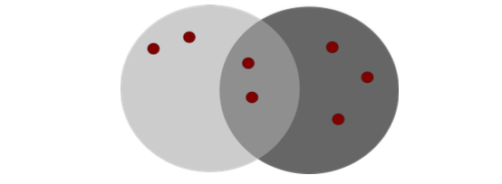
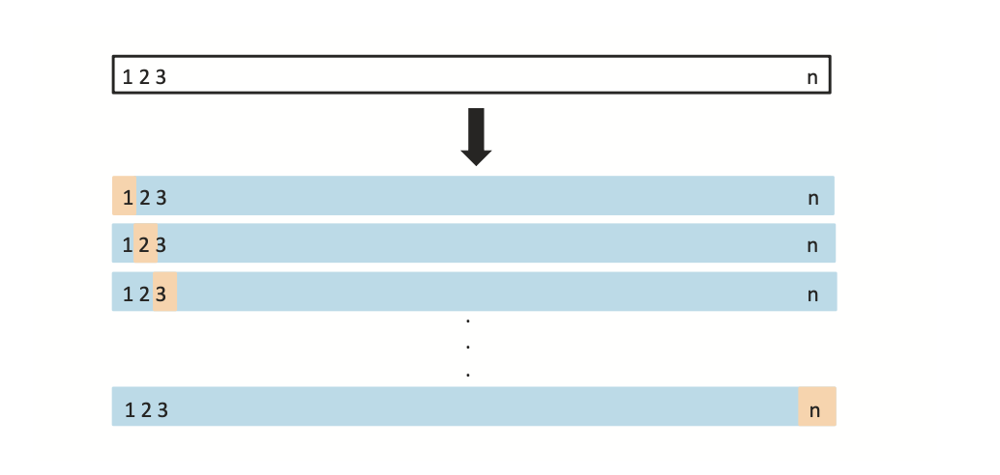
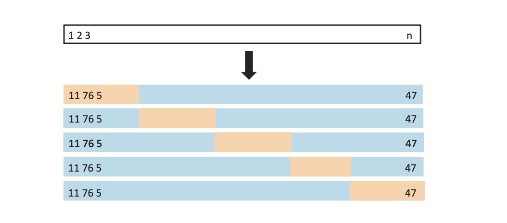

# Data Science Interview Questions And Answers

## General Concepts In Machine Learning

Contents
----
- [Basics](#basics)
- [Cross Validation](#cross-validation)
- [Similarity Measures](#Similarity-Measures)
- [Sampling Techniques and Creating Training Data](#sampling-techniques-and-creating-training-data)
- [Feature Engineering](#feature-engineering)
- [Bias and Variance](#bias-and-variance)

---

### Basics

Q. Explain supervised, unsupervised, weakly supervised, semi-supervised, and active learning.

<details><summary><b>Answer</b></summary>
    

*Supervised Learning*

It uses labeled data to train a model. The model learns to predict outputs from inputs based on examples with known outcomes. Common tasks include classification and regression.

*Unsupervised Learning*

It works with unlabeled data to find hidden patterns or structures. It identifies clusters or relationships within the data without predefined labels. Examples include clustering and dimensionality reduction.

*Weakly Supervised Learning*

It uses data with noisy, incomplete, or inaccurate labels. The model is trained on this imperfect data to make predictions, often incorporating techniques to handle label uncertainty.

*Semi-Supervised Learning*

It combines a small amount of labeled data with a large amount of unlabeled data. The model leverages the labeled examples to better understand the structure of the unlabeled data and improve learning performance.

*Active Learning*

It involves an iterative process where the model actively selects the most informative examples to be labeled by an oracle (e.g., a human expert). This helps improve model performance efficiently by focusing on challenging or uncertain examples.


</details>

---


Q. Empirical risk minimization.
1. What’s the risk in empirical risk minimization?
1. Why is it empirical?
1. How do we minimize that risk?


<details><summary><b>Answer</b></summary>

1. In Empirical Risk Minimization (ERM), the "risk" refers to the expected loss or error of a predictive model when applied to new, unseen data. It quantifies how well the model is expected to perform on future data by considering the possible errors the model might make. 

2. The term "empirical" in ERM arises because, in practice, we do not have access to the true underlying data distribution to calculate the true risk (also known as population risk). Instead, we estimate the risk based on a finite sample of training data. This estimated risk, computed using the training data, is called the empirical risk. Thus, the ERM approach minimizes the empirical risk as a proxy for the true risk.

3. Minimizing the empirical risk involves finding the model parameters that minimize the average loss over the training data. The steps are as follows:

- Define the Loss Function: Choose an appropriate loss function $L(y,f(x))$ that quantifies the error for each prediction.
$$R_{\text{emp}}(f) = \frac{1}{n} \sum_{i=1}^n L(y_i, f(x_i))$$

- Minimize the empirical risk by adjusting the model parameters using an optimization algorithm, such as gradient descent. The goal is to find the parameters that yield the lowest empirical risk.
    
</details>

---

Q. What are the exhaustive steps we need to perform when tackling any generic machine learning problem, specifically for both regression and classification tasks?

<details><summary><b>Answer</b></summary>

*Exhaustive Steps for Both Classification and Regression Problems*

1. Define the Problem and Objectives
   - Classification: Define the target classes and understand the nature of the classification (binary or multi-class).
   - Regression: Define the continuous target variable and set performance goals.
   - Identify the performance metrics: 
     - Classification: Accuracy, F1-score, precision, recall, ROC-AUC, etc.
     - Regression: Mean Squared Error (MSE), R-squared, Mean Absolute Error (MAE), etc.

2. Collect and Understand the Data
   - Gather data relevant to the problem (databases, APIs, files).
   - Perform exploratory data analysis (EDA) to understand patterns, distributions, and data types.
   - Visualize data using appropriate plots:
     - Classification: Histograms, bar charts, pair plots.
     - Regression: Scatter plots, line plots, distribution plots.

3. Data Cleaning
   - Handle missing values (imputation, removal).
   - Remove duplicates and correct data inconsistencies.
   - Address outliers if they significantly affect the model (more critical in regression).

4. Feature Engineering
   - Create and transform features that can enhance the model’s predictive power.
   - Handle categorical variables:
     - Classification and Regression: One-hot encoding, label encoding.
   - Scale or normalize numerical features if necessary.

5. Split the Data
   - Split data into training and testing sets (e.g., 80-20, 70-30).
   - Optionally split the training set further into validation sets for tuning.

6. Handle Imbalanced Data (Classification Only)
   - Use techniques like:
     - Oversampling: SMOTE, ADASYN.
     - Undersampling: Random undersampling.
     - Class weights adjustment in the loss function.

7. Model Selection and Training
   - Evaluate a range of algorithms to identify the best fit for your problem. Common choices include:
    - Classification: Logistic Regression, Decision Trees, Random Forest, SVM, Neural Networks.
    - Regression: Linear Regression, Decision Trees, Random Forest Regressor, Gradient Boosting, Neural Networks.
   - Use cross-validation to compare the performance of different models on your data, ensuring a fair evaluation.

8. Hyperparameter Tuning of best-performing model
   - Tune hyperparameters using Grid Search, Random Search, or Bayesian Optimization.
   - Use validation sets or cross-validation to validate tuning results.

9. Model Training
  - With the optimal combination of hyperparameters, train the model's parameters with the train data

10. Evaluate Model Performance
   - Classification: Use metrics such as confusion matrix, accuracy, precision, recall, F1-score, ROC-AUC.
   - Regression: Evaluate using MSE, MAE, R-squared, RMSE.
   - Plot residuals or learning curves to diagnose performance.

11. Feature Importance and Interpretation
   - Assess feature importance to understand model decision-making.
   - Use techniques like SHAP values, LIME for complex models.

12. Cross-Validation
   - Perform k-fold cross-validation to ensure the model is robust and not overfitting.
   - Compare performance across folds for consistency.

13. Error Analysis
   - Classification: Analyze misclassified instances using confusion matrices.
   - Regression: Analyze prediction errors, especially for high residuals or outliers.

14. Optimize Model and Ensemble Techniques
   - Use ensemble methods for improved performance:
     - Bagging, Boosting (XGBoost, LightGBM), Stacking.
   - Experiment with different algorithms and ensemble their results if beneficial.

</details>

---

Q. Explain the tradeoff between model's flexibility vs interpretability?

<details><summary><b>Answer</b></summary>

In general, as the flexibility of a method increases, its interpretability decreases.

Here is the a plot of model's flexibility vs interpretability:

<table align='center'>
<tr>
<td align="center">
    
</td>
</tr>
<tr>
<td align="center"> A representation of the tradeoff between flexibility and interpretability, using different statistical learning methods. </td>
</tr>
</table>

</details>

---

Q. Occam's razor states that when the simple explanation and complex explanation both work equally well, the simple explanation is usually correct. How do we apply this principle in ML?

<details><summary><b>Answer</b></summary>

Occam's Razor can be applied in model selection during machine learning. If two models—such as a linear regressor and a neural network—perform similarly on a given dataset, the principle suggests opting for the simpler model, in this case, the linear regressor. Choosing the simpler model helps prevent overfitting, makes the model more interpretable, and maintains simplicity without sacrificing performance.

</details>

---

Q. If we have a wide NN and a deep NN with the same number of parameters, which one is more expressive and why?

<details><summary><b>Answer</b></summary>

A deep neural network (DNN) is generally more expressive than a wide neural network (WNN) with the same number of parameters. This is because a DNN can learn more complex representations of the input data due to its increased depth, which allows it to capture more intricate patterns and dependencies in the data.

</details>

---

Q. The Universal Approximation Theorem states that a neural network with 1 hidden layer can approximate any continuous function for inputs within a specific range. Then why can’t a simple neural network reach an arbitrarily small positive error?

<details><summary><b>Answer</b></summary>
    
</details>

---

Q. What are saddle points and local minima? Which are thought to cause more problems for training large NNs?

<details><summary><b>Answer</b></summary>

A *saddle point* is a point on the loss surface where the gradient is zero, but it is neither a local minimum nor a local maximum. Instead, the loss decreases in some directions and increases in others around the saddle point.

A *local minimum* is a point on the loss surface where the loss is lower than at any nearby points, but it may not be the lowest possible loss (global minimum). The gradient is also zero at a local minimum, but all small perturbations around this point lead to an increase in loss.

<table align='center'>
<tr>
<td align="center">
    
</td>
</tr>
<tr>
<td align="center">Saddle point and Local Minima/Maxima</td>
</tr>
</table>

Saddle point cause more problem in training large Neural Networks. Because they are more common and can significantly slow down or stall the training process due to zero or minimal gradient at saddle points.

</details>

---

Q. Hyper-parameters.
1. What are the differences between parameters and hyper-parameters?
1. Why is hyperparameter tuning important?
1. List down methods for tuning hyper-parameters.


<details><summary><b>Answer</b></summary>

1. *Parameters* are the internal coefficients or weights that a model learns from the training data. These are the values that the model adjusts during training to minimize the loss function. But *Hyperparameters* are external configurations set before the training process begins. They govern the learning process and influence how the model learns from the data but are not directly learned from the data itself.

2. Hyperparameter tuning is important because it significantly impacts a model's performance. 

    Proper tuning can lead to
    - better accuracy
    - generalization, and efficiency

    while poor choices can lead to
    - underfitting
    - overfitting
    - convergence issues.

3. We can use following methods to tune the hyperparameter
    - Grid Search Algorithm
    - Random Search
    - Bayesian Optimization

</details>

---

Q. Classification vs. regression.
1. What makes a classification problem different from a regression problem?
1. Can a classification problem be turned into a regression problem and vice versa?

<details><summary><b>Answer</b></summary>

1. Response variable 
- **Classification**: In classification, the response variable (also called the target or output) is categorical. The goal is to assign inputs to one of several predefined categories or classes.
- **Regression**: In regression, the response variable is continuous. The goal is to predict a numerical value based on the input features.

2. In some instances, you can convert a regression problem into a classification problem by grouping the continuous target variable into discrete categories, a process known as **discretization**. For example, if the target variable is a continuous value between 0 and 100, you could create two classes:

    - **Class 0**: Values from 0 to 49
    - **Class 1**: Values from 50 to 100

    This transforms the regression problem into a classification problem, where the labels may have an ordered relationship (known as **ordinal** labels).

    Conversely, a classification problem can sometimes be converted into a regression problem by mapping class labels to a continuous range. For example, class labels might be assigned specific values:

    - **49** for Class 0
    - **100** for Class 1

    Alternatively, if the classification algorithm predicts probabilities for each class, these probabilities could be scaled to a continuous range using a formula like:

$$
\text{quantity} = \text{min} + \text{probability} \times \text{range}
$$

However, if the class labels in the original classification problem do not have a natural ordinal relationship, converting it to a regression problem might lead to poor performance. The model could mistakenly infer a relationship between the input features and the continuous output that doesn’t actually exist, leading to inaccurate predictions.

</details>

---

Q. Parametric vs. non-parametric methods.
1. What’s the difference between parametric methods and non-parametric methods? Give an example of each method.
1. When should we use one and when should we use the other?

<details><summary><b>Answer</b></summary>

1. The primary difference between parametric and non-parametric methods lies in their assumptions about the data distribution and the number of parameters used to describe the distribution. 

    - **Parametric methods** assume a specific form for the distribution of the data and use a fixed number of parameters to characterize that distribution. They are called "parametric" because they involve a parameterization of the data.
    - Example - Linear regression 
    - **Non-parametric** methods do not assume a specific form for the distribution of the data and do not use a fixed number of parameters. They are more flexible and can adapt to the structure of the data without making strong assumptions.
    - Example - Kernel density estimation


2. When to use them

    - Use Parametric Methods When:
        - You have a good understanding of the data's distribution.
        - You need a method that's computationally efficient.
        - You want to interpret the parameters of the model.
    - Use Non-Parametric Methods When:
        - You're unsure about the data's distribution or it's likely to be non-normal.
        - You're dealing with ordinal or ranked data.
        - You want a method that's robust to outliers.

</details>

---

Q. Why does an ML model’s performance degrade in production?

<details><summary><b>Answer</b></summary>

ML model's performance degrade in production due to following reasons:

- **Data Drift**: The distribution of the data changes over time, leading to a mismatch between the data the model was trained on and the data it encounters in production. 

    There are two main types of drift:

    - **Covariate Drift**: The distribution of the features (input variables) changes.
    - **Label Drift**: The distribution of the target variable changes.

- **Concept Drift**: The relationship between the features and the target variable changes over time. For example, customer behavior might evolve, altering the patterns the model was trained to recognize.

- **Data Quality Issues**: The quality of the data in production might be lower than in the training set, with issues like missing values, noise, or errors.

- **Model Staleness**: The model might become outdated as new trends or behaviors emerge that weren’t captured in the original training data.

- **Environmental Changes**: The production environment might differ from the development environment, causing issues.


</details>

---

Q. What problems might we run into when deploying large machine learning models?

<details><summary><b>Answer</b></summary>


</details>

---

Q. Your model performs really well on the test set but poorly in production.
1. What are your hypotheses about the causes?
1. How do you validate whether your hypotheses are correct?
1. Imagine your hypotheses about the causes are correct. What would you do to address them?

<details><summary><b>Answer</b></summary>
    
</details>

---

Q. What are some common encoding techniques in machine learning?

<details><summary><b>Answer</b></summary>
    
- One-hot/dummy encoding
- Label / Ordinal encoding
- Target encoding
- Frequency / count encoding
- Binary encoding
- Feature Hashing

</details>

---

### Cross Validation

#### Contents
- [CV approaches](#cv-approaches)
- K-Fold CV
- Stratification
- LOOCV

---

Q.  Below Fig depicts two different cross-validation approaches. Name them.

<table align='center'>
  <tr>
    <td align="center">
      
    </td>
  </tr>
  <tr>
    <td align="center"> Figure: Two CV approaches </td>
  </tr>
</table>

<details><summary><b>Answer</b></summary>

1st one is leave-one-out CV (LOOCV) and 2nd is a K-fold cross validation method.


</details>

---

Q.  
1. What is the purpose of following Python code snippet?
        ```python
        skf = StratifiedKFold(y, n_folds=5, random_state=989, shuffle=True)
        ```
2. Explain the benefits of using the K-fold cross validation approach.
3. Explain the benefits of using the Stratified K-fold cross validation approach.
4. State the difference between K-fold cross validation and stratified cross validation.
5. Explain in your own words what is meant by “We adopted a 5-fold cross-validation approach to estimate the testing error of the model”.

<details><summary><b>Answer</b></summary>

 

</details>

---

Q. **True or False:** In a K-fold CV approach, the testing set is completely excluded from the process and only the training and validation sets are involved in this approach.

<details><summary><b>Answer</b></summary>

 **True**, We never utilize the test set during a K-fold CV.

</details>

---

Q. **True or False:** In a K-fold CV approach, the final test error is:

$$
CV_k = \frac{1}{k}\sum_{i=1}^{k}MSE_i
$$

<details><summary><b>Answer</b></summary>

**True**, This is average of individual errors of $K$ estimates of the test errors

$$MSE_1,...,MSE_k$$

</details>

---

Q. Mark all the correct choices regarding a cross-validation approach:
1. A 5-fold cross-validation approach results in 5-different model instances being fitted.
1. A 5-fold cross-validation approach results in 1 model instance being fitted over and over again 5 times.
1. A 5-fold cross-validation approach results in 5-different model instances being fitted over and over again 5 times.
1. Uses K-different data-folds.

<details><summary><b>Answer</b></summary>

 Correct answer is : A 5-fold cross-validation approach results in 5-different model instances being fitted. It is a common misconception to think that in a K-fold approach the same model instance is repeatedly used. We must create a new model instance in each fold.

</details>

---

Q. Mark all the correct choices regarding the approach that should be taken to compute the performance of K-fold cross-validation:
1. We compute the cross-validation performance as the arithmetic mean over the K performance estimates from the validation sets.
1. We compute the cross-validation performance as the best one over the K performance estimates from the validation sets.

<details><summary><b>Answer</b></summary>

Correct answer : We compute the cross-validation performance as the arithmetic mean over the K performance estimates from the validation sets. Taking best one over K performance estimates defeats the purpose of using k-fold cross-validation. 

</details>

---

Q. A data-scientist who is interested in classifying cross sections of histopathology image slices decides to adopt a cross-validation approach he once read about in a book.

<table align='center'>
  <tr>
    <td align="center">
      
    </td>
  </tr>
  <tr>
    <td align="center"> A specific CV approach </td>
  </tr>
</table>

Name the approach from the following options:

1. 3-fold CV
2. 3-fold CV with stratification
3. A (repeated) 3-fold CV

<details><summary><b>Answer</b></summary>

The correct answer is: 3-fold CV. A k-fold cross-validation is a special case of cross-validation where we iterate over a dataset set k times. In each round, we split the dataset into k parts: one part is used for validation, and the remaining $k − 1 $parts are merged into a training subset for model evaluation. 

Stratification is used to balance the classes in the training and validation splits in cases where the corpus is imbalanced.

</details>

---

Q. 
1. **True or false**: The leave-one-out cross-validation (LOOCV) approach is a sub-case of k-fold cross-validation wherein K equals N , the sample size.
    1. **True or false**: It is always possible to find an optimal value $n$, $K = n$ in K-fold cross-validation.

<details><summary><b>Answer</b></summary>

1. **True**: leave-one-out cross-validation (LOOCV) is a special case of k-fold cross validation where $k$ ise set equal to $n$

2. **False**: There is no way of a-priori finding an optimal value for K, and the relationship between the actual sample size and the resulting accuracy is unknown.

</details>

---

Q. What is the main difference between RandomizedSearchCV and GridSearchCV?

<details><summary><b>Answer</b></summary>

The main difference between **RandomizedSearchCV** and **GridSearchCV** lies in how they explore the hyperparameter space:

1. **Search Strategy**:
   - **GridSearchCV**: Exhaustively searches over a specified grid of hyperparameter values. It tries every possible combination of the provided hyperparameters, which ensures that the best combination within the grid is found.
   - **RandomizedSearchCV**: Randomly samples a fixed number of hyperparameter combinations from the specified ranges. Instead of checking every possible combination, it selects random values for each hyperparameter according to a given distribution and evaluates them.
2. **Time and Computation**:
   - **GridSearchCV**: More time-consuming as it evaluates all possible combinations of hyperparameters.
   - **RandomizedSearchCV**: More computationally efficient as it limits the number of hyperparameter settings that are evaluated.

</details>

---

Q. When would you prefer to use RandomizedSearchCV over GridSearchCV, and vice versa?

<details><summary><b>Answer</b></summary>

- **RandomizedSearchCV** is preferred for large or complex hyperparameter spaces, limited computational resources, broad exploration, or preliminary tuning.
- **GridSearchCV** is preferred for smaller hyperparameter spaces, precise tuning, well-defined ranges, and detailed evaluation within a specific grid.


</details>

---

Q. What are the advantages of RandomizedSearchCV?

<details><summary><b>Answer</b></summary>
    
</details>

---

Q. What are the advantages of GridSearchCV?

<details><summary><b>Answer</b></summary>
    
</details>

---

Q. What is cross-validation in the context of hyperparameter tuning?

<details><summary><b>Answer</b></summary>

**Cross-validation** is a technique used in machine learning to assess the performance of a model and ensure that it generalizes well to unseen data. In the context of hyperparameter tuning, cross-validation is used to evaluate different hyperparameter configurations in a more reliable way than using a single train-test split.

***Steps of hyper-parameter tuning via cross-validation***

*Data Splitting:*

The dataset is divided into multiple subsets or "folds."
Typically, k-fold cross-validation is used, where the data is split into k equal-sized folds.

*Training and Validation Process:*

For each hyperparameter configuration, the model is trained k times, each time using a different fold as the validation set and the remaining k-1 folds as the training set.

The performance is evaluated on the validation fold after each training, and this process is repeated for all folds.

*Averaging Results:*

The validation performance across all folds is averaged to get a more robust estimate of how the hyperparameter configuration would perform on unseen data.
This average score is then used to compare different hyperparameter configurations.

*Hyperparameter Selection:*

The hyperparameter configuration that yields the best average validation performance is selected as the optimal set. This method ensures that the chosen hyper-parameters are not just good for one specific train-test split but are generally good across different splits of the data.
   
</details>

---

Q. Can you combine RandomizedSearchCV and GridSearchCV techniques for hyperparameter tuning?

<details><summary><b>Answer</b></summary>
    
</details>

---


### Similarity Measures

- Image, text similarity
- Jcard similarity
- The Kullback-Leibler Distance
- Min Hash
---

Q. A data scientist extracts a feature vector from an image using a pre-trained ResNet34 CNN as follows

    ```python
    import torchvision.models as models
    ...
    res_model = models.resnet34(pretrained=True)
    ```
    He then applies the following algorithm, entitled xxx on the image.

    ```python
    import math

    def xxx(arr):
        mod = 0.0
        
        for i in arr:
            mod += i * i
        
        mag = math.sqrt(mod)
        
        for i in range(len(arr)):
            arr[i] /= mag

    # Example usage:
    arr = [1.0, 2.0, 3.0]
    xxx(arr)
    print(arr)
    ```
Which results in this list:

<table align='center'>
<tr>
    <td align="center">
    
    </td>
</tr>
</table>

Name the algorithm that he used and explain in detail why he used it.

<details><summary><b>Answer</b></summary>
    
</details>

---

Q. Further to the above, the scientist then applies the following algorithm:

**Algo 1**

Data: Two vectors v1 and v2 are provided Apply algorithm xxx on the two vectors Run algorithm 2

**Algo 2**

```python
def algo2(v1, v2):
    mul = 0.0

    for i in range(len(v1)):
        mul += v1[i] * v2[i]
    if mul < 0:
        return 0
    
    return mul
```
1. Name the algorithm algo2 that he used and explain in detail what he used it for.
2. Write the mathematical formulae behind it.
3. What are the minimum and maximum values it can return?
4. An alternative similarity measures between two vectors is: $\text{simeuc}(v1, v2) = -\|v1 - v2\|$.
Name the measure.

<details><summary><b>Answer</b></summary>
    
</details>

---

Q. 
1. What is the formulae for the Jaccard similarity of two sets?
2. Explain the formulae in plain words.
3. Find the Jacard similarity given the sets.

<table align='center'>
<tr>
  <td align="center">
    
  </td>
</tr>
<tr>
  <td align="center">Jaccard similarity.</td>
</tr>
</table>

4. Compute the Jaccard similarity of each pair of the following sets:
    1. 12, 14, 16, 18
    2. 11, 12, 13, 14, 15
    3. 11, 16, 17

<details><summary><b>Answer</b></summary>
    
</details>

---

Q. In this problem, you have to actually read 4 different papers, so you will probably not encounter such a question during an interview, however reading academic papers is an excellent skill to master for becoming a DL researcher.

The Kullback-Leibler divergence is a meas- ure of how different two probability distribution are. As noted, the KL divergence of the probability distributions P, Q on a set X is defined as shown in Equation 8.11.

$$
D_{KL}(P \| Q) = \sum_{x \in X} P(x) \log\left(\frac{P(x)}{Q(x)}\right)
$$

Note however that since KL divergence is a non-symmetric information theoretical meas- ure of distance of P from Q, then it is not strictly a distance metric. During the past years, various KL based distance measures (rather than divergence based) have been introduced in the literature generalizing this measure.
Name each of the following KL based distances:

$$
D_{KLD1}(P \| Q) = D_{KL}(P \| Q) + D_{KL}(Q \| P)
$$

$$
D_{KLD2}(P \| Q) = \sum_{x \in X} (P(x) - Q(x)) \log(P(x))
$$

$$
D_{KLD3}(P \| Q) = \frac{1}{2} [D_{KL}\left(Q\|\right(\frac{P+Q}{2})) +  D_{KL}\left(P\|\right(\frac{P+Q}{2})) ]
$$

$$
D_{KLD4}(P \| Q) = max(D_{KL}\left(Q\|\right(P)) +  D_{KL}\left(P\|\right(Q)))
$$

<details><summary><b>Answer</b></summary>
    
</details>

---


### Sampling Techniques and Creating Training Data

Q. If you have 6 shirts and 4 pairs of pants, how many ways are there to choose 2 shirts and 1 pair of pants?

<details><summary><b>Answer</b></summary>
    
</details>

---

Q. What is the difference between sampling with vs. without replacement? Name an example of when you would use one rather than the other?

<details><summary><b>Answer</b></summary>
    
</details>

---

Q. Explain Markov chain Monte Carlo sampling.

<details><summary><b>Answer</b></summary>
    
</details>

---

Q. If you need to sample from high-dimensional data, which sampling method would you choose?

<details><summary><b>Answer</b></summary>
    
</details>

---

Q. Suppose we have a classification task with many classes. An example is when you have to predict the next word in a sentence -- the next word can be one of many, many possible words. If we have to calculate the probabilities for all classes, it’ll be prohibitively expensive. Instead, we can calculate the probabilities for a small set of candidate classes. This method is called candidate sampling. Name and explain some of the candidate sampling algorithms.

<details><summary><b>Answer</b></summary>
    
</details>

---

Q. Suppose you want to build a model to classify whether a Reddit comment violates the website’s rule. You have $10$ million unlabeled comments from $10K$ users over the last $24$ months and you want to label $100K$ of them.
    1. How would you sample $100K$ comments to label?
    1. Suppose you get back $100K$ labeled comments from $20$ annotators and you want to look at some labels to estimate the quality of the labels. How many labels would you look at? How would you sample them?

<details><summary><b>Answer</b></summary>
    
</details>

---

Q. Suppose you work for a news site that historically has translated only $1%$ of all its articles. Your coworker argues that we should translate more articles into Chinese because translations help with the readership. On average, your translated articles have twice as many views as your non-translated articles. What might be wrong with this argument?

<details><summary><b>Answer</b></summary>
    
</details>

---

Q. How to determine whether two sets of samples (e.g. train and test splits) come from the same distribution?

<details><summary><b>Answer</b></summary>
    
</details>

---

Q. How do you know you’ve collected enough samples to train your ML model?

<details><summary><b>Answer</b></summary>
    
</details>

---

Q. How to determine outliers in your data samples? What to do with them?

<details><summary><b>Answer</b></summary>
    
</details>

---

Q. Sample duplication
1. When should you remove duplicate training samples? When shouldn’t you?
1. What happens if we accidentally duplicate every data point in your train set or in your test set?

<details><summary><b>Answer</b></summary>
    
</details>

---


Q. Missing data
1. In your dataset, two out of 20 variables have more than 30% missing values. What would you do?
1. How might techniques that handle missing data make selection bias worse? How do you handle this bias?

<details><summary><b>Answer</b></summary>
    
</details>

---


Q. Why is randomization important when designing experiments (experimental design)?

<details><summary><b>Answer</b></summary>
    
</details>

---


Q. Class imbalance.
1. How would class imbalance affect your model?
1. Why is it hard for ML models to perform well on data with class imbalance?
1. Imagine you want to build a model to detect skin legions from images. In your training dataset, only $1%$ of your images shows signs of legions. After training, your model seems to make a lot more false negatives than false positives. What are some of the techniques you'd use to improve your model?

<details><summary><b>Answer</b></summary>
    
</details>

---


Q. Training data leakage.
1. Imagine you're working with a binary task where the positive class accounts for only 1% of your data. You decide to oversample the rare class then split your data into train and test splits. Your model performs well on the test split but poorly in production. What might have happened?
1. You want to build a model to classify whether a comment is spam or not spam. You have a dataset of a million comments over the period of 7 days. You decide to randomly split all your data into the train and test splits. Your co-worker points out that this can lead to data leakage. How?

<details><summary><b>Answer</b></summary>
    
</details>

---


Q. How does data sparsity affect your models?

<details><summary><b>Answer</b></summary>

Data sparsity can negatively impact machine learning models in several ways:

1. **Increased Complexity**: Sparse data increases the complexity of the model, requiring more storage space and longer processing times.

2. **Lack of Representativeness**: Sparse data might not accurately reflect the true distribution of the underlying population.

3. **Overfitting**: Models trained on sparse data are more prone to overfitting. Because the data is limited and does not capture all possible scenarios, the model may fit too closely to the training data and fail to generalize well to new, unseen data.

4. **Bias Toward Denser Variables**: Models might unintentionally prioritize denser variables (those with more non-zero data points) over sparser ones, even when the sparse variables are more predictive.


</details>

---


Q. Feature leakage
1. What are some causes of feature leakage?
1. Why does normalization help prevent feature leakage?
1. How do you detect feature leakage?

<details><summary><b>Answer</b></summary>
    
</details>

---


Q. Suppose you want to build a model to classify whether a tweet spreads misinformation. You have 100K labeled tweets over the last 24 months. You decide to randomly shuffle on your data and pick 80% to be the train split, 10% to be the valid split, and 10% to be the test split. What might be the problem with this way of partitioning?

<details><summary><b>Answer</b></summary>
    
</details>

---

Q. Your model has been performing fairly well using just a subset of features available in your data. Your boss decided that you should use all the features available instead. What might happen to the training error? What might happen to the test error?

<details><summary><b>Answer</b></summary>

- **Training Error**: Likely to decrease due to the model having more information to fit the training data.
- **Test Error**: Might increase due to overfitting, where the model becomes too complex and fails to generalize well to new data.

</details>

---


### Objective Functions and Performance Metrics

Q. Convergence.
1. When we say an algorithm converges, what does convergence mean?
1. How do we know when a model has converged?

<details><summary><b>Answer</b></summary>
    
</details>

---


Q. Draw the loss curves for overfitting and underfitting.

<details><summary><b>Answer</b></summary>
    
</details>

---

Q. Bias-variance trade-off
1.  What’s the bias-variance trade-off?
1. How’s this tradeoff related to overfitting and underfitting?
1. How do you know that your model is high variance, low bias? What would you do in this case?
1. How do you know that your model is low variance, high bias? What would you do in this case?

<details><summary><b>Answer</b></summary>
    
</details>

---

Q. What are the potential drawbacks of using the validation set approach for estimating the test error rate?

<details><summary><b>Answer</b></summary>

The validation set approach, while simple and easy to implement, has two main drawbacks:

1. **High Variability in Test Error Estimate:** The validation estimate of the test error rate can be highly variable, depending on which specific observations are included in the training set versus the validation set. This variability can lead to inconsistent estimates of the model's performance.

2. **Overestimation of Test Error Rate:** Since only a subset of the data is used to train the model (excluding the validation set), the model is trained on fewer observations, which can lead to suboptimal performance. This may cause the validation set error rate to overestimate the true test error rate for a model trained on the entire dataset.

</details>

---


Q. Cross-validation.
1. Explain different methods for cross-validation.
1. Why don’t we see more cross-validation in deep learning?

<details><summary><b>Answer</b></summary>

1. Different methods in cross-validation
    
    *Leave-One-Out Cross-Validation(LOOCV)*

    In this method a single observation $(x_1, y_1)$ is used for the validation set, and the remaining observations ${(x_2, y_2),...,(x_n, y_n)}$ make up the training set. We then fit the model on the training set and calculate the error on validation set. Repeating this approach iteratively with different set of predictors $n$ times and corresponding response yields $n$ squared errors, $MSE_1,..,MSE_n$. The LOOCV estimate for the test MSE is the average of these $n$ test error estimates:
    $$CV_{(n)} = \frac{1}{n}\sum_{i=1}^{n}MSE_i$$

    <table align='center'>
    <tr>
    <td align="center">
        
    </td>
    </tr>
    <tr>
    <td align="center"> A schematic display of LOOCV </td>
    </tr>
    </table>

    *k-Fold Cross-Validation*

    This approach involves randomly dividing the set of observations into $k$ groups, or folds, of approximately equal size. The first fold is treated as a validation set, and the method is fit on the remaining $k − 1$ folds. The mean squared error, $MSE_1$, is then computed on the observations in the held-out fold. This procedure is repeated k times; each time, a different group of observations is treated as a validation set. This process results in $k$ estimates of the test error, $MSE_1, MSE_2, . . . , MSE_k$. The k-fold CV estimate is computed by averaging these values.

    $$CV_{(k)} = \frac{1}{k}\sum_{i=1}^{k}MSE_i$$

    <table align='center'>
    <tr>
    <td align="center">
        
    </td>
    </tr>
    <tr>
    <td align="center">A schematic display of 5-fold CV </td>
    </tr>
    </table>

2. Cross-validation is less prevalent on deep learning due to following reasons:
    
    - Deep learning models are computationally expensive to train. Cross-validation involves training the model multiple times on different subsets of data, significantly increasing the overall training time. This can be prohibitive for large datasets and complex models. 
    - In neural networks we use different techniques such as dropout or early stopping to prevent overfitting instead of cross validation

</details>

---

Q. Is LOOCV a special case of k-fold CV?


<details><summary><b>Answer</b></summary>

Yes, It is a special case of k-fold CV in which $k$ is set to equal $n$

</details>

---

Q. Explain the bias variance tradeoff with the choice of k in k-fold validation?


<details><summary><b>Answer</b></summary>

As we increase k, we reduces bias in the estimation of the test error. LOOCV ($k=n$) will give unbiased estimation of the test error. An performing k-fold CV for $k=5$ or $k=10$ will lead to an intermediate level of bias since each training set contains approximately $\frac{(k-1)n}{k}$ observations which is fewer than in the LOOCV approach. 

On variance side, LOOCV has higher variance than does k-fold CV for $k<n$. When we perform LOOCV, we are in effect averaging the outputs of $n$ fitted models, each of which is trained on an almost identical set of observations; therefore, these outputs are highly (positively) correlated with each other. In contrast, when we perform k-fold CV with $k < n$, we are averaging the outputs of k fitted models that are somewhat less correlated with each other, since the overlap between the training sets in each model is smaller. Since the mean of many highly correlated quantities has higher variance than does the mean of many quantities that are not as highly correlated, the test error estimate resulting from LOOCV tends to have higher variance than does the test error estimate resulting from k-fold CV.

</details>

---

Q. Train, valid, test splits.
1. What’s wrong with training and testing a model on the same data?
1. Why do we need a validation set on top of a train set and a test set?
1. Your model’s loss curves on the train, valid, and test sets look like this. What might have been the cause of this? What would you do?


<details><summary><b>Answer</b></summary>

1. Training and testing a model on the same data is problematic because it leads to overfitting and gives a misleading estimate of the model's performance.

2. We need validation set for following reasons:
    
    - Hyper-parameter tuning
    - Model Selection
    - To get good estimate of test error(prevents over-fitting to test set)

3. 


</details>

---


### Feature Engineering

Q. Feature selection.
1. Why do we use feature selection?
1. What are some of the algorithms for feature selection? Pros and cons of each.

<details><summary><b>Answer</b></summary>
    
</details>

---


Q. Is feature scaling necessary for kernel methods?

<details><summary><b>Answer</b></summary>

Yes, All kernel methods are based on distance. For example the RBF kernel function is

$$K(u, v) = \exp(-\gamma||u - v||^2)$$

Given $3$ feature vectors:

$$x_1 = [1000, 1, 2], \hspace{1em} x_2 = [900, 1, 2], \hspace{1em} x_3 = [1050, -10, 20]$$

then for $\gamma = 1$, $\hspace{0.5em}$ $K(x_1, x_2) = \exp(-10000) \ll K(x_1, x_3) = \exp(-2095)$, that is $x_1$ is supposedly more similar to $x_3$ than to $x_2$.

The relative distance between $x_1$ and:
$$x_2 \rightarrow [0.1, 0, 0], \hspace{0.5em} x_3 \rightarrow [0.05, -10, 10]$$

So without scaling, we conclude that $x_1$ s more similar to $x_3$ than to $x_2$, even though the relative differences per feature between $x_1$ and $x_3$ are much larger than those of $x_1$ and $x_2$.

If we don't scale all features to comparable ranges, the features with largest range will completely dominate the computation of kernel matrix.

</details>

---


Q. What are the different types of feature selection techniques?

<details><summary><b>Answer</b></summary>
    
</details>

---


### Bias and Variance

Q. Explain Bias and Variance?

<details><summary><b>Answer</b></summary>
    
</details>

---


Q. Why is the bias-variance tradeoff important in machine learning?

<details><summary><b>Answer</b></summary>
    
</details>

---


Q. How can you tell if your model has a high bias or high variance problem?

<details><summary><b>Answer</b></summary>
    
</details>

---


Q. What are some techniques to reduce bias in a model?

<details><summary><b>Answer</b></summary>
    
</details>

---


Q. What are some techniques to reduce variance in a model?

<details><summary><b>Answer</b></summary>
    
</details>

---


Q. Can you explain cross-validation's role in addressing the bias-variance tradeoff?

<details><summary><b>Answer</b></summary>
    
</details>

---


Q. Is it always better to reduce bias and variance simultaneously?

<details><summary><b>Answer</b></summary>
    
</details>

---
