# Data Science Interview Questions And Answers


Topics
---

- [Neural Networks](#neural-networks)


## Neural Networks

Contents
----

- [Perceptron](#Perceptrons)
- [Activation Functions(rectification)](#Activation-Functions)
- [Performance Metrics](#Performance-Mertics) 
- [Training Hyperparameter](#Training-Hyperparameters)
- [Optimization and Loss](#Optimization-and-Loss)
- [NNLayers, Topologists and Blocks](#NNLayers,-Topologists-and-Blocks)


### Perceptron

- The single layer perceptron
- The Multi Layer Perceptron
- Activation functions in perceptron
- Backpropagation in perceptron
- The theory of perceptron
- Learning logical gates


3. Neural network in simple Numpy.
    1. Write in plain NumPy the forward and backward pass for a two-layer feed-forward neural network with a ReLU layer in between.
    1. Implement vanilla dropout for the forward and backward pass in NumPy.

<details><summary><b>Answer</b></summary>
    
</details>


---

27. In a single-layer feed-forward NN, there are [...] input(s) and [...]. output layer(s) and no [...] connections at all.

<details><summary><b>Answer</b></summary>
    
</details>


---

28. In its simplest form, a perceptron (8.16) accepts only a binary input and emits a binary output. The output, can be evaluated as follows:

$$output = \begin{cases}
              0, & \text{if } \sum_j(w_jx_j + b) \leq 0, \\
              1, & \text{if } \sum_j(w_jx_j + b) > 0
           \end{cases}$$

Where weights are denoted by wj and biases are denoted by b. Answer the following questions:

1. **True or False:** If such a perceptron is trained using a labelled corpus, for each participating neuron the values $w_j$ and $b$ are learned automatically.

2. **True or False:** If we instead use a new perceptron (sigmoidial) defined as follows:

$$
\sigma(wx + b)
$$

where $\sigma$ is the sigmoid function

$$
\sigma(z) = \frac{1}{1+e^{-z}}
$$

Then the new perceptron can process inputs ranging between 0 and 1 and emit output ranging between 0 and 1.

<details><summary><b>Answer</b></summary>
    
</details>


---

29.  Write the cost function associated with the sigmoidial neuron.

<details><summary><b>Answer</b></summary>
    
</details>


---

30. If we want to train the perceptron in order to obtain the best possible weights and biases, which mathematical equation do we have to solve?

<details><summary><b>Answer</b></summary>
    
</details>


---

31. Complete the sentence: To solve this mathematical equation, we have to apply $[...]$?

<details><summary><b>Answer</b></summary>
    
</details>


---

32. What does the following equation stands for?

$$
\nabla{C} = \frac{1}{n}\sum_x\nabla{C_x}
$$

Where:
$$
C_x = \frac{1}{2}\|y(x) - a(x,w,b)\|^2
$$

<details><summary><b>Answer</b></summary>
    
</details>


---

33. Complete the sentence: Due to the time-consuming nature of computing gradients for each entry in the training corpus, modern DL libraries utilize a technique that gauges the gradient by first randomly sampling a subset from the training corpus, and then averaging only this subset in every epoch. This approach is known as $[...]$. The actual number of randomly chosen samples in each epoch is termed $[...]$. The gradient itself is obtained by an algorithm known as $[...]$.

<details><summary><b>Answer</b></summary>
    
</details>


---

34. The following questions refer to the MLP depicted in (9.1).The inputs to the MLP are $x1 = 0.9$ and $x2 = 0.7$ respectively, and the weights $w1 = −0.3$ and $w2 = 0.15$ respectively. There is a single hidden node, $H1$. The bias term, $B1$ equals $0.001$.

<table align='center'>
  <tr>
    <td align="center">
      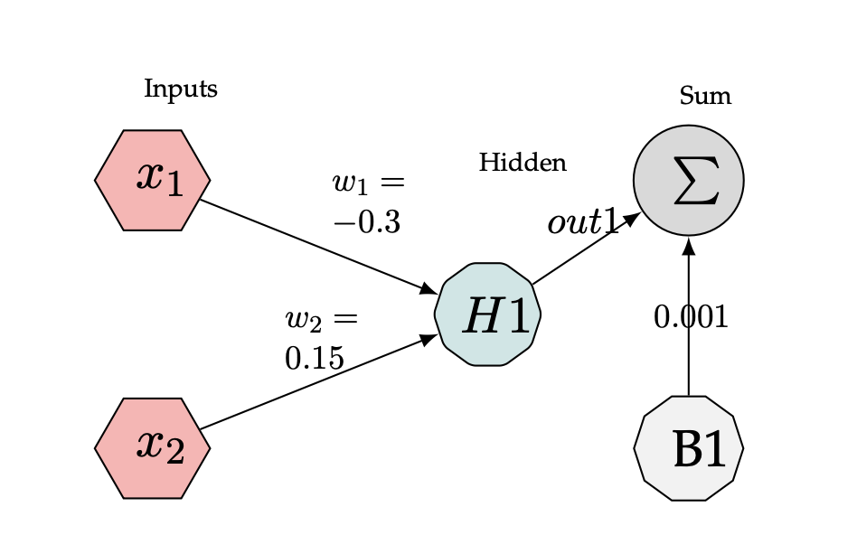
    </td>
  </tr>
  <tr>
    <td align="center"> Several nodes in a MLP.</td>
  </tr>
</table>

1. We examine the mechanism of a single hidden node, H1. The inputs and weights go through a linear transformation. What is the value of the output (out1) observed at the sum node?
2. What is the value resulting from the application the sum operator?
3. Verify the correctness of your results using PyTorch.

<details><summary><b>Answer</b></summary>
    
</details>


---

35. The following questions refer to the MLP depicted in (8.15).

1. Further to the above, the ReLU non-linear activation function $g(z) = max{0, z}$ is applied (8.15) to the output of the linear transformation. What is the value of the output (out2) now?

<table align='center'>
  <tr>
    <td align="center">
      
    </td>
  </tr>
  <tr>
    <td align="center"> Several nodes in a MLP.</td>
  </tr>
</table>

2. Confirm your manual calculation using PyTorch tensors.

<details><summary><b>Answer</b></summary>
    
</details>


---
4. Activation functions.
    1. Draw the graphs for sigmoid, tanh, ReLU, and leaky ReLU.
    1. Pros and cons of each activation function.
    1. Is ReLU differentiable? What to do when it’s not differentiable?
    1. Derive derivatives for sigmoid function when is a vector.

<details><summary><b>Answer</b></summary>
    
</details>


---

22. Why shouldn’t we have two consecutive linear layers in a neural network?

<details><summary><b>Answer</b></summary>
    
</details>


---

23. Can a neural network with only RELU (non-linearity) act as a linear classifier?

<details><summary><b>Answer</b></summary>
    
</details>


---

36. Your co-worker, an postgraduate student at M.I.T, suggests using the following activa-
tion functions in a MLP. Which ones can never be back-propagated and why?

1. $f(x) = |x|$
2. $f(x) = f(x)$ 
3. $f(x)= \begin{cases}
           0, & \text{if } x = 0, \\
           x \sin\left(\frac{1}{x}\right), & \text{if } x \neq 0.
       \end{cases}$
4. $f(x)= \begin{cases}
           0 & \text{if } x = 0 \\
           -x & \text{if } x < 0 \\
           x^2 & \text{if } x > 0
       \end{cases}$

<details><summary><b>Answer</b></summary>
    
</details>


---

37. You are provided with the following MLP as depicted in 8.16.

<table align='center'>
  <tr>
    <td align="center">
      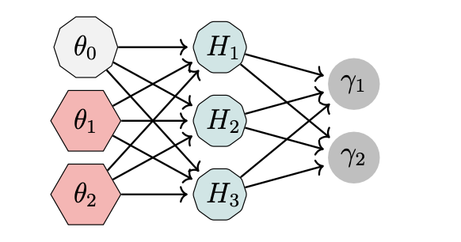
    </td>
  </tr>
  <tr>
    <td align="center"> A basic MLP</td>
  </tr>
</table>

The ReLU non-linear activation function $g(z) = max{0,z}$ is applied to the hidden layers $H1...H3$ and the bias term equals $0.001$.
At a certain point in time it has the following values $8.17$ all of which are belong to the type `torch.F loatTensor`:

```python
import torch
x= torch.tensor([0.9,0.7]) # Input
w= torch.tensor([
[-0.3,0.15],
[0.32,-0.91],
[0.37,0.47],
]) # Weights
B= torch.tensor([0.002]) # Bias
```
1. Using Python, calculate the output of the MLP at the hidden layers $H1...H3$.
2. Further to the above, you discover that at a certain point in time that the weights between the hidden layers and the output layers $γ1$ have the following values:
```python
w1= torch.tensor([0.15,-0.46,0.59], [0.10,0.32,-0.79])
```
What is the value observed at the output nodes $γ1..γ2$?
3. Assume now that a Softmax activation is applied to the output. What are the resulting values?
4. Assume now that a cross-entropy loss is applied to the output of the Softmax.
$$
L = -\sum_i{y_i\log(y_i)}
$$
What are the resulting values?

<details><summary><b>Answer</b></summary>
    
</details>


---

38. If someone is quoted saying: MLP networks are universal function approximators. What does he mean?

<details><summary><b>Answer</b></summary>
    
</details>


---

39. **True or False**: the output of a perceptron is 0 or 1.

<details><summary><b>Answer</b></summary>
    
</details>


---

40. **True or False:** A multi-layer perceptron falls under the category of supervised machine learning.

<details><summary><b>Answer</b></summary>
    
</details>


---

41. **True or False:** The accuracy of a perceptron is calculated as the number of correctly
classified samples divided by the total number of incorrectly classified samples.

<details><summary><b>Answer</b></summary>
    
</details>


---

42. The following questions refer to the SLP depicted in (8.18). The weights in the SLP are $w1 = 1$ and $w2 = 1$ respectively. There is a single hidden node, H1. The bias term, B1 equals $−2.5$.

<table align='center'>
  <tr>
    <td align="center">
      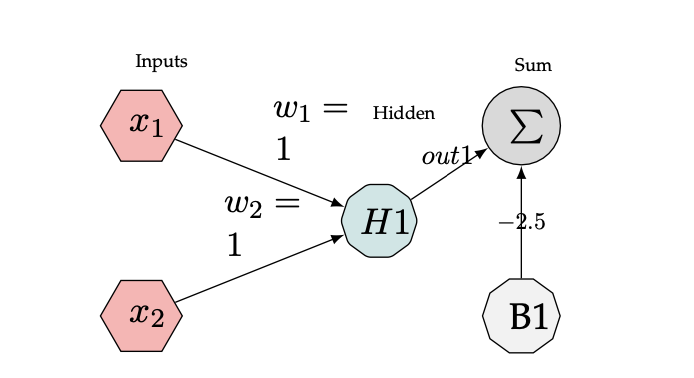
    </td>
  </tr>
  <tr>
    <td align="center"> A basic MLP</td>
  </tr>
</table>

1. Assuming the inputs to the SLP in (8.18) are
    1. x1 =0.0 and x2 =0.0 
    1. x1 =0.0 and x2 =1.0 
    1. x1 =1.0 and x2 =0.0 
    1. x1 = 1.0 and x2 =1.0

What is the value resulting from the application the sum operator?

<details><summary><b>Answer</b></summary>
    
</details>


---

43. Repeat the above assuming now that the bias term B1 was amended and equals −0.25.

<details><summary><b>Answer</b></summary>
    
</details>


---

44. Define what is the perceptron learning rule.

<details><summary><b>Answer</b></summary>
    
</details>


---

1. When building a neural network, should you overfit or underfit it first?

<details><summary><b>Answer</b></summary>
    
</details>


---

45. What was the most crucial difference between Rosenblatt’s original algorithm and Hinton’s fundamental papers of 1986: <a href="">Learning representations by back-propagating errors</a> and 2012:
<a href="">ImageNet Classification with Deep Convolutional Neural Networks” </a>

<details><summary><b>Answer</b></summary>
    
</details>


---

46. The AND logic gate is defined by the following table:

<table align='center'>
  <tr>
    <td align="center">
      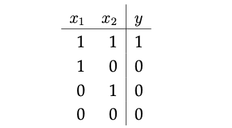
    </td>
  </tr>
  <tr>
    <td align="center"> Logical AND gate </td>
  </tr>
</table>

Can a perceptron with only two inputs and a single output function as an AND logic gate? If so, find the weights and the threshold and demonstrate the correctness of your answer using a truth table.

<details><summary><b>Answer</b></summary>
    
</details>


---

24. Design the smallest neural network that can function as an XOR gate.

<details><summary><b>Answer</b></summary>
    
</details>


---

47. The Sigmoid s(x) = 1 , also commonly known as the logistic function (Fig. 8.20),$s_c(x) = \frac{1}{1+e^-cx}$ is widely used in binary classification and as a neuron activation function in artificial neural networks. Typically, during the training of an ANN, a Sigmoid layer applies the Sigmoid function to elements in the forward pass, while in the backward pass the chain rule is being utilized as part of the backpropagation algorithm. In 8.20 the constant c was selected arbitrarily as 2 and 5 respectively.

<table align='center'>
  <tr>
    <td align="center">
      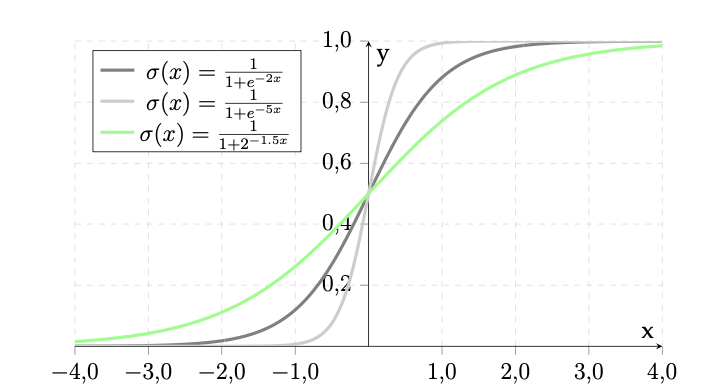
    </td>
  </tr>
  <tr>
    <td align="center"> Logical AND gate </td>
  </tr>
</table>

Digital hardware implementations of the sigmoid function do exist but they are expensive to compute and therefore several approximation methods were introduced by the research community. The method by [10] uses the following formulas to approximate the exponential function:

$$\exp{x} = Ex(x) = 2^{1.44x}$$

Based on this formulation, one can calculate the sigmoid function as:

$Sigmoid(x) = \frac{1}{1+2^{-1.44x}} = \frac{1}{1+2^{-1.5}}$

1. Code snippet 8.21 provides a pure C++ based (e.g. not using Autograd) implementation of the forward pass for the Sigmoid function. Implement the backward pass that directly computes the analytical gradients in C++ using Libtorch [19] style tensors.

```c
    #include <torch/script.h>
    #include <vector>

    torch::Tensor sigmoid001(const torch::Tensor & x ){ torch::Tensor sig = 1.0 / (1.0 + torch::exp(( -x))); return sig;}
```

2. Code snippet 8.22 provides a skeleton for printing the values of the sigmoid and its derivative for a range of values contained in the vector v. Complete the code (lines 7-8) so that the values are printed.

```c
    #include <torch/script.h>
    #include <vector>

    int main() {
    std::vector<float> v{0.0, 0.1, 0.2, 0.3, 0.4,0.5,0.6,0.7,0.8,0.9,0.99};
    for (auto it = v.begin(); it != v.end(); ++it) { torch::Tensor t0 = torch::tensor((*it));
    ...
    ...
    }
    }
```

3. Manually derive the derivative of eq. 8.27, e.g:

    $\frac{d}{dx}[\frac{1}{1+2^{-1.5x}}]$

4. Implement both the forward pass for the Sigmoid function approximation eq.8.27 that directly computes the analytical gradients in C++ using Libtorch [19].

5. Print the values of the Sigmoid function and the Sigmoid function approximation eq. 8.27 for the following vector:
v = [0.0, 0.1, 0.2, 0.3, 0.4, 0.5, 0.6, 0.7, 0.8, 0.9, 0.99]

<details><summary><b>Answer</b></summary>
    
</details>


---

48. The Hyperbolic tangent nonlinearity, or the tanh function (Fig. 8.23), is a widely used neuron activation function in artificial neural networks:

$$
f_{tanh}(x) = \frac{sinh(x)}{cosh(x)} = \frac{e^x - e^-x}{e^x + e^-x}
$$

<table align='center'>
  <tr>
    <td align="center">
      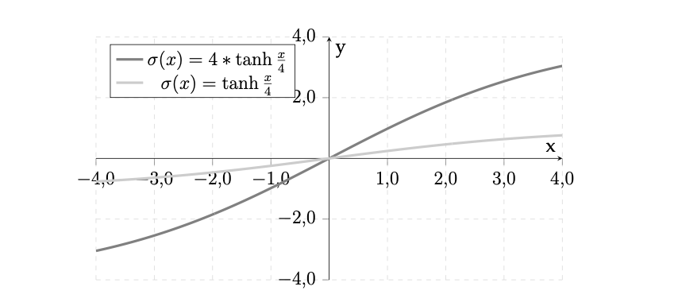
    </td>
  </tr>
  <tr>
    <td align="center"> Examples of two tanh functions </td>
  </tr>
</table>

1. Manually derive the derivative of the tanh function.
2. Use this numpy array as an input `[[0.37, 0.192, 0.571]]` and evaluate the result using pure Python.
3. Use the PyTorch based torch.autograd.Function class to write a custom Function that implements the forward and backward passes for the tanh function in Python.
4. Name the class TanhFunction, and using the gradcheck method from torch.autograd, verify that your numerical values equate the analytical values calculated by gradcheck. Remember you must implement a method entitled `.apply(x)` so that the function can be invoked by Autograd.

<details><summary><b>Answer</b></summary>
    
</details>


---

49. The code snippet in 8.24 makes use of the tanh function.
    ```python
    import torch
    nn001 = nn.Sequential(
    nn.Linear(200, 512),
    nn.Tanh(),
    nn.Linear(512, 512),
    nn.Tanh(),
    nn.Linear(512, 10),
    nn.LogSoftmax(dim=1)
    )
    ```
1. What type of a neural network does nn001 in 8.24 represent?
2. How many hidden layers does the layer entitles nn001 have?

<details><summary><b>Answer</b></summary>
    
</details>


---

50.  Your friend, a veteran of the DL community claims that MLPs based on tanh activation function, have a symmetry around 0 and consequently cannot be saturated. Saturation, so he claims is a phenomenon typical of the top hidden layers in sigmoid based MLPs. Is he right or wrong?

<details><summary><b>Answer</b></summary>
    
</details>


---

51. If we initialize the weights of a tanh based NN, which of the following approaches will lead to the vanishing gradients problem?
    1. Using the normal distribution, with parameter initialization method as suggested by
    Kaiming [14].
    1. Using the uniform distribution, with parameter initialization method as suggested by
    Xavier Glorot [9].
    1. Initialize all parameters to a constant zero value.

<details><summary><b>Answer</b></summary>
    
</details>


---

52. You friend, who is experimenting with the tanh activation function designed a small CNN with only one hidden layer and a linear output (8.25):

<table align='center'>
  <tr>
    <td align="center">
      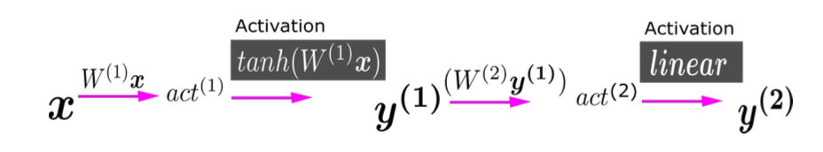
    </td>
  </tr>
  <tr>
    <td align="center"> A small CNN composed of tanh blocks </td>
  </tr>
</table>

He initialized all the weights and biases (biases not shown for brevity) to zero. What is the most significant design flaw in his architecture?

<details><summary><b>Answer</b></summary>
    
</details>


---

53. The rectified linear unit, or ReLU $g(z) = max{0, z}$ is the default for many CNN architectures. It is defined by the following function:

$$f_{ReLU} = max(0, x)$$

1. In what sense is the ReLU better than traditional sigmoidal activation functions?

<details><summary><b>Answer</b></summary>
    
</details>


---

54. You are experimenting with the ReLU activation function, and you design a small CNN (8.26) which accepts an RGB image as an input. Each CNN kernel is denoted by $w$.
<table align='center'>
  <tr>
    <td align="center">
      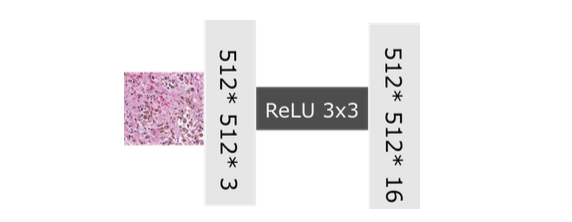
    </td>
  </tr>
  <tr>
    <td align="center"> A small CNN composed of ReLU blocks </td>
  </tr>
</table>
What is the shape of the resulting tensor W?

<details><summary><b>Answer</b></summary>
    
</details>


---

55.  Name the following activation function where $a ∈ (0, 1)$:

$$f(x) = \begin{cases}
    x & \text{if } x > 0 \\
    ax & \text{otherwise}
\end{cases}$$

<details><summary><b>Answer</b></summary>
    
</details>


---

56. In many interviews, you will be given a paper that you have never encountered before, and be required to read and subsequently discuss it. Please read <a href="https://arxiv.org/pdf/1710.05941.pdf">Searching for Activation Functions</a> before attempting the questions in this question.
    1. In, researchers employed an automatic pipeline for searching what exactly?
    2. What types of functions did the researchers include in their search space?
    3. What were the main findings of their research and why were the results surprising? 4. Write the formulae for the Swish activation function.
    5. Plot the Swish activation function.

<details><summary><b>Answer</b></summary>
    
</details>


---

### Performance Mertics

- Confusion Matrix
- precision and recall
- ROC-AUC

57. You design a binary classifier for detecting the presence of malfunctioning temperature sensors. Non-malfunctioning (N) devices are the majority class in the training corpus. While running inference on an unseen test-set, you discover that the Confusion Metrics (CM) has the following values 8.27:
<table align='center'>
  <tr>
    <td align="center">
      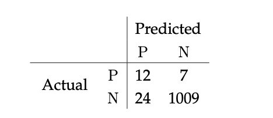
    </td>
  </tr>
  <tr>
    <td align="center"> A confusion metrics for functioning (N) temperature sensors. P stands for malfunctioning devices </td>
  </tr>
</table>
    1. Find: TP, TN, FP, FN and correctly label the numbers in table 8.27. 
    2. What is the accuracy of the model?
    3. What is the precision of the model?
    4. What is the recall of the model?

<details><summary><b>Answer</b></summary>
    
</details>


---

58. Complete the following sentences:

1. Receiver Operating Characteristics of a classifier shows its performance as a trade off between `[...]` and `[...]`.
2. It is a plot of `[...]` vs. the `[...]`. In place of `[...]`, one could also use `[...]` which are essen- tially {1 - ‘true negatives’}.
3. A typical ROC curve has a concave shape with `[...]` as the beginning and `[...]` as the end point
4. The ROC curve of a ‘random guess classifier’, when the classifier is completely con- fused and cannot at all distinguish between the two classes, has an AUC of `[...]` which is the `[...]` line in an ROC curve plot.

<details><summary><b>Answer</b></summary>
    
</details>


---

59. The code 8.30 and Figure 8.29 are the output from running XGBOOST for a binary
classification task.
    <table align='center'>
      <tr>
        <td align="center">
          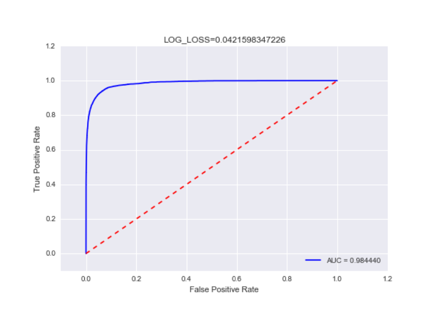
        </td>
      </tr>
      <tr>
        <td align="center"> RUC AUC </td>
      </tr>
    </table>

      ```python
      XGBClassifier(base_score=0.5, colsample_bylevel=1,colsample_bytree=0.5, gamma=0.017, learning_rate=0.15, max_delta_step=0, max_depth=9, min_child_weight=3, missing=None, n_estimators=1000, nthread=-1, objective='binary:logistic', reg_alpha=0, reg_lambda=1, scale_pos_weight=1, seed=0, silent=1, subsample=0.9)shape:(316200, 6)

      >ROC AUC:0.984439608912
      >LOG LOSS:0.0421598347226
      ```
    How would you describe the results of the classification?

<details><summary><b>Answer</b></summary>
    
</details>


---

### NNLayers, Topologists and Blocks

* CNN Arithmetics
* Dropout
* Convolution Layer
* Pooling layers
* MaxPooling
* Batch Normalization, Gaussian PDF
* The Gausssian distributions
* Batch Normalization(BN)
* Theory of CNN design
* CNN residual blocks

60. Given an input of size of $n×n$, filters of size $f×f$ and a stride of $s$ with padding of $p$, what is the output dimension?

<details><summary><b>Answer</b></summary>
    
</details>


---

61. Referring the code snippet in Fig. (8.31), answer the following questions regarding the VGG11 architecture [25]:

```python
  import torchvision
  import torch
  def main():
  vgg11 = torchvision.models.vgg11(pretrained=True)
  vgg_layers = vgg11.features
  for param in vgg_layers.parameters():
  param.requires_grad = False
  example = [torch.rand(1, 3, 224, 224),
  torch.rand(1, 3, 512, 512),
  torch.rand(1, 3, 704, 1024)]
  vgg11.eval()
  for e in example:
    out=vgg_layers(e)
    print(out.shape)
  if __name__ == "__main__":
    main()^^I^^I
```

1. In each case for the input variable example , determine the dimensions of the tensor which is the output of applying the VGG11 CNN to the respective input.
2. Choose the correct option. The last layer of the VGG11 architecture is:
    1. Conv2d
    2. MaxPool2d
    3. ReLU

<details><summary><b>Answer</b></summary>
    
</details>


---

62. Still referring the code snippet in Fig. (8.31), and specifically to line 7, the code is amended so that the line is replaced by the line: `vgg_layers=vgg11.features[:3]`.
    1. What type of block is now represented by the new line? Print it using PyTorch.
    2. In each case for the input variable example , determine the dimensions of the tensor which is the output of applying the block: `vgg_layers=vgg11.features[:3]` to the respective input.

<details><summary><b>Answer</b></summary>
    
</details>


---

63. Table (8.1) presents an incomplete listing of the of the VGG11 architecture [25]. As depicted, for each layer the number of filters (i. e., neurons with unique set of parameters) are presented.
<table align='center'>
  <tr>
    <td align="center">
      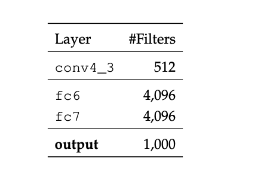
    </td>
  </tr>
  <tr>
    <td align="center"> Incomplete listing of the VGG11 architecture </td>
  </tr>
</table>
Complete the missing parts regarding the dimensions and arithmetics of the VGG11 CNN architecture:
1. The VGG11 architecture consists of `[...]` convolutional layers.
2. Each convolutional layer is followed by a `[...]` activation function, and five `[...]` opera- tions thus reducing the preceding feature map size by a factor of `[...]`.
3. All convolutional layers have a `[...]` kernel.
4. The first convolutional layer produces `[...]` channels.
5. Subsequently as the network deepens, the number of channels `[...]` after each `[...]` oper- ation until it reaches `[...]`.

<details><summary><b>Answer</b></summary>
    
</details>


---

64. A Dropout layer [26] (Fig. 8.32) is commonly used to regularize a neural network model by randomly equating several outputs (the crossed-out hidden node H) to 0.
<table align='center'>
  <tr>
    <td align="center">
      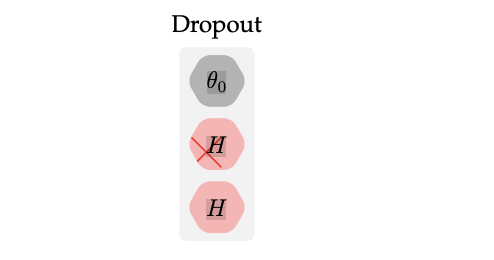
    </td>
  </tr>
  <tr>
    <td align="center"> A Dropout layer (simplified form) </td>
  </tr>
</table>
For instance, in PyTorch [20], a Dropout layer is declared as follows (8.2):

```python
import torch
import torch.nn as nn 
nn.Dropout(0.2)
```
Where nn.Dropout(0.2) (Line #3 in 8.2) indicates that the probability of zeroing an element is 0.2.
<table align='center'>
  <tr>
    <td align="center">
      
    </td>
  </tr>
  <tr>
    <td align="center"> A Dropout layer (simplified form) </td>
  </tr>
</table>
A new data scientist in your team suggests the following procedure for a Dropout layer which is based on Bayesian principles. Each of the neurons θn in the neural network in (Fig. 8.33) may drop (or not) independently of each other exactly like a Bernoulli trial.
During the training of a neural network, the Dropout layer randomly drops out outputs of the previous layer, as indicated in (Fig. 8.32). Here, for illustration purposes, all four neurons are dropped as depicted by the crossed-out hidden nodes $Hn$.

    1. You are interested in the proportion θ of droppedout neurons.Assume that the chance of drop-out, θ, is the same for each neuron (e.g. a uniform prior for θ). Compute the posterior of θ.
    2. Describe the similarities of dropout to bagging.

<details><summary><b>Answer</b></summary>
    
</details>


---


65. A co-worker claims he discovered an equivalence theorem where, two consecutive Dropout layers [26] can be replaced and represented by a single Dropout layer 8.34.
<table align='center'>
  <tr>
    <td align="center">
      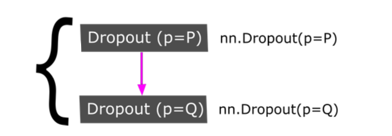
    </td>
  </tr>
  <tr>
    <td align="center">  Two consecutive Dropout layers </td>
  </tr>
</table>

$Hi$ realized two consecutive layers in PyTorch [20], declared as follows (8.3):

```python
import torch
import torch.nn as nn 
nn.Sequential(
    nn.Conv2d(1024, 32),
    nn.ReLU(),
    nn.Dropout(p=P, inplace=True),
    nn.Dropout(p=Q, inplace=True)
)
```
Where nn.Dropout(0.1) (Line #6 in 8.3) indicates that the probability of zeroing an element is 0.1.
1. What do you think about his idea, is he right or wrong?
2. Either prove that he is right or provide a single example that refutes his theorem.

<details><summary><b>Answer</b></summary>
    
</details>


---

66. If he uses the following filter for the convolutional operation, what would be the resulting
tensor after the application of the convolutional layer?
<table align='center'>
  <tr>
    <td align="center">
      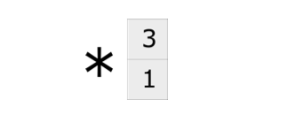
    </td>
  </tr>
  <tr>
    <td align="center">  A small filter for a CNN </td>
  </tr>
</table>

<details><summary><b>Answer</b></summary>
    
</details>


---

67. What would be the resulting tensor after the application of the ReLU layer (8.37)?
<table align='center'>
  <tr>
    <td align="center">
      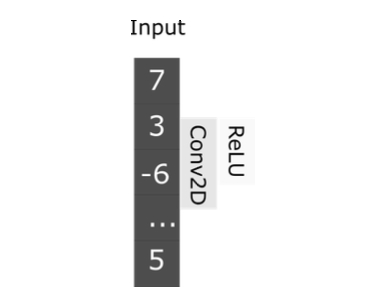
    </td>
  </tr>
  <tr>
    <td align="center">  The result of applying the filter </td>
  </tr>
</table>

<details><summary><b>Answer</b></summary>
    
</details>


---

68. What would be the resulting tensor after the application of the MaxPool layer (8.78)?

<details><summary><b>Answer</b></summary>
    
</details>


---

69. The following input 8.38 is subjected to a MaxPool2D(2,2) operation having 2 × 2 max-pooling filter with a stride of 2 and no padding at all.
<table align='center'>
  <tr>
    <td align="center">
      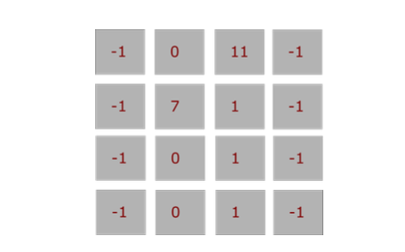
    </td>
  </tr>
  <tr>
    <td align="center">  Input to MaxPool2d operation </td>
  </tr>
</table>

Answer the following questions:
    1. What is the most common use of max-pooling layers?
    2. What is the result of applying the MaxPool2d operation on the input?

<details><summary><b>Answer</b></summary>
    
</details>


---

70. While reading a paper about the MaxPool operation, you encounter the following code snippet $9.1$ of a PyTorch module that the authors implemented. You download their pre- trained model, and evaluate its behaviour during inference:

```python
import torch
from torch import nn
class MaxPool001(nn.Module):
    def __init__(self): 
        super(MaxPool001, self).__init__() 
        self.math = torch.nn.Sequential(
        torch.nn.Conv2d(3, 32, kernel_size=7, padding=2),
        torch.nn.BatchNorm2d(32),
        torch.nn.MaxPool2d(2, 2),
        torch.nn.MaxPool2d(2, 2),
        )
def forward(self, x):
     print (x.data.shape)
    x = self.math(x)
    print (x.data.shape)
    x = x.view(x.size(0), -1)
    print ("Final shape:{}",x.data.shape)
    return x
model = MaxPool001()
model.eval()
x = torch.rand(1, 3, 224, 224)
out=model.forward(x)
```
The architecture is presented in 9.2:
<table align='center'>
  <tr>
    <td align="center">
      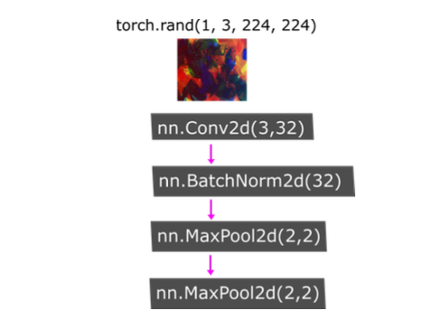
    </td>
  </tr>
  <tr>
    <td align="center">  Two consecutive MaxPool layers </td>
  </tr>
</table>
Please run the code and answer the following questions:
    1. In MaxPool2D(2,2), what are the parameters used for?
    2. After running line 8, what is the resulting tensor shape?
    3. Why does line 20 exist at all?
    4. Inline9,thereisaMaxPool2D(2,2)operation,followedbyyetasecondMaxPool2D(2,2). What is the resulting tensor shape after running line 9? and line 10?
    5. A friend who saw the PyTorch implementation, suggests that lines 9 and 10 may be replaced by a single MaxPool2D(4,4,) operation while producing the exact same results. Do you agree with him? Amend the code and test your assertion.

<details><summary><b>Answer</b></summary>
    
</details>


---

71. 1. What is batch normalization?
    2. The normal distribution is defined as follows:
    
    $$
    P(X) = \frac{1}{\sigma\sqrt{2\pi}}e^{\frac{-(x-\mu)^2}{2\sigma^2}}
    $$
    
    Generally i.i.d. $X ∼ N (μ, σ2)$ however BN uses the standard normal distribution. What mean and variance does the standard normal distribution have?
    3. What is the mathematical process of normalization?
    4. Describe, how normalization works in BN.

<details><summary><b>Answer</b></summary>
    
</details>


---

14. Compare batch norm and layer norm.

<details><summary><b>Answer</b></summary>
    
</details>


---

7. Weight normalization separates a weight vector’s norm from its gradient. How would it help with training?

---

72. In python, the probability density function for a normal distribution is given by 8.40:

```python
import scipy
scipy.stats.norm.pdf(x, mu, sigma)
```
    1. Without using Scipy, implement the normal distribution from scratch in Python.
    2. Assume, you want to back propagate on the normal distribution, and therefore you need the derivative. Using Scipy write a function for the derivative.

<details><summary><b>Answer</b></summary>
    
</details>


---

73. Your friend, a novice data scientist, uses an RGB image (8.41) which he then subjects to BN as part of training a CNN.
<table align='center'>
  <tr>
    <td align="center">
      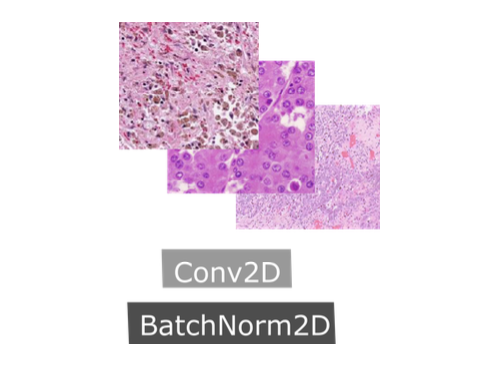
    </td>
  </tr>
  <tr>
    <td align="center">  Two consecutive MaxPool layers </td>
  </tr>
</table>

1. Helphimunderstand,duringBN,isthenormalizationappliedpixel-wiseorpercolour channel?
2. In the PyTorch implementation, he made a silly mistake 8.42, help him identify it:

```python
import torch
from torch import nn 

class BNl001(nn.Module):
 def __init__(self): 
    super(BNl001, self).__init__() self.cnn = torch.nn.Sequential(
    torch.nn.Conv2d(3, 64, kernel_size=3, padding=2),
    )
 self.math= torch.nn.Sequential(
  torch.nn.BatchNorm2d(32),
  torch.nn.PReLU(),
  torch.nn.Dropout2d(0.05)
)
 def forward(self, x):
    ...
```

<details><summary><b>Answer</b></summary>
    
</details>


---

74. **True or false**: An activation function applied after a Dropout, is equivalent to an activation function applied before a dropout.

<details><summary><b>Answer</b></summary>
    
</details>


---

75. Which of the following core building blocks may be used to construct CNNs? Choose all the options that apply: 
    1. Pooling layers
    2. Convolutional layers
    3. Normalization layers
    4.  Non-linear activation function
    5. Linear activation function

<details><summary><b>Answer</b></summary>
    
</details>


---

76. You are designing a CNN which has a single BN layer. Which of the following core CNN designs are valid? Choose all the options that apply: 
    1. CONV→act→BN→Dropout→...
    2. CONV→act→Dropout→BN→...
    3. CONV→BN→act→Dropout→... 
    4. BN→CONV→act→Dropout→... 
    5. CONV→Dropout→BN→act→...
    6.  Dropout→CONV→BN→act→...

<details><summary><b>Answer</b></summary>
    
</details>


---

78. The following operator is known as the Hadamard product:
$$
        OUT = A⊙B
$$
Where:
$$
        (A⊙B)i,j :=(A)i,j(B)i,j
$$
A scientist, constructs a Dropout layer using the following algorithm:

1.  Assign a probability of p for zeroing the output of any neuron.
2.  Accept an input tensor T , having a shape S
3. Generate a new tensor T ‘ ∈ {0, 1}^S
4. Assign each element in T‘a randomly and independently sampled value from a Bernoulli distribution:

$$         
            T‘i ∼  B(1,p)
$$

5. Calculate the OUT tensor as follows:

$$
        OUT = T‘⊙T 
$$

You are surprised to find out that his last step is to multiply the output of a dropout layer with:

$$
\frac{1}{1-p}
$$

Explain what is the purpose of multiplying by the term $\frac{1}{1-p}$

<details><summary><b>Answer</b></summary>
    
</details>


---

79. Visualized in (8.43) from a high-level view, is an MLP which implements a well-known idiom in DL.

<table align='center'>
  <tr>
    <td align="center">
      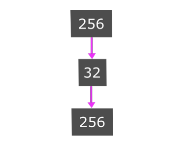
    </td>
  </tr>
  <tr>
    <td align="center">  A CNN block </td>
  </tr>
</table>

1. Name the idiom.
2. What can this type of layer learn?
3. A fellow data scientist suggests amending the architecture as follows (8.44)
<table align='center'>
<tr>
<td align="center">
  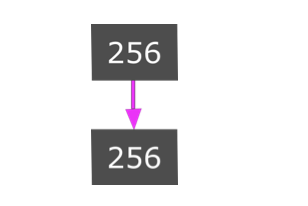
</td>
</tr>
<tr>
<td align="center">  A CNN block </td>
</tr>
</table>
Name one disadvantage of this new architecture.

4. Name one CNN architecture where the input equals the output.

<details><summary><b>Answer</b></summary>
    
</details>


---

80. Answer the following questions regarding residual networks.
    1. Mathematically, the residual block may be represented by:
    $$y = x + F(x)$$ 
    What is the function F?
    2. In one sentence, what was the main idea behind deep residual networks (ResNets) as introduced in the original paper?

<details><summary><b>Answer</b></summary>
    
</details>


---

81. Your friend was thinking about ResNet blocks, and tried to visualize them in (8.45).
<table align='center'>
  <tr>
    <td align="center">
      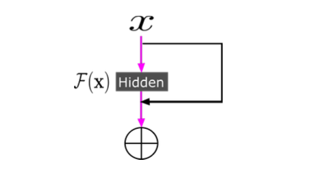
    </td>
  </tr>
  <tr>
    <td align="center"> A resnet CNN block </td>
  </tr>
</table>

1. Assuming a residual of the form $y = x + F(x)$, complete the missing parts in Fig. (8.45).
2. What does the symbol $⊕$ denotes?
3. A fellow data scientist,who had coffee with you said that residual blocks may compute the identity function. Explain what he meant by that.

<details><summary><b>Answer</b></summary>
    
</details>


---

### Training and Hyperparameters

* Hyperparameter optimization
* Labelling and bias
* Validation curve ACC
* Validation curve Loss
* Inference

---

82. A certain training pipeline for the classification of large images (1024 x 1024) uses the following Hyperparameters (8.46):

    Initial learning rate 0.1 
    Weight decay 0.0001 
    Momentum 0.9 
    Batch size 1024


```python

optimizer = optim.SGD(model.parameters(), lr=0.1, momentum=0.9,weight_decay=0.0001)
 ...
trainLoader = torch.utils.data.DataLoader(
    datasets.LARGE('../data', train=True, download=True, 7 transform=transforms.Compose([
    transforms.ToTensor(),
])),
batch_size=1024, shuffle=True)

```

In your opinion, what could possibly go wrong with this training pipeline?

<details><summary><b>Answer</b></summary>
    
</details>


---

83. A junior data scientist in your team who is interested in Hyperparameter tuning, wrote the following code (8.5) for spiting his corpus into two distinct sets and fitting an LR model:

```python

from sklearn.model_selection import train_test_split
dataset = datasets.load_iris()
X_train, X_test, y_train, y_test =
train_test_split(dataset.data, dataset.target, test_size=0.2) 
clf = LogisticRegression(data_norm=12)
clf.fit(X_train, y_train)

```

He then evaluated the performance of the trained model on the Xtest set.

1. Explain why his methodology is far from perfect.
2. Help him resolve the problem by utilizing a difference splitting methodology.
3. Your friend now amends the code an uses:
   
```python
clf = GridSearchCV(method, params, scoring='roc_auc', cv=5) clf.fit(train_X, train_y)
```
Explain why his new approach may work better?

<details><summary><b>Answer</b></summary>
    
</details>


---

84. In the context of Hyperparameter optimization, explain the difference between grid search and random search.

<details><summary><b>Answer</b></summary>
    
</details>


---

85. Non-invasive methods that forecast the existence of lung nodules (8.47), is a precursor to lung cancer. Yet, in spite of acquisition standardization attempts, the manual detection of lung nodules still remains predisposed to inter mechanical and observer variability. What is more, it is a highly laborious task.
<table align='center'>
  <tr>
    <td align="center">
      
    </td>
  </tr>
  <tr>
    <td align="center"> Pulmonary nodules </td>
  </tr>
</table>
In the majority of cases, the training data is manually labelled by radiologists who make mistakes. Imagine you are working on a classification problem and hire two radiologists for lung cancer screening based on low-dose CT (LDCT). You ask them to label the data, the first radiologist labels only the training set and the second the validation set. Then you hire a third radiologist to label the test set.

1. Do you think there is a design flow in the curation of the data sets?
2. A friend suggests that all the re radiologists read all the scans and label them independently thus creating a majority vote. What do you think about this idea?

<details><summary><b>Answer</b></summary>
    
</details>


---

86. Answer the following questions regarding the validation curve visualized in (8.48):
<table align='center'>
  <tr>
    <td align="center">
      
    </td>
  </tr>
  <tr>
    <td align="center"> A validation curve </td>
  </tr>
</table>

    1. Describe in one sentence, what is a validation curve.
    2. Which hyperparameter is being used in the curve?
    3. Which well-known metrics being used in the curve? Whichothermetricis commonly used?
    4. Which positive phenomena happens when we train a NN longer?
    5. Which negative phenomena happens when we train a NN longer than we should?
    6. How this negative phenomena is reflected in 8.48?
 
<details><summary><b>Answer</b></summary>
    
</details>


---

13. Learning rate.
    1. Draw a graph number of training epochs vs training error for when the learning rate is:
        1. too high
        1. too low
        1. acceptable.
    1. What’s learning rate warmup? Why do we need it?

<details><summary><b>Answer</b></summary>
    
</details>


---

17. It’s a common practice for the learning rate to be reduced throughout the training.
    1. What’s the motivation?
    1. What might be the exceptions?

<details><summary><b>Answer</b></summary>
    
</details>


---

87. Refer to the validation log-loss curve visualized in (8.49) and answer the following questions:

<table align='center'>
  <tr>
    <td align="center">
      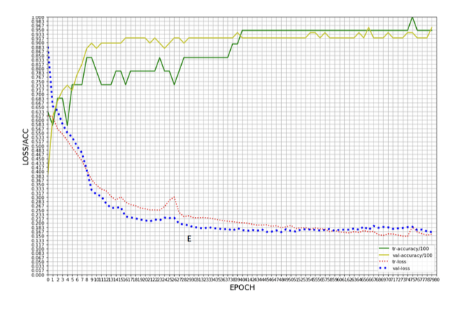
    </td>
  </tr>
  <tr>
    <td align="center">Log-loss function curve </td>
  </tr>
</table>

1. Name the phenomena that start shappening right after the marking by the letter E and describe why it is happening.
2. Name three different weight initialization methods.
3. What is the main idea behind these methods?
4. Describe several ways how this phenomena can be alleviated.
5. Your friend, a fellow data-scientist, inspects the code and sees the following Hyper- parameters are being used:
    Initial LR 0.00001 
    Momentum 0.9 
    Batch size 1024
He then tells you that the learning rate (LR) is constant and suggests amending the training pipeline by adding the following code (8.50):

```python
    scheduler = optim.lr_scheduler.ReduceLROnPlateau(opt)
```
What do you think about his idea?

6. Provide one reason against the use of the log-loss curve.

<details><summary><b>Answer</b></summary>
    
</details>


---

25. Why don’t we just initialize all weights in a neural network to zero?

<details><summary><b>Answer</b></summary>
    
</details>


---

88. You finished training a face recognition algorithm, which uses a feature vector of 128
elements. During inference, you notice that the performance is not that good. A friend tells you that in computer vision faces are gathered in various poses and perspectives. He there- fore suggests that during inference you would augment the incoming face five times, run inference on each augmented image and then fuse the output probability distributions by averaging.
    1. Name the method he is suggesting.
    2. Provide several examples of augmentation that you might use during inference.

<details><summary><b>Answer</b></summary>
    
</details>


---

89. Complete the sentence: If the training loss is insignificant while the test loss is signific-
antly higher, the network has almost certainly learned features which are not present in an `[...]` set. This phenomena is referred to as `[...]`

<details><summary><b>Answer</b></summary>
    
</details>


---

### Optimization and Loss

* Stochastic gradient descent, SGD
* Momentum
* Norms, L1, L2

---

90. What does the term stochastic in SGD actually mean? Does it use any random number generator?

<details><summary><b>Answer</b></summary>
    
</details>


---

26. Stochasticity.
    1. What are some sources of randomness in a neural network?
    1. Sometimes stochasticity is desirable when training neural networks. Why is that?

<details><summary><b>Answer</b></summary>
    
</details>


---

10. Gradient descent vs SGD vs mini-batch SGD.

<details><summary><b>Answer</b></summary>
    
</details>


---

2. Write the vanilla gradient update.

<details><summary><b>Answer</b></summary>
    
</details>


---

91. Explain why in SGD, the number of epochs required to surpass a certain loss threshold increases as the batch size decreases?

<details><summary><b>Answer</b></summary>
    
</details>


---

11. It’s a common practice to train deep learning models using epochs: we sample batches from data without replacement. Why would we use epochs instead of just sampling data with replacement?

<details><summary><b>Answer</b></summary>
    
</details>


---

18. Batch size.
    1. What happens to your model training when you decrease the batch size to 1?
    1. What happens when you use the entire training data in a batch?
    1. How should we adjust the learning rate as we increase or decrease the batch size?

<details><summary><b>Answer</b></summary>
    
</details>


---

6. Vanishing and exploding gradients.
    1. How do we know that gradients are exploding? How do we prevent it?
    1. Why are RNNs especially susceptible to vanishing and exploding gradients?

<details><summary><b>Answer</b></summary>
    
</details>


---

92. How does momentum work? Explain the role of exponential decay in the gradient descent update rule?

<details><summary><b>Answer</b></summary>
    
</details>


---
19. Why is Adagrad sometimes favored in problems with sparse gradients?

<details><summary><b>Answer</b></summary>
    
</details>


---
20. Adam vs. SGD.
    1. What can you say about the ability to converge and generalize of Adam vs. SGD?
    2. What else can you say about the difference between these two optimizers?

<details><summary><b>Answer</b></summary>
    
</details>


---

21. With model parallelism, you might update your model weights using the gradients from each machine asynchronously or synchronously. What are the pros and cons of asynchronous SGD vs. synchronous SGD?

<details><summary><b>Answer</b></summary>
    
</details>

---

93. In your training loop, you are using SGD and a logistic activation function which is
known to suffer from the phenomenon of saturated units.
    1. Explain the phenomenon.
    2. You switch to using the tanh activation instead of the logistic activation, in your opinion does the phenomenon still exists?
    3. In your opinion, is using the tanh function makes the SGD operation to converge better?

<details><summary><b>Answer</b></summary>
    
</details>


---

94. Which of the following statements holds true?
    1. In stochastic gradient descent we first calculate the gradient and only then adjust weights for each data point in the training set.
    2. In stochastic gradient descent, the gradient for a single sample is not so different from the actual gradient, so this gives a more stable value, and converges faster.
    3.  SGD usually avoids the trap of poor local minima.
    4. SGD usually requires more memory.

<details><summary><b>Answer</b></summary>
    
</details>


---

95. Answer the following questions regarding norms.
  
    1. Which norm does the following equation represent?
    $$
            |x1 − x2| + |y1 − y2|
    $$
    2. Which formulae does the following equation represent?
    
    $$\sqrt{\sum_{i=1}^n(x_i - y_i)^2}$$
    
    3. When your read that someone penalized the L2 norm, was the euclidean or the Manhattan distance involved?
    
    4. Compute both the Euclidean and Manhattan distance of the vectors: $x1$ = [6,1,4,5] and $x2$ = [2,8,3,−1].

<details><summary><b>Answer</b></summary>
    
</details>


---

 15. Why is squared L2 norm sometimes preferred to L2 norm for regularizing neural networks?

<details><summary><b>Answer</b></summary>
    
</details>


---

96. You are provided with a pure Python code implementation of the Manhattan distance
function (8.51):

```python

from scipy import spatial
x1=[6,1,4,5]
x2=[2,8,3,-1]
cityblock = spatial.distance.cityblock(x1, x2) 5 print("Manhattan:", cityblock)

```
In many cases, and for large vectors in particular, it is better to use a GPU for imple- menting numerical computations. PyTorch has full support for GPU’s (and its my favourite DL library ... ), use it to implement the Manhattan distance function on a GPU.

<details><summary><b>Answer</b></summary>
    
</details>


---

97. Your friend is training a logistic regression model for a binary classification problem using the L2 loss for optimization. Explain to him why this is a bad choice and which loss he should be using instead.

<details><summary><b>Answer</b></summary>
    
</details>


---

5. What’s the motivation for skip connection in neural works?

<details><summary><b>Answer</b></summary>
    
</details>


---

8. When training a large neural network, say a language model with a billion parameters, you evaluate your model on a validation set at the end of every epoch. You realize that your validation loss is often lower than your train loss. What might be happening?

<details><summary><b>Answer</b></summary>
    
</details>


---

9. What criteria would you use for early stopping?

<details><summary><b>Answer</b></summary>
    
</details>


---


12. Your model’ weights fluctuate a lot during training. How does that affect your model’s performance? What to do about it?

<details><summary><b>Answer</b></summary>
    
</details>


---


16. Some models use weight decay: after each gradient update, the weights are multiplied by a factor slightly less than 1. What is this useful for?

<details><summary><b>Answer</b></summary>
    
</details>


---

27. Dead neuron.
    1. What’s a dead neuron?
    1. How do we detect them in our neural network?
    1. How to prevent them?

<details><summary><b>Answer</b></summary>
    
</details>


---

28. Pruning.
    1. Pruning is a popular technique where certain weights of a neural network are set to 0. Why is it desirable?
    2. How do you choose what to prune from a neural network?

<details><summary><b>Answer</b></summary>
    
</details>


---

29. Under what conditions would it be possible to recover training data from the weight checkpoints?

<details><summary><b>Answer</b></summary>
    
</details>


---

30. Why do we try to reduce the size of a big trained model through techniques such as knowledge distillation instead of just training a small model from the beginning?

<details><summary><b>Answer</b></summary>
    
</details>


---

19. You’re building a neural network and you want to use both numerical and textual features. How would you process those different features?

<details><summary><b>Answer</b></summary>
    
</details>

---
