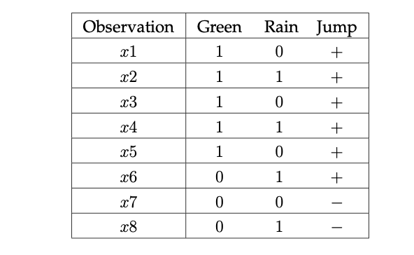
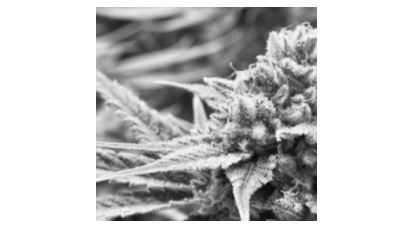
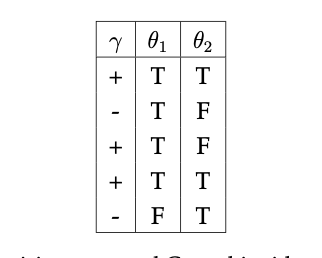
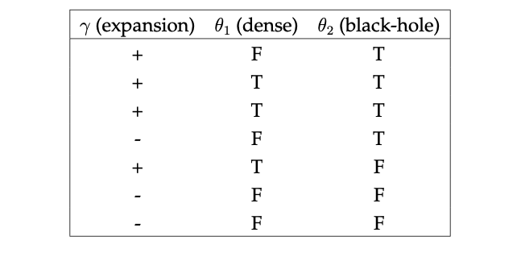
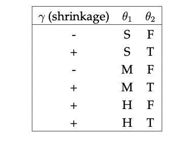
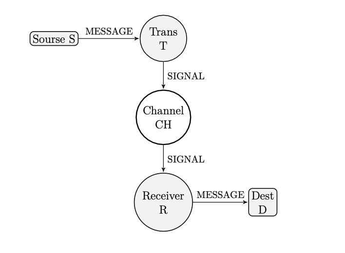
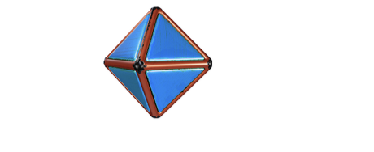

# Data Science Interview Questions And Answers


Topics
---

- [Information Theory]()


## Information Theory

Contents
----

- Logarithms in Information Theory 
- Shannon's Entropy
- Kullback-Leibler Divergence(KLD)
- Classification and Information Gain 
- Mutual Information
- Mechanical Statistics
- Jensen's inequality


---

1. Run the following Python code in a Python interpreter. What are the results?

```python

import math
import numpy
print (math.log(1.0/0.98)) # Natural log (ln)
print (numpy.log(1.0/0.02)) # Natural log (ln)

print (math.log10(1.0/0.98)) # Common log (base 10)
print (numpy.log10(1.0/0.02)) # Common log (base 10)
print (math.log2(1.0/0.98)) # Binary log (base 2)
print (numpy.log2(1.0/0.02)) # Binary log (base 2)

```

---

2. The three basic laws of logarithms:
    1. First law
    $$ \log A + \log B = \log AB $$

    Compute the following expression:
    $$
    \log_{10}3 + \log_{10}4
    $$

    2. Second law

    $$
    \log A^n = n\log A
    $$
    Compute the following expression:
    $$
    \log_24^6
    $$


    3. Third law
    $$
    \log A − \log B = \log \frac{A}{B} . 
    $$
    Therefore, subtracting $\log B$ from  in $\log A$ in $\log \frac{A}{B}$ .

    Compute the following expression:
    $$
    \log_e15 - \log_e3
    $$

---

3.  Write Shannon's famous general formulae for uncertainty.

---

4. Choose exactly one, and only one answer.
    1. For an event which is certain to happen, what is the entropy?

        (a) 1.0

        (b) 0.0

        (c) The entropy is undefined

        (d) −1

        (e) 0.5

        (f) $log_2(N)$, N being the number of possible events

    2. For N equiprobable events, what is the entropy?

        (a) 1.0

        (b) 0.0

        (c) The entropy is undefined 

        (d) −1

        (e) 0.5

        (f) $log_2(N)$

---

5. Shannon found that entropy was the only function satisfying three natural properties.
Enumerate these properties.

---

6. In information theory, minus the logarithm of the probability of a symbol (essentially the number of bits required to represent it efficiently in a binary code) is defined to be the information conveyed by transmitting that symbol. In this context, the entropy can be interpreted as the expected information conveyed by transmitting a single symbol from an alphabet in which the symbols occur with the probabilities $π_k$.

Mark the correct answer: Information is a/an `[decrease/increase]` in uncertainty.

---

7. Claud Shannon's paper “A mathematical theory of communication”, marked the birth of information theory. Published in 1948, it has become since the Magna Carta of the information age. Describe in your own words what is meant by the term Shannon bit.

---

8. With respect to the notion of surprise in the context of information theory:
    1. Define what it actually meant by being surprised.
    2. Describe how it is related to the likelihood of an event happening.
    3. True or False: The less likely the occurrence of an event, the smaller information it conveys.

---

9. Assume a source of signals that transmits a given message a with probability $P_a$. Assume further that the message is encoded into an ordered series of ones and zeros (a bit string) and that a receiver has a decoder that converts the bit string back into its respective message. Shannon devised a formulae that describes the size that the mean length of the bit string can be compressed to. Write the formulae.

---

10. Answer the following questions:
    1. Assume a source that provides a constant stream of N equally likely symbols ${x1, x2, . . . , xN }$. What does Shannon's formulae reduce to in this particular case?
    2. Assume that each equiprobable pixel in a monochrome image that is fed to a DL classification pipeline, can have values ranging from 0 to 255. Find the entropy in bits.

---

11. Given Shannon's famous general formulae for uncertainty:

$$
H = -\sum_{a=1}^NP_a\log_2P_a \\(bits per symbol)
$$
    1. Plot a graph of the curve of probability vs. uncertainty.
  
    2. Complete the sentence: The curve is [symmetrical/asymmetrical].

    3. Complete the sentence: The curve rises to a [minimum/maximum] when the two symbols are equally likely ($P_a = 0.5$).

---

12. Assume we are provided with biased coin for which the event ‘heads’ is assigned probability $p$, and ‘tails’ - a probability of $1 − p$. 

the respective entropy is:

$$
H(p) = −p\log p − (1 − p)\log (1 − p)
$$

Therefore, $H ≥ 0$ and the maximum possible uncertainty is attained when $p = 1/2$, is $H_max = \log_22$.

Given the above formulation, describe a helpful property of the entropy that follows from the concavity of the logarithmic function.

---

13. **True or False** : Given random variables X, Y and Z where $Y = X + Z$ then:

$$
H(X, Y ) = H(X, Z)
$$

---

14. What is the entropy of a biased coin? Suppose a coin is biased such that the probability of ‘heads’ is $p(x_h) = 0.98$
    1. Complete the sentence: We can predict ‘heads’ for each flip with an accuracy of [___]%.
    2. Complete the sentence : If the result of the coin toss is ‘heads’,the amount of Shannon information gained is [___] bits.
    3. Complete the sentence: If the result of the coin toss is ‘tails’, the amount of Shannon information gained is [___] bits.
    4. Complete the sentence : It is always true that the more information is associated with an outcome, the [more/less] surprising it is.
    5. Provided that the ratio of tosses resulting in ‘heads’ is $p(x_h)$, and the ratio of tosses resulting in ‘tails’ is $p(x_t)$, and also provided that $p(x_h)+p(x_t) = 1$, what is formulae for the average surprise?
    6. What is the value of the average surprise in bits?

---

15. Write the formulae for the Kullback-Leibler divergence between two discrete probability
density functions P and Q.

---

16. Describe one intuitive interpretation of the KL-divergence with respect to bits.

---

17. 1. True or False: The KL-divergence is not a symmetric measure of similarity, i.e.:
    $$
    D_{KL}(P||Q) != D_{KL}(Q||P)
    $$
    2. **True or False**: The KL-divergence satisfies the triangle inequality.
    3. **True or False**: The KL-divergence is not a distance metric.
    4. **True or False**: In information theory, KLD is regarded as a measure of the information gained when probability distribution Q is used to approximate a true probability distribution P .
    5. **True or False**: The units of KL-divergence are units of information.
    6. **True or False**: The KLD is always non-negative, namely:
    $$
    D_{KL}(P||Q) ≥ 0.
    $$
    7. **True or False:** In a decision tree, high information gain indicates that adding a split to the decision tree results in a less accurate model.

---

18. Given two distributions $f1$ and $f2$ and their respective joint distribution $f$, write the formulae for the mutual information of $f1$ and $f2$.

---

19. There are several measures by which one can determine how to optimally split attributes in a decision tree. List the three most commonly used measures and write their formulae.

---

20. Complete the sentence: In a decision tree, the attribute by which we choose to split is the one with `[minimum/maximum]` information gain.

---

21. To study factors affecting the decision of a frog to jump (or not), a deep learning researcher from a Brazilian rain-forest, collects data pertaining to several independent binary co-variates.

<table align='center'>
<tr>
<td align="center">
    
</td>
</tr>
<tr>
<td align="center"> A Frog in its natural habitat </td>
</tr>
</table>

The binary response variable Jump indicates whether a jump was observed. Referring to Table (4.1), each row indicates the observed values, columns denote features and rows denote labelled instances while class label (Jump) denotes whether the frog had jumped.
<table align='center'>
<tr>
<td align="center">
    
</td>
</tr>
<tr>
<td align="center"> A Frog in its natural habitat </td>
</tr>
</table>

Without explicitly determining the information gain values for each of the three attributes, which attribute should be chosen as the attribute by which the decision tree should be first partitioned? e.g which attribute has the highest predictive power regarding the decision of the frog (Fig. 4.4) to jump.

---

22. This question discusses the link between binary classification, information gain and decision trees. Recent research suggests that Cannabis (Fig. 4.5), and Cannabinoids administration in particular may reduce the size of malignant tumours in rodents. The data (Table 9.2) comprises a training set of feature vectors with corresponding class labels which a researcher intents classifying using a decision tree.
<table align='center'>
<tr>
<td align="center">
    
</td>
</tr>
<tr>
<td align="center">Cannabis </td>
</tr>
</table>

To study factors affecting tumour shrinkage, the deep learning researcher collects data regrading two independent binary variables; $θ1(T/F)$ indicating whether the rodent is a female, and $θ2(T/F)$ indicating whether the rodent was administrated with Cannabinoids. The binary response variable, $γ$, indicates whether tumour shrinkage was observed (e.g. shrinkage=+, no shrinkage=-). Referring to Table (9.2), each row indicates the observed values, columns $(θi)$ denote features and class label $(γ)$ denotes whether shrinkage was observed.
<table align='center'>
<tr>
<td align="center">
    
</td>
</tr>
<tr>
<td align="center">Decision trees and Cannabinoids administration </td>
</tr>
</table>

1. Describe what is meant by information gain.
2. Describe in your own words how does a decision tree work.
3. Using $\log_2$, and the provided dataset, calculate the sample entropy $H(γ)$.
4. What is the information gain $IG(X_1) ≡ H(γ) − H(|θ_1)$ for the provided training corpus?

---

23. To study factors affecting the expansion of stars, a physicist is provided with data regrading two independent variables; $θ_1 (T/F)$ indicating whether a star is dense, and $θ2 (T/F)$ indicating whether a star is adjacent to a black-hole. He is told that the binary response variable, $γ$, indicates whether expansion was observed.
e.g.:
$expansion=+$, no expansion=-$. Referring to table (4.3), each row indicates the observed values, columns $(θi)$ denote features and class label $(γ)$ denotes whether expansion was observed.
<table align='center'>
<tr>
<td align="center">
    
</td>
</tr>
<tr>
<td align="center">Decision trees and star expansion</td>
</tr>
</table>

1. Using $\log_2$ and the provided dataset, calculate the sample entropy $H(γ)$ (expansion) before splitting.
2. Using $\log_2$ and the provided dataset, calculate the information gain of $H(γ|θ1)$.
3. Using $log_2$ and the provided dataset, calculate the information gain of $H(γ|θ2)$.

---

24.  To study factors affecting tumour shrinkage in humans, a deep learning researcher is provided with data regrading two independent variables; $θ1(S/M/L)$ indicating whether the tumour is small(S), medium(M) or large(L), and $θ2(T/F)$ indicating whether the tumour has undergone radiation therapy. He is told that the binary response variable, $γ$, indicates whether tumour shrinkage was observed $(e.g. shrinkage=+, no shrinkage=-)$.

Referring to table (4.4), each row indicates the observed values, columns $(θ_i)$ denote features and class label $(γ)$ denotes whether shrinkage was observed.
<table align='center'>
<tr>
<td align="center">
    
</td>
</tr>
<tr>
<td align="center">Decision trees and radiation therapy</td>
</tr>
</table>

1. Using $\log_2$ and the provided dataset, calculate the sample entropy $H(γ)$ (shrinkage). 
2. Using $\log_2$ and the provided dataset, calculate the entropy of $H(γ|θ1)$.
3. Using $\log_2$ and the provided dataset, calculate the entropy of $H(γ|θ2)$.
4. **True or false**: We should split on a specific variable that minimizes the information gain, therefore we should split on $θ_2$ (radiation therapy).

---

25. Shannon described a communications system consisting five elements (4.6), two of which are the source S and the destination D.
<table align='center'>
<tr>
<td align="center">
    
</td>
</tr>
<tr>
<td align="center">Shannon's five element communications system</td>
</tr>
</table>

1. Draw a Venn diagram depicting the relationship between the entropies of the source H(S) and of the destination H(D).
2. Annotate the part termed equivocation.
3. Annotate the part termed noise.
4. Annotate the part termed mutual information.
5. Write the formulae for mutual information.

---

26. Complete the sentence: The relative entropy $D(p||q)$ is the measure of (a)[...] between two distributions. It can also be expressed as a measure of the (b)[...] of assuming that the distribution is q when the (c)[...] distribution is p.

---

27. Complete the sentence: Mutual information is a Shannon entropy-based measure of dependence between random variables. The mutual information between X and Z can be understood as the (a) [...] of the (b) [...] in X given Z:
$$
I(X; Z) := H(X) − H(X | Z)
$$
where H is the Shannon entropy, and $H (X | Z )$ is the conditional entropy of $Z$ given $X$.

---

28. What is the expression for the Boltzmann probability distribution?

---

29. Information theory, quantum physics and thermodynamics are closely interconnected. There are several equivalent formulations for the second law of thermodynamics. One approach to describing uncertainty stems from Boltzmanns fundamental work on entropy in statistical mechanics. Describe what is meant by Boltzmanns entropy.

---

30. From Boltzmanns perspective, what is the entropy of an octahedral dice?

<table align='center'>
<tr>
<td align="center">
    
</td>
</tr>
<tr>
<td align="center">An octahedral dice</td>
</tr>
</table>

---

31. 1. Define the term concave function.
    2. Define the term convex function.
    3. State Jensen's inequality and its implications.

---

32. **True or False**: Using Jensen's inequality, it is possible to show that the KL divergence
is always greater or equal to zero.

---

6. Jensen’s inequality forms the basis for many algorithms for probabilistic inference, including expectation maximization and variational inference. Explain what Jensen’s inequality is.