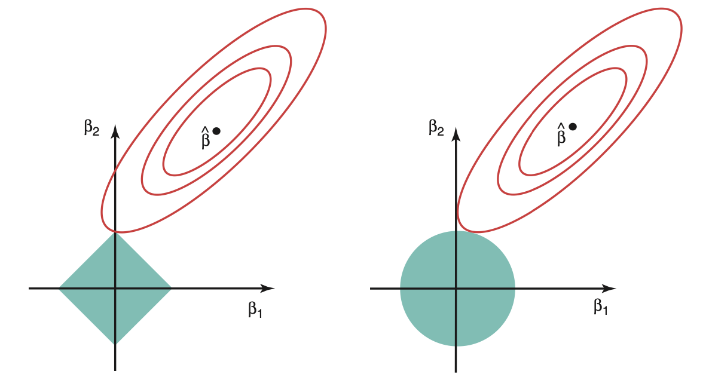

# Data Science Interview Questions And Answers

## Linear Methods For Regression

Contents
---

- [Linear Regression and Least Squares](#linear-regression)
- [Subset Selection](#subset-selection)
- [Shrinkage Methods](#shrinkage-methods)
- [Curse Of Dimensionality](#curse-of-dimensionality)

---

## Linear Regression

Q. What is linear regression, and how does it work?

<b>Answer</b>

Linear regression is a statistical model that assumes the regression function $E(Y|X)$ is linear or nearly linear. 

It takes the following form:

$$f(X) = \beta_{0} + \sum_{j=1}^{p}X_{j}\beta_{j}$$

Note that here $\beta_{j}$'s are unknown parameter or coefficients and the variables $X_{j}$ can come from different sources like
- Quantitative inputs or its transformations
- Basis expansion, such as $X_{2} = X_{1}^2$, $X_{3} = X_{1}^3$ leading to a polynomial representation
- Encoded categorical values
- Interaction between variables like $X_{3} = X_{1} \dot X_{2}$

It uses **least squares** as a estimation method to calculate the values of coefficients.

---

Q. How to determine the coefficients of a simple linear regression model?

<b>Answer</b>

Suppose we have a set of training data $(x_1, y_1),...,(x_n, y_n)$ from which we need to estimate the parameters $\beta$. Linear regression uses least squares estimation method to get values of the parameters. We pick the coefficients $\beta = (\beta_{0}, \beta_{1},....,\beta_{p}^{T})$ to minimize the residual sum of squares(RSS):

$$RSS(\beta) = \sum_{i=1}^{N}(y_{i} - f(x_{i}))^2 = \sum_{i=1}^{N}(y_{i} - \beta_{0} - \sum_{j=1}^{p}x_{ij}\beta_{j})^2$$

Alternatively we can rewrite the above equations as:

$$RSS(\beta) = (y - X\beta)^{T}(y - X\beta)$$

In order to minimize the above expression, differentiating with respect to $\beta$ we get,

$$\frac{\partial{RSS}}{\partial{\beta}} = -2X^{T}(y - X\beta)$$

$$\frac{\partial^{2}{RSS}}{\partial{\beta}\partial{\beta^{T}}} = 2X^{T}X$$

Assuming that $X$ has full column rank, hence $X^{T}X$ is positive definite so minima exists, we set first derivative to zero

$$X^{T}(y - X\beta) = 0$$

To obtain the unique solution

$$\hat{\beta} = (X^{T}X)^{-1}X^{T}y$$

---

Q. In which scenarios linear model can outperforms fancier non linear models?

<b>Answer</b>

In following cases in may happen:
- Low signal to noise ratio
- Near perfect linearity between predictors and the target variable
- Sparse data
- Small number of training instances

---

Q. Suppose a model takes form of $f(X) = \beta_{0} + \beta_{1}X_{1} + \beta_{2}X_{1}^{2}....$, Is it a linear model?

<b>Answer</b>

Yes model is still linear in nature. This is polynomial representation of a linear model.

We can write the given form in its linear mode:

$$f(X) = \beta_{0} + \beta_{1}X_{1} + \beta_{2}X_{2}....$$

Where $X_{2} = X_{1}^{2}$

No matter the source of the $X$, the model is linear in its parameter.

---

Q. What are the assumptions of linear regression?

<b>Answer</b>

The main assumptions of linear models are following:
- Linear relationship between predictors and response
    - If not then model may underfit and give bias predictions
- Predictors should be independent of each other(Non-Collinearity)
    - Otherwise it makes interpretation of output messy and unnecessary complicate model
- Homoscedasticity : Constant variance in the error terms(residual)
    - The standard errors, confidence intervals and hypothesis testing rely on this assumption
- Uncorrelated error terms(residuals)
    - If residuals are correlated then we may have pseudo confidence in our model
- Data should not have outliers
    - Can messed up the predictions if we have heavy outliers

---

Q. Explain the difference between simple linear regression and multiple linear regression.

<b>Answer</b>

The key difference between simple linear regression and multiple linear regression lies in the number of independent variables used to predict the dependent variable.

**Differences**

1. Number of Independent Variables:
   - Simple Linear Regression: One independent variable.
   - Multiple Linear Regression: Two or more independent variables.

2. Complexity:
   - Simple Linear Regression: Simpler and easier to interpret since it involves only one predictor.
   - Multiple Linear Regression: More complex due to the involvement of multiple predictors, and it requires more sophisticated techniques for interpretation and model validation.

3. Equation Form**:
   - Simple Linear Regression: $Y = \beta_0 + \beta_1 X + \epsilon$
   - Multiple Linear Regression: $Y = \beta_0 + \beta_1 X_1 + \beta_2 X_2 + \ldots + \beta_k X_k + \epsilon$

---

Q. What is Residual Standard Error(RSE) and how to interpret it?

<b>Answer</b>

The RSE is an estimate of the standard deviation of residuals($\epsilon$). It is the average amount by which the response will deviate from the true regression line.

It is computed using the formula:

$$RSE = \sqrt{\frac{1}{n-1}\sum_{i=1}^{n}{y_i - \hat{y}_i}}$$

It is considered as the lack of the fit of the data. Lower values indicates model fits the data very well.

---

Q. What is the purpose of the coefficient of determination (R-squared) in linear regression?

<b>Answer</b>

$R^2$ statistic provides goodness of fit and it is a unit less quantity so its better than the residual standard error.

It takes the form of a proportion *proportion of the variance explained* it always takes values between 0 and 1 and it is not dependent on the scale of $Y$. 

To calculate the $R^2$, we have following expressions:

$$R^2 = \frac{TSS - RSS}{TSS} = 1 - frac{RSS}{TSS}$$

Here, 

$$TSS(Total Sum of Squares) = \sum{(y_i - \hat{y})^2}$$

And,

$$RSS(Residual Sum of Squares) = \sum{(y_i - \cap{y})^2}$$

Statistically, it measures the proportion of variability in $Y$ that can be explained using $X$. 

---

Q. How to interpret the values of $R^2$ statistic?
   

<b>Answer</b>

A number near 0 indicates the regression does not explain the variability in the response, whereas 1 indicates a large proportion of the variability in the response is explained by the regression.

---

Q. How do you interpret the coefficients in a linear regression model?

<b>Answer</b>

Suppose we have a model of form:

$$Y = \beta_0 + \beta_{1}X_1 + \beta_{2}X_2 + \epsilon$$

Here's how to interpret them:
1. Intercept($\beta_0$):
    - It is the point where the regression line crosses the y-axis.
2. Slope Coefficient($\beta_i$):
    - For each independent variable, the slope coefficient ($\beta_{i}$) indicates the expected change in the dependent variable for a one-unit increase in the independent variable, holding all other variables constant.
    - positive/negative values means increase/decrease in independent variables lead to increase/decrease in response
3. Statistical Significance:
    - The p-value associated with each coefficient helps determine if the relationship is statistically significant. 
4. Magnitude:
    - The magnitude of the coefficient shows the strength of the relationship between the independent and dependent variables.

---

Q. What is the difference between correlation and regression?

<b>Answer</b>

- Correlation quantifies the degree to which two variables are related, without distinguishing between dependent and independent variables.
- Regression models the dependence of a variable on one or more other variables, providing a predictive equation and allowing for an analysis of the effect of each predictor.

---

Q. What are the methods to assess the goodness of fit of a linear regression model?

<b>Answer</b>

There are several methods to measure goodness of fit with some pros and cons:

- R-squared ($R^2$)
- Adjusted R-squared
- Residual Standard Error (RSE) or Root Mean Squared Error (RMSE)
- Mean Absolute Error (MAE)
- Akaike Information Criterion (AIC) and Bayesian Information Criterion (BIC)

We can use combinations of above statistic to evaluate the model performance.

---

Q. What is the purpose of the F-statistic in linear regression?

<b>Answer</b>

F-statistic is mainly used for hypothesis testing where we want to assess whether at least one of the predictors $X_1, X_2, ..., X_p$ is useful in predicting the response.

For example null hypothesis:

$$H_0 = \beta_1 = \beta_2 = ... = \beta_p = 0$$

alternate hypothesis:

$$H_a = at least one \beta_j is non-zero$$

here hypothesis test is performed by computing the F-statistic, 

$$F = \frac{(TSS - RSS)/p}{(RSS/(n-p-1))}$$

If the linear model assumptions are true:

$$E{(TSS-RSS)/p} = \sigma^2$$

and provided $H_0$ is true,

$$E{(TSS-RSS)/p} = \sigma^2$$

So, when there is no relationship between predictors and the response then F-statistic is near to 1 and if $H_a$ is true the  F-statistic will be greater than 1.

---

Q. What are the potential problems in linear regression analysis, and how can you address them?

<b>Answer</b>

Linear regression model may suffer from following issues mainly:

1. **Non-linearity**: Transform variables or use polynomial regression.
2. **Multicollinearity**: Remove or combine correlated predictors, use regularization.
3. **Heteroscedasticity**: Use robust standard errors, transform the dependent variable.
4. **Outliers**: Identify and handle outliers using diagnostic plots or robust regression.
5. **Overfitting**: Use cross-validation, simplify the model, or apply regularization.
6. **Non-normality of Residuals**: Transform variables or use non-parametric methods.

---

Q. What are some regularization techniques used in linear regression, and when are they applicable?

<b>Answer</b>

    

---

Q. Can you explain the concept of bias-variance trade-off in the context of linear regression?

<b>Answer</b>

    

---

## Subset Selection

Q. What do you mean by subset selection and how it is useful in linear regression models?

  
<b>Answer</b>

  
This approach involves identifying a subset of the <code>p</code> predictors that we believe to be related to the response. We then fit a model on the reduced set of variables or predictors.

  
This is useful because it:

  <ol>
    <li><b>Improves model interpretability</b>: Reduces complexity by using fewer predictors.</li>
    <li><b>Enhances prediction accuracy</b>: Removes irrelevant or redundant predictors that may add noise.</li>
    <li><b>Prevents overfitting</b>: Reduces the risk of the model fitting to the noise in the training data, leading to better generalization to new data.</li>
  </ol>

---

Q. What are some methods for selecting a subset of predictors?

<b>Answer</b>

There are mainly two methods for subset selection:

1. Best Subset Selection
2. Stepwise Selection
    - Forward Stepwise Selection
    - Backward Stepwise Selection

---

Q. Explain Best Subset Selection method?

<b>Answer</b>

Suppose we have $p$ predictors, we then fit a separate model to each possible combinations of $p$ predictors. That is we fit all the $p$ models that contains exactly one predictor, all $\binom{p}{2}
 = p(p-1)/2$ models that contains exactly two predictors and so on. We then look at the resulting models to identify the best one on the basis of objective metrics.

Here is the stepwise algorithm:
1. Let $M_0$ denote the null model, which contains no predictors. This model simply predicts the sample mean of each observations
2. For $k = 1, 2,...,p$:
    1. Fit all $\binom{p}{k}$ models that contains exactly $k$ predictors.
    2. Pick the best among these $\binom{p}{k}$ models and call it $M_k$, on the basis of RSS or $R^2$ score.
3. Select a single best model from among $M_0,....,M_p$ using cross validation prediction error like adjusted $R^2$ or $BIC$ etc.

---

Q. What is the drawback of selecting the best subset of features on the basis of Residual Square Error(RSS) or $R^2$ score in the above method?

<b>Answer</b>

As we induct more features in the model RSS monotonically decreases and $R^2$ increases monotonically. Therefore, if we use these statistics to select the best model, then we will always end up with the model involving all of the variables. The problem is that a low RSS or a high $R^2$ indicates low training error, whereas we want to have low test error.

<table align='center'>
  <tr>
    <td align="center">
      
    </td>
  </tr>
  <tr>
    <td align="center">Number of Predictors vs R2 and RSS</td>
  </tr>
</table>

---

Q. What are the limitations of Best Subset Selection method?

<b>Answer</b>

This method is simple and easy to understand but it suffers from the computational limitations. As we increase the number of predictors $p$, the number of possible models that we must consider increases exponentially. 

In general, there are $2^p$ models that involve subsets of $p$ predictors. So if $p=10$ then there will be $2^10$ possible models and if $p=20$ then here will be over one million possibilities.

---

Q. Given a use case that necessitates building a predictive model with a large number of features/predictors, which feature selection method would be most appropriate?

<b>Answer</b>

Stepwise Selection

---

Q. Why Forward Stepwise Selection method is better than the Best Subset Selection?

<b>Answer</b>

Forward stepwise selection is a computationally efficient alternative to the best subset selection. While the best subset selection procedure considers all $2^p$ possible models containing subsets of $p$ predictors, forward stepwise consider a much smaller set of $1 + p(p+1)/2$ models 

---

Q. How does the forward stepwise selection method works?

<b>Answer</b>

Forward stepwise selection steps:

1. Let $M_0$ denote the null model, which contains no predictors.
2. For $k=0,...,p-1$
    1. Consider all $p-k$ models that augment the predictors in $M_k$ with one additional predictor.
    2. Choose the best among these $p-k$ models and call it $M_{k+1}$ on the basis $R^2$ or $RSS$ basis.
3. Select a single best model from among $M_0,...,M_p$ using cross validate prediction error, $C_p$, $BIC$ and adjusted $R^2$.

**Example:**

Suppose you have a dataset with five predictors: $X_1, X_2, X_3, X_4$ and $X_5$, and a response variable $Y$. You want to build a linear regression model to predict $Y$.

Steps:

1. **Initialization**:
   - Start with an empty model (no predictors).

2. **Iteration**:

   **Iteration 1**:
   - Fit five simple linear regression models, each with one predictor:
     - Model 1: $Y \sim X_1$
     - Model 2: $Y \sim X_2$
     - Model 3: $Y \sim X_3$
     - Model 4: $Y \sim X_4$
     - Model 5: $Y \sim X_5$
   - Choose the model that has the best performance according to a criterion (e.g., lowest AIC). Suppose $X_3$ provides the best improvement.
   - Add $X_3$ to the model.

   **Iteration 2**:
   - Fit four models, each adding one more predictor to the model with $X_3$:
     - Model 1: $Y \sim X_3 + X_1$
     - Model 2: $Y \sim X_3 + X_2$
     - Model 3: $Y \sim X_3 + X_4$
     - Model 4: $Y \sim X_3 + X_5$
   - Choose the model that has the best performance. Suppose $X_2$ provides the best improvement.
   - Add $X_2$ to the model.

   **Iteration 3**:
   - Fit three models, each adding one more predictor to the model with $X_3$ and $X_2$
     - Model 1: $Y \sim X_3 + X_2 + X_1$
     - Model 2: $Y \sim X_3 + X_2 + X_4$
     - Model 3: $Y \sim X_3 + X_2 + X_5$
   - Choose the model that has the best performance. Suppose $X_1$ provides the best improvement.
   - Add $X_1$ to the model.

3. **Stopping Criterion**:
   - Stop adding predictors when the model improvement is no longer significant according to the chosen criterion.

Q. What is the major issue with stepwise selection?

<b>Answer</b>

stepwise selection  methods like forward/backward stepwise methods are basically a greedy algorithm and hence can produce sub-optimal subset of features as the best combinations. It is not guaranteed to yield the best model containing a subset of the $p$ predictions.

---

Q. Imagine you have a dataset with $100$ observations $(n=100)$ and $1000$ predictors $(p=1000)$. Which feature selection method you can use?

<b>Answer</b>

For cases $p >> n$, Forward-stepwise subset selection method is only feasible and appropriate solution for feature selection.

---

Q. Explain Backward stepwise selection method?

<b>Answer</b>

Backward stepwise selection steps:

1. Let $M_p$ denote the full model, which contains all the predictors.
2. For $k=p,...,0$
    1. Consider all $k$ models contain all but one of the predictors in $M_k$, for total of $k-1$ predictors.
    2. Choose the best among these $k$ models and call it $M_{k-1}$ on the basis $R^2$ or $RSS$ basis.
3. Select a single best model from among $M_0,...,M_p$ using cross validate prediction error, $C_p$, $BIC$ and adjusted $R^2$.

---

Q. One issue with Backward stepwise selection method?

<b>Answer</b>

It is not suitable for the cases having $p >> n$.

---

Q. Is it good idea to combine forward and backward stepwise subset selection technique as a single method?

<b>Answer</b>

Yeah we can adopt a hybrid approach where we can add predictors sequentially as like we do in forward selection. However after adding any predictors we can also remove any predictor which is not adding any improvement in the model fit. It mimics the best subset selection while retaining the computational advantages of forward and backward stepwise selection.

---

## Shrinkage Methods

Q. What is shrinkage methods?

<b>Answer</b>

Shrinkage methods are statistical techniques used to improve the accuracy and interpretability of regression models, especially when dealing with high-dimensional data. These methods work by introducing a penalty on the size of the regression coefficients, effectively *shrinking* them towards zero. This can help to reduce overfitting and improve the generalizability of the model.

---

Q. What are the benefits of using shrinkage methods over subset selection methods?

<b>Answer</b>

Subset selection method produces a model that is interpretable and has possibly less prediction error than the full model. However because it is a discrete process variables are either retained or discarded so it does not reduce the prediction error of the full model. Shrinkage methods are more continuous and don't suffer much from high variability. Also in shrinkage method we can fit model with all $p$ predictors.

---

Q. Name some shrinkage methods?

<b>Answer</b>

- Ridge Regression(L2 Regularization)
- Lasso Regression(L1 Regularization)
- Elastic Net 

---

Q. What's the main purpose of L1 and L2 regularization in linear regression?

<b>Answer</b>

Ordinary least square method suffers from the following issues:
- Poor prediction accuracy(Overfitting)
    - If $n ~ p$ i.e number of observations($n$) is not much larger than the number of predictors ($p$) then  there can be a lot of variability in the least square fit, resulting in overfitting and consequently poor prediction on test set.
    - If $p > n$, then there is no longer a unique least square coefficient estimation and variance is infinite so method an not be used at all
- Lack of model interpretability
    - It is often the case that some of many of the variables used in ols might not be associated with the response. They unnecessary complicate the model and makes hard to interpret the model output.

L1(Lasso) and L2(Ridge) regularization techniques help in addressing the above shortcomings of ols method. They can shrink the regression coefficient to zero or nearly zero and hence can help feature selection. Effectively they addresses the overfitting issue in ols by reducing the variance of the model.

---

Q. How do we estimate coefficients in Ridge regression?

<b>Answer</b>

The ridge regression coefficients estimates $\hat{\beta}^{R}$ are values that minimizes:

$$\sum_{i=1}^n(y_i - \beta_0 - \sum_{j=1}^p\beta_jx_{ij})^2 + \lambda\sum_{j=1}^p\beta_{j}^2$$

$$ = RSS + \lambda\sum_{j=1}^p\beta_{j}^2$$

where $\lambda >= 0$ is a tuning parameter, to be determined separately. The above equation tradeoff two criteria. As with least square error(RSS), ridge regression seeks coefficients estimates that fit the data well, by making the RSS smaller. The second term $\lambda\sum_{j=1}^p\beta_{j}^2$ , called a shrinkage penalty is small when $\beta_1,...,\beta_p$ are close to zero, so it has the effect of shrinking the estimates of $\beta_j$ towards zero.

---

Q. Explain the effect of tuning parameter $\lambda$ in ridge regression cost function?

<b>Answer</b>

It essentially balances the trade-off between fitting the data well (minimizing RSS) and keeping the model coefficients small (minimizing the penalty term). 

When $\lambda = 0$, the penalty term has no effect, and ridge regression will produce the least squares estimates. However, as $\lambda -> \inf$, the impact of shrinkage penalty grows, and the ridge regression coefficient estimates will approach zero.

---

Q. How can we determine optimal value of $\lambda$ ?

<b>Answer</b>

Using cross validation technique

---

Q. Suppose you fit a ordinary linear regression model over your data and you find it is under-fitting. Is it good idea to use Ridge or Lasso regression here?

<b>Answer</b>

No, Ridge or Lasso regression addresses the variance issue in ols technique, here the model is suffering from the biasness and hence they can provide any help here. We can use polynomial regression or some other more complex model.

---

Q. How do L1 and L2 regularization affect the model's coefficients?

<b>Answer</b>

L1 or L2 regularization are shrinkage methods which helps in reducing the coefficient of the estimate to zero or nearly zero. 

---

Q. Can we use ridge regression for variable selection purpose?

<b>Answer</b>

No we can't use it as feature selection technique. The penalty term $\lambda \sum\beta_j^{2}$ in ridge regression will shrink all the coefficients towards zero, but will not set any of them exactly zero (unless $\lambda = \infin$).

---

Q. Write the loss function involve in lasso regression?

<b>Answer</b>

The loss function expression in lasso regression:

$$\sum_{i=1}^n(y_i - \beta_0 - \sum_{j=1}^p\beta_jx_{ij})^2 + \lambda\sum_{j=1}^p|{\beta_{j}}|$$

$$ = RSS + \lambda\sum_{j=1}^p|\beta_{j}|$$

---

Q. Which regression technique leads to sparse models? Lasso or ridge regression?

<b>Answer</b>

Lasso regression method

---

Q. Why is it that the lasso, unlike ridge regression, results in coefficient estimates that are exactly equal to zero?

<b>Answer</b>

The loss function involve in lasso and ridge regression can be re-written as follows:

**Lasso loss function:**

$$minimize_\beta\{{\sum_{i=1}^{n}(y_i - \beta_0 - \sum_{j=1}^{p}\beta_{j}x_{ij})^2}\}$$
subjected to $$\sum_{j=1}^{p}|\beta_{j}| \leq s$$

**Ridge loss function:**

$$minimize_\beta\{{\sum_{i=1}^{n}(y_i - \beta_0 - \sum_{j=1}^{p}\beta_{j}x_{ij})^2}\}$$
subjected to $$\sum_{j=1}^{p}\beta_{j}^2 \leq s$$

For $p=2$, we can plot the error and constraints functions for the lasso and ridge regression as follows:

<table align='center'>
  <tr>
    <td align="center">
      
    </td>
  </tr>
  <tr>
    <td align="center">Contours of the error and constraint functions for the lasso(left) and ridge regression(right). The solid blue areas are the constraint regions, $|β1| + |β2| ≤ s and β1 + β2 ≤ s, while the red ellipses are the contours of the RSS</td>
  </tr>
</table>

The ellipse that are centered around $\hat{\beta}$ represent regions of constant RSS. In other words, all of the points on a given ellipse share a common value of RSS. As the ellipse expand away from least squares coefficient estimates, the RSS increases. The above equations indicate that the lasso and ridge regression coefficients estimates are given by the first point at which an ellipse contacts the constraint region. 

Since ridge regression has a circular constraint with no sharp points, this intersection will not generally occur on an axis, and so the ridge regression coefficient estimate will be exclusively non-zero. However, the lasso constraint has corners at each of the axes, and so the ellipse will often intersect the constraint region at an axis. When this occurs, one of the coefficients will equal to zero.

---

Q. List some advantages of using lasso regression over ridge regression?

<b>Answer</b>

- It produces simpler and more interpretable model
- Can perform feature selection 

---

Q. What are the hyper-parameters associated with L1 and L2 regularization?

<b>Answer</b>

$\alpha$, It controls the relative impact of Residual Square Sum and Shrinkage penalty $\sum_{j}{\beta_{j}^{2}} on regression coefficients estimates.

---

Q. When would you choose L1 regularization over L2, and vice versa?

<b>Answer</b>

 
L1 regularization performs better in a setting where a relatively small number of predictors have substantial coefficients and remaining predictors have coefficients that are very small or near to zero. Also L1 performs variable selection be forcing some coefficients of the estimates to zero and hence easier to interpret.

L2 regularization is effective when the response is a function of many predictors, all with the coefficients roughly equal in size. Also L1 technique may lead to sparse model.

---

Q. What is Elastic Net regularization, and how does it relate to L1 and L2 regularization?

<b>Answer</b>

    

---

Q. How do you choose the optimal regularization strength (alpha) for L1 and L2 regularization?

<b>Answer</b>

Cross validation can be used to tune the *alpha*. 
- Choose a grid of $\alpha$ values and compute cross validation error for each value of $\alpha$
- Select the $\alpha$ which is yielding smallest cross validation error
- Refit the model with all the available variables and the selected $\alpha$ value.
  

---

Q. What are the consequences of multi-collinearity?

<b>Answer</b>

Multi collinearity can pose problems in regression context:
- It can be difficult to separate out the individual effects of collinear variables on the response.
- It reduces the accuracy of the estimate of the regression coefficients
- It reduces the power of the hypothesis testing - like *probability of correctly detecting a non zero coefficient* 

---

Q. How can you detect collinearity in a regression model?

<b>Answer</b>

A simple way to detect collinearity is to look at the correlation matrix of the predictors. A large absolute value in that matrix indicates a pair of highly correlated variables.

---

Q. How can you detect multi-collinearity in a regression model?

<b>Answer</b>

We can detect multi-collinearity using *variance inflation factor(VIF)*. VIF measures how much the variance of a regression coefficient is inflated due to multi-collinearity.

The VIF is the ratio of the variance of $\beta_j$ when fitting the full model divided by the variance of $\beta_j$ if fit on its own. 

$$VIF(\beta_j) = \frac{1}{1-R^{2}_{X_{j}|X_{-j}}}$$

where $R^{2}_{X_{j}|X_{-j}}$ is the $R^2$ from a regression of $X_j$ onto all the other predictors.

The smallest possible value of VIF is 1, which indicates complete absence of collinearity. In practice we have small collinearity among the predictors so VIF greater tha 5 or 10 depicts problematic amount of collinearity.

---

Q. How can you address multi-collinearity?

<b>Answer</b>

There are several methods to address multi-collinearity:
- Remove Highly Correlated Predictors
- Combine Correlated Predictors
- Principal Component Analysis (PCA)
- Use ridge or lasso regression or combination of both(elastic net regression) for modeling

---

Q. Can you have perfect multi-collinearity?

<b>Answer</b>

Yeah, It may occur when one predictor variable in a regression model is an exact linear combination of one or more other predictor variables. In other words, the correlation between the variables is exactly 1 (or -1).

---

### Curse Of Dimensionality

Q. How can we determine whether a dataset is high-dimensional or low-dimensional?

<b>Answer</b>

We can determine whether a dataset is high-dimensional or low-dimensional by comparing the number of features($p$) to the number of observations($n$). 

- High dimensional
    
    - $p \gg n$

- Low dimensional

    - $n \gg p$

---

Q. What is the issue of using least squares regression in high dimensional setting?

<b>Answer</b>

When $p > n$, where $p$ is the number of features and $n$ is the number of observations, the least squares method will produce coefficient estimates that perfectly fit the data, resulting in zero residuals. This occurs regardless of whether there is a true relationship between the features and the response. Such a perfect fit is problematic because it leads to overfitting, capturing noise rather than the underlying pattern. The issue is that when $p > n$ or $p \approx n$, least squares regression is too flexible, making the model prone to overfitting the data.

---

Q. What happens to the Train MSE and Test MSE in a linear regression model if we add features that are completely unrelated to the response?

<b>Answer</b>

As we induct more redundant features in a linear regression model, the Train MSE will typically decrease because the model can fit the training data better due to the additional features. However, the Test MSE is likely to increase because including the additional predictors leads to a vast increase in the variance of the coefficient estimates(overfitting).

---

Q. What is curse of dimensionality?

<b>Answer</b>

The curse of dimensionality refers to the phenomenon where the test error typically increases as the number of features or predictors in a dataset grows, unless these additional features have a genuine relationship with the response variable. This occurs because as dimensionality rises, the data becomes sparser, making it harder for models to generalize well and increasing the risk of overfitting.

---

Q. If I add a feature to my linear regression model, how will it affect the Train MSE and Test MSE?

<b>Answer</b>

When you add a feature to your linear regression model, the Train MSE will generally decrease because the model becomes better at fitting the training data. However, the Test MSE may increase if the new feature does not contribute meaningful information and instead leads to overfitting. This happens because the additional feature can cause the model to capture noise rather than the underlying pattern, which harms its performance on new, unseen data.

---

Q. Can we use lasso or ridge regression in high dimensional setup?

<b>Answer</b>

Yeah, They will make the linear regression less flexible in higher dimensional and prevent to overfit the train data.

---

Q. Can we use lasso or ridge regression in high dimensional setup?

<b>Answer</b>

Yeah, They will make the linear regression less flexible in higher dimensional and prevent to overfit the train data.

---

Q. [True/False] In the high-dimensional setting, the multicollinearity problem is extreme?

<b>Answer</b>

True

---

Q. [True/False] In the high-dimensional setting, the multicollinearity problem is extreme?

<b>Answer</b>

True

---

Q. Why should one be cautious when reporting errors and measures of model fit in high-dimensional settings?

<b>Answer</b>

In high-dimensional settings (where $p > n$), traditional measures like sum of squared errors, p-values, and $R^2$ can be misleading. A model might show zero residuals or an $R^2$ of 1 simply due to overfitting, not because it is genuinely good. To avoid misinterpretation, rely on performance metrics from an independent test set or cross-validation, as these provide a more accurate assessment of the model's true effectiveness.

---

