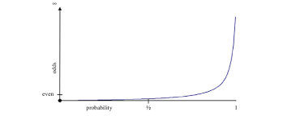
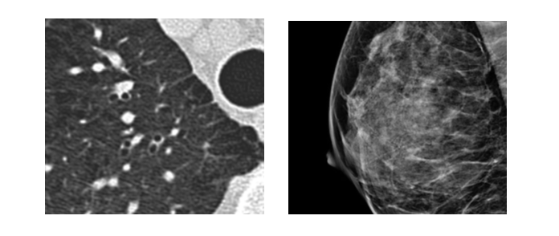
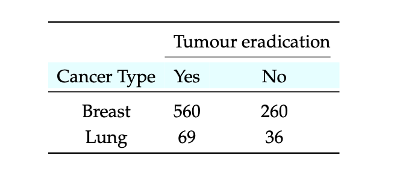
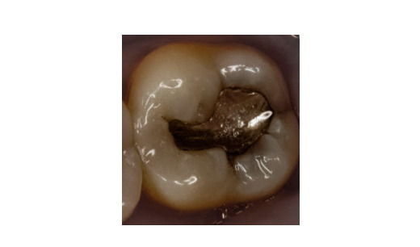
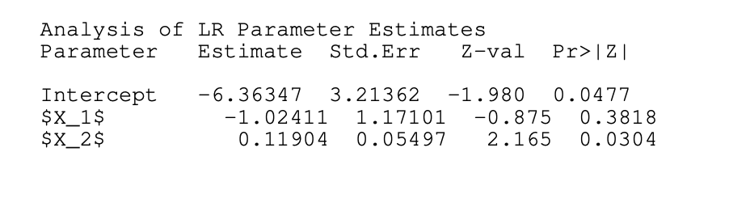
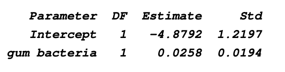
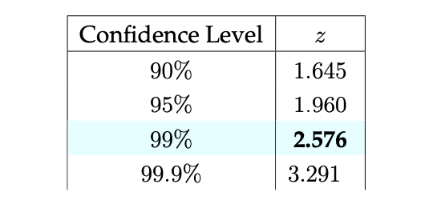
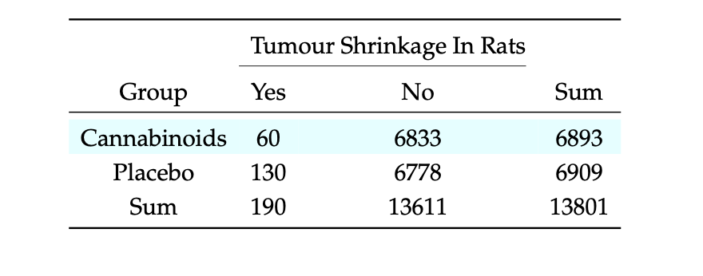

# Deep Learning Interview Questions

Topics
---

- [Logistic Regression](#logistic-regression)

## Logistic Regression

Contents
---
- [General Concepts](#general-concepts)
- [Odds and Log-odds](#odds-and-log-odds)
- [The Sigmoid](#the-sigmoid)
- [Truly Understanding Logistic Regression](#truly-understanding-logistic-regression)
- [The Logit Function and Entropy](#the-logit-function-and-entropy)

### General Concepts

1. **True or False**: For a fixed number of observations in a data set, introducing more variables normally generates a model that has a better fit to the data. What may be the drawback of such a model-fitting strategy?

<b>Answer</b>

    

    <b>True</b> But if the inducted features do not provide enough information and act like redundant predictors, then it does not make sense to add those predictors to the model. It unnecessarily increases the complexity of the model and may cause overfitting issues.
    

---
2. Define the term **“odds of success”** both qualitatively and formally. Give a numerical example that stresses the relation between probability and odds of an event occurring.

<b>Answer</b>

    
  The term "odds of success" refers to the likelihood or probability of a favorable outcome or event occurring in a given situation or experiment. The odds of success express the relative chances of a positive outcome compared to a negative outcome. It tells you how much more likely success is compared to failure.

    
Odds of Success = $\frac{q}{p}$

    
Let's consider a simple numerical example to illustrate the relationship between probability and the odds of an event occurring:

     
  Suppose you are flipping a fair coin. The probability of getting heads ($p$) is $0.5$, and the probability of getting tails ($q$) is also $0.5$. To calculate the odds of success (getting heads):

     
Odds of Success = $\frac{q}{p}$ = $\frac{0.5}{0.5} = 1$

In this case, the odds of success are 1. This means that the chances of getting heads and the chances of getting tails are equal. 

---
3. Answer the following:
    1. Define what is meant by the term **"interaction"**, in the context of a logistic regression predictor variable.
    1. What is the simplest form of an interaction? Write its formulae.
    1. What statistical tests can be used to attest to the significance of an interaction term?

<b>Answer</b>

    
 1. An interaction is the product of two single predictor variables implying a non-additive effect.
 

    
2. Suppose in your model you have two predictors $X$ and $Y$, a model having interaction term can be expressed as :
    $$\beta_0 + \beta_1X + \beta_2Y + \beta_3XY$$
    The last term $\beta_3XY$ represents an interaction between these two predictors.
    

     
 3.  For testing the contribution of an interaction, two principal methods are commonly employed; the Wald chi-squared test or a likelihood ratio test between the model with and without the interaction term.
 

---
4. **True or False**: In machine learning terminology, unsupervised learning refers to the mapping of input covariates to a target response variable that is attempted to be predicted when the labels are known.

<b>Answer</b>

    
 <b>False</b>, In unsupervised learning we don't have anything like targets/labels to guide the model's predictions. We mostly use unsupervised learning to gain insights from the data. Note that the above definition describes another paradigm of machine learning i.e. supervised learning. 

---
5. **Complete the following sentence**: In the case of logistic regression, the response variable is the log of the odds of being classified in `[...]`.

<b>Answer</b>

    
 In the case of logistic regression, the response variable is the log of the odds of being classified in a group of binary or multi-class responses. This definition essentially demonstrates that odds can take the form of a vector, allowing for a linear relationship 

---
6. Describe how in a logistic regression model, a transformation to the response variable is applied to yield a probability distribution. Why is it considered a more informative representation of the response?

<b>Answer</b>

    
 There are different techniques that are widely used to model probability distribution over output classes, which is bounded between 0 and 1. 
    We can use the following functions to achieve that:
    
 sigmoid(x) = $\frac{1}{1+\exp^{-x}}$

    

    

    

---
7. Complete the following sentence: Minimizing the negative log-likelihood also means
maximizing the `[...]` of selecting the `[...]` class.

<b>Answer</b>

    

    Minimizing the negative log-likelihood also means
maximizing the <b>probability/likelihood</b> of selecting the <b>positive</b> class
    

    

---
8. Assume the probability of an event occurring is `p = 0.1`.
    1. What are the `odds` of the event occurring?
    2. What are the `log odds` of the event occurring?
    3. Construct the `probability` of the event as a ratio that equals 0.1

    
<b>Answer</b>

   
1. odds of an event with probability <i>p</i> = $\frac{p}{1-p}$ 

   
For given $p=0.1$ : odds of the event = $\frac{0.1}{1-0.1} = \frac{1}{9} = 0.11$

   
2. log odds of the event = $\log(odds of the event) = \log_e\frac{1}{9} = -2.20$

   
3. probability of the event in terms of the odds can be written as follows:

   $$probability = \frac{odds}{1+odds}$$
   $$probability = \frac{0.11}{1.11} = 0.1$$
    

---

### Odds and Log-odds

9. **True or False**: If the odds of success in a binary response is $4$, the corresponding probability of success is $0.8$.

<b>Answer</b>

  
<b>True</b>

  Let's calculate the probability of the succeess(p). We can define the probability(p) in terms of odds of the success as follows:
  

  $$p = \frac{odds}{1+odds}$$
  

  
Since odds of the success = 4.

  

    $$p = \frac{4}{1+4} = 0.8$$
  
 

---

10. Draw a graph of odds to probabilities, mapping the entire range of probabilities to
their respective odds.

<b>Answer</b>

  
 $odds(p) = \frac{p}{1-p}$

<table align='center'>
  <tr>
    <td align="center">
      
    </td>
  </tr>
  <tr>
    <td align="center">  Probability vs Odds </td>
  </tr>
</table>

---

11. The logistic regression model is a subset of a broader range of machine learning models known as generalized linear models (GLMs), which also include analysis of variance (ANOVA), vanilla linear regression, etc. There are three components to a GLM; identify these three components for binary logistic regression.

<b>Answer</b>

A binary logistic regression GLM consists of there components:
1. <b>Random component:</b> refers to the probability distribution of the response variable (Y ), e.g., binomial distribution for Y in the binary logistic regression, which takes on the valuesY =0 or Y =1.
2. <b>Systematic component:</b> describes the explanatory variables:
$(X1, X2, ...)$ as a combination of linear predictors. The binary case does not constrain these variables to any degree.
3. <b>Link function:</b> specifies the link between random and systematic components. It says how the expected value of the response relates to the linear predictor of explanatory variables.
Note: Assume that Y denotes whether a human voice activity was detected $(Y = 1)$ or not $(Y = 0)$ in a give time frame. Propose two systematic components and a link function adjusted for this task.

---

12. Let us consider the logit transformation, i.e., log-odds. Assume a scenario in which the
logit forms the linear decision boundary, for a given vector of systematic components X and predictor variables θ. Write the mathematical expression for the hyperplane that describes the decision boundary.

$$
\log{\frac{Pr(Y = 1 | X)}{Pr(Y = 0|X)}} = \theta_0 + \theta^TX
$$

<b>Answer</b>

At the decision boundary we will have $Pr(Y = 1 | X) = 0.5$

If we put the 0.5 in log-odds expression we get,

$$\theta_0 + \theta^TX = \log{\frac{0.5}{1 - 0.5}} = \log{1} = 0$$

So, $\theta_0 + \theta^TX = 0$ governs the decision boundary hyperplane.

---

13. **True or False**: The logit function and the natural logistic (sigmoid) function are inverses
of each other.

<b>Answer</b>

<b>True</b>

Logit expression :  $z(p) = \log\frac{p}{1-p}$ for any $p ∈ [0, 1]$. 

A simple set of algebraic equations yields the inverse relation:

Sigmoid expression : $p(z) = \frac{exp{z}}{1+exp{z}}$

---

### The Sigmoid

14. Compute the derivative of the natural sigmoid function:

$$
\sigma(x) = \frac{1}{1+e^{-x}} \epsilon (0, 1)
$$

<b>Answer</b>

Direct deravative:
We have,

$$\sigma(x) = \frac{1}{1+e^{-x}}$$

We can apply formula for $\frac{d}{dx}\frac{1}{x}$ here as well.

$$\frac{d}{dx}\sigma(x) = \frac{d}{dx}((1+e^{-x})^{-1})$$
$$\frac{d}{dx}\sigma(x) = -((1+e^{-x})^{-2})\frac{d}{dx}(1+e^{-x})$$
$$\frac{d}{dx}\sigma(x) = \frac{e^{-x}}{(1+e^{x})^2}$$

---

15. Characterize the sigmoid function when its argument approaches $0$, $\inf$ and $-\inf$.

<b>Answer</b>

We have:

$$\sigma(x) = \frac{1}{1+e^{-x}}$$

For x = 0:

$$\sigma(0) = \frac{1}{1+e^{0}}$$
$$\sigma(0) = \frac{1}{2}$$

For x -> -∞:

$$\sigma(x -> -\inf) = \frac{1}{1+e^{\inf}} = 0$$

For x -> ∞:

$$\sigma(x -> \inf) = \frac{1}{1+e^{-\inf}} = 1$$

---

15. Remember that in logistic regression, the hypothesis function for some parameter vector $β$ and measurement vector $x$ is defined as:

$$
h_\beta(x) = g(\beta^Tx) =  \frac{1}{1+e^{-\beta^Tx}}\\
= P(y = 1|x;\beta)
$$

where y holds the hypothesis value. Suppose the coefficients of a logistic regression model with independent variables are as follows: $\beta_0 = -1.5$, $\beta_1 = 3$, $\beta_2 = -0.5$. Assume additionally, that we have an observation with the following values for the independent variables: $x_1 = 1$, $x_2 = 5$. As a result, the logit equation becomes: $$logit = \beta_0 + \beta_1x_1 + \beta_2x_2$$.
1. What is the value of the logit for this observation?
2. What is the value of the odds for this observation?
3. What is the value of $P(y = 1)$ for this observation?

<b>Answer</b>

1. Logit value can be obtained by substituting independent variables and model's coefficients as followes:

$$logit = \beta_0 + \beta_1x_1 + \beta_2x_2$$

Substitute the given values:

$$logit =  -1.5 + 3*1 + -0.5*5$$
$$logit =  -1.5 + 3 - 2.5 = -1$$

2. We know the log-odds can be written in terms of logit as follows:

$$logit =  \log\frac{p}{1-p}$$

We know the logit value for given parameters and observations.

$$\log\frac{p}{1-p} = -1$$

On taking $\exp$ on both sides:

$$frac{p}{1-p} = e^{-1}$$

$$frac{p}{1-p} = 0.3678$$

3. We can write odds of getting $y=1$ in terms of $P(y = 1)$ as follows:

$$odds = frac{P(y = 1)}{1-P(y = 1)}$$

We know the odds i.e $e^{-1}$, so

$$P(y = 1) = \frac{e^{-1}}{1+e^{-1}}$$

On simplifying the above expression, we get

$$P(y = 1) = 0.2689$$

   
---
### Truly Understanding Logistic Regression

16. Proton therapy (PT) is a widely adopted form of treatment for many types of cancer including breast and lung cancer (Fig. 2.2).
<table align='center'>
  <tr>
    <td align="center">
      
    </td>
  </tr>
  <tr>
    <td align="center"> Pulmonary nodules (left) and breast cancer (right) </td>
  </tr>
</table>
A PT device which was not properly calibrated is used to simulate the treatment of cancer. As a result, the PT beam does not behave normally. A data scientist collects information relating to this simulation. The covariates presented in Table 2.1 are collected during the experiment. The columns Yes and No indicate if the tumour was eradicated or not, respectively.
<table align='center'>
  <tr>
    <td align="center">
      
    </td>
  </tr>
  <tr>
    <td align="center">Tumour eradication statistics</td>
  </tr>
</table>
Referring to Table 2.1: Answer the following questions

1. What is the explanatory variable and what is the response variable?
2. Explain the use of relative risk and odds ratio for measuring association.
3. Are the two variables positively or negatively associated? Find the direction and strength of the association using both relative risk and odds ratio.
4. Compute a 95% confidence interval (CI) for the measure of association.
5. Interpret the results and explain their significance.

<b>Answer</b>

   
---
   
17. Consider a system for radiation therapy planning (Fig. 2.3). Given a patient with a malignant tumour, the problem is to select the optimal radiation exposure time for that patient. A key element in this problem is estimating the probability that a given tumour will be erad- icated given certain covariates. A data scientist collects information relating to this radiation therapy system.
<table align='center'>
  <tr>
    <td align="center">
      
    </td>
  </tr>
  <tr>
    <td align="center">A multi-detector positron scanner used to locate tumors</td>
  </tr>
</table>

The following covariates are collected; $X_1$ denotes time in milliseconds that a patient is irradiated with, $X_2$ = holds the size of the tumour in centimeters, and $Y$ notates a binary response variable indicating if the tumour was eradicated. Assume that each response’ variable $Y_i$ is a Bernoulli random variable with success parameter $p_i$, which holds:

$$
p_i = \frac{e^{\beta_0+\beta_1x_1+\beta_2x_2}}{1+e^{\beta_0+\beta_1x_1+\beta_2x_2}}
$$

The data scientist fits a logistic regression model to the dependent measurements and produces these estimated coefficients:

$$
\hat{\beta_{0}} = -6 \\
\hat{\beta_{1}}= 0.05\\
\hat{\beta_{2}} = 1
$$

1. Estimate the probability that, given a patient who undergoes the treatment for $40 \ milliseconds$ and who is presented with a tumour sized $3.5\ cm$, the system eradicates the tumour.
2. How many milliseconds the patient in part (a) would need to be radiated with to have exactly a $50%$ chance of eradicating the tumour?
   
---

18. Recent research suggests that heating mercury containing dental amalgams may cause the release of toxic mercury fumes into the human airways. It is also presumed that drinking hot coffee, stimulates the release of mercury vapour from amalgam fillings (Fig. 2.4).
<table align='center'>
  <tr>
    <td align="center">
      
    </td>
  </tr>
  <tr>
    <td align="center"> A dental amalgam </td>
  </tr>
</table>
To study factors that affect migraines, and in particular, patients who have at least four dental amalgams in their mouth, a data scientist collects data from $200K$ users with and without dental amalgams. The data scientist then fits a logistic regression model with an indicator of a second migraine within a time frame of one hour after the onset of the first migraine, as the binary response variable (e.g., migraine=1, no migraine=0). The data scientist believes that the frequency of migraines may be related to the release of toxic mercury fumes.
There are two independent variables:
    1. $X_1 = 1$ if the patient has at least four amalgams; $0$ otherwise.
    2. $X_2$ = coffee consumption (0 to 100 hot cups per month).
The output from training a logistic regression classifier is as follows:
<table align='center'>
  <tr>
    <td align="center">
      
    </td>
  </tr>
  <tr>
    <td align="center"> A dental amalgam </td>
  </tr>
</table>
    1. Using $X_1$ and $X_2$, express the odds of a patient having a migraine for a second time. 
    2. Calculate the probability of a second migraine for a patient that has at least four amalgams and drank 100 cups per month?
    3. For users that have at least four amalgams, is high coffee intake associated with an increased probability of a second migraine?
    4. Is there statistical evidence that having more than four amalgams is directly associated with a reduction in the probability of a second migraine?
    
---

19. To study factors that affect Alzheimer’s disease using logistic regression, a researcher
considers the link between gum (periodontal) disease and Alzheimer as a plausible risk factor. The predictor variable is a count of gum bacteria (Fig. 2.5) in the mouth.
<table align='center'>
  <tr>
    <td align="center">
      
    </td>
  </tr>
  <tr>
    <td align="center"> A chain of spherical bacteria. </td>
  </tr>
</table>
The response variable, Y , measures whether the patient shows any remission (e.g. yes=1).

The output from training a logistic regression classifier is as follows:
<table align='center'>
  <tr>
    <td align="center">
      
    </td>
  </tr>
  <tr>
    <td align="center"> output from training a logistic regression classifier </td>
  </tr>
</table>

1. Estimate the probability of improvement when the count of gum bacteria of a patient is 33.
2. Find out the gum bacteria count at which the estimated probability of improvement is 0.5.
3. Find out the estimated odds ratio of improvement for an increase of 1 in the total gum bacteria count.
4. Obtain a 99% confidence interval for the true odds ratio of improvement increase of 1 in the total gum bacteria count. Remember that the most common confidence levels are 90%, 95%, 99%, and 99.9%. Table 9.1 lists the z values for these levels.

<table align='center'>
  <tr>
    <td align="center">
      
    </td>
  </tr>
  <tr>
    <td align="center"> Common confidence levels </td>
  </tr>
</table>

---

20.  Recent research suggests that cannabis (Fig. 2.6) and cannabinoids administration in particular, may reduce the size of malignant tumours in rats.
<table align='center'>
  <tr>
    <td align="center">
      
    </td>
  </tr>
  <tr>
    <td align="center"> Cannabis </td>
  </tr>
</table>
To study factors affecting tumor shrinkage, a deep learning researcher collects data from two groups; one group is administered with a placebo (a substance that is not medicine) and the other with cannabinoids. His main research revolves around studying the relationship (Table 2.3) between the anticancer properties of cannabinoids and tumor shrinkage:
<table align='center'>
  <tr>
    <td align="center">
      
    </td>
  </tr>
  <tr>
    <td align="center"> Tumour shrinkage in rats </td>
  </tr>
</table>

For the true odds ratio:
1. Find the sample odds ratio.
2. Find the sample log-odds ratio.
3. Compute a 95% confidence interval $(z_{0.95} = 1.645; z_{0.975} = 1.96)$ for the true log odds ratio and true odds ratio.

---

### The Logit Function and Entropy

21. The entropy of a single binary outcome with probability $p$ to receive 1 is defined as:
    $$H(p) ≡ −p\log{p}−(1−p)\log(1−p)$$
    1. At what $p$ does $H(p)$ attain its maximum value?
    2. What is the relationship between the entropy $H(p)$ and the logit function, given $p$?

<b>Answer</b>

1. To get the $argmax(H(p))$, we can differentiate the function wrt to $p$ and equate it to $0$.

Using derivative rule for logs and products:

$$\frac{d}{dx}H(p) = -\log(p) -1 - \frac{(1-p)}{1-p}*-1 -\log(1-p)*-1 = 0$$

$$\frac{d}{dx}H(p) = -\log(p) -1 + 1 + \log(1-p) = 0$$

$$\frac{d}{dx}H(p) = -\log(p) + \log(1-p) = 0$$

$$\log(p)  = \log(1-p)$$

On simplifying the above expression:

$$ p = 0.5$$

So, $H(p)$ is maximum at $p = 0.5$

2. If we look at derivative of entropy $H(p)$ wrt $p$, we have 

$$\frac{d}{dx}H(p) = -\log(p) + \log(1-p)$$

$$\frac{d}{dx}H(p) = -\log\frac{p}{1-p} = -logit(p)$$

---

