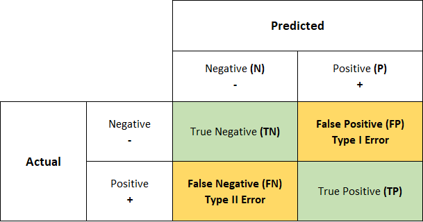
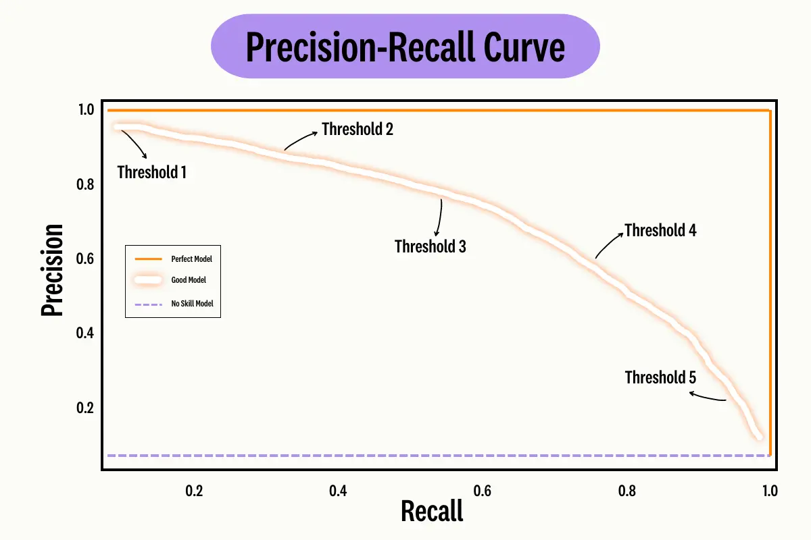
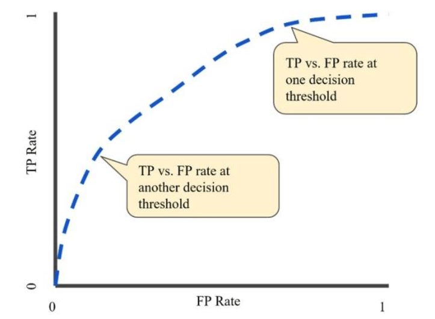

# Data Science Interview Questions And Answers

## Performance Metrics

Contents
---

- [Regression Metrics](#linear-regression)
- [Classification Metrics](#ridge-and-lasso-regularization)
- [Clustering Metrics]()
- [Metrics in NLP]()

---

## Regression Metrics

Q. List down metrics for evaluating regression tasks?

<b>Answer</b>

We can use following regression metrics for evaluation

- Mean Squared Error(MSE)
- Root Mean Squared Error(RMSE)
- Mean Absolute Error(MAE)
- R-squared(Goodness of fit)
- Adjusted R-squared
- Pearson correlation
- Spearman rank correlation

---

Q. List down metrics for evaluating regression tasks?

<b>Answer</b>

We can use following regression metrics for evaluation

- Mean Squared Error(MSE)
- Root Mean Squared Error(RMSE)
- Mean Absolute Error(MAE)
- R-squared(Goodness of fit)
- Adjusted R-squared
- Pearson correlation
- Spearman rank correlation

---

Q. Write down mathematical expression of MSE?

<b>Answer</b>

$$
\text{MSE} = \frac{1}{n}\sum_{i=i}^{n}(y_{pred, i} - y_{true,i})^2
$$

Where

- $y_{pred, i}$ : Predicted value by model for input vector $x_i$
- $y_{true, i}$ : Ground truth value/label by model for input vector $x_i$

---

Q. What are benefits of using MSE as loss function?

<b>Answer</b>

- Smooth and Differentiable : Suitable for gradient-based optimization methods like gradient descent.
- Penalizes Larger Errors More Heavily: MSE squares the error, which means that larger errors contribute significantly more to the total loss compared to smaller errors. 
- Convexity Ensures a Global Minimum: MSE is a convex function, which means that the optimization landscape has a single global minimum.

---

Q. State the range of MSE?

<b>Answer</b>

Bounds of mean-squared error(mse)

$$
[0, \inf)
$$

with $0$ the best mse

---

Q. How can we interpret mse value?

<b>Answer</b>

MSE estimates the average squared difference of predicted values and actual values. 

- $MSE = 0$: Indicates perfect predictions
- Low MSE: Predictions are closer to actual values
- High MSE: Larger difference between predicted and actual values

---

Q. What value MSE encode?

<b>Answer</b>

MSE measures seeks to summarize the errors made by regression model. The smaller value indicates, model's prediction closer to actual values. It is intuitively like counterpart to accuracy for classifier.

---

Q. Why do we square the differences in MSE?

<b>Answer</b>

Squaring the differences in MSE is done to emphasize larger errors, ensure non-negative values, maintain mathematical properties needed for optimization, align with the concept of variance, and avoid the cancellation of errors.

---

Q. What is the significance of a low MSE value?

<b>Answer</b>

A low Mean Squared Error (MSE) value signifies that a model's predictions are close to the actual values, indicating that the model performs well in terms of accuracy. 

---

Q. How can you minimize MSE in a machine learning model?

<b>Answer</b>

Minimizing MSE involves a combination of techniques:

- Feature Engineering
- Model Selection and Tuning
- Regularization

---

Q. What are weaknesses of mean-squared error(mse)?

<b>Answer</b>

- Scale dependent values: MSE values are highly dependent on scale of the output variable
- Hard to interpret in isolation: Scale dependency makes it hard to interpret in isolation
- Sensitive to outliers: If prediction is an outlier then we may get inflated MSE
- Treats all errors equally irrespective to magnitude and direction
- Overestimation and underestimations are weighted equally 
- May ignore small errors as it squares the difference between predicted and actual values
- It assumes errors should be gaussian distributed 

---

Q. Write the expression for Root Mean Squared Error(RMSE)?

<b>Answer</b>

RMSE is basically root of mean-squared error

$$
\text{RMSE} = \sqrt{\frac{1}{n}\sum_{i=i}^{n}(y_{pred, i} - y_{true,i})^2}
$$

---

Q. What is the benefit of using RMSE over MSE?

<b>Answer</b>

- RMSE unit is in sync with target variable unit
- Easy to interpret the output and can be used directly to compare multiple models performance
- Does not influence much from outliers unlike MSE

---

Q. What are weaknesses of RMSE?

<b>Answer</b>

- Not much robust to outliers
- Always positive so not useful where direction of error make sense
- Not scale invariant 
- Can be affected by sample size
- Bias towards large values

---

Q. Write the mathematical expression for Mean Absolute Error(MAE)?

<b>Answer</b>

MAE is average of absolute difference of predicted and actual values.

$$
\text{MAE} = \frac{1}{n}\sum_{i=1}^{n}|y_{true, i} - y_{pred, i}|
$$

---

Q. What is the benefit of using MAE over RMSE or MSE?

<b>Answer</b>

It is more robust to outliers unlike MSE and RMSE

---

Q. State one drawback of using MAE over RMSE or MSE?

<b>Answer</b>

MAE uses `|.|` function which is not differential at zero

---

Q. What is the difference between MSE and RMSE (Root Mean Square Error)?

<b>Answer</b>

- Units: MSE is in squared units of the target variable, while RMSE is in the same units as the target variable. This makes RMSE generally easier to interpret and communicate.
- Sensitivity to Outliers: Both MSE and RMSE are sensitive to outliers, but since RMSE is the square root of MSE, it is less exaggerated in terms of units. However, it still reflects the impact of large errors due to the squaring operation in MSE.
- Interpretation: RMSE can be more intuitive for understanding the average prediction error in the context of the data, whereas MSE’s squared units can make interpretation less straightforward.

---

Q. What is Mean Absolute Percentage Error (MAPE), and how is it calculated?

<b>Answer</b>

MAPE is a metric used to evaluate the accuracy of a forecasting or regression model. It measures the average absolute percentage error between predicted and actual values. It is calculated as:

$$
\text{MAPE} = \frac{1}{n} \sum_{i=1}^{n} \left| \frac{y_i - \hat{y}_i}{y_i} \right| \times 100
$$

where $y_i$ is the actual value, $\hat{y}_i$ is the predicted value, and $n$ is the number of observations.

---

Q. Why might MAPE be misleading if the actual values of the target variable are very small?

<b>Answer</b>

MAPE can be misleading if the actual values are very small because the percentage error becomes very large when the actual values approach zero. This can lead to exaggerated error values that do not accurately reflect the model’s performance. For example, if the actual value is close to zero, even a small absolute error can result in a very high percentage error, skewing the metric.

---

Q. In which scenarios would MAPE be preferred over metrics like RMSE or MAE?

<b>Answer</b>

MAPE is preferred over metrics like RMSE or MAE when you want to evaluate the model’s performance in terms of relative error, especially when comparing forecasts across different scales or units. It is useful when the goal is to understand the average percentage error relative to the actual values, making it easier to communicate the model’s accuracy in percentage terms.

---

Q. How does MAPE handle negative values in the actual data, and why might this be problematic?

<b>Answer</b>

MAPE is not well-suited for datasets with negative values because the percentage error calculation involves dividing by the actual value. When actual values are negative, this division results in negative or undefined percentage errors, which can be problematic and lead to inaccurate or misleading metrics. 

---

Q. Can MAPE be used to evaluate a model’s performance if the target variable contains zero values?

<b>Answer</b>

MAPE cannot be reliably used when the target variable contains zero values, as it involves division by the actual values. When the actual value is zero, the percentage error calculation becomes undefined or infinite.

---

Q. What are the benefits of using MAPE in a business context, and what potential pitfalls should be considered?

<b>Answer</b>

*Benefits*

- MAPE provides an easy-to-understand measure of prediction accuracy expressed as a percentage, which is straightforward to communicate to stakeholders.
- It allows for the comparison of models across different scales and units, making it useful for evaluating performance in a relative context.

*Pitfalls*

- MAPE can be misleading with very small or zero actual values, leading to exaggerated error metrics.
- It does not handle negative values or account for asymmetry in errors, which can affect its suitability for certain types of data or business contexts.

---

Q. How does MAPE handle asymmetric errors, and what might be the implications for model evaluation?

<b>Answer</b>

MAPE does not account for the direction of errors (whether they are positive or negative), which means it treats overestimation and underestimation equally. This can be a limitation if the cost of overestimation is different from underestimation, as MAPE does not differentiate between these scenarios.

---

Q. What is R-squared ($R^2$)?

<b>Answer</b>

R-squared is also called coefficient of determination. It is a statistical measure which evaluates the goodness of fit of a regression model. It represents the proportion of the variance in the dependent variable that is explained by the independent variables in the model. 

---

Q. When R-squared is more suitable to use?

<b>Answer</b>

R-squared is more useful when we have linear relationship between dependent and independent variables.

---

Q. What is the range of R-squared values?

<b>Answer</b>

R-squared ranges from $0$ to $1$, with $1$ indicating a perfect fit and $0$ indicating no fit at all.

---

Q. What does an R-squared value of 0.75 mean?

<b>Answer</b>

An R-squared value of $0.75$ means that 75% of the variance in the dependent variable (target) can be explained by the independent variables (predictors) in the model. In other words, the model accounts for $75%$ of the variability in the data, indicating a relatively good fit.

---

Q. State the expression for R-squared?

<b>Answer</b>

Mathematically, It can be expressed as:

$$
\text{R-squared} = 1 - \frac{SSR}{SST} = 1 - \frac{\sum_{i}^{N}(y_i - \hta{y}_{i})^2}{\sum_{i}^{N}(y_i - \bar{y}_{i})^2}
$$

Where:

- SSR(Sum of Squared residuals) represents the sum of the squared differences between the predicted values and the actual values
- SST(Sum of Squared Total) represents the sum of the squared differences between actual values and mean of the dependent values.

---

Q. Can R-squared be negative?

<b>Answer</b>

Yeah, `R-squared` value can be negative due to outliers i.e when `MSE(model) > MSE(Baseline)`. It is the case when we have heavy outliers in predictions. 

$$
\text{SSR} > \text{SST}
$$

---

Q. What are the benefits of using R-squared as performance indicator?

<b>Answer</b>

- Intuitive Interpretation: R-squared of 0.80 means that 80% of the variance is explained by the model, which is easy to interpret and communicate.
- Scale-Independent: Since R-squared is a proportion of explained variance, it is not affected by the scale of the dependent variable.
- Goodness of Fit: R-squared is a commonly used metric to assess the goodness of fit for linear regression models.

---

Q. How do you interpret R-squared?

<b>Answer</b>

- $R² = 1$: The model explains all the variability in the target variable. Predictions perfectly match the actual values.
- $0 < R² < 1$: R-squared is between 0 and 1, indicating the proportion of variance explained by the model. 
- $R² = 0$: The model does not explain any of the variance in the target variable
- $R² < 0$: Worse Than a Simple Mean Model

---

Q. What are the limitations of R-squared?

<b>Answer</b>

- It does not tell us about magnitude of error
- A high R-squared does not guaranteed accurate predictions, as the model may still have residual errors or maybe overfitting the data
- Inability to determine causality: Higher R-squared values maybe due to presence of some latent/confounding variables
- Limited to linear relationship: If the relationship is non-linear, R-squared may not accurately reflect the goodness of fit
- Influence by number of predictors in the data

---

Q. When should you use R-squared as an evaluation metric?

<b>Answer</b>

Use R-squared as an evaluation metric when you are working with linear regression models and want to assess how well your model explains the variability in the dependent variable. 

---

Q. Why do we need adjusted R-squared instead of standard R-squared?

<b>Answer</b>

R-squared suffers from problem that the scores keep improving on addition of predictors even if the additional predictors do not significantly improve the model's ability to explain the variation in the dependent variable. This can result in overfitting, where the model appears to fit the data well but may not generalize well to new data. To overcome the above problem associated with R-squared, adjusted R-squared adjusts for the number of predictors in the model, penalizing models with more predictors if the additional predictors do not contribute significantly to the model's ability to explain the variance in the dependent variable.

---

Q. What is the expression of adjusted R-squared?

<b>Answer</b>

Mathematically It can be expressed as:

$$
\text{Adjusted R-squared} = 1 - (\frac{(1-R^2).(n-1)}{n - k -1})
$$

Where:

- R-squared(Goodness of fit)
- n: Total number of observations in the dataset
- k: number of predictors(independent variables) in the regression model

---

Q. What is the limitation of adjusted R-squared?

<b>Answer</b>

Adjusted R-squared value is sensitive to sample size. It means the value may decrease as we we increase the sample size even if the model is performing better.

---

Q. What is pearson correlation?

<b>Answer</b>

Pearson Correlation is a statistical method that measures the similarity or correlation between two data objects by comparing their attributes and calculating a score ranging from $-1$ to $+1$.

---

Q. Write the expression of pearson correlation $\rho$?

<b>Answer</b>

The Pearson correlation coefficient between two vectors $y$ and $\cap{y}$ of dimension is:

$$
\rho(y, \hat(y)) = \frac{\text{Cov}(y, \hat{y})}{\sigma_{y} \sigma_{\hat{y}}}
$$

---

Q. What is the range of pearson correlations?

<b>Answer</b>

Bound of $\rhi$ is $[0, 1]$, $+1$ is complete positive linear correlation, and $0$ is no linear correlation at all.

---

Q. State the weakness of pearson correlation?

<b>Answer</b>

- Pearson correlations are highly sensitive to the magnitude of the differences between the actual and predicted values. As a result, they are also very sensitive to outliers.
- More useful to detect correlation in linearly dependent values

---

Q. What is spearman correlation?

<b>Answer</b>

Spearman's rank correlation coefficient, often denoted as $\rho_s$ or $r_s$, is a non-parametric measure of correlation that assesses the strength and direction of the monotonic relationship between two variables. Unlike Pearson’s correlation, which measures linear relationships, Spearman’s correlation evaluates how well the relationship between two variables can be described by a monotonic function. 

---

Q. What is the benefit of using spearman correlation over pearson correlation?

<b>Answer</b>

- None parametric: Does not require relationship to be linear or data should be normally distributed
- Detects Monotonic Relationships: Capable of identifying monotonic relationships that are not strictly linear.
- Not sensitive to outliers
- Better for non-linear trends
- Applicable to Ordinal Data: Can handle ranked data effectively.

---

Q. Write the formula of spearman correlation?

<b>Answer</b>

The formula for Spearman’s rank correlation is:

$$
\rho_s = 1 - \frac{6\sum d_{i}^2}{n(n^2-1)}
$$

Where $d_i$ is the difference between the ranks of each pair of values, and $n$ is the number of observations.

---

Q. How can you compute the spearman correlation between two variable $X$ and $Y$?

<b>Answer</b>

1. Rank the data

- Assign ranks to values of both variables and if there are ties, assign the average rank to the tied values.

2. Calculate the differences and squared sum $\sum d_{i}^2$

- Compute the difference between the ranks for each pair of values

3. Apply the expression of spearman correlation

$$
\rho_s = 1 - \frac{6\sum d_{i}^2}{n(n^2-1)}
$$

---

Q. How to interpret spearman correlation values?

<b>Answer</b>

- $+1$: Perfect positive monotonic correlation (as one variable increases, the other variable also increases).
- $−1$: Perfect negative monotonic correlation (as one variable increases, the other variable decreases).
- $0$: No monotonic correlation (the variables do not exhibit a monotonic relationship).

---

Q. State the one scenario where spearman correlation is more appropriate than pearson coefficients?

<b>Answer</b>

*Scenario*

You are analyzing a dataset where you have customer satisfaction scores and purchase frequencies. The customer satisfaction scores are obtained on an ordinal scale (e.g., ratings from 1 to 5), and the purchase frequencies are counts of how often each customer makes a purchase within a given period.

Data Characteristics:

- Ordinal data

Customer satisfaction scores are ordinal, not interval. This means that while the scores indicate relative satisfaction levels, the intervals between them are not necessarily uniform. For example, the difference between a rating of 1 and 2 might not be the same as the difference between 4 and 5 in terms of satisfaction.

- Non-Linear Relationship

You suspect that the relationship between satisfaction and purchase frequency might be monotonic but not necessarily linear. For instance, higher satisfaction might generally lead to more frequent purchases, but the rate of increase in purchases might not be consistent across the satisfaction scale.

In the above scenario spearman is more appropriate than the pearson coefficients.

Q. What is the limitation of spearman correlation?

<b>Answer</b>

- Monotonic Relationship Assumption: Not suitable for non-linear relationship
- Data Transformation Sensitivity: The correlation might be affected by transformations that alter the ranks of the data.

---

Q. How can we handle asymmetric errors?

<b>Answer</b>

We can use following metrics/loss to handle asymmetric errors:

- Weighted Absolute Error
- Asymmetric Loss Functions
- Quantile Loss
- Huber Loss

---

## Classification Metrics

Q. What metrics we can use to evaluate a classifier?

<b>Answer</b>

We can use following metrics for evaluation:

- Accuracy score
- Precision
- Recall
- F-scores
- Precision Recall curve
- ROC curve

---

Q. What is the purpose of a confusion matrix?

<b>Answer</b>

This a 2D matrix of size $n \times n$ where n is number of distinct tables we have. It stores information about the actual label and corresponding predicted values. A confusion matrix visualizes and summarizes the performance of a classification algorithm.

<table align='center'>
<tr>
<td align="center">
    
</td>
</tr>
<tr>
<td align="center"> Confusion Matrix for Binary Classification </td>
</tr>
</table>

---

Q. Explain True Positive (TP) and False Positive (FP).

<b>Answer</b>

- True Positive (TP): A true positive occurs when the model correctly predicts a positive class.
- False Positive (FP): A false positive happens when the model incorrectly predicts a positive class when it is actually negative.

---

Q. Define True Negative (TN) and False Negative (FN).

<b>Answer</b>

- True Negative (TN): A true negative occurs when the model correctly predicts a negative class. 
- False Negative (FN): A false negative happens when the model incorrectly predicts a negative class when it is actually positive. 

---

Q. How can you use a confusion matrix to choose an appropriate threshold for a binary classifier?

<b>Answer</b>

To choose an appropriate threshold for a binary classifier using a confusion matrix:

1. Vary Thresholds: Adjust the threshold and observe changes in TP, TN, FP, and FN values.
2. Evaluate Metrics: Calculate precision, recall, accuracy, and F1-score at each threshold.
3. Analyze Trade-offs: Higher thresholds increase precision but reduce recall, and vice versa.
4. Plot Curves: Use precision-recall or ROC curves to visualize the trade-offs.
5. Select Optimal Threshold: Choose a threshold that meets your performance goals (e.g., maximizing F1-score).
6. Balance Metrics: Adjust to prioritize precision (reduce FP) or recall (reduce FN) as needed.
7. Validate Choice: Test the selected threshold on a validation set to ensure it generalizes well.

---

Q. Define accuracy score?

<b>Answer</b>

Accuracy scores signifies the portion of true predictions among total cases examined. 

---

Q. Write the mathematical expression of accuracy score?

<b>Answer</b>

It is mathematically expressed as:

$$
\text{accuracy score} = \frac{TP + TN}{TP + FP + FN + TN}
$$

Where:

- TP (True Positives) = Number of scenarios where the model's predicted labels match with the positive labels
- FP (False Positives) = Number of scenarios where the actual label is negative, but the model predicts it as positive(Type I Error)
- FN (False Negatives) = Number of scenarios where the actual label is positive, but the model predicts it as negative(Type I Error)
- TN (True Negative) = Number of instances where both the actual label and the model's prediction are negative

---

Q. What is the range of accuracy score?

<b>Answer</b>

*Accuracy bounds*

$[0, 1]$, with $0$ the worst and $1$ the best.

---

Q. How does accuracy is related with negative log(logistic) loss?

<b>Answer</b>

Accuracy of a classifier on a validation set will be negatively correlated with the negative log (logistic, cross-entropy) loss, which is a common loss for classifiers. In this sense, these classifiers are optimizing for accuracy.

---

Q. What is the main issue with accuracy score?

<b>Answer</b>

Accuracy score provides an overall evaluation of the model's performance across all classes, but it may be deceptive in cases where the label distribution is skewed or imbalanced. In such cases, the accuracy score may be high due to the majority class dominating the predictions, while the minority class may be misclassified.

---

Q. How can we overcome with accuracy score limitations?

<b>Answer</b>

To address accuracy score limitation issue, it's recommended to use other performance metrics along with accuracy score, such as precision, recall, F1-score, or area under the Receiver Operating Characteristic (ROC) curve. These metrics provide insights on the model's performance at a class-level, allowing for a more comprehensive evaluation of the model's predictive accuracy, especially in imbalanced datasets.

---

Q. What do you mean by precision? How can we calculate it?

<b>Answer</b>

Precision is the portion of true positive class among predicted positive classes. 

It can be expressed as:

$$
\text{Precision Score} = \frac{TP}{TP+FP}
$$

Note that precision is per-class notion.

---

Q. When precision is preferred?

<b>Answer</b>

It is preferable choice when you want to be very sure of your predictions.

---

Q. What is the range of precision value?

<b>Answer</b>

$[0, 1]$, with $0$ the worst and $1$ the best. 

---

Q. What are the weaknesses of precision as a metric in classification, and how can it be misleading in certain scenarios?

<b>Answer</b>

A key weakness of precision is that it can be artificially inflated by rarely predicting a class, especially when the class is infrequent or unimportant compared to others.

For example, By focusing on precision, the model may become overly conservative, only predicting positive when it’s very certain, which can result in a high number of false negatives. This is problematic in scenarios where missing positive cases (false negatives) carries a significant cost, such as in medical diagnoses or fraud detection.

---

Q. State one scenario where you should use precision of the system as evaluation metric?

<b>Answer</b>

In an email marketing campaign, high precision means emails are sent mostly to recipients likely to respond, reducing costs by avoiding those unlikely to engage. However, if the model rarely predicts engagement to maintain high precision, it might miss many potential customers, limiting the campaign's reach and overall effectiveness. This highlights how precision can be misleading if used alone, as it prioritizes correctness over coverage.

---

Q. What is the other name of recall?

<b>Answer</b>

True Positive Rate

---

Q. Define recall score?

<b>Answer</b>

Recall is the sum of correct predictions divided by the sum of all true instances. Note that recall is per-class notion. 

---

Q. What does recall measures? How is it calculated?

<b>Answer</b>

Recall measures the proportion of actual positives cases that are correctly predicted by the model

It is calculated as:

$$
\text{recall score} = \frac{TP}{TP+FN}
$$

---

Q. What does higher value of recall indicates? 

<b>Answer</b>

A higher recall score indicates that the model is effectively capturing a larger proportion of the actual positive cases.

---

Q. When should we use recall? 

<b>Answer</b>

It is a suitable metric when the goal is to minimize false negatives, i.e., correctly identifying as many positive cases as possible.

---

Q. What is the range of recall metric? 

<b>Answer</b>

$[0, 1]$, with $0$ the worst and $1$ the best.

---

Q. What is the main limitation of recall metric? 

<b>Answer</b>

Recall's dangerous edge case is that one can achieve very high recall for a category by always guessing it. This could mean a lot of incorrect guesses, but recall sees only the correct ones.

---

Q. State one scenario where recall is more desirable? 

<b>Answer</b>

Recall is prioritized when the cost of missing positive instances (false negatives) is high, as in healthcare. For example, missing a person who needs a flu shot can lead to serious health issues, while giving a shot to someone who doesn't need it incurs minimal cost. Therefore, healthcare providers often prioritize recall over precision, opting to vaccinate a broader audience to avoid missing those who need it.

---

Q. Explain the tradeoff between recall and precision? 

<b>Answer</b>

The tradeoff between precision and recall arises because adjusting the classification threshold impacts both metrics: raising the threshold reduces false positives (boosting precision) but increases false negatives (lowering recall), and lowering the threshold has the opposite effect. This means you can't minimize both errors at once without a perfect classifier, so enhancing one metric usually compromises the other.

---

Q. Define F Scores?

<b>Answer</b>

F scores combine precision and recall via their harmonic mean, with a value  that can be used to emphasize one or the other. Like precision and recall, this is a per-category notion.

It captures the tradeoff between precision and recall:

$$
\text{F Score} = (\beta^2 + 1)\frac{\text{precision} \cdot \text{recall}}{\beta^{2} \cdot \text{precision} + \text{recall}}
$$

---

Q. What is F-1 Score? When should we use it?

<b>Answer</b>

F-1 Score is a special case of F scores when we give equal weighage to precision and recall. In this setup $\beta  = 1$

$$
\text{F-1 Score} = \frac{2 * \text{precision} \cdot \text{recall}}{\text{precision} + \text{recall}}
$$

The F1 score is a suitable choice when both precision and recall are equally important, and we want to balance between the two.

---

Q. What is range of F Scores?

<b>Answer</b>

Bounds of F scores: $[0, 1]$, with $0$ the worst and $1$ the best, and guaranteed to be between precision and recall.

---

Q. What are the weaknesses of F-1 score?

<b>Answer</b>

- The F-score only considers precision and recall, ignoring true negatives, which can lead to misleading results, especially in imbalanced datasets.
- The F1-score equally weights precision and recall, which may not be ideal if one is more important than the other in a given context.

---

Q. Explain the difference between Type I and Type II errors in the context of a confusion matrix.

<b>Answer</b>

---

Q. What is the main limitations with confusion matrix summarization?

<b>Answer</b>

Confusion matrices hide a threshold for turning probabilities/scores into predicted labels. With precision–recall curves, we finally address this.

---

Q. What is precision and recall curve?

<b>Answer</b>

A precision–recall curve is a method for summarizing the relationship between precision and recall for a binary classifier. 

<table align='center'>
<tr>
<td align="center">
    
</td>
</tr>
<tr>
<td align="center"> Precision and Recall Curve </td>
</tr>
</table>

---

Q. State the use of precision and recall curve?

<b>Answer</b>

With precision–recall curves, we get a generalized perspective on F1 scores (and we could weight precision and recall differently to achieve the effects of $\beta$ for F scores more generally). These curves can be used, not only to assess a system, but also to identify an optimal decision boundary given external goals.

---

Q. How can we construct precision and recall curve?

<b>Answer</b>

1. Obtain Prediction Scores: Use your classifier to get probability scores or confidence scores for each instance, indicating how likely it is to belong to the positive class.

2. Sort Predictions: Sort the instances by their predicted scores in descending order, from the highest probability of being positive to the lowest.

3. Vary the Classification Threshold: Adjust the threshold from high to low to classify instances as positive or negative. Each threshold value corresponds to a different set of predicted positives and negatives.

4. Calculate Precision and Recall: For each threshold, calculate precision and recall:
   - Precision = TP / (TP + FP): Measures the proportion of true positives among all predicted positives.
   - Recall = TP / (TP + FN): Measures the proportion of actual positives correctly identified.

5. Plot Precision vs. Recall: Plot the calculated precision values on the y-axis against the corresponding recall values on the x-axis for each threshold.

6. Analyze the Curve: The resulting curve shows the trade-off between precision and recall. A curve closer to the top-right corner (high precision and high recall) indicates better performance.

<table align='center'>
<tr>
<td align="center">
    
</td>
</tr>
<tr>
<td align="center"> Precision and Recall Curve </td>
</tr>
</table>

---

Q. What are the limitations of precision and recall curve?

<b>Answer</b>

- Most implementations are limited to binary problems. The basic concepts are defined for multi-class problems, but it's very difficult to understand the resulting hyperplanes.

- There is no single statistic that does justice to the full curve, so this metric isn't useful on its own for guiding development and optimization. Indeed, opening up the decision threshold in this way really creates another hyperparameter that one has to worry about!

---

Q. What does ROC Curve depicts?

<b>Answer</b>

The Receiver Operating Characteristic (ROC) curve for a class $k$ depicts recall the false positive rate (FPR) for $k$ as a function of the recall for $k$.

$$
\text{False Positive Rate} = \frac{FP}{FP + TN}
$$

ROC curve indicates how well probabilities from positive class are separated from negative class.

<table align='center'>
<tr>
<td align="center">
    
</td>
</tr>
<tr>
<td align="center"> AUC ROC Curve </td>
</tr>
</table>

---

Q. For an ideal model what should ROC-AUC?

<b>Answer</b>

The ROC curve is a probability curve, and for an ideal model, the area under the ROC curve would be 1, indicating perfect classification performance.

---

Q. State what does mean to have AUC of 0.2?

<b>Answer</b>

AUC of $0.2$ indicates there are $20%$ chance of fair classification.

---

Q. Can we use ROC-AUC score for multi-class classification?

<b>Answer</b>

It's important to note that the AUROC is commonly used for binary class classification problems. For multiclass classification, there would be N number of AUROC curves using the one vs rest methodology, where each class is compared against the rest of the classes separately.

---

Q. What is the range of ROC-AUC?

<b>Answer</b>

For ROC AUC: $[0, 1]$, with $1$ the best.

---

Q. Your team is building a system to aid doctors in predicting whether a patient has cancer or not from their X-ray scan. Your colleague announces that the problem is solved now that they’ve built a system that can predict with 99.99% accuracy. How would you respond to that claim?

<b>Answer</b>

Accuracy is not a reliable metric in this scenario because cancer is rare. A model that predicts all patients as cancer-free could still achieve high accuracy, but it would fail to correctly identify those with cancer. 

---

Q. Given a binary classifier that outputs the following confusion matrix.

$$
\begin{bmatrix} 
    \textbf{""} & \textbf{Predicted True} & \textbf{Predicted False} \\\\
    \textbf{Actual True} & 30 & 20 \\\\
    \textbf{Actual False} & 5 & 40 \\\\
\end{bmatrix}
$$

1. Calculate the model’s precision, recall, and F1.
1. What can we do to improve the model’s performance?

<b>Answer</b>

1. Precision, Recall, and F1 Score Calculations:
   -Precision: $\text{Precision} = \frac{\text{TP}}{\text{TP} + \text{FP}} = \frac{30}{30 + 5} = \frac{30}{35} \approx 0.857$
   -Recall: $\text{Recall} = \frac{\text{TP}}{\text{TP} + \text{FN}} = \frac{30}{30 + 20} = \frac{30}{50} = 0.600$
   -F1 Score: $\text{F1} = 2 \times \frac{\text{Precision} \times \text{Recall}}{\text{Precision} + \text{Recall}} = 2 \times \frac{0.857 \times 0.600}{0.857 + 0.600} \approx 0.714$

2. Improving the Model’s Performance:
   - Adjust Threshold: Experiment with different classification thresholds to balance precision and recall.
   - Collect More Data: Gather more samples to better train the model and improve generalization.
   - Feature Engineering: Improve the feature set to provide the model with more relevant information.

---

Q. Consider a classification where $99%$ of data belongs to class A and $1%$ of data belongs to class B.
1. If your model predicts A 100% of the time, what would the F1 score be? Hint: The F1 score when A is mapped to 0 and B to 1 is different from the F1 score when A is mapped to 1 and B to 0.
1. If we have a model that predicts A and B at a random (uniformly), what would the expected $F_1$ be?

<b>Answer</b>

    

---

Q. Show that the negative log-likelihood and cross-entropy are the same for binary classification tasks.

<b>Answer</b>

    

---

Q. For classification tasks with more than two labels (e.g. MNIST with $10$ labels), why is cross-entropy a better loss function than MSE?

<b>Answer</b>

    

---

Q. Consider a language with an alphabet of $27$ characters. What would be the maximal entropy of this language?

<b>Answer</b>

    

---

Q. Suppose you want to build a model to predict the price of a stock in the next 8 hours and that the predicted price should never be off more than $10%$ from the actual price. Which metric would you use?

<b>Answer</b>

    

---

## Clustering Metrics

## Metrics in NLP