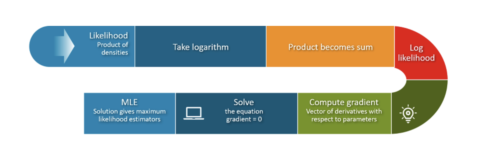

# Data Science Interview Questions And Answers

## Probabilistic Modeling

Contents
---
- [Maximum Likelihood Estimation(MLE)](#maximum-likelihood-estimation)
- [Maximum A Posteriori(MAP)](#maximum-a-posteriori)
- [Naive Bayes](#naive-bayes)
- [Logistic Regression](#logistic-regression)

---

## Maximum Likelihood Estimation

Q. How can we estimate the parameters of a given probability distribution?

<b>Answer</b>

We can use following methods to estimates parameters:

- Maximum Likelihood Estimation(MLE)
- Maximum A Posteiori(MAP)

---

Q. What is the main assumption of MAP and MLE?

<b>Answer</b>

MLE/MAP both assumes the data are independent and identically distributed(iid)

---

Q. How is likelihood different than probability?

<b>Answer</b>

In the case of discrete distributions, likelihood is a synonym for the probability mass, or joint probability mass, of the data. In the case of continuous distribution, likelihood refers to the probability density of the data distribution.

---

Q. Write the mathematical expression of likelihood?

<b>Answer</b>

It represents the probability of observing the given data as a function of the parameters of the statistical model.

For a random variable $X$ with probability density function (PDF) $f(X; \theta)$ or probability mass function (PMF) in the discrete case, where $\theta$ represents the parameters of the model, the likelihood of observing a specific dataset $\{x_1, x_2, \ldots, x_n\}$ is given by:

$$
L(\theta; x_1, x_2, \ldots, x_n) = \prod_{i=1}^{n} f(x_i; \theta)
$$

Since we assumed that each data point is independent, the likelihood of all of our data is the product of the likelihood of each data point.

---

Q. What does *Argmax* mean?

<b>Answer</b>

Argmax is short for Arguments for the maxima. The argmax of a function is the value of the domain at which the function is maximized.

---

Q. Describe how to analytically find the MLE of a likelihood function?

<b>Answer</b>

To analytically find the Maximum Likelihood Estimator (MLE) of a likelihood function, we can follow below steps:

<table align='center'>
<tr>
<td align="center">
    
</td>
</tr>
<tr>
<td align="center"> MLE Estimation Steps </td>
</tr>
</table>

*Define the likelihood function*

Suppose we have a set of independent and identical distributed observations $X_1, X_2, ...,X_n$ from a probability distribution with a parameter $\theta$.

$$
L(\theta) = \prod_{i=1}^{n} f(X_i \mid \theta)
$$

- Here $f(X_i \mid \theta)$ is the pdf or pmf of the data given the parameter $\theta$

*Take the log likelihood*

To simplify the $L(\theta)$, take natural log on boh side:

$$
l(\theta) = log(L(\theta)) = \sum_{i=1}^{n}\log f(X_i \mid \theta)
$$

*Take the derivative wrt $\theta$*

$$
\frac{d\ell(\theta)}{d\theta}
$$

*Set the Derivative Equal to Zero*

To find the critical points set:

$$
\frac{d\ell(\theta)}{d\theta} = 0
$$

*Solve $\theta$*

Find the values of $\theta$ that maximize likelihood function. These values are potential MLEs, representing the parameter estimates that maximize the likelihood of observing the given data.

*Verify the Maximum (Second Derivative Test)*

$$
\frac{d^2\ell(\theta)}{d\theta^2}
$$

- If the second derivative is negative at the critical point, it confirms a local maximum.

---

Q. What is the term used to describe the first derivative of the log-likelihood function?

<b>Answer</b>

Score function : The score function measures the sensitivity of the log-likelihood function to changes in the parameter $\theta$. It is the gradient (or derivative) of the log-likelihood with respect to the parameter.

---

Q. What is the relationship between the likelihood function and the log-likelihood function?

<b>Answer</b>

The log-likelihood function is derived by taking the natural logarithm of the likelihood function.

$$
l(\theta) = \log{L(\theta)}
$$

- Likelihood: $L(\theta)$
- Log-Likelihood: $\ell(\theta)$

---

Q. What is likelihood function of the independent identically distributed (i.i.d) random variables:
$X_1,··· ,X_n$ where $X_i ∼ binomial(n, p)$, $∀i ∈ [1,n]$, and where p is the parameter of interest?

<b>Answer</b>

Likelihood function in case of discrete random variables is jus the PMF. 

For Binomial distribution:

$$
P(X_i = x_i) = \binom{n}{x_i} p^{x_i} (1 - p)^{n - x_i} \quad \text{PMF}
$$

Since the observations are i.i.d., the likelihood function is the product of the individual PMFs:

$$
L(p) = \prod_{i=1}^{n} P(X_i = x_i) = \prod_{i=1}^{n} \binom{n}{x_i} p^{x_i} (1 - p)^{n - x_i}.
$$

---

Q. How can we derive the maximum likelihood estimator (MLE) of the i.i.d samples $X_1, · · · , X_n$ introduced in above question?

<b>Answer</b>

Likelihood function in case of binomial distribution:

$$
L(p) = \prod_{i=1}^{n} P(X_i = x_i) = \prod_{i=1}^{n} \binom{n}{x_i} p^{x_i} (1 - p)^{n - x_i}.
$$

Log likelihood:

$$
LL(p) = \log{\binom{n}{x}} + x \log{p} + (n-x) \log{1-p} \quad text{(Log Likelihood)}
$$

On taking derivative wrt $p$

$$
\frac{dL(p)}{dp} = 0 + \frac{x}{p} - \frac{(n-x)}{1-p}
$$

$$
\frac{dL(p)}{dp} = \frac{x-pn}{p(1-p)}
$$

For maximizing the likelihood:

$$
\frac{dL(p)}{dp} = 0
$$

$$
p = \frac{x}{n}
$$

---

Q. Derive the maximum likelihood estimator of an exponential distribution.

<b>Answer</b>

*PDF of exponential distribution:*

$$
f(x \mid \lambda) = \lambda e^{-\lambda x}, \quad x \geq 0.
$$

*Likelihood Function:*

For $n$ i.i.d. observations $ X_1, X_2, \ldots, X_n $, the likelihood function is the product of the individual densities:

$$
L(\lambda) = \prod_{i=1}^{n} f(X_i \mid \lambda) = \prod_{i=1}^{n} \lambda e^{-\lambda X_i}.
$$

Simplifying this expression:

$$
L(\lambda) = \lambda^n e^{-\lambda \sum_{i=1}^{n} X_i}.
$$

*Log-Likelihood Function:*

To make the maximization easier, take the natural logarithm of the likelihood function to get the log-likelihood function:

$$
\ell(\lambda) = \log L(\lambda) = \log(\lambda^n) + \log\left(e^{-\lambda \sum_{i=1}^{n} X_i}\right).
$$

Simplify:

$$
\ell(\lambda) = n \log(\lambda) - \lambda \sum_{i=1}^{n} X_i.
$$

*Differentiate the Log-Likelihood Function:*

Differentiate $\ell(\lambda)$ with respect to $\lambda$:

$$
\frac{d\ell(\lambda)}{d\lambda} = \frac{n}{\lambda} - \sum_{i=1}^{n} X_i.
$$

*Set the Derivative Equal to Zero:*

Set the first derivative to zero to find the critical points:

$$
\frac{n}{\lambda} - \sum_{i=1}^{n} X_i = 0.
$$

*Solve for $\lambda$:*

Rearrange the equation to solve for $\lambda$:

$$
\frac{n}{\lambda} = \sum_{i=1}^{n} X_i.
$$

Therefore, the MLE of \(\lambda\) is:

$$
\hat{\lambda} = \frac{n}{\sum_{i=1}^{n} X_i} = \frac{1}{\bar{X}},
$$

---

Q. A lot of machine learning models aim to approximate probability distributions. Let’s say P is the distribution of the data and Q is the distribution learned by our model. How do measure how close Q is to P?

<b>Answer</b>

We can use KL Divergence formula which is a measure of how one probability distribution $Q$ diverges from a second, expected probability distribution $P$.

$$
D_{KL}(P \| Q) = \sum_{x} P(x) \log \frac{P(x)}{Q(x)} \quad \text{(for discrete distributions)}
$$

$$
D_{KL}(P \| Q) = \int P(x) \log \frac{P(x)}{Q(x)} \, dx \quad \text{(for continuous distributions)}
$$

---

## Maximum A Posteriori

Q. What is MAP? How is it different than MLE?

<b>Answer</b>

MAP estimation finds the parameter values that maximize the posterior distribution of the parameters given the data, inducing prior beliefs about the parameters.

$$
 \hat{\theta}_{\text{MAP}} = \arg\max_{\theta} P(\theta | X) = \arg\max_{\theta} \frac{P(X | \theta) P(\theta)}{P(X)}.
$$

Since \(P(X)\) is constant with respect to \(\theta\), it simplifies to:

$$
\hat{\theta}_{\text{MAP}} = \arg\max_{\theta} P(X | \theta) P(\theta)
$$

- MAP induces priori knowledge about the parameters through a prior distribution where as MLE does not consider any prior information.
- In MLE, parameters are treated as fixed values, while in MAP, they are treated as random variables with a prior distribution, requiring an extra assumption about the prior.

---

Q. When to use MAP over MLE?

<b>Answer</b>

If prior probability is provided in the problem setup, that information should be used (i.e., apply MAP). However, if no prior information is given or assumed, MAP cannot be used, and MLE becomes a suitable approach.

---

Q. When do MAP and MLE yield similar parameter estimates?

<b>Answer</b>

MAP and MLE will yield similar parameter estimates in following situations:

- Uniform Prior : When prior assign equal probabilities to all parameter values, adding no additional information
- Non-informative Priors : Priors that are weakly informative (e.g., with very high variance) have little impact on the posterior,
- Data Size is large : With a large amount of data, the likelihood dominates the posterior, reducing the influence of the prior

---

Q. 
1. Define the term conjugate prior.
2. Define the term non-informative prior.

<b>Answer</b>

*Conjugate Prior*

A conjugate prior is a probability distribution that, when combined with the likelihood and normalized, results in a posterior distribution that belongs to the same family as the prior.

$$
p(\theta | x) = \frac{p(x|\theta)p(\theta)}{p(x)}
$$

The prior $p(\theta)$ is conjugate to the posterior $p(\theta | x)$ if both are in same family of distributions.

*Non-Informative Prior*

---

Q. MPE (Most Probable Explanation) vs. MAP (Maximum A Posteriori)
1. How do MPE and MAP differ?
1. Give an example of when they would produce different results.

<b>Answer</b>

    

---

## Naive Bayes

Q. Naive Bayes classifier.
1. How is Naive Bayes classifier naive?
1. Let’s try to construct a Naive Bayes classifier to classify whether a tweet has a positive or negative sentiment. We have four training samples:

$$
\begin{bmatrix} 
    \text{Tweet} &  \text{Label} \\\\
    \text{This makes me so upset} & \text{Negative}\\\\
    \text{This puppy makes me happy} & \text{Positive} \\\\
    \text{Look at this happy hamster} & \text{Positive} \\\\
    \text{No hamsters allowed in my house} & \text{Negative}
\end{bmatrix}
$$

According to your classifier, what's sentiment of the sentence The hamster is upset with the puppy?

<b>Answer</b>

1. The Naive Bayes classifier is considered "naive" because it makes a strong and often unrealistic assumption: it assumes that all features (or predictors) in the dataset are independent of each other given the class label.

2. 

---

Q. How does the Naive Bayes algorithm work?

<b>Answer</b>

*Naive Bayes Assumption*

It assumes that each feature $x$ is independent of one another give $y$

*Training Phase*

In this phase we do parameter estimations. In core Naive Bayes uses Bayes theorem.

$$
 P(\text{Class} | \text{Features}) = \frac{P(\text{Features} | \text{Class}) \cdot P(\text{Class})}{P(\text{Features})}
$$

- $P(\text{Features} | \text{Class})$: Likelihood of the features given the class.
- $P(\text{Class})$: Prior probability of the class.
- $P(\text{Features})$: Evidence, the overall probability of the features.

Using Naive Bayes Assumption

$$
P(\text{Features} | \text{Class}) = P(\text{Feature}_1 | \text{Class}) \times P(\text{Feature}_2 | \text{Class}) \times \ldots \times P(\text{Feature}_n | \text{Class})
$$

Here we can calculate all the terms of Bayes theorem:

- Prior Probability: $P(\text{Class})$: This is usually estimated from the training data by calculating the frequency of each class.
- Likelihood: $P(\text{Feature}_i | \text{Class})$: Estimated from the training data by counting how often each feature value appears within each class.
- Evidence: $P(\text{Features})$: This term is often omitted during classification since it's the same for all classes and does not affect the ranking of probabilities.

*Predictions*

- For a given set of feature values, the classifier computes the posterior probability for each class.
- The class with the highest posterior probability is chosen as the predicted class.

---

Q. Why is Naive Bayes still used despite its flawed assumption of feature independence?

<b>Answer</b>

Naive Bayes is beneficial primarily because of its "naive" assumption of feature independence, which, although technically incorrect, offers some practical advantages:

- Scalability: Handles large feature spaces efficiently. It scales linearly with the number of features
- Simplicity: Easy to implement and interpret.
- High-Dimensional Performance: Performs well in high-dimensional datasets.
- Robustness: Yields good results in many practical applications.

---

Q. What is Laplace smoothing (additive smoothing) in Naive Bayes?

<b>Answer</b>

Laplace smoothing, also known as additive smoothing, is a technique used in Naive Bayes to handle zero probabilities that occur when a feature (e.g., a word in text classification) does not appear in the training data for a given class. Without smoothing, if a word never appears in a class during training, its probability would be zero, which could incorrectly influence the final prediction.

---

Q. Can Naive Bayes handle continuous and categorical features?

<b>Answer</b>

Yeah, We can handle both categorical and continuous features both using Naive Bayes

- Categorical Features : can be handled with methods like multinomial and bernoulli distributions 
- Continuous Features : Can be handled using Gaussian assumptions
- Mixed Data : We can either convert continuous values into bins(categorization) and treat it as only categorical features or, we can fit separate model on categorical and numeric data and then combine to make prediction 

---

Q. Can Naive Bayes handle missing data?

<b>Answer</b>

Naive Bayes does not directly handle missing data, but several practical strategies, such as ignoring missing features, imputing missing values, or creating indicator variables, can be employed to manage it effectively.

---

Q. What is the difference between Naive Bayes and other classification algorithms like Logistic Regression or Decision Trees?

<b>Answer</b>

---

## Logistic Regression

Q. Define logistic regression?

<b>Answer</b>

Logistic Regression is a discriminative classifier that works by trying to learn a function that approximates $P(y|x)$. 

---

Q. What is the main assumption of logistic regression?

<b>Answer</b>

The central assumption that $P(y|x)$ can be approximated as a sigmoid function function applied to a linear combination of input features.

$$
P(Y=1 | X) = \frac{1}{1+\exp(-w_0 - \sum_i w^i X^i)}
$$

- Logistic function applied to a linear function of the data.

---

Q. Write the expression of sigmoid or logistic function?

<b>Answer</b>

$$
\sigma(z) = \frac{1}{1+\exp(-z)}
$$

---

Q. Prove that logistic regression is a linear classifier?

<b>Answer</b>

At the decision boundary:

$$
P(Y=1|X) = \frac{1}{2}
$$

We can express this as:

$$
P(Y=1|X) = \frac{1}{1 + \exp(-w_0 - \sum_i w_i X_i)} = \frac{1}{2}
$$

Solving this equation gives:

$$
\exp(-w_0 - \sum_i w_i X_i) = 1
$$

This occurs only if:

$$
-w_0 - \sum_i w_i X_i = 0
$$

This equation defines the decision boundary of logistic regression. Since it represents a straight line, logistic regression is classified as a linear classifier.

---

Q. Does closed-form solution exists for logistic regression?

<b>Answer</b>

No closed-form solution exist

---

Q. ?

<b>Answer</b>

No closed-form solution

---