# Data Science Interview Questions And Answers

## Probability

## Contents

- [Basic Probability](#basic-probability)
- [Conditional Probability](#conditional-probability)
- [Bayes Theorem](#bayes-theorem)
- [Random Variables](#random-variables)
- [Discrete Random Variables](#discrete-random-variables)
- [Continuous Random Variables](#continuous-random-variables)
- [Correlation and Covariance](#correlation-and-variance)

---

### Basic Probability

Q. What do you mean by probability?

<details><summary><b>Answer</b></summary>


</details>

---

Q. Define probability of an event?

<details><summary><b>Answer</b></summary>


</details>

---

Q. Define disjoint sets.

<details><summary><b>Answer</b></summary>


</details>

---

### Conditional Probability

Q. Write the expression of probability of $A$ given that $B$ has already occured.

<details><summary><b>Answer</b></summary>


</details>

---


Q. What is the law of total probability?

<details><summary><b>Answer</b></summary>


</details>

---

Q. What does it mean for two variables to be independent?

<details><summary><b>Answer</b></summary>


</details>

---

Q. Given two random variables $X$  and $Y$. We have the values $P(X|Y)$  and $P(Y)$  for all values of $X$  and $Y$. How would you calculate $P(X)$?

<details><summary><b>Answer</b></summary>


</details>

---

Q. You know that your colleague Jason has two children and one of them is a boy. What’s the probability that Jason has two sons? 

<details><summary><b>Answer</b></summary>


</details>

---

Q. Consider a room of $n$ people. Suppose that their birthdays are randomly distributed among $365$ days of the year. Find the expression for the probability of  at-least two people have birthday on same day vs $n$. Find the probability when $n=2$.

<details><summary><b>Answer</b></summary>


</details>

---

Q. Given two events $A$ and $B$ in probability space $H$, which occur with probabilities $P(A)$ and $P(B)$, respectively:
1. Define the conditional probability of $A$ given $B$. Mind singular cases. 
2. Annotate each part of the conditional probability formulae.
3. Draw an instance of Venn diagram, depicting the intersection of the events $A$ and $B$. Assume that $A  \cup B = H$.

<details><summary><b>Answer</b></summary>


</details>

---

Q. Assume you manage an unreliable file storage system that crashed 5 times in the last year, each crash happens independently.
1. What's the probability that it will crash in the next month?
1. What's the probability that it will crash at any given moment?

<details><summary><b>Answer</b></summary>


</details>

---

Q. Say you built a classifier to predict the outcome of football matches. In the past, it's made 10 wrong predictions out of 100. Assume all predictions are made independently, what's the probability that the next 20 predictions are all correct?

<details><summary><b>Answer</b></summary>


</details>

---

### Bayes Theorem

Q. State bayes theorem.

<details><summary><b>Answer</b></summary>


</details>

---

Q. Write the simplified version of bayes rules.

<details><summary><b>Answer</b></summary>


</details>


---

Q. Show the relationship between the prior, posterior and likelihood probabilities.

<details><summary><b>Answer</b></summary>


</details>


---

Q. In a Bayesian context, if a first experiment is conducted, and then another experiment is followed, what does the posterior become for the next experiment?

<details><summary><b>Answer</b></summary>


</details>


---

Q. What is the condition under which two events $A$ and $B$ are said to be statistically independent?

<details><summary><b>Answer</b></summary>


</details>


---

Q. Suppose there are three closed doors and a car has been placed behind one of the door at random. There are two goats behind the other two doors. Now you pick a door 1 but the admin knows where the car is and open the door 2 to reveal a goat(admin will always open the door with a goat). Now he offers you to stay at the same chosen door or switch between closed doors i.e door 1 and door 2. Should you switch the door to maximize chances of getting car?

<details><summary><b>Answer</b></summary>


</details>


---

Q. There are only two electronic chip manufacturers: $A$ and $B$, both manufacture the same amount of chips. A makes defective chips with a probability of $30%$, while B makes defective chips with a probability of $70%$.
1. If you randomly pick a chip from the store, what is the probability that it is defective?
1. Suppose you now get two chips coming from the same company, but you don’t know which one. When you test the first chip, it appears to be functioning. What is the probability that the second electronic chip is also good?

<details><summary><b>Answer</b></summary>


</details>

---

Q. There’s a rare disease that only 1 in 10000 people get. Scientists have developed a test to diagnose the disease with the false positive rate and false negative rate of 1%.
1. Given a person is diagnosed positive, what’s the probability that this person actually has the disease?
1. What’s the probability that a person has the disease if two independent tests both come back positive?

<details><summary><b>Answer</b></summary>


</details>


---

Q. A dating site allows users to select $10$ out of $50$ adjectives to describe themselves. Two users are said to match if they share at least $5$ adjectives. If Jack and Jin randomly pick adjectives, what is the probability that they match?

<details><summary><b>Answer</b></summary>


</details>


---

Q. Consider a person A whose sex we don’t know. We know that for the general human height, there are two distributions: the height of males follows $h_m=N(μ_m,σ^{2}_m)$  and the height of females follows $h_j=N(μ_j,σ^{2}_j)$ . Derive a probability density function to describe A’s height.

<details><summary><b>Answer</b></summary>


</details>


---

Q. There are three weather apps, each the probability of being wrong $\frac{1}{3}$ of the time. What’s the probability that it will be foggy in San Francisco tomorrow if all the apps predict that it’s going to be foggy in San Francisco tomorrow and during this time of the year, San Francisco is foggy $50%$ of the time?

<details><summary><b>Answer</b></summary>


</details>


---

Q. Given n  samples from a uniform distribution $[0,d]$. How do you estimate $d$? (Also known as the German tank problem)

<details><summary><b>Answer</b></summary>


</details>


---

Q. You’re part of a class. How big the class has to be for the probability of at least a person sharing the same birthday with you is greater than $50%$?

<details><summary><b>Answer</b></summary>


</details>


---

Q. You decide to fly to Vegas for a weekend. You pick a table that doesn’t have a bet limit, and for each game, you have the probability $p$ of winning, which doubles your bet, and $1−p$ of losing your bet. Assume that you have unlimited money (e.g. you bought Bitcoin when it was 10 cents), is there a betting strategy that has a guaranteed positive payout, regardless of the value of $p$?

<details><summary><b>Answer</b></summary>


</details>


---

Q. In national health research in the US, the results show that the top 3 cities with the lowest rate of kidney failure are cities with populations under $5,000$. Doctors originally thought that there must be something special about small town diets, but when they looked at the top 3 cities with the highest rate of kidney failure, they are also very small cities. What might be a probabilistic explanation for this phenomenon?

<details><summary><b>Answer</b></summary>


</details>


---

Q. Bayesian inference amalgamates data information in the likelihood function with known prior information. This is done by conditioning the prior on the likelihood using the Bayes formulae. Assume two events A and B in probability space $H$, which occur with probabilities $P(A)$ and $P(B)$, respectively. Given that $A \cup B = H$, state the Bayes formulae for this case, interpret its components and annotate them.

<details><summary><b>Answer</b></summary>


</details>


---

Q. In an experiment conducted in the field of particle physics (Fig. 3.2), a certain particle may be in two distinct equally probable quantum states: integer spin or half-integer spin. It is well-known that particles with integer spin are bosons, while particles with half-integer spin are fermions.
<table align='center'>
<tr>
<td align="center">
    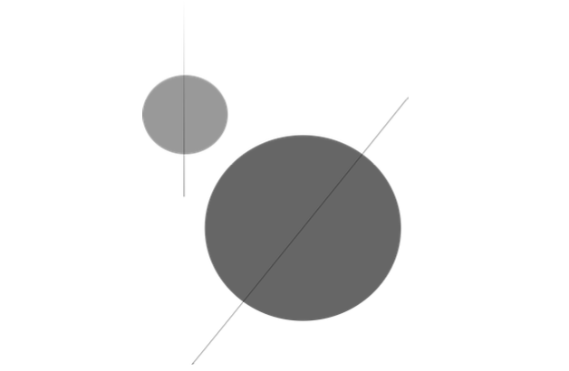
</td>
</tr>
<tr>
<td align="center">Bosons and fermions: particles with half-integer spin are fermions</td>
</tr>
</table>

A physicist is observing two such particles, while at least one of which is in a half-integer state. What is the probability that both particles are fermions?

<details><summary><b>Answer</b></summary>


</details>

---

Q. During pregnancy, the Placenta Chorion Test is commonly used for the diagnosis of hereditary diseases (Fig. 3.3). The test has a probability of $0.95$ of being correct whether or not a hereditary disease is present.

<table align='center'>
<tr>
<td align="center">
    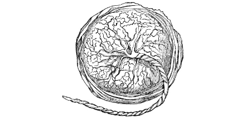
</td>
</tr>
<tr>
<td align="center">Foetal surface of the placenta</td>
</tr>
</table>

It is known that $1\%$ of pregnancies result in hereditary diseases. Calculate the probability of a test indicating that a hereditary disease is present.

<details><summary><b>Answer</b></summary>


</details>

---

Q. The Dercum disease is an extremely rare disorder of multiple painful tissue growths.
In a population in which the ratio of females to males is equal, 5% of females and 0.25% of males have the Dercum disease (Fig. 3.4).

<table align='center'>
<tr>
<td align="center">
    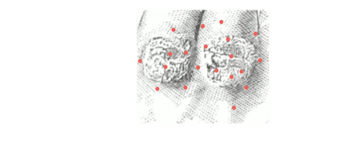
</td>
</tr>
<tr>
<td align="center">The Dercum disease<</td>
</tr>
</table>

A person is chosen at random and that person has the Dercum disease. Calculate the probability that the person is female.

<details><summary><b>Answer</b></summary>


</details>

---

Q. There are numerous fraudulent binary options websites scattered around the Internet, and for every site that shuts down, new ones are sprouted like mushrooms. A fraudulent AI based stock-market prediction algorithm utilized at the New York Stock Exchange, (Fig. 3.6) can correctly predict if a certain binary option shifts states from 0 to 1 or the other way around, with $85\%$ certainty.

<table align='center'>
<tr>
<td align="center">
    
</td>
</tr>
<tr>
<td align="center">The New York Stock Exchange</td>
</tr>
</table>

A financial engineer has created a portfolio consisting twice as many $state-1$ options then $state-0$ options. A stock option is selected at random and is determined by said algorithm to be in the state of $1$. What is the probability that the prediction made by the AI is correct?

<details><summary><b>Answer</b></summary>


</details>


---

Q. In an experiment conducted by a hedge fund to determine if monkeys (Fig. 3.6) can
outperform humans in selecting better stock market portfolios, 0.05 of humans and 1 out of 15 monkeys could correctly predict stock market trends correctly.

<table align='center'>
<tr>
<td align="center">
    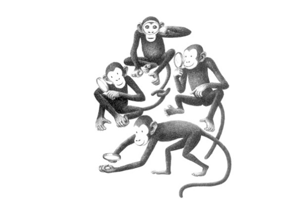
</td>
</tr>
<tr>
<td align="center">Hedge funds and monkeys</td>
</tr>
</table>

From an equally probable pool of humans and monkeys an “expert” is chosen at random. When tested, that expert was correct in predicting the stock market shift. What is the probability that the expert is a human?

<details><summary><b>Answer</b></summary>


</details>


---

Q. During the cold war, the U.S.A developed a speech to text (STT) algorithm that could theoretically detect the hidden dialects of Russian sleeper agents. These agents (Fig. 3.7), were trained to speak English in Russia and subsequently sent to the US to gather intelligence. The FBI was able to apprehend ten such hidden Russian spies and accused them of being "sleeper" agents.

<table align='center'>
<tr>
<td align="center">
    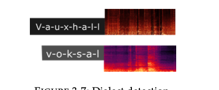
</td>
</tr>
<tr>
<td align="center">Dialect detection</td>
</tr>
</table>

The Algorithm relied on the acoustic properties of Russian pronunciation of the word *(v-o-k-s-a-l)* which was borrowed from English *V-a-u-x-h-a-l-l*. It was alleged that it is impossible for Russians to completely hide their accent and hence when a Russian would say *V-a-u-x-h-a-l-l*, the algorithm would yield the text *v-o-k-s-a-l*. To test the algorithm at a diplomatic gathering where $20\%$ of participants are Sleeper agents and the rest Americans, a data scientist randomly chooses a person and asks him to say *V-a-u-x-h-a-l-l*. A single letter is then chosen randomly from the word that was generated by the algorithm, which is observed to be an "l". What is the probability that the person is indeed a Russian sleeper agent?

<details><summary><b>Answer</b></summary>


</details>


---

Q. During World War II, forces on both sides of the war relied on encrypted communications. The main encryption scheme used by the German military was an Enigma machine, which was employed extensively by Nazi Germany. Statistically, the Enigma machine sent the symbols X and Z Fig. (3.8) according to the following probabilities:

$$
P(X) = \frac{2}{9} \\ 
\\ 
P(Z) = \frac{7}{9}
$$

<table align='center'>
<tr>
<td align="center">
    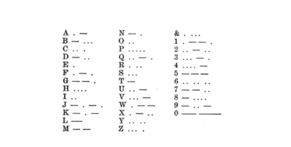
</td>
</tr>
<tr>
<td align="center">The Morse telegraph code</td>
</tr>
</table>

In one incident, the German military sent encoded messages while the British army used countermeasures to deliberately tamper with the transmission. Assume that as a result of the British countermeasures, an X is erroneously received as a Z (and mutatis mutandis) with a probability $\frac{1}{7}$. If a recipient in the German military received a Z, what is the probability that a Z was actually transmitted by the sender?

<details><summary><b>Answer</b></summary>


</details>


---

Q. What is the relationship between the likelihood function and the log-likelihood function?

<details><summary><b>Answer</b></summary>


</details>


---

Q. Describe how to analytically find the MLE of a likelihood function?

<details><summary><b>Answer</b></summary>


</details>


---

Q. What is the term used to describe the first derivative of the log-likelihood function?

<details><summary><b>Answer</b></summary>


</details>


---

Q. Naive Bayes classifier.
1. How is Naive Bayes classifier naive?
1. Let’s try to construct a Naive Bayes classifier to classify whether a tweet has a positive or negative sentiment. We have four training samples:

$$
\begin{bmatrix} 
    \text{Tweet} &  \text{Label} \\
    \text{This makes me so upset} & \text{Negative}\\
    \text{This puppy makes me happy} & \text{Positive} \\
    \text{Look at this happy hamster} & \text{Positive} \\
    \text{No hamsters allowed in my house} & \text{Negative}
    \end{bmatrix}
$$

According to your classifier, what's sentiment of the sentence The hamster is upset with the puppy?

<details><summary><b>Answer</b></summary>


</details>

---

Q. How does the Naive Bayes algorithm work?

<details><summary><b>Answer</b></summary>


</details>

---


Q. What is Laplace smoothing (additive smoothing) in Naive Bayes?

<details><summary><b>Answer</b></summary>


</details>

---


Q. Can Naive Bayes handle continuous and categorical features?

<details><summary><b>Answer</b></summary>


</details>

---


Q. What are the advantages of using Naive Bayes?

<details><summary><b>Answer</b></summary>


</details>

---


Q. What are the advantages of using Naive Bayes?

<details><summary><b>Answer</b></summary>


</details>

---


Q. Can Naive Bayes handle missing data?

<details><summary><b>Answer</b></summary>


</details>

---


Q. How do you evaluate the performance of a Naive Bayes classifier?

<details><summary><b>Answer</b></summary>


</details>

---

Q. What is the difference between Naive Bayes and other classification algorithms like Logistic Regression or Decision Trees?


<details><summary><b>Answer</b></summary>


</details>

---

### Random Variables

Q. In context of random variables define the following terms:

- Distributions
- Expectations
- Variance
- PMFs and CDFs
- Support


<details><summary><b>Answer</b></summary>


</details>


---

Q. Can the values of PDF be greater than 1? If so, how do we interpret PDF?


<details><summary><b>Answer</b></summary>


</details>


---

Q. What’s the difference between multivariate distribution and multimodal distribution?


<details><summary><b>Answer</b></summary>


</details>


---

Q. How would you turn a probabilistic model into a deterministic model?


<details><summary><b>Answer</b></summary>


</details>


---


Q. What is the relationship between the likelihood function and the log-likelihood function?


<details><summary><b>Answer</b></summary>


</details>


---

Q. What is a moment of function? Explain the meanings of the zeroth to fourth moments.


<details><summary><b>Answer</b></summary>

Statistical moments are additional descriptors of a curve/distribution. Moments quantify three parameters of distributions: location, shape, and scale. 

- `location` -  A distribution’s location refers to where its center of mass is along the x-axis. 
- `Scale` -  The scale refers to how spread out a distribution is. Scale stretches or compresses a distribution along the x-axis.
- `Shape` - The shape of a distribution refers to its overall geometry: is the distribution bimodal, asymmetric, heavy-tailed?

The $k$th moment of a function $f(x)$ about a non-random value $c$ is:

$$E[(X - c)^k] = \int_{-\infty}^{\infty} (x - c)^k f(x) dx$$

This generalization allows us to make an important distinction: 
- a raw moment is a moment about the origin $(c=0)$

- a central moment is a moment about the distribution’s mean $(c=E[X])$

First five moments in order from $0$th to $4$th moments: `total mass`, `mean`, `variance`, `skewness`, and `kurtosis`. 

- <b>Zeroth Moment(total mass)</b>: The zeroth moment is simply the constant value of 1. It doesn't provide much information about the distribution itself but is often used in mathematical contexts.

- <b>1st Moment(mean)</b> - The first moment is also known as the mean or expected value. It represents the center of the distribution and is a measure of the average or central location of the data points. 

$$\(\mu = \frac{1}{n} \sum_{i=1}^{n} x_i\)$$

Where:
- $\(\mu\)$ (mu) is the mean.
- $\(n\)$ is the number of data points.
- $\(x_i\)$ represents individual data points.

- <b>2nd Moment(Variance)</b> - The second moment is the variance. It measures the spread or dispersion of the data points around the mean. It is calculated as the average of the squared differences between each data point and the mean. 

$$\(\sigma^2 = \frac{1}{n} \sum_{i=1}^{n} (x_i - \mu)^2\)$$

Where:
  - \(\sigma^2\) (sigma squared) is the variance.

- <b>3rd Moment(Skewness)</b> - The third moment is a measure of the skewness of the distribution. It indicates whether the distribution is skewed to the left (negatively skewed) or to the right (positively skewed). 

$$\[Skewness = \frac{1}{n} \sum_{i=1}^{n} \left(\frac{x_i - \mu}{\sigma}\right)^3\]$$

- <b>4th Moment(Kurtosis)</b> - The fourth moment measures the kurtosis of the distribution. Kurtosis indicates whether the distribution is more or less peaked (leptokurtic or platykurtic) compared to a normal distribution. 

$$\[Kurtosis = \frac{1}{n} \sum_{i=1}^{n} \left(\frac{x_i - \mu}{\sigma}\right)^4\]$$

</details>

---


### Discrete Random Variables

Q. List down some famous discrete distributions.


<details><summary><b>Answer</b></summary>


</details>


---

Q. Define what is meant by a Bernoulli trial.


<details><summary><b>Answer</b></summary>


</details>


---

Q. The binomial distribution is often used to model the probability that $k$ out of a group of $n$
objects bare a specific characteristic. Define what is meant by a binomial random variable $X$.


<details><summary><b>Answer</b></summary>


</details>


---

Q. What does the following shorthand stand for?

$$
X ∼ Binomial(n, p)
$$


<details><summary><b>Answer</b></summary>


</details>


---

Q. Find the probability mass function (PMF) of the following random variable:

$$
X ∼ Binomial(n, p)
$$


<details><summary><b>Answer</b></summary>


</details>


---

Q. Define the terms likelihood and log-likelihood of a discrete random variable X given a fixed parameter of interest $\gamma$. Give a practical example of such scenario and derive its likelihood and log-likelihood.


<details><summary><b>Answer</b></summary>


</details>


---

Q. Given a fair coin, what’s the number of flips you have to do to get two consecutive heads?


<details><summary><b>Answer</b></summary>


</details>


---

Q. Answer the following questions:
1. Define what is meant by (mathematical) expectation.
2. Define what is meant by variance.
3. Derive the expectation and variance of a the binomial random variable $X ∼ Binomial(n, p)$ in terms of $p$ and $n$.


<details><summary><b>Answer</b></summary>


</details>


---

Q. Proton therapy (PT) is a widely adopted form of treatment for many types of cancer.
A PT device which was not properly calibrated is used to treat a patient with pancreatic cancer (Fig. 3.1). As a result, a PT beam randomly shoots $200$ particles independently and correctly hits cancerous cells with a probability of $0.1$.

<table align='center'>
<tr>
<td align="center">
    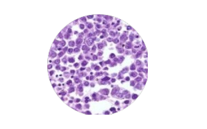
</td>
</tr>
<tr>
<td align="center">Histopathology for pancreatic cancer cells</td>
</tr>
</table>

1. Find the statistical distribution of the number of correct hits on cancerous cells in the described experiment. What are the expectation and variance of the corresponding random variable?
2. A radiologist using the device claims he was able to hit exactly 60 cancerous cells. How likely is it that he is wrong?


<details><summary><b>Answer</b></summary>


</details>

---

Q. What is likelihood function of the independent identically distributed (i.i.d) random variables:
$X_1,··· ,X_n$ where $X_i ∼ binomial(n, p)$, $∀i ∈ [1,n]$, and where p is the parameter of interest?


<details><summary><b>Answer</b></summary>


</details>


---

Q. How can we derive the maximum likelihood estimator (MLE) of the i.i.d samples $X_1, · · · , X_n$ introduced in above question?


<details><summary><b>Answer</b></summary>


</details>


---


Q. The 2014 west African Ebola epidemic has become the largest and fastest spreading outbreak of the disease in modern history with a death tool far exceeding all past outbreaks combined. Ebola (named after the Ebola River in Zaire) first emerged in 1976 in Sudan and Zaire and infected over 284 people with a mortality rate of 53%.

<table align='center'>
<tr>
<td align="center">
    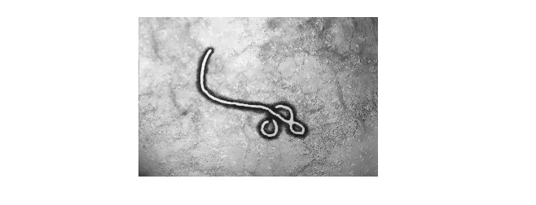
</td>
</tr>
<tr>
<td align="center">The Ebola virus</td>
</tr>
</table>

This rare outbreak, underlined the challenge medical teams are facing in containing epidemics. A junior data scientist at the center for disease control (CDC) models the possible spread and containment of the Ebola virus using a numerical simulation. He knows that out of a population of k humans (the number of trials), x are carriers of the virus (success in statistical jargon). He believes the sample likelihood of the virus in the population, follows a Binomial distribution:

$$
L(\gamma | y) = (n, y)\gamma^y(1-\gamma)^{n-y}, \ \gamma \epsilon [0, 1], \  y = 1,2,...n
$$

As the senior researcher in the team, you guide him that his parameter of interest is $γ$, the proportion of infected humans in the entire population. The expectation and variance of the binomial distribution are:

$$
E(y|γ, n) = nγ, V (y|γ, n) = nγ(1 − γ) 
$$

Answer the following; for the likelihood function of the form $L_x(γ)$:
1. Find the log-likelihood function $l_x(γ) = ln L_x(γ)$.
2. Find the gradient of $l_x(γ)$.
3. Find the Hessian matrix $H(γ)$.
4. Find the Fisher information $I(γ)$.
5. In a population spanning $10,000$ individuals, $300$ were infected by Ebola. Find the MLE for γ and the standard error associated with it.


<details><summary><b>Answer</b></summary>


</details>


---

Q. Let y be the number of successes in 5 independent trials, where the probability of success is θ in each trial. Suppose your prior distribution for θ is as follows: $P(θ = 1/2) = 0.25, P (θ = 1/6) = 0.5, and P (θ = 1/4) = 0.25$.
1. Derive the posterior distribution $p(θ|y)$ after observing y. 
2. Derive the prior predictive distribution for y.


<details><summary><b>Answer</b></summary>


</details>


---

Q. 
1. Define the term conjugate prior.
2. Define the term non-informative prior.


<details><summary><b>Answer</b></summary>


</details>


---

Q. Prove that the family of beta distributions is conjugate to a binomial likelihood, so that if a prior is in that family then so is the posterior. That is, show that:

$$
x ∼ Ber(γ), γ ∼ B(α,β) ⇒ γ|x ∼ B(α′,β′)
$$

For instance, for h heads and t tails, the posterior is:

$$
B(h + α,t + β)
$$


<details><summary><b>Answer</b></summary>


</details>


---

Q. A recently published paper presents a new layer for a new Bayesian neural network (BNN). The layer behaves as follows. During the feed-forward operation, each of the hidden neurons $H_n , n ∈ 1, 2$ in the neural network (Fig. 3.10) may, or may not fire independently of each other according to a known prior distribution.

<table align='center'>
<tr>
<td align="center">
    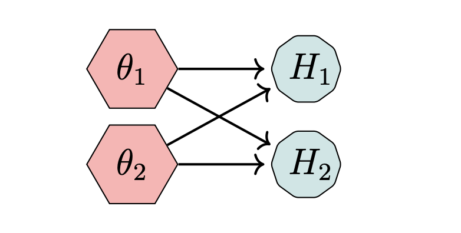
</td>
</tr>
<tr>
<td align="center">Likelihood in a BNN model</td>
</tr>
</table>

The chance of firing, γ, is the same for each hidden neuron. Using the formal definition, calculate the likelihood function of each of the following cases:
1. The hidden neuron is distributed according to $X ∼ binomial(n, γ)$ random variable and fires with a probability of $γ$. There are 100 neurons and only 20 are fired.
2. The hidden neuron is distributed according to $X ∼ Uniform(0,γ)$ random variable and fires with a probability of $γ$.


<details><summary><b>Answer</b></summary>


</details>

---

Q. Your colleague, a veteran of the Deep Learning industry, comes up with an idea for for a BNN layer entitled OnOffLayer. He suggests that each neuron will stay on (the other state is off) following the distribution $f(x) = e^{−x} \ for \ x > 0 \ and \ f(x) = 0 \ otherwise (Fig. 3.11)$. $X$ indicates the time in seconds the neuron stays on. In a BNN, 200 such neurons are activated independently in said OnOffLayer. The OnOffLayer is set to off (e.g. not active) only if at least 150 of the neurons are shut down. Find the probability that the OnOffLayer will be active for at least 20 seconds without being shut down.

<table align='center'>
<tr>
<td align="center">
    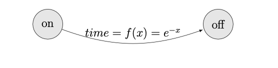
</td>
</tr>
<tr>
<td align="center">OnOffLayer in a BNN model</td>
</tr>
</table>


<details><summary><b>Answer</b></summary>


</details>

---

Q. A Dropout layer(Fig. 3.12) is commonly used to regularize a neural network model by randomly equating several outputs (the crossed-out hidden node H) to 0.
<table align='center'>
<tr>
<td align="center">
    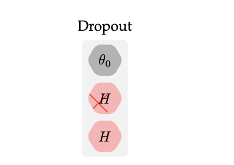
</td>
</tr>
<tr>
<td align="center">A Dropout layer (simplified form)</td>
</tr>
</table>
For instance, in PyTorch, a Dropout layer is declared as follows:

```python

import torch
import torch.nn as nn
nn.Dropout(0.2)

```

Where nn.Dropout(0.2) (Line #3 in 3.1) indicates that the probability of zeroing an element is 0.2.
<table align='center'>
<tr>
<td align="center">
    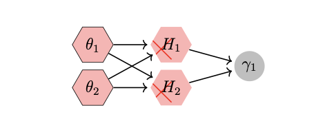
</td>
</tr>
<tr>
<td align="center">A Bayesian Neural Network Model</td>
</tr>
</table>

A new data scientist in your team suggests the following procedure for a Dropout layer which is based on Bayesian principles. Each of the neurons $θ_n$ in the neural network in (Fig. 8.33) may drop (or not) independently of each other exactly like a Bernoulli trial.

During the training of a neural network, the Dropout layer randomly drops out outputs of the previous layer, as indicated in (Fig. 3.12). Here, for illustration purposes, all two neurons are dropped as depicted by the crossed-out hidden nodes $H_n$.

You are interested in the proportion θ of dropped-out neurons. Assume that the chance of drop-out, $θ$, is the same for each neuron (e.g. a uniform prior for $θ$). Compute the posterior of $θ$.


<details><summary><b>Answer</b></summary>


</details>


---

Q. A new data scientist in your team, who was formerly a Quantum Physicist, suggests the following procedure for a Dropout layer entitled Quantum Drop which is based on Quantum principles and the Maxwell Boltzmann distribution. In the Maxwell-Boltzmann distribution, the likelihood of finding a particle with a particular velocity v is provided by:

$$
n(v)dv = \frac{4\pi N}{V}(\frac{m}{2\pi kT})^{\frac{3}{2}}v^2e^{-\frac{mv^2}{2kT}}dv
$$

<table align='center'>
<tr>
<td align="center">
    
</td>
</tr>
<tr>
<td align="center">The Maxwell-Boltzmann distribution</td>
</tr>
</table>

In the suggested QuantumDrop layer (3.15), each of the neurons behaves like a molecule and is distributed according to the Maxwell-Boltzmann distribution and fires only when the most probable speed is reached. This speed is the velocity associated with the highest point in the Maxwell distribution (3.14). Using calculus, brain power and some mathem- atical manipulation, find the most likely value (speed) at which the neuron will fire.
<table align='center'>
<tr>
<td align="center">
    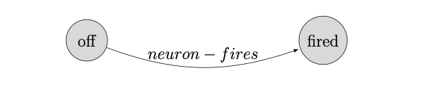
</td>
</tr>
<tr>
<td align="center">A QuantumDrop layer</td>
</tr>
</table>


<details><summary><b>Answer</b></summary>


</details>


---


### Continuous Random Variables

Q. Given a uniform random variable X  in the range of [0,1]  inclusively. What’s the probability that X=0.5 ?


<details><summary><b>Answer</b></summary>


</details>


---

Q. You’re drawing from a random variable that is normally distributed, $X∼N(0,1)$, once per day. What is the expected number of days that it takes to draw a value that’s higher than $0.5$?


<details><summary><b>Answer</b></summary>


</details>


---

Q. It’s a common practice to assume an unknown variable to be of the normal distribution. Why is that?


<details><summary><b>Answer</b></summary>


</details>


---

Q. Is it possible to transform non-normal variables into normal variables? How?


<details><summary><b>Answer</b></summary>


</details>


---

Q. When is the t-distribution useful?


<details><summary><b>Answer</b></summary>


</details>


---

Q. Derive the maximum likelihood estimator of an exponential distribution.


<details><summary><b>Answer</b></summary>


</details>


---

Q. Define the term prior distribution of a likelihood parameter $\gamma$ in the continuous case.


<details><summary><b>Answer</b></summary>


</details>


---

Q. In this question, you are going to derive the Fisher information function for several distributions. Given a probability density function (PDF) $f(X|γ)$, you are provided with the following definitions:
1. The natural logarithm of the PDF $lnf(X|γ) = Φ(X|γ)$.
2. The first partial derivative $Φ′(X|γ)$.
3. The second partial derivative $Φ′′(X|γ)$.
4. The Fisher Information for a continuous random variable:

$$
I(γ) = −Eγ[Φ′(X|γ)]
$$

Find the Fisher Information $I(γ)$ for the following distributions:
1. The Bernoulli Distribution $X ∼ B(1, γ)$.
2. The Poisson Distribution $X ∼ Poiss(θ)$.


<details><summary><b>Answer</b></summary>


</details>

---

Q. 
1. Define the term posterior distribution.
2. Define the term prior predictive distribution.


<details><summary><b>Answer</b></summary>


</details>


---

### Correlation and Covariance

Q. Are independence and zero covariance the same? Give a counterexample if not.

<details><summary><b>Answer</b></summary>

<b>No</b> 

Independence and zero covariance are related but not the same. Independence implies zero covariance, but the reverse is not necessarily true. Zero covariance indicates that there is no linear relationship between the variables. However, it does not necessarily mean that the variables are independent. Non-linear relationships can still exist between variables even if their covariance is zero.

Lets explain this with an example:

Consider two random variables $X$ and $Y$ defined as follows:

- A random variable $𝑋$ with $𝐸[𝑋]=0$ and $𝐸[𝑋^3]=0$, e.g. normal random variable with zero mean. 
- Take $𝑌=𝑋^2$.

Now it is clear the $X$ and $Y$ are dependent, now lets look the covariance of both

$$𝐶𝑜𝑣(𝑋,𝑌) = 𝐸[𝑋𝑌]−𝐸[𝑋]⋅𝐸[𝑌]$$

$$𝐶𝑜𝑣(𝑋,𝑌) = 𝐸[𝑋.X^2]−𝐸[𝑋]⋅𝐸[X^2]$$

$$𝐶𝑜𝑣(𝑋,𝑌) = 0$$

Now $Cov(X, Y)$ coming as zero and hence depicting the $X$ and $Y$ are independent which is not the case.

</details>

---

Q. Suppose we have a random variable X supported on $[0,1]$  from which we can draw samples. How can we come up with an unbiased estimate of the median of X?


<details><summary><b>Answer</b></summary>


</details>


---

Q. Define variance and co-variance. What is the difference between them?

<details><summary><b>Answer</b></summary>

Variance measures the spread of a random variable while co-variance measures how two random variables vary together.

Variance can be only non-negative while co-variance can be positive, negative or zero.

</details>

---


Q. How does sign of covariance decides the direction of relationship between two random variables?

<details><summary><b>Answer</b></summary>

The sign of co-variance decides how two random variables vary together

- Positive covariance - Both variables vary in the same direction
- Negative covariance - Both variables vary in opposite direction
- Zero covariance - There are linearly independent  

</details>


---

Q. Suppose you are conducting an experiment for studying behavior of two random variables $X$ and $Y$ and you found out $Cov(X, Y) = 100$. Does it mean they are strongly correlated?

<details><summary><b>Answer</b></summary>

From the given information we can not conclude about strength of the relationship.

Covariance is scale variant. It means its value is sensitive to scale of the measurement. We need to find out correlation $\rho$ to comment on the strength of the relationship.

</details>

---

Q. Prove that $Cov(X, X) = Var(X)$.

<details><summary><b>Answer</b></summary>

We know that:

$$Var(X) = (E(X - E(X))^2)$$

Also

$$Cov(X, X) = E((X-E(X))(X - E(X)))$$

on further simplifications, we get:

$$Cov(X, X) = E((X-E(X))^2) = Var(X)$$

</details>

---

Q. Prove that $Cov(X, Y) = E(XY) - E(X)E(Y)$.

<details><summary><b>Answer</b></summary>

From definition of Covariance:

$$Cov(X, Y) = E((X - E(X))(Y - E(Y)))$$

on simplification,

$$Cov(X, Y) = E(XY - YE(X) - E(Y)X + E(X)E(Y))$$

after taking outer expectations:

$$Cov(X, Y) = E(XY) - E(YE(X)) - E(E(Y)X) + E(E(X)E(Y))$$

Since E(X) is a constant since we are taking the average and expectation of a constant is just the same constant.

$$E(c) = c$$

Using the above expression:

$$Cov(X, Y) = E(XY) - E(X)E(Y) - E(X)E(Y) + E(X)E(Y)$$

after canceling out terms:

$$Cov(X, Y) = E(XY) - E(X)E(Y)$$


</details>

---

Q. What will be the value of $Cov(X, c) where $X$ is a random variable and $c$ is a constant value?
1. $Cov(X)$
2. $cCov(X)$
3. $c^2Cov(X)$
4. $0$

<details><summary><b>Answer</b></summary>

$0$ is the right answer. 

$Cov(X, c)$ encodes the information of how X and Y varies together. Since $c$ is a constant value so whatever value $X$ takes the value of $c$ will remain unchanged.

</details>

---

Q. Write down some properties of Covariance.

<details><summary><b>Answer</b></summary>

Properties of Covariance:

- $Cov(X, Y) = Cov(Y, X)$
- $Cov(X, X) = Var(X)$
- $Cov(X, c) = 0$
- $Cov(X, Y+Z) = Cov(X, Y) + Cov(X, Z)$
- $Cov(X, Y) = 0$ if X and Y are independent.
- $Cov(c) = c$

Here $X$, $Y$ and $Z$ are random variables and $c$ is a constant.

</details>


---

Q. Can the correlation be greater than 1? Why or why not? How to interpret a correlation value of 0.3?

<details><summary><b>Answer</b></summary>

<b>No</b> correlation(r) can not be greater than 1 and range of r is $[-1, 1]$. 

Lets look at the expression of correlation(r) to establish the above statement.

Suppose we have two variables X and Y and we want to investigate the relationship between them.

$$correlation(r_{XY}) = \frac{covariance(X, Y)}{{\sigma_X}{\sigma_Y}}$$

Now let's define two vectors $\arrow{u}$ and $\arrow{v}$ where $\arrow{u} = [u_1, u_2, ..., u_n]$ and $\arrow{v} = [v_1, v_2, ..., v_n]$ where elements are the deviation from the mean.

$$\u_i = x_i - \hat{x} \quad \v_i = y_i - \hat{y}$$

We can now write the sample covariance and the sample variances in vector notation as:

$$Covariance(u, v) = \frac{1}{n-1}\sum_{i=1}^n u_i v_i = \frac{1}{n-1}u \cdot v$$

similary variance in X and Y can be expressed in vectorized form:

$$Var(X) = \frac{1}{n-1}\sum_{i=1}^n {u_i}^{2} = \frac{1}{n-1} \| \mathbf{u} \|^2$$

$$Var(Y) = \frac{1}{n-1}\sum_{i=1}^n {v_i}^{2} = \frac{1}{n-1} \| \mathbf{v} \|^2$$

Now we can write correlation expression using vectors $u$ and $v$,

$$r_{XY} = \frac{Covariance(u, v)}{\sqrt{Var(X)}{Var(Y)}}$$

$$r_{XY} = \frac{\mathbf{u} \cdot \mathbf{v}}{\| \mathbf{u} \| \| \mathbf{v} \|}$$

From cosine rule, we get

$$r_{XY} = \cos\theta$$

Since $-1 <= \cos\theta <= 1$, $r_{XY} is always between -1 and 1$ 

For give $r = 0.3$, we can deduce following conclusions:

- Relationship is positive but week.
- Increasing one variable is resulting in increase in another variable too.

Note that the above conlusions are based on assumption that both variable are linearly dependent.

</details>

---

Q. What is the Pearson correlation coefficient, and how is it calculated?


<details><summary><b>Answer</b></summary>


</details>

---

Q. What is the significance of a correlation coefficient value of 0?

<details><summary><b>Answer</b></summary>


</details>

---

Q. What is the difference between positive and negative correlation?

<details><summary><b>Answer</b></summary>


</details>

---

Q. What are some limitations of the Pearson correlation coefficient?

<details><summary><b>Answer</b></summary>


</details>

---

Q. Can you have a high correlation without causation?


<details><summary><b>Answer</b></summary>


</details>

---
