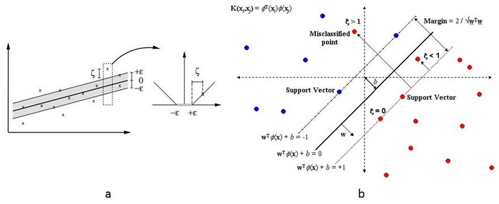

# Data Science Interview Questions And Answers

## Support Vector Machines

Contents
---

- [Maximal Margin Classifier](#maximal-margin-classifier)
- [Support Vector Classifier](#support-vector-classifier)
- [Support Vector Machines](#support-vector-machines)
- [Support Vector Regression](#support-vector-regression)

---

## Maximal Margin Classifier

Q. Is support vector machine(SVM) a generalization of maximal margin classifier?

<b>Answer</b>

True

---

Q. What is a hyperplane?

<b>Answer</b>

In a p-dimensional space, a hyperplane is a flat affine subspace of dimension $p-1$. For example, in two dimensions, a hyperplane is a flat one-dimensional subspace i.e a line.

---

Q. Write generic expression of a p-dimensional hyperplane?

<b>Answer</b>

$$\beta_0 + \beta_1X_1 + \beta_2X_2 + .... + \beta_pX_p  = 0$$

---

Q. How to determine whether a point or a vector lies on a hyperplane?

<b>Answer</b>

We can put the given point in the hyperplane equation and check the sign. 

---

Q. How does maximal margin classifier work?

<b>Answer</b>

Maximal margin classifier is a linear classifier that attempts to separate two classes by finding the hyperplane that maximizes the margin between the classes.

It works as follows:

Suppose we are working on a binary classification problem with $n$ training examples $\{(x_i, y_i)\}^n_{i=1}$ where

- $x_i \in \mathbb{R}^n$ is a $p$-dimensional feature vector
- $y_i \in \{-1, +1\}$ 

With the above setup, maximal margin classifier tries to find a hyperplane which can be represented as:

$$f(x) = w^Tx + b$$

where:

- $w \in \mathbb{R}^p$ is the weight vector (normal to the hyperplane)
- $b \in \mathbb{R}$ is the offset of the hyperplane from the origin

Decision boundary can be defined by:

$$f(x) = 0$$

$$ w^Tx + b  = 0$$

Now, we want to maximize the margin which is basically the distance between the decision boundary(hyperplane) and the closest points in the dataset(support vectors).  

Assume $x_i$ is a support vector, the distance(d) from the hyperplane can be expressed as

$$d = \frac{|w^Tx_i + b|}{||w||}$$

If we assume data is perfectly separable:

$$y_i(w^Tx_i + b) \ge 1$$

Using above two equations, margin can be derived as 

$$\text{Margin} = \frac{2}{||w||}$$

Note that here $2$ comes from the distance between the two support vectors(one from each class), each being at the distance of $\frac{1}{||w||}$ from the hyperplane.

So, maximal margin classifier tends to optimize the margin subject to the constraints that all points are classified correctly:

$$\min_{\mathbf{w}, b}\frac{1}{2}||w||^2$$

subject to:

$$y_i(w^Tx_i + b) \ge 1 \forall i$$

- Here we have used $||w||^2$ instead of $||w||$ to make the objective function convex and differential
- The constraints ensures that all points are on the correct side of the margin 

---

Q. What is the main limitation of maximal margin classifier?

<b>Answer</b>

Maximal margin classifier has following limitations:

- It works well when the data is perfectly linearly separable, in case of non linearly separable cases it fails to find the optimal hyperplane.
- It is highly sensitive to outliers if they are close to decision boundary or wrong side of it.
- The maximal margin hyperplane is extremely sensitive to a change in a single observation suggests that it may have overfit the training data.

---

Q. How can we overcome limitation of maximal margin classifier?

<b>Answer</b>

We can use soft margin i.e a hyperplane that almost separates the classes. It is also called as support vector classifier.

---

Q. How can we overcome limitation of maximal margin classifier?

<b>Answer</b>

We can use soft margin i.e a hyperplane that almost separates the classes. It is also called as support vector classifier.

---

Q. What is difference between Maximal margin classifier(MMC) and Support vector classifier(SVC)?

<b>Answer</b>

MMC seeks the largest possible margin so that every observation is on correct side of hyperplane as well as on the correct side of margin.  

But support vector machine, sometimes called as soft margin classifier allows some observations to be on incorrect side of the margin or even the incorrect side of hyperplane(The margin is soft because it can be violated by some training observations.)

---

Q. How does Support vector classifier(SVC) works?

<b>Answer</b>

The support vector classifier classifies a test observations depending on which side of hyperplane it lies. The hyperplane is chosen to correctly separate most of the training observations into two classes, but may classify few observations.

It is the solution to the optimization problem:

$$\max_{\mathbf{\beta_0,..,\beta_p}, \epsilon_1,..,\epsilon_n, M} M$$

subjected to

$$\sum_{j=1}^p\beta_j^2 = 1$$

$$y_i(\beta_0 + \beta_1x_{i1} + \beta_2x_{i2} + ... + \beta_px_{ip}) \ge M(1-\epsilon_i)$$

$$\epsilon_i \ge 0, \sum_{i=1}^{n}\epsilon_i \le C$$

Where $C$ is a nonnegative tuning parameter. $M$ is the width of the margin and $\epsilon_1,....\epsilon_n$ are slack variables that allows individual observations on the wrong side of the margin or the hyperplane.

Once we have hyperplane after solving above set of equations, we classify a test observations $x^*$, by simply determining on which side of hyperplane it lies.

$$
Sign(f(x^*) = \beta_0 + \beta_1x_1^{*}+...+\beta_Px_p^*)$$

---

Q. What kind of information we get from slack variables $\epsilon$ in SVC?

<b>Answer</b>

The slack variable $\epsilon_i$ tells us where the $i$th observations is located, relative to the hyperplane and relative to the margin.

- If $\epsilon_i > 0$ : $i$th observation is on the wrong side of the margin
- If $\epsilon_i = 0$ : $i$th observation is on the correct side of the margin
- If $\epsilon_i > 1$ : $i$th observation is on the wrong side of the hyperplane

---

Q. How to interpret regularization parameter $C$ in SVC?

<b>Answer</b>

We can think of $C$ as a budget for the amount that margin can be violated by $n$ observations. If $C=0$ then there is no budget for violations to the margin i.e maximal margin classifier. As the budget $C$ increases, the model becomes more tolerant of violations to the margin, and so the margin will widen. Conversely, as C decreases, we become less tolerant of violations to the margin and so the margin narrows.

---

Q. What are support vectors in SVC?

<b>Answer</b>

Observations that lie directly on the margin or on the wrong side of the margin for their class, are known as support vectors. 

---

Q. Explain bias-variance tradeoff in SVC?

<b>Answer</b>

The regularization parameter $C$ controls the bias-variance trade-off. 

- C is small : Low bias and high variance 
- C is large : High bias and low variance 

---

Q. Is SVC robust to outliers?

<b>Answer</b>

Yeah mostly, since the decision boundary is influenced only by support vectors, outliers that are far from the hyperplane(on the correct side) have little or no impact on the decision boundary.

---

Q. What is the main limitation of SVC?

<b>Answer</b>

It struggles with the cases having non-linear decision boundary.

---

Q. Can we use feature space enlarging technique to solve non linear decision boundary problem with SVC?

<b>Answer</b>

Yeah we can address the problem of non-linear boundaries between classes by enlarging the feature space using quadratic, cubic or even higher order polynomial functions of the predictors. But there is an issue because there are many possible ways to enlarge the feature space and we may end up with huge number of features.  Then computation would become unmanageable. 

---

Q. What is support vector machine(SVM)?

<b>Answer</b>

The support vector machine(SVM) is an extension of the support vector classifier that results from the enlarging the feature in a certain way using kernels.

---

Q. What do you mean by kernel function in SVM?

<b>Answer</b>

Kernel function quantifies the similarity of two observations.

- Linear kernel

    $$K(x_i, x_{i'}) = \sum_{j-1}^p{x_{ij}{x_{i'j}}}$$

- Polynomial kernel

    $$K(x_i, x_i') = (1 + \sum_{j=1}^p{x_{ij}{x_{i'j}}})^d$$

    where, $d > 1$

- Radial kernel

    $$K(x_i,x_{i'}) = exp(-\gamma\sum_{j=1}^{p}(x_{ij} - x_{i'j})^2)$$

where, $\gamma$ is positive constant.

---

Q. What is advantage of using kernel trick over simply enlarging feature space using functions of the original features?

<b>Answer</b>

Kernel trick is more computationally effective technique. We only need to compute $K(x_i, x'{_{i}})$ for all $\binom{n}{2}$ distinct pairs of $i, i'$. This can be done without explicitly working in the enlarged feature space. This is important because in many applications of SVMs, the enlarged feature space is so large that computations are intractable.

---

Q. What are major drawbacks of kernel based machines?

<b>Answer</b>

- Computation cost : In kernel machines the cost of evaluating the decision function is linear in number of training examples i.e $O(n)$ time complexity.
- Generic kernels struggles to generalize well.

---

Q. Why kernel trick is popular in SVM?

<b>Answer</b>

Although kernel machines are computationally expensive, SVMs are inherently efficient because they rely only on a subset of the training data, called support vectors, to define the decision boundary. The number of support vectors is typically much smaller than the total number of data points, which significantly reduces both training and prediction time, making the kernel trick particularly popular in SVM.

$$
f(x) = b + \sum_i \alpha_i k(x, x^{(i)})
$$

In SVMs, the vector of coefficients, \(\alpha\), is sparse, with non-zero values only for the support vectors and zero for the rest of the training points.

---

Q. Is SVM a linear model or non-linear model?

<b>Answer</b>

SVM can be linear or non-linear depending on the kernels we are using. When we are using linear kernel then the decision boundary will be linear, but if we using non-linear kernels like radial basis function(RBF) or sigmoid kernel.

---

Q. What is the kernel trick in Support Vector Machines (SVM), and how does it work?

<b>Answer</b>

The kernel trick in Support Vector Machines (SVM) is a technique used to handle non-linearly separable data. It allows SVM to find a hyperplane that can separate data points in higher-dimensional space without explicitly computing their coordinates in that space.

Instead of transforming the data explicitly:

- The SVM algorithm computes the kernel function directly between pairs of data points.
- This computation effectively simulates the inner products in the higher-dimensional space.
- The optimization problem remains linear in the original space, but the decision boundary can capture complex, non-linear relationships.

The linear function used by SVM can be rewritten as follows:

$$
f(x) = w^{T}x + b = b + \sum_{i}\alpha_{i}k(x, x^{(i)})
$$

---

Q. How can we set up SVMs to work with multi class classification problems?

<b>Answer</b>

We can use following approaches to accomplish it:

*One-versus-one classification*

To classify data with SVMs when there are $( K > 2 )$ classes, the *one-versus-one* (or *all-pairs*) approach is used. This method involves constructing $\binom{K}{2}$ SVM classifiers, each trained to distinguish between a pair of classes. For example, one SVM might compare the $k$th class with the $k'$th class. To classify a new observation, each of these classifiers is used to predict the class, and the observation is assigned to the class that receives the most votes from the pairwise classifiers.

*One-Versus-All classification*

In the one-versus-all (or one-versus-rest) approach for classifying with SVMs when there are $K > 2$ classes, $K$ separate SVMs are trained. Each SVM is designed to distinguish one class from the rest. For each SVM, the class of interest is coded as $+1$, while the remaining classes are coded as $-1$. 

To classify a new observation $x^*$, we compute the decision function values for all $K$ SVMs. The observation is assigned to the class for which this decision function value is the highest, indicating the strongest confidence that the observation belongs to that class.

---

Q. Is the SVM unique in its use of kernels to enlarge the feature space to accommodate non-linear class boundaries?

<b>Answer</b>

No, we could use it for other classification methods as well like with logistic regression. For historical reasons, the use of non-linear kernel is attached with SVMs.

---

Q. When should we use SVMs over logistic regression?

<b>Answer</b>

When the classes are well separated, SVMs tend to behave better than logistic regression; in more overlapping regimes, logistic regression is often preferred.

---

Q. What is the main benefit of using logistic regression over SVM?

<b>Answer</b>

SVM does not provide probabilities like logistic regression output. It only outputs a class identity/label.

---

Q. Given a true label $y = +1$ and a predicted score $\hat{y} = 0.5$, calculate the hinge loss for this classification example?

<b>Answer</b>

To calculate the hinge loss for the given true label and predicted score, use the hinge loss formula:

$$L(X, y, \beta) = \sum_{i=1}^{n}max[0, 1 - y_i(\beta_0 + \beta_1x_{i1} + ... + \beta_{p}x_{ip})]$$

On putting the given values:

$$Loss = max[0, 1 - 0.5] = 0.5$$

## Support Vector Machines

Q. SVM.
1. What’s linear separation? Why is it desirable when we use SVM?

1. How well would vanilla SVM work on this dataset?

1. How well would vanilla SVM work on this dataset?

1. How well would vanilla SVM work on this dataset?

<b>Answer</b>

---

## Support Vector Regression

Q. What is the main difference between Support Vector Machines (SVM) and Support Vector Regression (SVR)?

<b>Answer</b>

SVM is designed for classification by finding the best decision boundary between classes, while SVR is tailored for regression, focusing on fitting data points within a defined margin of error. 

SVM and SVR also differ in the loss function they want to minimize:

- SVM Loss Function (Hinge Loss)

$$\text{Loss} = \max(0, 1 - y_i \cdot (\mathbf{w} \cdot \mathbf{x}_i + b))$$

-  SVR Loss Function (Epsilon-Insensitive Loss)

$$
\text{Loss} = 
\begin{cases}
0 & \text{if } |y_i - (\mathbf{w} \cdot \mathbf{x}_i + b)| \leq \epsilon \\
|y_i - (\mathbf{w} \cdot \mathbf{x}_i + b)| - \epsilon & \text{otherwise}
\end{cases}
$$

---

Q. What are the key components of SVR?

<b>Answer</b>

The key components of SVR are:
- $ε-tube$ (ε-insensitive tube), 
- Support vectors
- Hyperplane

---

Q. What is the role of the ε-tube in SVR?

<b>Answer</b>

The ε-tube (epsilon-tube) in Support Vector Regression (SVR) plays a crucial role in defining the margin of error around the regression line within which the model does not penalize errors.

<table align='center'>
<tr>
<td align="center">
    
</td>
</tr>
<tr>
<td align="center">ε-tube (epsilon-tube) in Support Vector Regression (SVR)</td>
</tr>
</table>

Role of the ε-Tube in SVR:

1. **Defines Tolerance Margin**: The ε-tube sets a tolerance level within which predictions can deviate from the actual target values without incurring a penalty. Points that lie inside this tube are considered acceptable deviations, and no loss is calculated for these points.

2. **Controls Model Complexity**: By adjusting the width of the ε-tube (controlled by the epsilon parameter), you can make the model more or less sensitive to deviations from the actual data points. A wider ε-tube allows for more flexibility and fewer support vectors, leading to a simpler model, while a narrower tube makes the model stricter and more sensitive to the data points.

3. **Balances Fit and Generalization**: The ε-tube helps SVR strike a balance between fitting the data closely and maintaining good generalization. By ignoring small errors within the tube, SVR avoids overfitting to minor variations or noise in the data.

4. **Determines Support Vectors**: Only the data points that lie outside the ε-tube become support vectors, which influence the final regression model. Points inside the tube do not affect the optimization of the regression line, allowing the model to focus only on significant deviations.

---

Q. How do you tune the hyperparameters in SVR?

<b>Answer</b>

Hyperparameters in SVR include:

- Regularization parameter $C$
- Kernel type
- Kernel-specific parameters (e.g., degree for polynomial kernels, gamma for RBF kernels)

Tuning can be done using techniques like grid search or randomized search cross-validation to find the optimal combination of hyperparameters.

---

Q. What is the significance of the regularization parameter ($C$) in SVR?

<b>Answer</b>

The parameter $C$$ determines how strictly the model should fit the data versus maintaining a smooth regression function. A high  value emphasizes minimizing errors (fitting the data closely), while a low value emphasizes maximizing the margin and maintaining model simplicity.

---

Q. How does SVR handle outliers in the data?

<b>Answer</b>

SVR handles outliers by using an ε-insensitive loss function, a soft margin approach, and a tunable regularization parameter, making it more robust to outliers compared to traditional regression methods. However, extreme outliers can still affect the model, so proper preprocessing, such as scaling and outlier removal, is recommended.

---

Q. What are the evaluation metrics used to assess the performance of SVR models?

<b>Answer</b>

Common evaluation metrics for SVR include:

- Mean Squared Error (MSE)
- Root Mean Squared Error (RMSE)
- Mean Absolute Error (MAE) 
- R-squared (R2) to measure the goodness of fit.

---

Q. What are the advantages and disadvantages of SVR compared to other regression techniques?

<b>Answer</b>

Advantages of using SVR:

- **Robust to Outliers**: SVR uses a margin of tolerance (epsilon-insensitive loss), making it less sensitive to outliers compared to methods like linear regression.
- **Non-Linear Relationships**: SVR can capture non-linear relationships using kernel tricks (e.g., RBF, polynomial kernels), making it more versatile than simple linear models.
- **Generalization**: SVR aims to find a hyperplane that maximizes the margin, often resulting in better generalization on unseen data compared to other methods that minimize error without considering margin.

Disadvantages of using SVR:

- **Complexity and Computational Cost**: SVR can be computationally expensive, especially with large datasets or complex kernels, unlike simpler models like linear or ridge regression.
- **Not Scale Invariant**: SVR is sensitive to the scale of input features, requiring careful feature scaling, unlike some tree-based methods that are more robust to unscaled data.
-  **Interpretability Issue**: It is less interpretable because it doesn't provide clear coefficients for each feature.

---

Q. Can SVR be used for time series forecasting?

<b>Answer</b>

Yes, SVR can be applied to time series data by performing feature engineering on time/date attributes. However, it's not the best approach because SVR does not account for the temporal relationships in the data, which are crucial for time series forecasting.

---