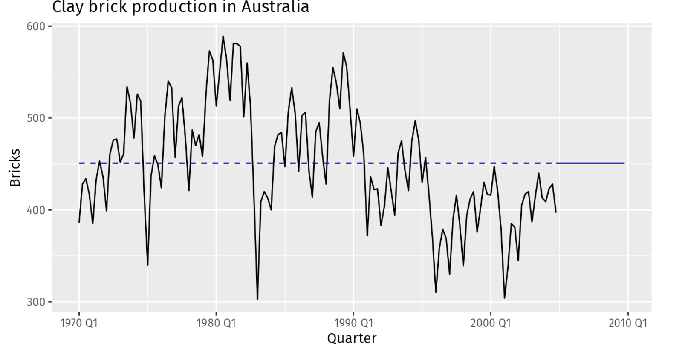

# Data Science Interview Questions And Answers

## Time Series Analysis and Forecasting

Contents
----

- [Introduction](#introduction)
- [Time Series Graphics](#time-series-graphics)
- [Time Series Decomposition](#time-series-decomposition)
- [Benchmark Forecasting Methods](#benchmark-forecasting-methods)
- [Time Series Regression Models](#time-series-regression-models)
- [Exponential Smoothing](#exponential-smoothing)
- [ARIMA Models](#arima-models)
- [Dynamic regression models](#dynamic-regression-models)
- [Prophet Model](#prophet-model)
- [Vector Autoregressions](#vector-autoregressions)
- [Neural Networks](#neural-networks)

---

## Introduction

Q. What is forecasting?

<b>Answer</b>

Forecasting is about predicting the future as accurately as possible, given all of the information available, including historical data and knowledge of any future events that might impact the forecasts.

---

Q. What do you mean by time series?

<b>Answer</b>

Anything that is observed sequentially over time is a time series. The observations can be at regular intervals of time (e.g. hourly, daily, monthly etc.) or irregular intervals.

---

Q. State the difference between univariate and multivariate time series?

<b>Answer</b>

Univariate time series refers to a single variable tracked over time, such as daily temperature readings in a city. In contrast, multivariate time series encompasses multiple variables measured over the same period, like daily temperature, humidity, and wind speed.

---

Q. Define following terms:
- Short-term forecasts
- Medium-term forecasts
- Long-term forecasts

<b>Answer</b>

*Short-term forecasts*

It is needed for the scheduling of personnel, production and transportation. As part of the scheduling process, forecasts of demand are often also required.

*Medium-term forecasts*

It is needed to determine future resource requirements, in order to purchase raw materials, hire personnel, or buy machinery and equipment.

*Long-term forecasts*

It is used in strategic planning. Such decisions must take account of market opportunities, environmental factors and internal resources.

---

Q. List down factors on which predictability of an event or quantity depends?

<b>Answer</b>

The predictability of an event or a quantity depends on several factors including
- how well we understand the factors that contribute to it
- how much data is available 
- how similar the future is to the past
- whether the forecasts can affect the thing we are trying to forecast

---

Q. Is it correct to assume that forecasts are not possible in a changing environment?

<b>Answer</b>

No it is not correct. Forecasts rarely assume that the environment is unchanging. What is normally assumed is that the way in which the environment is changing will continue into the future.

---

Q. How would you approach forecasting if there is no available data, or if the data you have is not relevant to the forecasts?

<b>Answer</b>

In this scenario we can use qualitative forecasting methods. These methods are not purely guesswork—there are well-developed structured approaches to obtaining good forecasts without using historical data. 

---

Q. When can we use Quantitative methods for forecasting use-cases?

<b>Answer</b>

Quantitative forecasting can be applied when two conditions are satisfied:

- Numerical information about the past is available
- It is reasonable to assume that some aspects of the past patterns will continue into the future

---

Q. State the difference between exogenous and endogenous variables?

<b>Answer</b>

Exogenous Variables: Determined outside the model and not influenced by other variables within it; serve as inputs.

Endogenous Variables: Determined by relationships within the model; influenced by other variables and represent the outcomes the model aims to explain. 

---

## Time Series Graphics

Q. Which is the most common plot in time series EDA?

<b>Answer</b>

Time plot - the observations are plotted against the time of observation, with consecutive observations joined by straight lines.

<table align='center'>
  <tr>
    <td align="center">
      
    </td>
  </tr>
  <tr>
    <td align="center"> Time Plot </td>
  </tr>
</table>

---

Q. What is the difference between seasonal plot and time plot?

<b>Answer</b>

A seasonal plot is similar to a time plot except that the data are plotted against individual seasons in which the data were observed.

<table align='center'>
  <tr>
    <td align="center">
      
    </td>
  </tr>
  <tr>
    <td align="center"> Seasonal Plot </td>
  </tr>
</table>

---

Q. What is the difference between seasonal plot and time plot?

<b>Answer</b>

A seasonal plot is similar to a time plot except that the data are plotted against individual seasons in which the data were observed.

<table align='center'>
  <tr>
    <td align="center">
      
    </td>
  </tr>
  <tr>
    <td align="center"> Seasonal Plot </td>
  </tr>
</table>

---

Q. What is the benefit of seasonal plots?

<b>Answer</b>

A seasonal plot allows the underlying seasonal pattern to be seen more clearly, and is especially useful in identifying years in which the pattern changes.

---

Q. What is seasonal subseries plots?

<b>Answer</b>

An alternative plot that emphasises the seasonal patterns is where the data for each season are collected together in separate mini time plots.

<table align='center'>
  <tr>
    <td align="center">
      
    </td>
  </tr>
  <tr>
    <td align="center"> Seasonal Subseries Plots </td>
  </tr>
</table>

---

Q. What is seasonal subseries plots?

<b>Answer</b>

An alternative plot that emphasises the seasonal patterns is where the data for each season are collected together in separate mini time plots.

<table align='center'>
  <tr>
    <td align="center">
      
    </td>
  </tr>
  <tr>
    <td align="center"> Seasonal Subseries Plots </td>
  </tr>
</table>

---

Q. Can we use scatter plots for time series EDA?

<b>Answer</b>

Yes, scatterplot helps us to visualise the relationship between the variables. For example we can study the relationship between demand and temperature by plotting one series against the other. 

---

Q. What is the difference between correlation and autocorrelation?

<b>Answer</b>

Correlation measures the extent of a linear relationship between two variables, autocorrelation measures the linear relationship between lagged values of a time series.

---

Q. What is the autocorrelation function (ACF)?

<b>Answer</b>

The ACF is a plot of autocorrelation between a variable and itself separated by specified lags. 

<table align='center'>
  <tr>
    <td align="center">
      
    </td>
  </tr>
  <tr>
    <td align="center"> Autocorrelation Function </td>
  </tr>
</table>

---

Q. Write the expression for autocorrelation?

<b>Answer</b>

$$
r_k = \frac{\sum_{t=k+1}^{T}(y_t - \bar{y})(y_{t-k} - \bar{y})}{\sum_{t=1}^{T}(y_t - \bar{y})^2}
$$

Where $T$ is the length of the time series.

Note that $r_1$ measures the relationship between $y_t$ and $y_{t-1}$, $r_2$ measures the relationship between $y_t$ and $y_{t-2}$ and so on. 

---

Q. Define following terms:
- Trend
- Seasonal
- Cyclic

<b>Answer</b>

*Trend*

A trend exists when there is a long-term increase or decrease in the data. It does not have to be linear.

*Seasonal*

A seasonal pattern occurs when a time series is affected by seasonal factors such as the time of the year or the day of the week. Seasonality is always of a fixed and known period

*Cyclic*

A cycle occurs when the data exhibit rises and falls that are not of a fixed frequency. These fluctuations are usually due to economic conditions, and are often related to the "business cycle". 

---

Q. How can we check for trend in time series data using ACF plots?

<b>Answer</b>

When data have a trend, the autocorrelations for small lags tend to be large and positive because observations nearby in time are also nearby in value. So the ACF of a trended time series tends to have positive values that slowly decrease as the lags increase.

<table align='center'>
  <tr>
    <td align="center">
      
    </td>
  </tr>
  <tr>
    <td align="center"> ACF plot for data with trend </td>
  </tr>
</table>

---

Q. How can we check for seasonality in time series data using ACF plots?

<b>Answer</b>

When data are seasonal, the autocorrelations will be larger for the seasonal lags (at multiples of the seasonal period) than for other lags.

<table align='center'>
  <tr>
    <td align="center">
      
    </td>
  </tr>
  <tr>
    <td align="center"> ACF plot for data with seasonal </td>
  </tr>
</table>

---

Q. How does the ACF plot looks like if data has both trend and seasonality?

<b>Answer</b>

The slow decrease in the ACF as the lags increase is due to the trend, while the “scalloped” shape is due to the seasonality.

<table align='center'>
  <tr>
    <td align="center">
      
    </td>
  </tr>
  <tr>
    <td align="center"> ACF plot for data with seasonal and trend </td>
  </tr>
</table>

---

Q. What does white noise mean in time series?

<b>Answer</b>

Time series that show no autocorrelation are called white noise. 

<table align='center'>
  <tr>
    <td align="center">
      
    </td>
  </tr>
  <tr>
    <td align="center"> White Noise </td>
  </tr>
</table>

---

Q. What are the statistical properties of white noise?

<b>Answer</b>

- For white noise series, autocorrelation to be close to zero.
- For a white noise series, we expect $95%$ of the spikes in the ACF to lie within $±1.96/\sqrt{T}$ where $T$ is the length of the time series.

---

Q. How could you check if the given time series is white noise?

<b>Answer</b>

We can use the fact that for a white noise series, we expect $95%$ of the spikes in the ACF to lie within $±1.96/\sqrt{T}$ where $T$ is the length of the time series.

It is common to plot these bounds on a graph of the ACF (the blue dashed lines above). If one or more large spikes are outside these bounds, or if substantially more than 5% of spikes are outside these bounds, then the series is probably not white noise.

---

## Time Series Decomposition

Q. What is time series decomposition?

<b>Answer</b>

Splitting a time series into several components, each representing an underlying pattern category.
- A trend-cycle component ($T_t$)
- A seasonal component ($S_t$)
- A residual component ($R_t$)

---

Q. Can a given time series posses more than one seasonal component?

<b>Answer</b>

For some time series (e.g., those that are observed at least daily), there can be more than one seasonal component, corresponding to the different seasonal periods.

---

Q. What are the benefits of time series decomposition?

<b>Answer</b>

- It helps improve understanding of the time series
- It can also be used to improve forecast accuracy.

---

Q. What kind of adjustments we can do with time series data to simplify the patterns in it?

<b>Answer</b>

We can do four kinds of adjustments:
- calendar adjustments
- population adjustments
- inflation adjustments 
- mathematical transformations.

---

Q. Why is it recommended to make adjustments or transformations to time series data before decomposing it?

<b>Answer</b>

The purpose of adjustments and transformations is to simplify the patterns in the historical data by removing known sources of variation, or by making the pattern more consistent across the whole data set. Simpler patterns are usually easier to model and lead to more accurate forecasts.

---

Q. Why is it recommended to make adjustments or transformations to time series data before decomposing it?

<b>Answer</b>

The purpose of adjustments and transformations is to simplify the patterns in the historical data by removing known sources of variation, or by making the pattern more consistent across the whole data set. Simpler patterns are usually easier to model and lead to more accurate forecasts.

---

Q. What are some common mathematical transformations that can be applied to time series data?

<b>Answer</b>

We can apply following transformations to time series depending on the scenarios
- Logarithmic transformations
- Power transformations
- Box-cox transformations

---

Q. What are the benefits of using mathematical transformations?

<b>Answer</b>

Mathematical transformations are techniques used to modify data in ways that make it more suitable for analysis. They can help stabilize variance, reduce skewness, and make relationships within the data more linear or normally distributed.

---

Q. What is log transformation? 

<b>Answer</b>

If we denote the original observations as $y_1,...,y_T$ and the transformed observations as $w_1,w_2,...,w_T$, then $w_t = \log{y_t}$.

---

Q. In which scenarios we should use log transformations? 

<b>Answer</b>

Log transformations reduce right-skewness and stabilizes variance, especially in cases where data values are growing exponentially. It is commonly used when data ranges over several orders of magnitude.

---

Q. What is power transformations?

<b>Answer</b>

It uses mapping as:

$$
y' = y^p
$$

It Increases or decreases the rate of change for different data values. Depending on the power \( p \) (for example, \( p = 2 \) for a square transformation or \( p = -1 \) for a reciprocal transformation), this transformation can reduce skewness or stabilize variance.

---

Q. What are Box-Cox transformations?

<b>Answer</b>

A useful family of transformations, that includes both logarithms and power transformations, is the family of Box-Cox transformations, which depend on the parameter $λ$ and are defined as follows:

$$
y(\lambda) = 
\begin{cases} 
\frac{y^\lambda - 1}{\lambda} & \text{if } \lambda \neq 0 \\
\ln(y) & \text{if } \lambda = 0 
\end{cases}
$$

where:
- \( y \) is the original data,
- \( \lambda \) is the transformation parameter.

For \( \lambda = 0 \), the natural logarithm of \( y \) is used instead, which is a common transformation when data has exponential growth or multiplicative seasonality. The value of \( \lambda \) can be estimated to best transform the data for further analysis.

---

Q. What are additive and multiplicative models in time series decomposition?

<b>Answer</b>

In time series decomposition, additive and multiplicative models are used to break down a time series into its components: trend, seasonality, and residual (or noise). 

---

Q. Explain additive model in time series decomposition?

<b>Answer</b>

In an additive model, the time series value at any given time \( Y_t \) is the sum of three components:

- Trend (\( T_t \)) – the long-term increase or decrease in the data.
- Seasonal (\( S_t \)) – the repeating short-term cycle in the data (such as monthly or yearly seasonality).
- Residual (\( R_t \)) – the remaining random variation or noise.

$$
Y_t = T_t + S_t + R_t
$$

---

Q. When should we use additive model for time series decomposition?

<b>Answer</b>

An additive model is appropriate when the trend and seasonal variations are relatively constant over time. This means that the amplitude (size) of seasonal variations does not change with the level of the time series. For instance, if sales increase by a constant amount each year, an additive model might be suitable.

---

Q. Explain multiplicative model in time series decomposition?

<b>Answer</b>

In an multiplicative model, the time series value at any given time \( Y_t \) is the sum of three components:

- Trend (\( T_t \)) – the long-term increase or decrease in the data.
- Seasonal (\( S_t \)) – the repeating short-term cycle in the data (such as monthly or yearly seasonality).
- Residual (\( R_t \)) – the remaining random variation or noise.

$$
Y_t = T_t \times S_t \times R_t 
$$

---

Q. When should we use multiplicative model for time series decomposition?

<b>Answer</b>

A multiplicative model is appropriate when the seasonal variations change proportionally to the trend level. In this case, seasonal fluctuations grow or shrink as the trend rises or falls. For example, if sales increase by a certain percentage each year, a multiplicative model would be more suitable.

---

Q. How do we determine whether to use an additive or multiplicative model?

<b>Answer</b>

- Additive Model: Use when seasonality is roughly constant, regardless of the level of the trend.
- Multiplicative Model: Use when seasonality varies proportionally with the trend.

---

Q. How does a log transformation allow additive decomposition to approximate a multiplicative decomposition?

<b>Answer</b>

An alternative to using a multiplicative decomposition is to first transform the data until the variation in the series appears to be stable over time, then use an additive decomposition. When a log transformation has been used, this is equivalent to using a multiplicative decomposition on the original data because 

$$
y_t = S_t \times T_t \times R_t
$$

On taking $\log$ both side:

$$
\log{y_t} = \log{S_t} + \log{T_t} + \log{R_t}
$$

---

Q. What is seasonally adjusted data?

<b>Answer</b>

If the seasonal component is removed from the original data, the resulting values are the "seasonally adjusted" data. For an additive decomposition, the seasonally adjusted data are given by $y_t - S_t$ and for multiplicative data, the seasonally adjusted values are obtained using $\frac{y_t}{S_t}$

---

Q. Explain moving average smoothing in time series decomposition?

<b>Answer</b>

A moving average of order $m$ can be written as

$$
\hat{T}_{t} = \frac{1}{m}\sum_{j=-k}{k}y_{t+j}
$$

where $m = 2k+1$. That is, the estimate of the trend-cycle at time $t$ is obtained by averaging values of the time series within $k$ periods of $t$. Observations that are nearby in time are also likely to be close in value. Therefore, the average eliminates some of the randomness in the data, leaving a smooth trend-cycle component. 

---

Q. How does order $m$ of moving average impact the modelling?

<b>Answer</b>

The order of the moving average determines the smoothness of the trend-cycle estimate. 

---

Q. In an m-order moving average, is symmetry important?

<b>Answer</b>

In an m-order moving average, symmetry is important because it ensures that each data point is treated equally, minimizing lag and providing a more accurate representation of the trend at a given time. 

---

Q. Explain weighted moving averages?

<b>Answer</b>

Combinations of moving averages result in weighted moving averages. In general, a weighted m-MA can be written as:

$$
\hat{T}_t = \sum^{k}_{j=-k}a_j y_{t+j}
$$

where $k = (m-1)/2$, and weights are given by $[a_{-k},..,a_k]$. It is important that the weights all sum to one and that they are symmetric so that $a_j = a_{-j}$.

---

Q. What is the major advantage of using weighted moving averages over m-MA?

<b>Answer</b>

A major advantage of weighted moving averages is that they yield a smoother estimate of the trend-cycle. Instead of observations entering and leaving the calculation at full weight, their weights slowly increase and then slowly decrease, resulting in a smoother curve.

---

Q. How can we use m-MA for time series decomposition?

<b>Answer</b>

An m-Moving Average (m-MA) can be used for time series decomposition by helping to separate the trend and seasonal components from the data.

1. Identify the Seasonal Period: 
- Determine the period of seasonality in your data, such as daily, monthly, or quarterly, depending on the time series. The chosen value of $m$ is usually equal to this seasonal period.
2. Calculate the Moving Average: 
- Apply an m-point moving average to smooth the data. The choice of m depends on the frequency of seasonality. For example, with monthly data and yearly seasonality, you’d use a 12-point moving average.
- For symmetric smoothing, use a centered moving average, where you calculate the average over equal numbers of points before and after a central point
3. Extract the Trend Component:
- The resulting moving average values represent the trend component, which shows the general direction of the series (upward, downward, or flat).
4. Isolate the Seasonal Component:
- To find the seasonal component, divide the original time series values by the trend (for a multiplicative model) or subtract the trend values (for an additive model).
- This can be done across several periods to get the average seasonal pattern, which smooths out random variations.
5. Calculate the Residual Component:
- After extracting the trend and seasonal components, the residual (or irregular) component can be determined by subtracting the seasonal component from the detrended data in the additive model, or dividing it in the multiplicative model.
- The residual component represents the noise or random variation left in the data after removing the trend and seasonality.

---

Q. What are the limitations of classical time series decomposition?

<b>Answer</b>

Classical time series decomposition has these main limitations:

1. Missing Trend Estimates: It doesn’t estimate the trend-cycle for the first and last few data points.
2. Over-Smoothing: Rapid changes in data are often smoothed out, losing detail.
3. Fixed Seasonality: Assumes seasonality is constant over time, which fails with evolving patterns.
4. Outlier Sensitivity: Not robust to unusual or extreme values, which can skew the results.

---

Q. How does STL decomposition work?

<b>Answer</b>

STL is a versatile and robust method for decomposing time series. STL is an acronym for "Seasonal and Trend decomposition using Loess", while loess is a method for estimating nonlinear relationships. STL was designed to handle data that exhibit non-linear patterns and allows for changing seasonality, unlike classical decomposition methods.

Here's how STL decomposition works:

1. Loess (Locally Estimated Scatterplot Smoothing): This is a non-parametric technique that uses local weighted regression to smooth parts of the data. STL uses Loess to estimate both the trend and seasonal components.
2. Seasonal Estimation: 
- STL first removes the rough trend by applying a Loess smoother to the entire series. This detrended series is then used to estimate the seasonal component, again using Loess smoothing but focusing on the seasonal cycle's length.
- The seasonality is allowed to change over time, and STL handles this by breaking the series into cycles and smoothing each separately.
3. Trend Estimation:
- Once the seasonal component is subtracted from the original data, what remains (original minus seasonal) is used to estimate the trend using another Loess smoother.
- This step focuses on longer periods than the seasonal estimation to capture the overall direction or trend without short-term fluctuations.
4. Residual Calculation:
- The residual component is simply calculated by subtracting both the estimated seasonal and trend components from the original time series.
5. Iterative Procedure:
- STL performs these steps iteratively, refining the estimates of trend and seasonality to minimize the residual component. This iterative approach allows STL to adapt to complex and changing patterns in the data.

---

Q. What are the advantages of using STL over classical decomposition?

<b>Answer</b>

STL has several advantages over classical decomposition:
- The seasonal component is allowed to change over time, and the rate of change can be controlled by the user.
- The smoothness of the trend-cycle can also be controlled by the user.
- It can be robust to outliers (i.e., the user can specify a robust decomposition), so that occasional unusual observations will not affect the estimates of the trend-cycle and seasonal components.

---

Q. What are the limitations of STL decomposition?

<b>Answer</b>

STL (Seasonal-Trend Decomposition using Loess) is a powerful decomposition method, but it does have some limitations:
- Computational Intensity: It requires significant computational resources, especially for large datasets.
- Lack of Forecasting Capability: STL doesn't directly provide forecasting models; it's primarily for decomposition.
- It does not handle trading day or calendar variation automatically, and it only provides facilities for additive decompositions.

---

Q. How can we use time series decomposition to  measure the strength of trend and seasonality in a time series?

<b>Answer</b>

A time series decomposition can be used to measure the strength of trend and seasonality in a time series:

$$
y_t = T_t + S_t + R_t 
$$

*Strength of Trend*

For strongly trended data, the seasonally adjusted data should have much more variation than the remainder component.

$$
F_T = max(0, 1 - \frac{\text{Var}(R_t)}{\text{Var}(T_t + R_t)})
$$

This will give a measure of the strength of the trend between 0 and 1.

*Strength of seasonality*

The strength of seasonality is defined similarly, but with respect to the detrended data rather than the seasonally adjusted data: 

$$
F_S = max(0, 1 - \frac{\text{Var}(R_t)}{\text{Var}(S_t + R_t)})
$$

A series with seasonal strength $F_S$ close to 0 exhibits almost no seasonality.

---

## Benchmark Forecasting Methods

Q. What are some simple forecasting methods?

<b>Answer</b>

- Mean method
- Naive Method
- Seasonal Naive Method
- Drift Method

---

Q. Explain mean method in time series forecasting?

<b>Answer</b>

Mean method assumes that forecasts of all future values are equal to average of historical data. If we let the historical data denoted by $y_1,..,y_T$, then we can write forecasts as

$$
\hat{y}_{T+h|T} = \bar{y} = (y_1 + ... + y_T)/T
$$

<table align='center'>
  <tr>
    <td align="center">
      
    </td>
  </tr>
  <tr>
    <td align="center"> Mean method forecasts applied to clay brick production in Australia. </td>
  </tr>
</table>

---

Q. How does naive method works in forecasting?

<b>Answer</b>

For naïve forecasts, we simply set all forecasts to be the value of the last observation. That is,

$$
\hat{y}_{T+h|T} = y_T 
$$

Note that naive method is also called random walk forecasts.

<table align='center'>
  <tr>
    <td align="center">
      
    </td>
  </tr>
  <tr>
    <td align="center"> Naïve forecasts applied to clay brick production in Australia. </td>
  </tr>
</table>

---

Q. How does seasonal naive method works in forecasting?

<b>Answer</b>

We  set each forecast to be equal to the last observed value from the same season (e.g., the same month of the previous year). 

$$
\hat{y}_{T+h|T} = y_{T+h - m(k+1)} 
$$

Where m = the seasonal period, and $k$ is the integer part of $(h-1)/m$ (i.e., the number of complete years in the forecast period prior to time $T+h$). For example, with monthly data, the forecast for all future February values is equal to the last observed February value.

<table align='center'>
  <tr>
    <td align="center">
      
    </td>
  </tr>
  <tr>
    <td align="center"> Seasonal naïve forecasts applied to clay brick production in Australia. </td>
  </tr>
</table>

---

Q. How does drift method works in forecasting?

<b>Answer</b>

A variation on the naïve method is to allow the forecasts to increase or decrease over time, where the amount of change over time (called the drift) is set to be the average change seen in the historical data. 

Forecast for time $T+h$ is given by

$$
\hat{y}_{T+h|T} = y_T + \frac{h}{T-1} \sum_{t=2}^{T}(y_t - y_{t-1}) = Y_T + h(\frac{y_t - y_1}{T - 1})
$$

Where m = the seasonal period, and $k$ is the integer part of $(h-1)/m$ (i.e., the number of complete years in the forecast period prior to time $T+h$). For example, with monthly data, the forecast for all future February values is equal to the last observed February value.

<table align='center'>
  <tr>
    <td align="center">
      
    </td>
  </tr>
  <tr>
    <td align="center"> Drift forecasts applied to clay brick production in Australia. </td>
  </tr>
</table>

---

Q. What do you mean by residual in time series model?

<b>Answer</b>

The "residuals" in a time series model are what is left over after fitting a model. The residuals are equal to the difference between the observations and the corresponding fitted values:

$$
e_t = y_t - \hat{y}_t
$$

Residuals are useful in checking whether a model has adequately captured the information in the data. 

---

Q. What properties should innovation residuals have to indicate a good forecasting method?

<b>Answer</b>

A good forecasting method will yield innovation residuals with the following properties:

Essential properties:
- The innovation residuals are uncorrelated. If there are correlations between innovation residuals, then there is information left in the residuals which should be used in computing forecasts.
- The innovation residuals have zero mean. If they have a mean other than zero, then the forecasts are biased.
Good to have:
- The innovation residuals have constant variance. This is known as “homoscedasticity”.
- The innovation residuals are normally distributed.

---

Q. What properties should innovation residuals have to indicate a good forecasting method?

<b>Answer</b>

A good forecasting method will yield innovation residuals with the following properties:

Essential properties:
- The innovation residuals are uncorrelated. If there are correlations between innovation residuals, then there is information left in the residuals which should be used in computing forecasts.
- The innovation residuals have zero mean. If they have a mean other than zero, then the forecasts are biased.
Good to have:
- The innovation residuals have constant variance. This is known as “homoscedasticity”.
- The innovation residuals are normally distributed.

---

Q. How do you determine the prediction interval for forecasted values?

<b>Answer</b>

Most time series models produce normally distributed forecasts — that is, we assume that the distribution of possible future values follows a normal distribution. A prediction interval gives an interval within which we expect $y_t$ to lie with a specified probability. For example, assuming that distribution of future observations is normal, a $95\%$  prediction interval for the h-step forecast is:

$$
\hat{y}_{T+h|T} \pm 1.96\hat{\sigma}_h
$$

where $\hat{\sigma}_h$ is an estimate of the standard deviation of the  h-step forecast distribution.

More generally, a prediction interval can be written as

$$
\hat{y}_{T+h|T} \pm c\hat{\sigma}_h
$$

where the multiplier $c$ depends on the coverage probability.

---

Q. How do you determine the prediction interval for forecasted values?

<b>Answer</b>

Most time series models produce normally distributed forecasts — that is, we assume that the distribution of possible future values follows a normal distribution. A prediction interval gives an interval within which we expect $y_t$ to lie with a specified probability. For example, assuming that distribution of future observations is normal, a $95\%$  prediction interval for the h-step forecast is:

$$
\hat{y}_{T+h|T} \pm 1.96\hat{\sigma}_h
$$

where $\hat{\sigma}_h$ is an estimate of the standard deviation of the  h-step forecast distribution.

More generally, a prediction interval can be written as

$$
\hat{y}_{T+h|T} \pm c\hat{\sigma}_h
$$

where the multiplier $c$ depends on the coverage probability.

---

Q. Express the standard deviation of the forecast distribution in case of one step prediction?

<b>Answer</b>

When forecasting one step ahead, the standard deviation of the forecast distribution can be estimated using the standard deviation of the residuals given by 

$$
\hat{\sigma} = \sqrt{\frac{1}{T - K - M}\sum_{t=1}^{T}e_{t}^2}
$$

where $K$ is the number of parameters estimated in the forecasting method, and $M$ is the number of missing values in the residuals.

---

Q. What happens with prediction intervals in case of multi-step forecasting?

<b>Answer</b>

Prediction intervals usually increase in length as the forecast horizon increases. The further ahead we forecast, the more uncertainty is associated with the forecast, and thus the wider the prediction intervals.

---

Q. For benchmark methods write the standard deviation expression for h-step forecast distribution?

<b>Answer</b>

For the four benchmark methods, it is possible to mathematically derive the forecast standard deviation under the assumption of uncorrelated residuals.

$$
\begin{table}[H]
\centering
\begin{tabular}{|c|c|}
\hline
\textbf{Forecasting Method} & \textbf{h-step forecast standard deviation} \\ \hline
Mean                        & $\hat{\sigma}_h = \hat{\sigma} \sqrt{1 + \frac{1}{T}}$                 \\ \hline
Naïve                       & $\hat{\sigma}_h = \hat{\sigma} \sqrt{h}$                               \\ \hline
Seasonal Naïve              & $\hat{\sigma}_h = \hat{\sigma} \sqrt{k + 1}$                           \\ \hline
Drift                       & $\hat{\sigma}_h = \hat{\sigma} \sqrt{h \left(1 + \frac{h}{T - 1}\right)}$ \\ \hline
\end{tabular}
\caption{Standard Deviation Equations for Different Forecasting Methods}
\label{tab:forecast_sd}
\end{table}
$$

---

Q. If the residuals from a fitted forecasting model do not exhibit a normal distribution, how would you establish prediction intervals for the forecasted values? 

<b>Answer</b>

When assuming a normal distribution for residuals is not suitable, an alternative approach is to use bootstrapping. This method assumes that the residuals are uncorrelated and have a consistent variance.

---

Q. Can time series decomposition be utilized for forecasting, and if so, what is the method for doing so?

<b>Answer</b>

Yes, Time series decomposition can be a useful step in producing forecasts. Assuming an additive decomposition, the decomposed time series can be written as

$$
y_t = \hat{S}_t + \hat{A}_t
$$

Where $\hat{A}_t = \hat{T}_t + \hat{R}_t$ is the seasonally adjusted component. 

To forecast a decomposed time series, we forecast the seasonal component, $\hat{S}_t$, and the seasonally adjusted component $\hat{A}_t$, separately. It is usually assumed that the seasonal component is unchanging, or changing extremely slowly, so it is forecast by simply taking the last year of the estimated component. In other words, a seasonal naïve method is used for the seasonal component.

To forecast the seasonally adjusted component, any non-seasonal forecasting method may be used. For example, the drift method, or Holt’s method, or a non-seasonal ARIMA model may be used.

---

Q. How does forecast errors differ from residuals?

<b>Answer</b>

Forecast errors are different from residuals in two ways. First, residuals are calculated on the training set while forecast errors are calculated on the test set. Second, residuals are based on one-step forecasts while forecast errors can involve multi-step forecasts.

---

Q. What are different techniques for measuring forecast accuracy?

<b>Answer</b>

We can measure forecast accuracy by summarising the forecast errors in following ways:

*Scale-dependent errors*
- Mean absolute error(MAE)
- Root mean squared error(RMSE)

*Percentage errors*
- Mean absolute percentage error(MAPE)

*Scaled Errors*

Scaled errors were proposed by Hyndman & Koehler (2006) as an alternative to using percentage errors when comparing forecast accuracy across series with different units. They proposed scaling the errors based on the training MAE from a simple forecast method.

---

Q. Is it feasible to apply the cross-validation technique to evaluate the accuracy of forecasts?

<b>Answer</b>

Yes, In this procedure, there are a series of test sets, each consisting of a single observation. The corresponding training set consists only of observations that occurred prior to the observation that forms the test set.

<table align='center'>
  <tr>
    <td align="center">
      
    </td>
  </tr>
  <tr>
    <td align="center"> Cross-validation for time series forecasts </td>
  </tr>
</table>

With time series forecasting, one-step forecasts may not be as relevant as multi-step forecasts. In this case, the cross-validation procedure based on a rolling forecasting origin can be modified to allow multi-step errors to be used. Suppose that we are interested in models that produce good 4-step-ahead forecasts. Then the corresponding diagram is shown below:

<table align='center'>
  <tr>
    <td align="center">
      
    </td>
  </tr>
  <tr>
    <td align="center"> Cross-validation for time series multi-step forecasts </td>
  </tr>
</table>

---

## Time Series Regression Models

Q. What assumptions do we make when using a linear regression model for forecasting?

<b>Answer</b>

When using a linear regression model, we assume:

1. Model Approximation: The model is a reasonable approximation to reality. This implies that the relationship between the forecast variable and predictor variables is linear.

2. Assumptions about the Errors:
   - Mean Zero: The errors have a mean of zero to avoid systematic bias in forecasts.
   - No Autocorrelation: The errors are not autocorrelated, ensuring forecasts are efficient without missed information in the data.
   - Unrelated to Predictors: The errors are unrelated to predictor variables, suggesting that all relevant information is captured within the model's systematic part.
   - Normal Distribution with Constant Variance: It is helpful for the errors to be normally distributed with constant variance (\( \sigma^2 \)) to facilitate prediction interval calculations.

---

Q. Explain least squares principle?

<b>Answer</b>

The least squares principle provides a way of choosing the coefficients effectively by minimising the sum of the squared errors. That is, we choose the values of $\beta_0,\beta_1,..,\beta_k$ that minimise 

$$
\sum_{t=1}^T \eta_{t}^2 = \sum_{t=1}^T(y_t - \beta_0 - \beta_1x_{1, t} - ... - \beta_k x_{k, t})^2
$$

This is called least squares estimation because it gives the least value for the sum of squared errors. 

---

Q. What are some typical predictors used in time series regression models?

<b>Answer</b>

There are several useful predictors that occur frequently when using regression for time series data.
- Trend: It is common for time series data to be trending. A linear trend can be modelled by simply using $x_{1, t}=t$ as predictor,

$$
y_t = \beta_0 + \beta_1t + \eta_t
$$
- Dummy variables
    - Public holiday 
- Seasonal dummy variables
    - Day of the week
    - Weekends
    - Week of the month
    - Month
    - Quarter
- Intervention variables: It is often necessary to model interventions that may have affected the variable to be forecast.
    - Competitor activity
    - Advertising expenditure
    - Industrial action
- Trading days: The number of trading days in a month can vary considerably and can have a substantial effect on sales data.
    - number of Mondays/Sundays in month
- Distributed lags
- Rolling stats

---

Q. What is Akaike's Information Criterion (AIC)?

<b>Answer</b>

AIC is defined as:

$$
\text{AIC} = T\log(\frac{SSE}{T}) + 2(k+2)
$$

$$
\text{SSE} = \sum_{t=1}^T \eta_{t}^2
$$

where $T$ is the number of observations used for estimation and $k$ is the number of predictors in the model.

The $k+2$ part of the equation occurs because there are $k+2$ parameters in the model: the $k$ coefficients for the predictors, the intercept and the variance of the residuals. 

---

Q. How can the AIC score be interpreted?

<b>Answer</b>

The model with the minimum value of the AIC is often the best model for forecasting. 

---

Q. Why do we need to adjust bias in AIC score?

<b>Answer</b>

For small values of $T$, the AIC tends to select too many predictors, and so a bias-corrected version of the AIC has been developed.

$$
\text{AIC}_c = \text{AIC} + \frac{2(k+2)(k+3)}{(T-k-3)}
$$

---

Q. What is Bayesian Information Criterion (BIC)?

<b>Answer</b>

Schwarz’s Bayesian Information Criterion (usually abbreviated to BIC, SBIC or SC):

$$
\text{BIC} = T\log{\frac{SSE}{T}} + (k+2)\log(T)
$$

---

Q. How does AIC differs from BIC?

<b>Answer</b>

BIC penalizes the number of parameters more heavily than the AIC. Although  If the value of $T$ is large enough, both will lead to the same model.

---

## Exponential Smoothing

Q. What are exponential smoothing methods?

<b>Answer</b>

Exponential smoothing methods are weighted averages of past observations, with the weights decaying exponentially as the observations get older.

---

Q. What is simple exponential smoothing method?

<b>Answer</b>

Simple Exponential Weighted Average, or simple exponential smoothing, is a forecasting method that assigns larger weights to more recent observations and gradually decreases the weights for older observations. 

$$
\hat{y}_{T+1 | T} = \alpha y_T + \alpha(1-\alpha)y_{T-1}+\alpha(1-\alpha)^2y_{T-2}+...
$$

Where $0 \le \alpha \le 1$ is the smoothing parameter. The rate at which the weights decrease is controlled by the parameter $α$.

---

Q. What occurs in simple exponential smoothing when \(\alpha = 1\)?

<b>Answer</b>

For the extreme case where $\alpha = 1$, $\hat{y}_{T+1 | T} = y_T$, and the forecasts are equal to the naïve forecasts.

---

Q. Write the component form of simple exponential smoothing?

<b>Answer</b>

For simple exponential smoothing, the only component included is the level, $l_t$. Component form representations of exponential smoothing methods comprise a forecast equation and a smoothing equation for each of the components included in the method. 

The component form of simple exponential smoothing is given by:

$$
\text{Forecast equation} \hat{y}_{t+h | t} = l_t  \\

\text{Smoothing equation} l_t = \alpha y_t + (1-\alpha)l_{t-1}
$$

where $l_t$ is the level (or the smoothed value) of the series at time $t$.

---

Q. Why can’t we use the exponential smoothing method for data with seasonality and trend?

<b>Answer</b>

Simple exponential smoothing has a "flat" forecast function:

$$
\hat{y}_{T+h | T} = \hat{y}_{T+1 | T} = l_T, h = 2, 3, ..
$$

That is, all forecasts take the same value, equal to the last level component.

---

Q. How does Holt's linear trend method work?

<b>Answer</b>

Holt extended simple exponential smoothing to allow the forecasting of data with a trend. This method involves a forecast equation and two smoothing equations (one for the level and one for the trend):

$$
\text{Forecast equation}  \hat{y}_{t+h | t} = l_t + hb_t \\

\text{Level equation}  l_t = \alpha y_t + (1-\alpha)(l_{t-1} + b_{t-1}) \\

\text{Trend equation}  b_t = \beta^* (l_t - l_{t-1}) + (1-\beta^*)b_{t-1}
$$

where $l_t$ denotes an estimate of the level of the series at time $t$, $b_t$ denotes an estimate of the trend (slope) of the series at time $t$, $\alpha$ is the smoothing parameter for the level and $\beta^*$ is the smoothing parameter for the trend.

---

Q. What is the main issue with Holt's linear trend method?

<b>Answer</b>

The forecasts generated by Holt’s linear method display a constant trend (increasing or decreasing) indefinitely into the future. Empirical evidence indicates that these methods tend to over-forecast, especially for longer forecast horizons. 

---

Q. Explain working of damped trend methods?

<b>Answer</b>

In conjunction with the smoothing parameters $\alpha$ and $\beta^*$ (with values between 0 and 1 as in Holt’s method), damped trend method also includes a damping parameter $0 < \phi < 1$:

$$
\text{Forecast equation}  \hat{y}_{t+h | t} = l_t + (\phi + \phi^2 + ... + \phi^h)b_t \\

\text{Level equation}  l_t = \alpha y_t + (1-\alpha)(l_{t-1} + \phi b_{t-1}) \\

\text{Trend equation}  b_t = \beta^* (l_t - l_{t-1}) + (1-\beta^*)\phi b_{t-1}
$$

If $\phi = 1$,  the method is identical to Holt’s linear method. For values between $0$ and $1$, $\phi$ dampens the trend so that it approaches a constant some time in the future.

---

Q. What is Holt-Winter's method?

<b>Answer</b>

Holt and Winters extended Holt’s method to capture seasonality. The Holt-Winters seasonal method comprises the forecast equation and three smoothing equations:
- Level $l_t$ 
- Trend $b_t$
- Seasonal Component $s_t$

*Holt-Winters’ additive method*

$$
\hat{y}_{t+h|t} = \ell_t + h b_t + s_{t + h - m(k+1)}
$$

$$
\ell_t = \alpha (y_t - s_{t-m}) + (1 - \alpha)(\ell_{t-1} + b_{t-1})
$$

$$
b_t = \beta^* (\ell_t - \ell_{t-1}) + (1 - \beta^*) b_{t-1}
$$

$$
s_t = \gamma (y_t - \ell_{t-1} - b_{t-1}) + (1 - \gamma) s_{t-m}
$$

Where $k$ is the integer part of $(h-1)/m$. $\alpha$, $\ell_t$ and $\gamma$ are the smoothing parameter of level, trend and seasonality.

---

Q. In the damped Holt-Winters method with multiplicative seasonality, what role does the parameter \( \phi \) play, and what would be the effect on the trend if \( \phi = 1 \) versus \( \phi < 1 \)?

<b>Answer</b>

The parameter \( \phi \) in the damped Holt-Winters method controls the damping of the trend component over time. When \( \phi = 1 \), there is no damping, meaning the trend continues to grow linearly (or decline) indefinitely, as in the traditional Holt-Winters method. In contrast, if \( \phi < 1 \), the trend is damped, causing the effect of the trend to decrease exponentially over time, which often leads to more stable and realistic long-term forecasts for seasonal data. 

This damping effect is beneficial for situations where a continuously increasing or decreasing trend is not expected to persist indefinitely, helping the model produce more accurate and robust forecasts for seasonal data with a moderated trend component.

---

Q. What are state space models in the context of time series analysis?

<b>Answer</b>

State space models in time series analysis consist of two main components: a measurement equation and state equations. The measurement equation describes the observed data, capturing the relationship between the observed values and the underlying states of the model. The state equations describe the dynamics of these unobserved components, such as the level, trend, and seasonal variations, detailing how they evolve over time. This framework allows for a comprehensive modeling of time series data, accommodating changes in different states to better forecast future values.

---

Q. What is difference between methods and models?

<b>Answer</b>

- Methods are algorithms that return point forecasts. 
- A statistical model is a stochastic (or random) data generating process that can produce an entire forecast distribution.

---

Q. What is the forecast error in simple exponential smoothing model?

<b>Answer</b>

Forecast error is given by:

$$
e_t = y_t - \hat{y}_{t | t-1}
$$

$$
e_t = y_t - l_{t-1}
$$

---

Q. What is the forecast error in simple exponential smoothing model?

<b>Answer</b>

Forecast error is given by:

$$
e_t = y_t - \hat{y}_{t | t-1}
$$

$$
e_t = y_t - l_{t-1}
$$

---

Q. Write the expression for SES with additive errors?

<b>Answer</b>

Forecast error is given by:

- Measurement equation: It captures relationship between observations and states
$$
y_t = l_{t-1} + \eta_t
$$
- State equation: Evolution of states through time
$$
l_t = l_{t-1} + \alpha \eta_t
$$

---

Q. For an additive error model, maximising the likelihood (assuming normally distributed errors) gives the same results as minimising the sum of squared errors?

<b>Answer</b>

True

---

Q. For an multiplicative error model, maximising the likelihood (assuming normally distributed errors) gives the same results as minimising the sum of squared errors?

<b>Answer</b>

False

---

Q. Write the expression of $AIC$, $AIC_{c}$ and $BIC$ for ETS models?

<b>Answer</b>

For ETS models, Akaike’s Information Criterion (AIC) is defined as

$$
AIC = -2\log{(L)} + 2k
$$

where L is the likelihood of the model and k is the total number of parameters and initial states that have been estimated (including the residual variance).

The AIC corrected for small sample bias ($AIC_c$) is defined as:

$$
AIC_c = AIC + \frac{2k(k+1)}{T - k -1}
$$

and the Bayesian Information Criterion (BIC) is

$$
BIC = AIC + k[\log{(T)} - 2]
$$

---

## ARIMA Models

Q. What is the main difference between ARIMA models and exponential smoothing models?

<b>Answer</b>

Exponential smoothing models are based on a description of the trend and seasonality in the data, ARIMA models aim to describe the autocorrelations in the data.

---

Q. What What do you mean by stationary time series? 

<b>Answer</b>

A stationary time series is one whose statistical properties do not depend on the time at which the series is observed. Thus, time series with trends, or with seasonality, are not stationary — the trend and seasonality will affect the value of the time series at different times.

---

Q. What What do you mean by stationary time series? 

<b>Answer</b>

A stationary time series is characterized by statistical properties such as mean, variance, and autocorrelation that are constant over time. This means that the values of the series are not dependent on the time at which they are observed.

---

Q. When is a time series considered non-stationary?

<b>Answer</b>

Non-stationary time series exhibit trends or seasonal patterns that affect their statistical properties across different time periods. For instance, a time series with a trend will have a mean that changes over time, and a series with seasonality will show variations at regular intervals, influencing the series' behavior and making standard analyses challenging without adjustments to account for these dependencies.

---

Q. Is white noise series stationary?

<b>Answer</b>

Yes, white noise series is stationary — it does not matter when you observe it, it should look much the same at any point in time.

---

Q. Is a time series that exhibits cyclic behavior but lacks any trend or seasonality considered stationary?

<b>Answer</b>

Yes, a time series with cyclic behaviour (but with no trend or seasonality) is stationary. This is because the cycles are not of a fixed length, so before we observe the series we cannot be sure where the peaks and troughs of the cycles will be.

---

Q. How can we make non-stationary time series stationary?

<b>Answer</b>

To make a non-stationary time series stationary — compute the differences between consecutive observations. This is known as differencing. 

---

Q. How does differencing transform a non-stationary time series into a stationary one?

<b>Answer</b>

Differencing can help stabilize the mean of a time series by removing changes in the level of a time series, and therefore eliminating (or reducing) trend and seasonality.

---

Q. How can we stabilize the variance of a time series? 

<b>Answer</b>

Transformations such as logarithms can help to stabilise the variance of a time series.

---

Q. How can one determine if a time series is stationary?

<b>Answer</b>

An ACF (Autocorrelation Function) plot can help identify whether a time series is stationary. For a stationary time series, the ACF typically declines to zero fairly rapidly, indicating a lack of long-term correlations. In contrast, the ACF of non-stationary time series tends to decrease slowly, suggesting persistent correlations over time. Additionally, in non-stationary data, the first lag autocorrelation, \( r_1 \), is often significantly large and positive.

---

Q. What is second order differencing?

<b>Answer</b>

Second-order differencing is a technique used in time series analysis to make a non-stationary series stationary. It involves applying differencing twice to the original time series data.
- The first-order difference of a time series is calculated by subtracting the previous observation from the current observation:

$$
Y'_{t} = Y_t - Y_{t-1}
$$

- The second-order difference is calculated as:

$$
Y''_{t} = Y'_{t} - Y'_{t-1} = Y_t - 2Y_{t-1} + Y_{t-2}
$$

---

Q. When is Second-Order Differencing Used?

<b>Answer</b>

Second-order differencing is useful when the data has a second-degree trend or when the first-order differencing does not sufficiently stabilize the mean of the series. This makes the series suitable for various forecasting methods, such as ARIMA models, which assume the data is stationary.

---

Q. What is seasonal differencing?

<b>Answer</b>

A seasonal difference is the difference between an observation and the previous observation from the same season. So

$$
y'_{t} = y_t - y_{t-m}
$$

where m = the number of seasons.

Note that these are also called lag-m differences, as we subtract the observation after a lag of $m$ periods.

---

Q. Why is it important to avoid applying more differencing than necessary in time series analysis?

<b>Answer</b>

Applying more differences than necessary in time series analysis can lead to false dynamics or autocorrelations that aren't actually present in the original data. This can distort the true structure of the series, potentially leading to incorrect interpretations and inaccurate forecasts. Therefore, it’s essential to use the minimum number of differences needed to achieve stationarity, as excessive differencing can artificially introduce complexity and obscure the real patterns in the data.

---

Q. How can we determine the required order of differencing?

<b>Answer</b>

We can conduct some statistical tests to determine the required order of differencing:
- Augmented dickey fuller test: Null hypothesis is data are non-stationary and non-seasonal
- KPSS test:  Null hypothesis is data are stationary and non-seasonal

---

Q. How can the $d$th-order difference be expressed using backshift notation?

<b>Answer</b>

In general, a $d$th-order difference can be written as:

$$
(1-B)^d y_t
$$

---

Q. What does autoregression indicates?

<b>Answer</b>

The term autoregression indicates that it is a regression of the variable against itself.

---

Q. What are the differences between a linear regression model and an autoregression model?

<b>Answer</b>

In a multiple regression model, the variable of interest is forecasted using a linear combination of predictors. In contrast, an autoregression model forecasts the variable of interest by using a linear combination of its past values.

---

Q. What are the differences between a linear regression model and an autoregression model?

<b>Answer</b>

In a linear regression model, the variable of interest is forecasted using a linear combination of predictors. In contrast, an autoregression model forecasts the variable of interest by using a linear combination of its past values.

---

Q. State the expression of autoregressive model of order $p$?

<b>Answer</b>

An autoregressive model of order $p$ **AR(p) model** can be written as:

$$
y_t = c + \phi_1 y_{t-1} + \phi_2 y_{t-2} + ... + \phi_p y_{t-p} + \eta_t 
$$

where $\eta_t$ is white noise. 

---

Q. Why are autoregressive models typically restricted to stationary data?

<b>Answer</b>

Autoregressive models are typically restricted to stationary data because their assumptions and predictions rely on the properties of stationarity. In stationary data, statistical properties like mean, variance, and autocorrelation remain constant over time, allowing the autoregressive model to accurately capture relationships based on past values. If the data is non-stationary, these properties may change over time, leading to unreliable forecasts and model instability.

---

Q. What are the parameter constraints for stationarity in AR(1) and AR(2) models?

<b>Answer</b>

For the model to remain stationary, certain constraints are placed on the parameters:

- For an AR(1) model: \(-1 < \phi_1 < 1\).
- For an AR(2) model: \(-1 < \phi_2 < 1\), \(\phi_1 + \phi_2 < 1\), and \(\phi_2 - \phi_1 < 1\).

---

Q. How does moving average model works?

<b>Answer</b>

A moving average model uses past forecast errors in a regression-like model:

$$
y_t = c + \eta_t + \theta_1 \eta_{t-1} + \theta_2 \eta_{t-2} + ... + \theta_q \eta_{t-q}
$$

where $\eta_t$ is white noise. It is called as a moving average model of order $q$.

---

Q. What is the difference between moving average model and moving average smoothing?

<b>Answer</b>

A moving average model is used for forecasting future values, while moving average smoothing is used for estimating the trend-cycle of past values.

---

Q. In the context of ARIMA what does integration mean?

<b>Answer</b>

Integration is the reverse of differencing.

---

Q. What does ARIMA stands for?

<b>Answer</b>

ARIMA is an acronym for AutoRegressive Integrated Moving Average

---

Q. What is non seasonal ARIMA model?

<b>Answer</b>

Non seasonal ARIMA model combines differencing with autoregression and a moving average model. 

The full model **ARIMA(p, d, q)** can be written as:

$$
y'_t = c + \phi_1 y'_{t-1} + ... + \phi_p y'_{t-p} + \theta_1 \eta_{t-1} + ... + \theta_q \eta_{t-q} + \eta_t
$$

where  $y'_t$ is the differenced series (it may have been differenced more than once). The “predictors” on the right hand side include both lagged values of $y_t$ and lagged errors. 

Here, $p$ is order of the autoregressive part, $d$ is degree of first differencing involved and $q$ is order of the moving average part.

---

Q. What is partial autocorrelation?

<b>Answer</b>

Partial autocorrelation measures the relationship between $y_t$ and $y_{t-k}$ after removing effects of lags $1, ,2 , 3,.., k-1$. 

---

Q. Why do we need partial autocorrelation instead of just autocorrelation?

<b>Answer</b>

Autocorrelations measure the relationship between \( y_t \) and \( y_{t-k} \) for different values of \( k \). If \( y_t \) and \( y_{t-1} \) are correlated, then \( y_{t-1} \) and \( y_{t-2} \) will also be correlated. Consequently, \( y_t \) and \( y_{t-2} \) might appear correlated—not due to any unique information in \( y_{t-2} \), but because both are connected to \( y_{t-1} \). This indirect connection does not necessarily indicate a direct influence of \( y_{t-2} \) on \( y_t \) for forecasting purposes.

---

Q. How can we determine the parameters of ARIMA models?

<b>Answer</b>

Using maximum likelihood estimation (MLE)

---

Q. How does seasonal ARIMA (SARIMA) works?

<b>Answer</b>

The SARIMA (Seasonal ARIMA) model is an extension of the ARIMA model that accounts for seasonal variations in time series data. It combines both non-seasonal and seasonal factors in a multiplicative model. The general equation for a SARIMA model is typically expressed as follows:

<table align='center'>
  <tr>
    <td align="center">
      
    </td>
  </tr>
  <tr>
    <td align="center"> SARIMA Expression </td>
  </tr>
</table>

---

Q. How does the value of \(d\) affect the prediction interval in ARIMA models?

<b>Answer</b>

Higher values of \(d\) (e.g., \(d = 1\) or \(d = 2\)) mean that the data is being differenced more, which can lead to a loss of information about the level of the original series. As a result, while forecasts may be less biased, the prediction intervals can become wider due to increased uncertainty.

---

Q. State the difference between ARIMA and ETS models?

<b>Answer</b>

| Feature              | ARIMA                                                         | ETS                                                            |
|----------------------|---------------------------------------------------------------|----------------------------------------------------------------|
| Model Structure  | Uses past values and errors to model autocorrelations.        | Explicitly models error, trend, and seasonality components.    |
| Components       | Defined by orders \( p \), \( d \), \( q \) for non-seasonal; \( P \), \( D \), \( Q \) for seasonal. | Models can be additive or multiplicative for each component.   |
| Data Requirements| Requires data to be stationary.                               | No stationarity requirement; handles trends and seasonality directly. |
| Complexity       | Requires identification of model orders, which can be complex. | Simpler setup with systematic component selection.             |
| Usage            | Robust across various datasets, adaptable for complex patterns.| Easier to use when clear seasonal and trend patterns are present.|
| Predictive Performance | Versatile but may require careful optimization.          | Generally effective, particularly in datasets with strong seasonal components. |
| Theoretical Basis| Focuses on sequential dependencies in data.                    | Decomposes time series into error, trend, and seasonal elements.|
| Ideal Use Case   | Best for datasets where autocorrelation modeling is critical. | Preferred for clear, straightforward seasonal and trend forecasting. |

---

Q. What are the differences between ARIMA models and regression models?

<b>Answer</b>

| Feature                | ARIMA Models                         | Regression Models                   |
|------------------------|--------------------------------------|-------------------------------------|
| Purpose            | Time series forecasting              | Assessing relationships between variables |
| Data Type          | Time series data                     | Various data types (cross-sectional, time series, panel) |
| Assumptions        | Stationarity; relies on autocorrelation | Linear relationships; independent and identically distributed residuals |
| Model Structure    | Comprises AR, I (differencing), and MA components | Linear equation with coefficients for independent variables |
| Forecasting Method | Based on past values and patterns in time series | Based on established relationships between dependent and independent variables |
| Focus              | Temporal dependencies                 | Relationships and influences among variables |

---

## Dynamic regression models

Q. What are the limitations of regression and ARIMA models, and how do dynamic regression models address these needs?

<b>Answer</b>

Regression models excel at incorporating relevant predictor variables but often overlook the subtle time series dynamics, such as trends and seasonality, that are essential for accurate forecasting. On the other hand, ARIMA models effectively capture these temporal patterns using past observations but fail to include other important external factors, like holidays, competitor actions, or economic changes, which can significantly influence the data.

To overcome these limitations, dynamic regression models merge the strengths of both approaches. They allow for the inclusion of external variables while also accounting for time-dependent behaviors, enabling a more comprehensive analysis. This integration enhances forecast accuracy by leveraging both the historical patterns inherent in the time series and the additional context provided by relevant predictors.

---

Q. How does dynamic regression models differ from regression models?

<b>Answer</b>

Traditional regression model takes the form of

$$
y_t = \beta_0 + \beta_1 x_{1, t} + .. + \beta_k x_{k, t} + \epsilon_t
$$

where $y_t$ is a linear function of the $k$ predictor variables $(x_{1, t},...,x_{k, t})$ and $\eta_t$ is usually assumed to be an uncorrelated error term (i.e it is white noise).

Dynamic regression allows the errors from a regression to contain autocorrelation. To emphasise this change in perspective, we will replace $\epsilon_t$ with $\eta_t$ in the equation. The error series $\eta_t$ is assumed to follow an ARIMA model. 

If $\eta_t$ follows an ARIMA(1, 1, 1) model, we can write 

$$
y_t = \beta_0 + \beta_1 x_{1, t} + .. + \beta_k x_{k, t} + \eta_t
$$

$$
(1 - \phi_1 B)(1 - B)\eta_t = (1 + \theta_1 B)\epsilon_t
$$

Where $\epsilon_t$ is a white noise series.

Note that the model includes two error terms: the error from the regression model, denoted as \( \eta_t \), and the error from the ARIMA model, denoted as \( \epsilon_t \). It is important to note that only the errors from the ARIMA model are assumed to be white noise.

---

Q. What must be checked before estimating a regression with ARMA errors?

<b>Answer</b>

All of the variables in the model, including \(y_t\) and the predictors \((x_{1,t}, \ldots, x_{k,t})\), must be stationary. If any of these are non-stationary, the estimated coefficients may not be consistent. However, if the non-stationary variables are co-integrated and there exists a stationary linear combination, then the estimated coefficients will be consistent.

---

Q. How do you forecast using a regression model with ARIMA errors?

<b>Answer</b>

To forecast using a regression model with ARIMA errors, you need to forecast both the regression part and the ARIMA part of the model and then combine the results. If the predictors are known into the future, forecasting is straightforward. However, if the predictors are unknown, you must either model them separately or use assumed future values for each predictor.

---

Q. How do you forecast using a regression model with ARIMA errors?

<b>Answer</b>

To forecast using a regression model with ARIMA errors, you need to forecast both the regression part and the ARIMA part of the model and then combine the results. If the predictors are known into the future, forecasting is straightforward. However, if the predictors are unknown, you must either model them separately or use assumed future values for each predictor.

---

Q. What is dynamic harmonic regression?

<b>Answer</b>

Harmonic regression is a type of regression analysis used to model periodic or seasonal data. It incorporates sine and cosine terms to capture the cyclical patterns within the data. This method is particularly useful when the data exhibits regular fluctuations, such as daily, monthly, or yearly trends.

The model typically includes terms like:

\[
y_t = \beta_0 + \beta_1 \cos(2\pi ft) + \beta_2 \sin(2\pi ft) + \epsilon_t
\]

where \(f\) is the frequency of the cycles.

---

Q. What is benefit of dynamic harmonic regression?

<b>Answer</b>

- It allows any length seasonality;
- for data with more than one seasonal period, Fourier terms of different frequencies can be included;
- the smoothness of the seasonal pattern can be controlled by $K$, the number of Fourier sin and cos pairs – the seasonal pattern is smoother for smaller values of $K$
- the short-term dynamics are easily handled with a simple ARMA error.

---

Q. What are lag predictors?

<b>Answer</b>

Lagged predictors are predictors that have an impact that is not immediate. For example, an advertising campaign's impact on sales may continue for some time after the campaign ends.

---

Q. What challenges arise when forecasting higher frequency time series data with complicated seasonal patterns?

<b>Answer</b>

Higher frequency time series data, such as daily and hourly data, often exhibit complex seasonal patterns, including multiple types of seasonality (e.g., daily, weekly, and annual). For example, daily data can have both weekly and annual patterns, while hourly data typically includes daily, weekly, and annual seasonality. Additionally, weekly data poses challenges because there are not a whole number of weeks in a year, resulting in an average annual seasonal period of approximately \(365.25/7 \approx 52.179\).

---

## Prophet Model

Q. What is the Prophet model, and what are its key features?

<b>Answer</b>

The Prophet model, developed by Facebook, is designed for forecasting time series data, particularly daily data with strong seasonal patterns and holiday effects. It can handle various types of seasonal data and works best with several seasons of historical data. The model can be represented as:

\[
y_t = g(t) + s(t) + h(t) + \epsilon_t
\]

where \(g(t)\) describes a piecewise-linear trend, \(s(t)\) captures seasonal patterns using Fourier terms, \(h(t)\) accounts for holiday effects, and \(\epsilon_t\) is a white noise error term. 

Key features include:

- Automatic selection of knots (changepoints) for the trend.
- Optional logistic function for setting an upper trend bound.
- Default settings of order 10 for annual seasonality and order 3 for weekly seasonality.
- Use of a Bayesian approach for model estimation, allowing for automatic selection of changepoints and other characteristics.

---

## Vector Autoregressions

Q. What is vector autoregression?

<b>Answer</b>

Vector autoregression (VAR) is a statistical model designed to capture the relationships among multiple variables as they evolve over time. As a type of stochastic process model, VAR extends the concept of univariate autoregressive models to accommodate multivariate time series data.

---

Q. How does the VAR model address stationarity and non-stationarity in time series data?

<b>Answer</b>

If the series are stationary, we forecast them by fitting a VAR to the data directly (known as a “VAR in levels”). If the series are non-stationary, we take differences of the data in order to make them stationary, then fit a VAR model (known as a “VAR in differences”).

---

Q. Write the governing equation of 2-dimensional VAR(1) model?

<b>Answer</b>

2-dimensional VAR(1) model as:

$$
y_{1, t} = c_1 + \phi_{11,1}y_{1,t-1} + \phi_{12,1}y_{2,t-1} + \epsilon_{1, t}
$$

$$
y_{2, t} = c_2 + \phi_{21,1}y_{1,t-1} + \phi_{22,1}y_{2,t-1} + \epsilon_{2, t}
$$

---

Q. What are the challenges of dealing with weekly, daily and sub-daily data?

<b>Answer</b>

*Issue Weekly Data*

Working with weekly data is challenging because the seasonal period is large and non-integer, averaging 52.18 weeks in a year. Most methods require the seasonal period to be an integer, and even approximating it to 52 can lead to inefficiencies in handling such a long seasonal cycle.

*Daily and sub-daily data*

They involve multiple seasonal patterns, and so we need to use a method that handles such complex seasonality. 

---

Q. How to handle missing values in time series?

<b>Answer</b>

We can use following approaches for handling missing data:

1. Assess Potential Bias: Determine if the missing data could introduce bias in your forecasts. For instance, if missing sales data occurs on public holidays, it may lead to underestimating sales on the following day.

2. Use Dynamic Regression Models: For situations where the missingness is related to specific events (like public holidays), implement dynamic regression models with dummy variables to indicate relevant days, as automated methods may not adequately address such context-specific effects.

3. Random Missingness: If the missing values are random (e.g., due to recording errors), and their absence is not informative for forecasting, you can handle them more easily, possibly through imputation methods.

4. Remove Unusual Observations: If certain unusual observations are removed from the dataset, this may create missing values, which can also be managed depending on the context.

---
