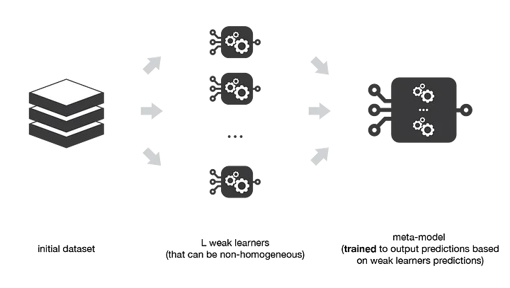
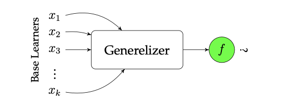
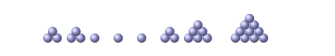
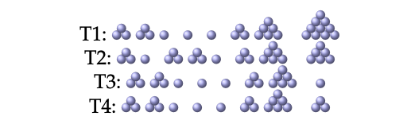
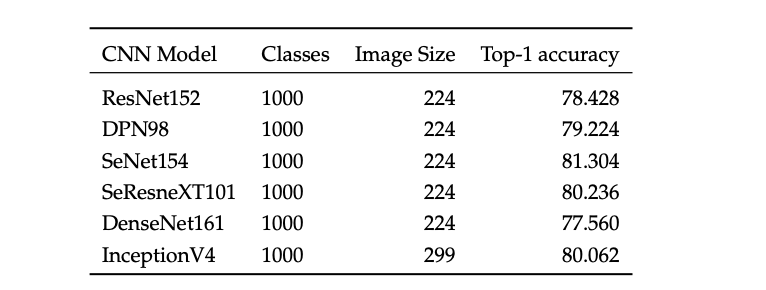
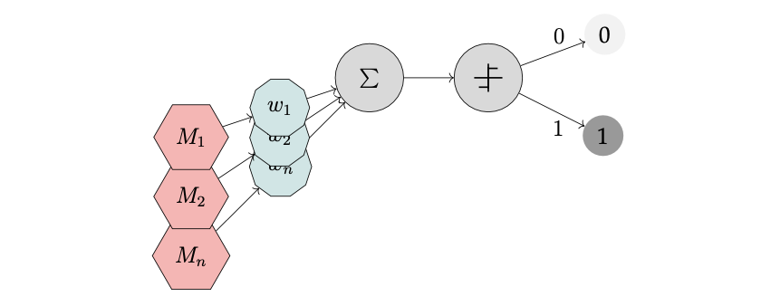
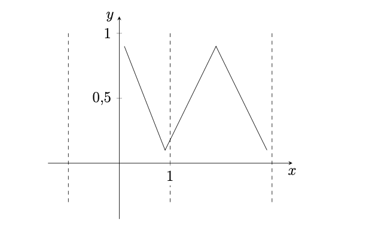

# Data Science Interview Questions And Answers

## Tree Based Methods in Machine Learning

Contents
----

- [Decision Trees](#decision-trees)
- [Bagging, Boosting, Stacking and Blending]()
- [Approaches for Combining Predictors]()
- [Monolithic and Heterogeneous Ensembling]()
- [Ensemble Learning]()
- [Snapshot Ensembling]()
- [Multi-model Ensembling]()
- [Learning-rate Schedules in Ensembling]()
- [Random Forest]()
- [Boosting based Algorithms]()

---

## Decision Trees

Q. What is a decision tree?

<details><summary><b>Answer</b></summary>

Decision Trees(DTs) are non-parametric supervised learning method which can be employed for Classification and Regressions tasks.

</details>

---

Q. What is the purpose of decision trees in machine learning?

<details><summary><b>Answer</b></summary>

The main purpose of DTs in machine learning is to model data by learning simple decision rules inferred from the attributes of the datasets. A decision tree can be seen as piecewise constant approximation.

</details>

---

Q. How is a decision tree built?

<details><summary><b>Answer</b></summary>

The main purpose of DTs in machine learning is to model data by learning simple decision rules inferred from the attributes of the datasets. A decision tree can be seen as piecewise constant approximation.

</details>

---

Q. What is over-fitting in decision trees, and how can it be prevented?

<details><summary><b>Answer</b></summary>

Over-fitting in decision trees occurs when a model is too complex, capturing noise in the data rather than representing the underlying relationship. 

Different ways of preventing over-fitting:

1. **Tree Pruning**: Reduce the size of the tree after it has been created by removing sections that provide little power in predicting the target variable.

2. **Setting Maximum Depth**: Limit the maximum depth of the tree during the model building phase to prevent the tree from becoming excessively deep and overfitting.

3. **Minimum Samples Split**: Specify the minimum number of samples required to split a node, ensuring that splits that occur do not respond to noise/variance in the data alone.

4. **Minimum Samples Leaf**: Define the minimum number of samples a leaf node must have. This prevents the model from creating leaves that represent outliers or anomalies in the dataset.

5. **Feature Selection**: Limit the number of features used for making decisions. Use those that are most predictive to avoid noise and complexity in the model.

6. **Using Ensemble Methods**: Implement techniques like bagging (Bootstrap Aggregating) and boosting to construct multiple models and average their predictions to improve performance and reduce overfitting.

7. **Cross-Validation**: Use cross-validation techniques to check the effectiveness of the model on unseen data, ensuring it generalizes well beyond the training dataset.

</details>

---

Q. What are some common impurity measures used in decision tree algorithms?

<details><summary><b>Answer</b></summary>

Impurity measures are used in decision tree algorithms to decide how a node should be split. 

Here are the most common ones:

1. **Gini Impurity**: Used primarily in classification problems to quantify how often a randomly chosen element would be incorrectly identified. It measures the frequency at which any element of the dataset will be mislabeled when it is randomly labeled according to the distribution of labels in the dataset.

2. **Entropy**: Another measure for classification that quantifies the amount of uncertainty or randomness in the data. It's used to calculate the information gain, representing the effectiveness of a feature in classifying the training data.

3. **Classification Error**: A simpler and less sensitive measure compared to Gini impurity and entropy. It is the proportion of the training instances of the most common class in the node.

4. **Mean Squared Error (MSE)**: Used in regression problems. It measures the average of the squares of the errors—that is, the average squared difference between the observed actual outcomes and the outcomes predicted by the model.

5. **Mean Absolute Error (MAE)**: Another criterion for regression that measures the average magnitude of the errors in a set of predictions, without considering their direction (i.e., it takes the average over the absolute values of the errors).

</details>

---

Q. List down pros and cons of different splitting criteria?

<details><summary><b>Answer</b></summary>

1. Gini Impurity
- **Pros**:
  - Fast to compute as it doesn't involve logarithmic calculations, making it computationally efficient.
  - Tends to isolate the most frequent class by itself in one of the groups after the split, which can be advantageous for imbalanced datasets.
  - Performs well in practice for binary and multi-class classification problems.
- **Cons**:
  - Can be biased towards multi-class splits; hence it may not always produce balanced binary splits.
  - Less sensitive to changes in class probabilities compared to Entropy, which can be a drawback when dealing with more nuanced class distributions.

2. Entropy (Information Gain)
- **Pros**:
  - Provides a very clear measure of the effectiveness of an attribute in classifying the training data, as it directly measures the purity of the class distribution.
  - Sensitive to changes in the probability distribution of the classes, making it effective for datasets with multiple classes.
- **Cons**:
  - More computationally intensive due to the logarithmic calculations, which can be a factor in very large datasets.
  - Like Gini, can be biased towards splits that result in a larger number of distinct outcomes (multi-class splits).

3. Classification Error
- **Pros**:
  - Very simple and quick to calculate, requiring minimal computational resources.
  - Useful for giving a rough estimate of impurity, and sometimes used in educational contexts to explain the concept of impurity.
- **Cons**:
  - Least sensitive among the impurity measures, making it inappropriate for datasets where nuanced changes in class distributions are critical.
  - Often leads to poorer decision boundaries, as it doesn’t consider the distribution of classes beyond the most frequent one.

4. Mean Squared Error (MSE) – for Regression
- **Pros**:
  - Directly related to the criterion used for measuring model performance (MSE), which makes it a natural choice for regression tasks.
  - Punishes larger errors more than smaller ones, which can help in focusing the model on larger deviations.
- **Cons**:
  - Can be overly sensitive to outliers, as squaring the errors amplifies the effect of large residuals.
  - Not suitable for classification tasks.

5. Mean Absolute Error (MAE) – for Regression
- **Pros**:
  - Less sensitive to outliers compared to MSE, providing a more robust criterion in the presence of anomalous data.
  - Directly interpretable as the average error magnitude.
- **Cons**:
  - Like MSE, it’s not applicable to classification tasks.
  - Often more challenging to optimize because it involves absolute values, which can complicate the gradient computations in some algorithms.

</details>

---

Q. What is pruning in decision trees?

<details><summary><b>Answer</b></summary>

Pruning in decision trees is a technique used to reduce the size of a decision tree after it has been built. This process helps in combating overfitting, which occurs when a model is too complex and captures noise in the data rather than the underlying pattern. 

There are two main types of pruning:

- **Pre-Pruning (Early Stopping)**: Stop the tree from growing when the information gain becomes minimal or when reaching a predefined depth or minimum node size.
- **Post-Pruning**: After fully growing the tree, systematically remove nodes from the tree. This is done by replacing a node or a subtree with a leaf node, and assigning it the most common class among its samples or by averaging/regressing outcomes.

</details>

---

Q. Can decision trees handle categorical data, and how is it done?

<details><summary><b>Answer</b></summary>

Yes, decision trees can handle categorical data effectively. Here's how it is done:

1. **Binary Splitting**: For binary categorical variables, the tree directly splits data into two groups based on the presence or absence of a feature.

2. **Multi-way Splitting**: For multi-category variables, decision trees can perform multi-way splits, dividing the data into as many branches as there are categories. This approach is particularly common in algorithms like C4.5 and CART, though CART typically uses binary splits by dividing categories into two super-groups.

3. **Label Encoding**: Categorical variables can be transformed into numerical labels. This approach is simpler but can impose an ordinal relationship that doesn't exist, influencing the model inaccurately.

4. **One-Hot Encoding**: This involves creating a new binary variable for each category in the original variable. Each observation is encoded with 0s and 1s, indicating the absence or presence of a feature. This method is effective as it avoids arbitrary numerical relationships but increases the dimensionality of the data.

5. **Handling within Node Impurity Calculation**: When categorical data is used, impurity measures like Gini impurity or entropy calculate splits based on the distribution of the target variable across the categories.

</details>

---

Q. What are some advantages of decision trees in machine learning?

<details><summary><b>Answer</b></summary>

1. Simple to understand, interpret and visualize.
2. Requires little data preparations like normalization. Some tree based methods even provide support missing values.
3. The cost of predictions is logarithmic in the number of data points used in training the model.
4. Able to handle multi-output problems.
5. Can convert to rules and can handles noisy data

</details>

---

Q. What are some limitations of decision trees?

<details><summary><b>Answer</b></summary>

1. More prone to overfitting the underlying pattern if they grow in uncontrollable manner.
2. DTs can be unstable sometimes like small deviation in data might result in completely different tree all together.
3. Not good at extrapolation since the decision boundaries are piecewise constant approximation.
4. Does not perform well incase of data imbalance scenarios.
5. Non-incremental (i.e., batch method)
6. Requires fixed-length feature vectors

</details>

---

Q. What is ID3, and how does it work?

<details><summary><b>Answer</b></summary>
ID3 stands for Iterative Dichotomiser 3 and It means the model iteratively(repeatedly) dichotomizes(divides) features into two or more groups at each step.

It uses top down greedy approach ti build a decision tree and was invented by Ross Quinlan. Top-down means we start building the tree from the top and greedy approach means that at each iteration we select the best feature at the preset moment to create a node.

</details>

---


Q. What is information gain in ID3?

<details><summary><b>Answer</b></summary>

Information Gain calculates the reduction in the entropy and measures how good a given attribute split the target classes. The feature with highest information gain is the best one.

Information Gain for a feature column A is calculated as:

$$
IG(S, A) = Entropy(S) - \sum{((|S_v|/|S|)*Entropy(S_v))}
$$

where $S_v$ is the set of rows in $S$ for which the feature column $A$ has value $v$, $|Sᵥ|$ is the number of rows in $S_v$ and likewise $|S|$ is the number of rows in $S$.

</details>

---

Q. What are the steps involved in building a decision tree with ID3?

<details><summary><b>Answer</b></summary>

The following steps involve in building a ID3 trees:
1. Calculate the Information Gain for each attribute.
2. Split the dataset $S$ into subsets with the attribute having highest IG.
3. Make a decision tree node using the feature with maximum Information Gain.
4. If all the rows belong to same class, make the current node as leaf node with the class as it label.
5. Repeat for the remaining feature until we run out of all features or the decision tree has all leaf nodes.

</details>

---

Q. What are the limitations of ID3?

<details><summary><b>Answer</b></summary>

Limitations of ID3:

- ID3 follows greedy algorithm while building the decision trees and hence can provide suboptimal solutions sometimes.
- It can overfit the train data. Smaller decision trees should be preferred over larger decision trees.
- ID3 is mainly good with nominal features so continuous features can be only used after converting them to nominal bins.

</details>

---

Q. How does ID3 handle over-fitting?

<details><summary><b>Answer</b></summary>

It handles overfitting cases using following methods:

1. Stopping Criteria: The algorithm stops growing the tree when all instances in a node belong to the same class or when all the attributes have been used. This can prevent the tree from becoming excessively deep and complex when there are no clear distinctions left to make among the instances.

</details>

---

Q. What is the difference between ID3 and C4.5?

<details><summary><b>Answer</b></summary>

| Feature                         | ID3                                                        | C4.5                                                         |
|---------------------------------|------------------------------------------------------------|--------------------------------------------------------------|
| **Splitting Criteria**          | Uses information gain                                      | Uses gain ratio as splitting criteria                        |
| **Handling of Numeric Attributes** | Cannot handle numeric attributes directly                | Can handle numeric attributes                                |
| **Pruning Method**              | Generally does not use pruning                             | Uses error-based pruning after the growing phase             |
| **Handling of Missing Values**  | Typically does not handle missing values                   | Allows attribute values to be missing (marked as ?)          |
| **Handling of Continuous Attributes** | Does not handle continuous attributes                | Handles continuous attributes by binary splitting. Searches for the best threshold that maximizes the gain ratio. |
| **Branching and Pruning**       | Simple growth with no specific branching procedure         | Implements a pruning procedure to remove branches that do not contribute to accuracy, replacing them with leaf nodes |
| **Performance on Small Datasets** | Not specifically mentioned                               | Performs better than J48 and C5.0 on small datasets according to comparative studies |

</details>

---

Q. Can you explain how the concept of entropy is used in ID3?

<details><summary><b>Answer</b></summary>

Here's how entropy is used in the ID3 algorithm:

- **Dataset Splitting**: ID3 uses entropy to decide which attribute to split the data on at each step in the tree. The goal is to find the attribute that results in the highest gain in information or the largest decrease in entropy. This is done by calculating the entropy before and after the dataset is split on each attribute.

- **Information Gain**: The information gain for an attribute is calculated as the difference between the entropy of the parent dataset and the weighted sum of the entropies of the subsets that result from splitting the dataset on the attribute. The formula for information gain $\( IG \)$ is:
  $$
  \[
  IG(S, A) = H(S) - \sum_{v \in Values(A)} \frac{|S_v|}{|S|} H(S_v)
  \]
  $$
  Here, \( A \) is the attribute being considered for splitting, \( Values(A) \) are the different values that \( A \) can take, \( S_v \) is the subset of \( S \) for which \( A \) has value \( v \), and \( |S_v|/|S| \) is the proportion of the number of elements in \( S_v \) to the number of elements in \( S \).

- **Selecting the Best Attribute**: The attribute with the highest information gain is chosen for the split because it provides the most significant reduction in entropy, indicating a more definitive classification rule at that node of the tree.

- **Recursive Splitting**: This process is repeated recursively for each new subset, choosing the attribute that yields the highest information gain at each stage until a stopping criterion is met (like when no more significant information gain is possible or the subset at a node all belongs to the same class).


</details>

Q. What are different criteria along which the implementation of DTs varies?

<details><summary><b>Answer</b></summary>

- Criteria for node splitting (e.g., methods for calculating "variance")
- Capability to develop both regression models (for continuous variables like scores) and classification models (for discrete variables like class labels)
- Strategies to prevent or minimize overfitting
- Ability to process datasets with missing values

</details>

Q. What is the difference between CART and ID3/C4.5?

<details><summary><b>Answer</b></summary>

| **Aspect**           | **CART (Classification and Regression Trees)**                        | **ID3 (Iterative Dichotomiser 3)**                                  | **C4.5**                                       |
|----------------------|---------------------------------------------------------------------|---------------------------------------------------------------------|------------------------------------------------|
| **Type of Trees**    | Can create both classification and regression trees.                | Primarily used for creating classification trees.                  | Used for creating classification trees.         |
| **Splitting Criteria**| Uses Gini impurity or entropy for classification; variance reduction for regression.| Uses information gain (based on entropy).                          | Uses gain ratio (a normalization of information gain). |
| **Handling Continuous and Categorical Data** | Handles both continuous and categorical variables directly.        | Primarily handles categorical variables; continuous data must be discretized prior to building the tree.| Handles both but often requires discretization of continuous variables. |
| **Pruning**          | Uses cost-complexity pruning to avoid overfitting, which is a post-pruning technique. | Does not include a pruning step, leading to potentially over-fitted trees. | Uses post-pruning methods to simplify the tree after it is fully grown. |
| **Handling Missing Values** | Has mechanisms to handle missing values directly during tree construction. | Does not handle missing values inherently; preprocessing is required. | Has improved strategies to deal with missing values compared to ID3. |

</details>

---

Q. How does CART handle over-fitting?

<details><summary><b>Answer</b></summary>

CART (Classification and Regression Trees) handles overfitting primarily through two techniques: **pruning** and **setting constraints during the tree building process**.

1. **Pruning:**
   Pruning reduces the size of a decision tree by removing parts of the tree that provide little power in classifying instances. This process helps in reducing the complexity of the final model, thereby minimizing overfitting. There are two types of pruning:
   - **Pre-pruning (early stopping rule):** This method stops the tree from growing when further splitting is statistically unlikely to add value. This could be determined by setting a minimum number on the gain of a node’s split, or restricting the depth of the tree.
   - **Post-pruning:** This involves building the tree first and then removing non-significant branches. A common approach is to use cost-complexity pruning where a penalty is applied for the number of parameters (or the depth) of the tree, aiming to find a good trade-off between the tree’s complexity and its accuracy on the training set.

2. **Setting Constraints:**
   By setting constraints during the building of the tree, you can also control overfitting:
   - **Maximum depth of the tree:** Limiting the depth prevents the model from creating highly complex trees that fit all the details and noise in the training data.
   - **Minimum samples split:** This constraint specifies the minimum number of samples a node must have before it can be split. Higher values prevent the model from learning overly fine distinctions.
   - **Minimum samples leaf:** This parameter ensures that each leaf node has a minimum number of samples. This helps in creating more generalized regions in the leaf nodes rather than very specific rules that might apply only to the training data.
   - **Maximum leaf nodes:** Setting a maximum number of leaf nodes helps in controlling the size of the tree.

</details>

---

Q. Mark all the approaches which can be utilized to boost a single model performance:
  1. Majority Voting
  2. Using K-identical base-learning algorithms
  3. Using K-different base-learning algorithms 
  4. Using K-different data-folds
  5. Using K-different random number seeds 
  6. A combination of all the above approaches

<details><summary><b>Answer</b></summary>
All options are correct.
</details>

---

How does stacking differ from other ensemble methods like bagging and boosting?

<details><summary><b>Answer</b></summary>

Stacking mainly differ from bagging and boosting on two points:

1. **Heterogeneous weak learners**: Stacking often combine considers heterogenous week learners(different learning algorithms are combined) whereas bagging and boosting consider mainly homogenous weak learners.
2. **Meta model** - Stacking learn to combine the base model using a meta model where as bagging or boosting combine weak learners following deterministic algorithms. 

</details>

---

Q. What are the key components of a stacking ensemble?

<details><summary><b>Answer</b></summary>

The main components involved in stacking are as follows:

1. **Base Learners (Level-0 Models)**:
   - These are diverse machine learning models that are trained independently on the same dataset.
   - The variety in these models can include different algorithms (e.g., decision trees, neural networks, SVMs) or variations of the same algorithm with different parameter settings.

2. **Meta Learner (Level-1 Model)**:
   - After the base models are trained, the meta-model is trained on the outputs of the base learners.
   - Its role is to learn how best to combine the predictions of the base models to make a final prediction.
   - The inputs to the meta-model are typically the predictions of the base models, and the output is the final prediction.
</details>

---

Q. How do you prevent over-fitting in a stacked ensemble?

<details><summary><b>Answer</b></summary>

Techniques to reduce overfitting in a stacked ensemble:

1. **Use Diverse Base Learners**: Incorporate a variety of models with different underlying algorithms to ensure diversity in the predictions, reducing the risk of all models overfitting in the same way.

2. **Cross-Validation**: Employ robust cross-validation techniques like k-fold cross-validation for both base learners and the meta-learner to validate model performance effectively and minimize data leakage.

3. **Simple Meta-Learner**: Opt for a simpler model as the meta-learner to avoid learning noise and complex patterns that do not generalize well to unseen data.

4. **Regularization Techniques**: Apply regularization methods to the training of the meta-learner and, if applicable, to base learners to penalize model complexity and discourage overfitting.

</details>

---

Q. Can you explain the process of creating a stacking ensemble?

<details><summary><b>Answer</b></summary>

In order to build the stacking ensemble we need to define two things:

- the L learners we want to fit and,
- the meta-model that combines them.

So, assume that we want to fit a stacking ensemble composed of L weak learners. Then we have to follow the steps thereafter:

- split the training data in two folds
- choose L weak learners and fit them to data of the first fold
- for each of the L weak learners, make predictions for observations in the second fold
- fit the meta-model on the second fold, using predictions made by the weak learners as inputs and output as the target values.

<table align='center'>
  <tr>
    <td align="center">
      
    </td>
  </tr>
</table>

</details>

---

Q. What is the advantage of stacking over using a single powerful model?

<details><summary><b>Answer</b></summary>

The advantage of using a stacking ensemble over a single powerful model primarily revolves around improved model accuracy and robustness. 

Here are the key benefits:

1. **Increased Model Accuracy**: Stacking combines multiple models, which can lead to better predictive performance than any individual model.

2. **Reduction of Model Variance**: Each model in the ensemble may have different variances based on their underlying algorithms. Stacking can reduce the overall variance without increasing bias significantly, leading to a more stable model on unseen data.

3. **Handling of Different Types of Data**: Different models have different strengths depending on the nature of the data. For instance, linear models might perform well on linearly separable data, while tree-based models might excel with hierarchical or non-linear decision boundaries. Stacking allows the ensemble to handle a broader range of data characteristics effectively.

4. **Mitigation of Overfitting**: While any powerful model can potentially overfit, stacking uses a meta-learner to effectively combine the predictions of the base learners. This setup can mitigate overfitting as the meta-learner learns to optimize the blend of base model outputs, focusing on generalization rather than fitting to noise.

</details>

---

Q. What are some popular algorithms used as base models in stacking ensembles?

<details><summary><b>Answer</b></summary>

In stacking ensembles, a variety of algorithms can be used as base models to ensure diversity and robustness.

- Decision Trees
- Neural Networks
- Support Vector Machines (SVM)
- Random Forests etc.

</details>

---

Are there any limitations or challenges associated with stacking ensembles?

<details><summary><b>Answer</b></summary>

Yes, stacking ensembles come with several limitations and challenges that can affect their practical application and performance.

1. **Increased Complexity**: Stacking involves multiple layers of models, which can significantly increase the complexity of the overall modeling process.
2. **Computational Cost**: Training multiple base models and a meta-learner requires more computational resources and time.
3. **Risk of Overfitting**: While stacking is designed to reduce overfitting by blending predictions, the meta-learner itself can overfit the predictions of the base models, especially if the base models are highly correlated or if the meta-learner is too complex.
4. **Data Requirements**: Stacking often requires a substantial amount of data to effectively train both the base models and the meta-learner.
5. **Difficulty in Tuning**: The process of selecting the right combination of base models and tuning their hyperparameters, along with those of the meta-learner, can be intricate and time-consuming.
6. **Interpretability Issues**: With multiple layers of predictions being combined, it can be challenging to understand how decisions are being made within the ensemble, which reduces the model's transparency.

</details>

---

Q. When should you consider using stacking in a machine learning project?

<details><summary><b>Answer</b></summary>


</details>

---

Q. How does blending work?

<details><summary><b>Answer</b></summary>

You can think of blending as a type of stacking, where the meta-model is trained on predictions made by the base model on the hold-out validation set.

You can consider the blending process to be:

- Split the data into a test and validation set
- Model(s) are fit on the training set
- Make predictions on the validation and test set
- Use the validation set and its predictions to build a final model
- Make final predictions using this model.

</details>

---

Q. Can you explain the difference between stacking and blending?

<details><summary><b>Answer</b></summary>
The difference between stacking and blending is that Stacking uses out-of-fold predictions for the train set of the next layer (i.e meta-model), and Blending uses a validation set (let’s say, 10-15% of the training set) to train the next layer. Blending is simpler than stacking and prevents leakage of information in the model.
</details>

---

Q. What is the purpose of a meta-model in blending?

<details><summary><b>Answer</b></summary>

</details>

---

Q. What are the advantages of blending?

<details><summary><b>Answer</b></summary>

</details>

---

Q. What are the common algorithms used for blending?

<details><summary><b>Answer</b></summary>

</details>

---

Q. What precautions should you take when implementing blending?

<details><summary><b>Answer</b></summary>

</details>

---

Q. Can you explain the difference between bagging, boosting, and blending?

<details><summary><b>Answer</b></summary>

</details>

---

Q. When should you consider using blending in a machine learning project?

<details><summary><b>Answer</b></summary>

</details>

---

Q. What challenges can arise when implementing blending in practice?

<details><summary><b>Answer</b></summary>

</details>

---

Q. An argument erupts between two senior data-scientists regarding the choice of an approach for training of a very small medical corpus. One suggest that bagging is superior while the other suggests stacking. Which technique, bagging or stacking, in your opinion is superior? Explain in detail.
  1. Stacking since each classier is trained on all of the available data.
  2. Bagging since we can combine as many classifiers as we want by training each on a different sub-set of the training corpus.

<details><summary><b>Answer</b></summary>

The correct choice would be stacking. Since data size is small, we would most likely prefer training our models over full dataset.

</details>

---

Q. Complete the sentence: A random forest is a type of a decision tree which utilizes `[bagging/boosting]`

<details><summary><b>Answer</b></summary>

A random forest is a type of a decision tree which utilizes **bagging**

</details>


---

Q. The algorithm depicted in Fig. 6.1 was found in an old book about ensembling. Name the
algorithm.

```
Algorithm 1: Algo 1
```
**Data:** A set of training data, Q with N elements has been established 

while K times do

        Create a random subset of N ′ data by sampling from Q containing the N samples;
        N′ < N;
        Execute algorithm Algo 2; 
        Return all N′ back to Q

```
Algorithm 2: Algo 2
```
Choose a learner $h_m$; 

while K times do

        Pick a training set and train with $h_m$;

<details><summary><b>Answer</b></summary>

The given algorithm is a typical bagging method.

</details>

---

Q. What is a Random Forest, and how does it work?

<details><summary><b>Answer</b></summary>


</details>

---

Q. How do you choose between different types of decision tree algorithms (e.g., CART, ID3, C4.5, Random Forest)?

<details><summary><b>Answer</b></summary>


</details>

---

Q. What is the difference between a decision tree and a Random Forest?

<details><summary><b>Answer</b></summary>


</details>

---


Q. Why is it called a "Random" Forest?

<details><summary><b>Answer</b></summary>


</details>

---

Q. What is the purpose of feature bagging in a Random Forest?

<details><summary><b>Answer</b></summary>


</details>

---

Q. How does a Random Forest handle missing data?

<details><summary><b>Answer</b></summary>


</details>

---

Q. What are the advantages of using Random Forests?

<details><summary><b>Answer</b></summary>


</details>

---

Q. What is out-of-bag error, and how is it used in Random Forests?

<details><summary><b>Answer</b></summary>

Out-of-Bag estimation is 


</details>

---

Q. What is the issue with Gini impurity?

<details><summary><b>Answer</b></summary>


</details>

---

Q. Can you explain the concept of feature importance in a Random Forest?

<details><summary><b>Answer</b></summary>

Feature importance in a Random Forest is a measure of the impact or relevance of each feature (or variable) in making predictions. It helps identify which features contribute most to the model's decision-making process.

There are primarily two ways to compute feature importance in Random Forests:

1. Mean decrease impurity

We can obtain overall summary of the importance of each predictor using the RSS(for bagging regression trees) or Gini index(for bagging classification trees). In case of bagging regression trees, we can record total amount that the RSS is decreased due to splits over a given predictor, averaged over all $B$ trees. A large value indicates an important predictor. Similarly, in the context of bagging classification trees, we can add up the total amount that the Gini index is decreased by splits over a given predictor, averaged over all $B$ trees.

2. Mean Decrease in Accuracy(Permutation Importance)

Permutation Importance is based on the idea of measuring the impact on model accuracy when the values of a feature are randomly shuffled. The underlying assumption is that if a feature is important, shuffling its values should lead to a significant drop in the model's accuracy, since the relationship between that feature and the target variable has been disrupted. Conversely, if shuffling a feature does not affect the accuracy, it indicates that the feature is less important or irrelevant to the model’s predictions.


</details>

---

Q. What are some potential drawbacks of using Random Forests?

<details><summary><b>Answer</b></summary>


</details>

---

Q. When would you choose a Random Forest over other machine learning algorithms?

<details><summary><b>Answer</b></summary>


</details>

---

Below Fig depicts a part of a specific ensembling approach applied to the models $x1, x2...xk$.
In your opinion, which approach is being utilized?
  <table align='center'>
  <tr>
  <td align="center">
      
  </td>
  </tr>
  <tr>
  <td align="center"> A specific ensembling approach </td>
  </tr>
  </table>

- (i) Bootstrap aggregation 

- (ii) Snapshot ensembling

- (iii) Stacking

- (iv) Classical committee machines

<details><summary><b>Answer</b></summary>

The approach which is depicted is the first phase of stacking. In stacking, we first (phase
0) predict using several base learners and then use a generalizer (phase 1) that learns on top of the base learners predictions.

</details>

---

Q. Consider training corpus consisting of balls which are glued together as triangles, each
of which has either $1, 3, 6, 10, 15, 21, 28, 36, \hspace{0.1em}\text{or} \hspace{0.1em} 45 \hspace{0.5em} \text{balls}$.

  1. We draw several samples from this corpus as presented in Fig.6.3 where in each sample is equiprobable. What type of sampling approach is being utilized here?

      <table align='center'>
      <tr>
      <td align="center">
          
      </td>
      </tr>
      <tr>
      <td align="center"> Sampling approaches</td>
      </tr>
      </table>

      - (i) Sampling without replacement 

      - (ii) Sampling with replacement

  2. Two samples are drawn one after the other. In which of the following cases is the covariance between the two samples equals zero?
    - (i) Sampling without replacement 
    - (ii) Sampling with replacement

  3. During training, the corpus sampled with replacement and is divided into several folds as presented in Fig. 6.4.
  <table align='center'>
  <tr>
  <td align="center">
      
  </td>
  </tr>
  <tr>
  <td align="center"> Sampling approaches</td>
  </tr>
  </table>

  If 10 balls glued together is a sample event that we know is hard to correctly classify, then it is impossible that we are using:

  - (i) Bagging 

  - (ii) Boosting

<details><summary><b>Answer</b></summary>

1. Sampling with replacement

2. Sampling without replacement

3. This may be mostly a result of bagging, since in boosting we would have expected miss-correctly classified observations to repeatedly appear in subsequent samples.

</details>

---

Q. There are several methods by which the outputs of base classifiers can be combined to yield a single prediction. Below code snippet depicts part of a specific ensembling approach applied to several CNN model predictions for a labelled data-set. Which approach is being utilized?
  1. Majority voting for binary classification
  2. Weighted majority voting for binary classification
  3. Majority voting for class probabilities (iv) Weighted majority class probabilities
  4. An algebraic weighted average for class probabilities
  5. An adaptive weighted majority voting for combining multiple classifiers

  ```python

  l=[]
  for i,f in enumerate(filelist):
      temp = pd.read_csv(f)
      l.append(temp)
  arr = np.stack(l,axis=-1)
  avg_results = pd.DataFrame(arr[:,:-1,:].mean(axis=2))
  avg_results['image'] = l[0]['image']
  avg_results.columns = l[0].columns

  ```

<details><summary><b>Answer</b></summary>

An Algebraic weighted average for class probabilities.

</details>

---

Q. Read the paper **Neural Network Ensembles** and then **complete the sentence**: If the average error rate for a specific instance in the corpus is less than [...]% and the respective classifiers in the ensemble produce independent [...], then when the number of classifiers combined approaches infinity, the expected error can be diminished to zero.

<details><summary><b>Answer</b></summary>

If the average error rate for a specific instance in the corpus is less than `[...]`% and the respective classifiers in the ensemble produce independent `[...]`, then when the number of classifiers combined approaches infinity, the expected error can be diminished to zero.

</details>

---

Q. **True or False**: A perfect ensemble comprises of highly correct classifiers that differ as much as possible.

<details><summary><b>Answer</b></summary>

**True**, A perfect ensemble model consists of classifiers that achieve high accuracy and exhibit significant diversity. High accuracy ensures each classifier is competent on its own, while diversity between the classifiers means they make different types of errors, allowing the ensemble to benefit from error reduction when aggregating their prediction.

</details>

---

Q. How does bagging work?

<details><summary><b>Answer</b></summary>

</details>

---

Q. What are the advantages of bagging over decision trees?

<details><summary><b>Answer</b></summary>


</details>

---

Q. How does bagging reduces the variance in decision trees?

<details><summary><b>Answer</b></summary>

</details>

---

Q. What are some popular algorithms that use bagging?

<details><summary><b>Answer</b></summary>


</details>

---

Q. What's the difference between bagging and boosting?

<details><summary><b>Answer</b></summary>


</details>

---

Q. How does bagging handle imbalanced datasets?

<details><summary><b>Answer</b></summary>


</details>


---

Q. Can bagging be used with any base model?

<details><summary><b>Answer</b></summary>


</details>


---

Q. What are some potential drawbacks of bagging?

<details><summary><b>Answer</b></summary>


</details>


---

Q. What is the trade-off between bagging and variance?

<details><summary><b>Answer</b></summary>


</details>


---

Q. **True or false**: In bagging, we re-sample the training corpus with replacement and there-
fore this may lead to some instances being represented numerous times while other instances not to be represented at all.

<details><summary><b>Answer</b></summary>

**True**, In a bagging approach, we first randomly draw (with replacement), K examples where K is the size of the original training corpus therefore leading to an imbalanced representation of the instances.

</details>

---

Bagging and boosting are two popular ensembling methods. Random forest is a bagging example while XGBoost is a boosting example.
  1. What are some of the fundamental differences between bagging and boosting algorithms?
  1. How are they used in deep learning?

<details><summary><b>Answer</b></summary>


</details>


---

Q. How does boosting work?

<details><summary><b>Answer</b></summary>


</details>


---

Q. What are some popular boosting algorithms?

<details><summary><b>Answer</b></summary>


</details>


---

Q. What is the key idea behind AdaBoost?

<details><summary><b>Answer</b></summary>


</details>


---

Q. What is overfitting, and how does boosting address it?

<details><summary><b>Answer</b></summary>


</details>


---

Q. Can boosting models handle noisy data?

<details><summary><b>Answer</b></summary>


</details>


---

Q. What are the hyperparameters in boosting algorithms?

<details><summary><b>Answer</b></summary>


</details>


---

Q. What is the key idea behind XGBoost?

<details><summary><b>Answer</b></summary>


</details>


---

Q. What are some advantages of using XGBoost?

<details><summary><b>Answer</b></summary>


</details>


---

Q. How does LightGBM differ from traditional gradient boosting algorithms?

<details><summary><b>Answer</b></summary>


</details>


---

Q. What is the trade-off between LightGBM's speed and memory consumption?

<details><summary><b>Answer</b></summary>


</details>


---

Q. How does CatBoost handle categorical features?

<details><summary><b>Answer</b></summary>


</details>


---

Q. What are some benefits of using CatBoost for gradient boosting?

<details><summary><b>Answer</b></summary>


</details>


---
Q. 
1. **True or false**: Training an ensemble of a single monolithic architecture results in lower model diversity and possibly decreased model prediction accuracy.
2. **True or false**: The generalization accuracy of an ensemble increases with the number of well-trained models it consists of.
3. **True or false**: Bootstrap aggregation (or bagging), refers to a process wherein a CNN ensemble is being trained using a random subset of the training corpus.
4. **True or false**: Bagging assumes that if the single predictor shave independent errors, then a majority vote of their outputs should be better than the individual predictions.

<details><summary><b>Answer</b></summary>

1. **True** Due to their lack of diversity, an ensemble of monolithic architectures tends to
perform worse than an heterogeneous ensemble.
2. **True**, The generalization accuracy of an ensemble typically increases as the number of well-trained models it includes grows, provided that these models are sufficiently diverse.
3. **True**
4. **True**, The total error decreases with the addition of predictors to the ensemble.

</details>

---

Q. Refer to the papers: <a href='https://arxiv.org/pdf/1506.02142.pdf'>Dropout as a Bayesian Approximation</a> and <a href='https://arxiv.org/pdf/1906.02530.pdf'>Can You TrustYour Model’s Uncertainty?</a> and answer the following question: 
  1. Do deep ensembles achieve a better performance on out-of-distribution uncertainty benchmarks compared with Monte-Carlo (MC)-dropout?

<details><summary><b>Answer</b></summary>

Yes, they do

</details>

---
Q. 
1. In a transfer-learning experiment conducted by a researcher, a number of ImageNet-pretrained CNN classifiers, selected from Table 6.1 are trained on five different folds drawn from the same corpus. Their outputs are fused together producing a composite machine. Ensembles of these convolutional neural networks architectures have been extensively studies an evaluated in various ensembling approaches. Is it likely that the composite machine will produce a prediction with higher accuracy than that of any individual classifier? Explain why.

<table align='center'>
<tr>
<td align="center">
    
</td>
</tr>
<tr>
<td align="center"> ImageNet-pretrained CNNs. Ensembles of these CNN architectures have been extensively studies and evaluated in various ensembling approaches </td>
</tr>
</table>

2. **True or False**: In a classification task, the result of ensembling is always superior.

3. **True or False**: In an ensemble, we want differently trained models converge to different local minima.

<details><summary><b>Answer</b></summary>

1. Yes, it is very likely, especially if their errors are independent.
2. True It may be proven that ensembles of models perform at least as good as each of the ensemble members it consists of.
3. True Different local minima add to the diversification of the models.

</details>

---

In committee machines, mark all the combiners that do not make direct use of the input:
  1. A mixture of experts 
  2. Bagging
  3. Ensemble averaging 
  4. Boosting

<details><summary><b>Answer</b></summary>

Boosting is the only one that does not.

</details>

---

Q. **True or False**: Considering a binary classification problem $(y = 0\ or \ y = 1)$, ensemble averaging, wherein the outputs of individual models are linearly combined to produce a fused output is a form of a static committee machine.

<table align='center'>
<tr>
<td align="center">
    
</td>
</tr>
<tr>
<td align="center"> A typical binary classification problem </td>
</tr>
</table>

<details><summary><b>Answer</b></summary>

**False** By definition, static committee machines use only the output of the single predict-
ors.

</details>

---

Q. **True or false**: When using a single model, the risk of overfitting the data increases when
the number of adjustable parameters is large compared to cardinality (i.e., size of the set) of the training corpus.

<details><summary><b>Answer</b></summary>

**True** 

</details>

---

Q. **True or false**: If we have a committee of $K$ trained models and the errors are uncorrelated, then by averaging them the average error of a model is reduced by a factor of $K$.

<details><summary><b>Answer</b></summary>

**False** Though this may be theoretically true, in practice the errors are rarely uncorrelated
and therefore the actual error can not be reduced by a factor of K.

</details>

---
Q. 
1. Define ensemble learning in the context of machine learning.
2. Provide examples of ensemble methods in classical machine-learning.
3. **True or false**: Ensemble methods usually have stronger generalization ability.
4. Complete the sentence: Bagging is `variance/bias` reduction scheme while boosting reduced `variance/bias`.

<details><summary><b>Answer</b></summary>

1. An ensemble method is an approach that combines many simple building blocks models in order to obtain a single and potentially very powerful model. These simple building block models are known as weak learners, since they may lead to mediocre predictions on their own.
2. In classical machine learning Ensemble methods usually refer to bagging, boosting and the linear combination of regression or classification models.
3. True The stronger generalization ability stems from the voting power of diverse models which are joined together.
4. Bagging is variance reduction scheme while boosting reduced bias.

</details>

---

Q. Your colleague, a well-known expert in ensembling methods, writes the following pseudo-code in Python shown in Fig. 6.7 for the training of a neural network. This runs inside a standard loop in each training and validation step.

  ```python

  import torchvision.models as models ...
  models = ['resnext']
  for m in models: 
      train ...
      compute VAL loss ... 
      amend LR ...
      if (val_acc > 90.0):
          saveModel()

  ```
1. What type of ensembling can be used with this approach? Explain in detail.
2. What is the main advantage of snapshot ensembling? What are the disadvantages, if any?

<details><summary><b>Answer</b></summary>

1. Since only a single model ie being utilized, this type of ensembling is known as snap- shot ensembling. Using this approach, during the training of a neural network and in each epoch, a snapshot, e.g. the weights of a trained instance of a model (a PTH file in PyTorch nomenclature) are persisted into permanent storage whenever a certain performance metrics, such as accuracy or loss is being surpassed. Therefore the name “snapshot”; weights of the neural network are being snapshot at specific instances in time. After several such epochs the top-5 performing Snapshots which converged to local minima are combined as part of an ensemble to yield a single prediction.
2. Advantages: during a single training cycle, many model instances may be collected. Disadvantages: inherent lack of diversity by virtue of the fact that the same models is being repeatedly used.

</details>

---

Q. Assume further that your colleague amends the code as follows.

```python

  import torchvision.models as models
  import random
  import np
  ...
  models = ['resnext']
  for m in models:
      train ...
      compute loss ...
      amend LR ...
      manualSeed= draw a new random number
      random.seed(manualSeed)
      np.random.seed(manualSeed)
      torch.manual_seed(manualSeed)
      if (val_acc > 90.0):
          saveModel()

```
Explain in detail what would be the possible effects of adding `lines 10-13`.

<details><summary><b>Answer</b></summary>

Changing the random seed at each iteration/epoch, helps in introducing variation which
may contribute to diversifying the trained neural network models.

</details>

---

Q. 
1. Assume your colleague, a veteran in DL and an expert in ensembling methods writes the following Pseudo code shown in Fig. 6.9 for the training of several neural networks. This code snippet is executed inside a standard loop in each and every training/validation epoch. 

    ```python

    import torchvision.models as models 
    ...
    models = ['resnext','vgg','dense']
    for m in models: 
        train ...
        compute loss/acc 
        ... 
        if (val_acc > 90.0):
            saveModel()

    ```
    What type of ensembling is being utilized in this approach? Explain in detail.

2. Name one method by which NN models may be combined to yield a single prediction.

<details><summary><b>Answer</b></summary>

1. Multi-model ensembling.
2. Both averaging and majority voting.

</details>

---

Q. 
1. Referring to Below fig. which depicts a specific learning rate schedule, describe the basic notion behind its mechanism.

<table align='center'>
<tr>
<td align="center">
    
</td>
</tr>
<tr>
<td align="center"> A typical binary classification problem </td>
</tr>
</table>

2. Explain how cyclic learning rates can be effective for the training of convolutional neural networks such as the ones in the code snippet.

3. Explain how a cyclic cosine annealing schedule as proposed by Loshchilov [10] and [13] is used to converge to multiple local minima.


<details><summary><b>Answer</b></summary>

1. Capturing the best model of each training cycle allows to obtain multiple models settled on various local optima from cycle to cycle at the cost of training a single mode
2. The approach is based on the non-convex nature of neural networks and the ability to converge and escape from local minima using a specific schedule to adjust the learning rate during training.
3. Instead of monotonically decreasing the learning rate,this method lets the learning rate cyclically vary between reasonable boundary values.

</details>

---

Q. Two popular algorithms for winning Kaggle solutions are Light GBM and XGBoost. They are both gradient boosting algorithms.
  1. What is gradient boosting?
  1. What problems is gradient boosting good for?


<details><summary><b>Answer</b></summary>

In gradient boosting, the ensemble model we try to build is also a weighted sum of weak learners.

<table align='center'>
<tr>
<td align="center">
    
</td>
</tr>
<tr>
<td align="center"> GB governing equation </td>
</tr>
</table>

</details>