# Data Science Interview Questions And Answers

## Unsupervised Learning

Contents
---
- [General Concepts](#general-concepts)
- [Association Mining](#association-mining)
- [Clustering](#clustering)
- [Dimensionality Reduction](#dimensionality-reduction)
- [Recommendation Engines](#recommendation-engines)
- [Autoencoders](#autoencoders)

---

## General Concepts

Q. What is unsupervised learning?

<b>Answer</b>

It is a set of statistical tools intended for the setting in which we have only a set of features $X1, X2, . . . , Xp$ measured on $n$ observations. We are not interested in prediction, because we do not have an associated response variable $Y$. Rather, the goal is to discover interesting patterns in the measurements on $X1, X2, . . . , X_p$

---

Q. Name some scenarios where we can use unsupervised learning algorithms?

<b>Answer</b>

We can use unsupervised learning in following use-cases:

- Anomaly detections
- Dimensionality reduction
- Clustering

---

## Association Mining

---

## Clustering

Q. What do you mean by clustering?

<b>Answer</b>

Clustering refers to a very broad set of techniques for finding subgroups, or clusters, in a data set. When we cluster the observations of a data set, we seek to partition them into distinct groups so that the observations within each group are quite similar to each other, while observations in different groups are quite different from each other.

---

Q. What is the main difference between clustering and PCA?

<b>Answer</b>

Although both clustering and PCA seeks to simplify the data via a small number of summaries, but their mechanism is different:

- PCA looks to find a low dimensional representation of the observations that explain a good fraction of the variance.
- Clustering looks to find homogenous subgroups among the observations.

---

Q. What is the role of the $K$ in K-means?

<b>Answer</b>

$K$ is a hyperparameter that decides number of clusters we want from the model to find in the underlying data.

---

Q. What are the advantages of K-means clustering?

<b>Answer</b>

K-means clustering offers several key advantages:

1. **Simplicity**: Easy to understand and implement.
2. **Efficiency**: Fast and computationally efficient, even for large datasets.
3. **Scalability**: Works well with large datasets.
4. **Quick Convergence**: Typically converges quickly in a few iterations.
5. **Interpretability**: Results are easy to interpret, with clear centroids representing clusters.

---

Q. K-means clustering:
1. How would you choose the value of k?
1. If the labels are known, how would you evaluate the performance of your k-means clustering algorithm?
1. How would you do it if the labels aren’t known?
1. Given the following dataset, can you predict how K-means clustering works on it? Explain.

<b>Answer</b>

1. We can use following methods to get the optimal value $K$

    - **Elbow Method**:
        - Plot the sum of squared distances from each point to its assigned cluster centroid (known as the Within-Cluster Sum of Squares or WCSS) against the number of clusters $K$.
        - As $K$ increases, WCSS decreases. The idea is to choose the value of $K$ at the "elbow" point where the rate of decrease sharply slows down. This indicates diminishing returns and is a good trade-off between reducing WCSS and keeping $K$ manageable.

    - **Silhouette Score**:
        - Calculate the silhouette score for different values of $K$. The silhouette score measures how similar a data point is to its own cluster compared to other clusters.
        - The value of $K$ that maximizes the average silhouette score across all data points is typically considered optimal.

    - **Cross-Validation**:
        - Split the data into training and validation sets, perform K-means clustering on the training set for different values of $K$, and evaluate the clustering performance on the validation set.
        - Choose the $K$ that gives the best performance on the validation set.

2. 

---

Q. What are the limitations of K-means clustering?

<b>Answer</b>

K-means clustering suffers from following limitations:

1. **Assumes Spherical Clusters**: K-means works well for data with spherical-like cluster shapes but performs poorly when clusters have complex geometric shapes.

2. **Difficulty with Distant Data Points**: K-means doesn't allow distant data points to belong to the same cluster, even if they naturally should, leading to incorrect clustering when data points are spread across different regions.

3. **Bias Toward Larger Clusters**: K-means tends to favor larger clusters when minimizing within-cluster variation, which can result in smaller clusters being inaccurately represented or misclassified.

4. **Poor Performance with Non-Linear Boundaries**: K-means struggles with data that has non-linear boundaries or complicated shapes, such as moons or concentric circles, failing to cluster such data correctly.

5. **K is a hyperparameter**: It doesn’t learn the number of clusters from the data and requires it to be pre-defined. 

6. **Feature Scaling**: The features should be scaled to have mean zero and standard deviation one.

---

Q. How do you initialize the centroids in K-means?

<b>Answer</b>

Initializing centroid plays crucial role in model's performance and can impact quality of final clusters.

- Random Initialization

    - Select $k$ data points randomly from the dataset as initial centroid
    - It may lead to suboptimal clustering or slow convergence 

- K-means++ Initialization

    - This is improvement over random initialization, here we select first centroid randomly and then chooses subsequent centroids probabilistically based on their distance from the nearest existing centroid. 
    - Points further away from existing centroids are more likely to be selected.
    - Computationally expensive  

---

Q. Why is it important to run the K-means algorithm multiple times with different initial cluster assignments, and how is the best solution selected?

<b>Answer</b>

K-means clustering is sensitive to the initial random assignment of cluster centroids, which means it can converge to different local optima rather than the global optimum. To address this issue and improve the reliability of the results, it is crucial to run the algorithm multiple times with different random initializations. By doing so, you obtain several different clustering solutions.

To select the best solution, compare the objective values (within-cluster sum of squares) for each run. The best clustering result is the one with the smallest objective value, indicating that the clusters are more compact and have lower within-cluster variance. 

<table align='center'>
<tr>
<td align="center">
    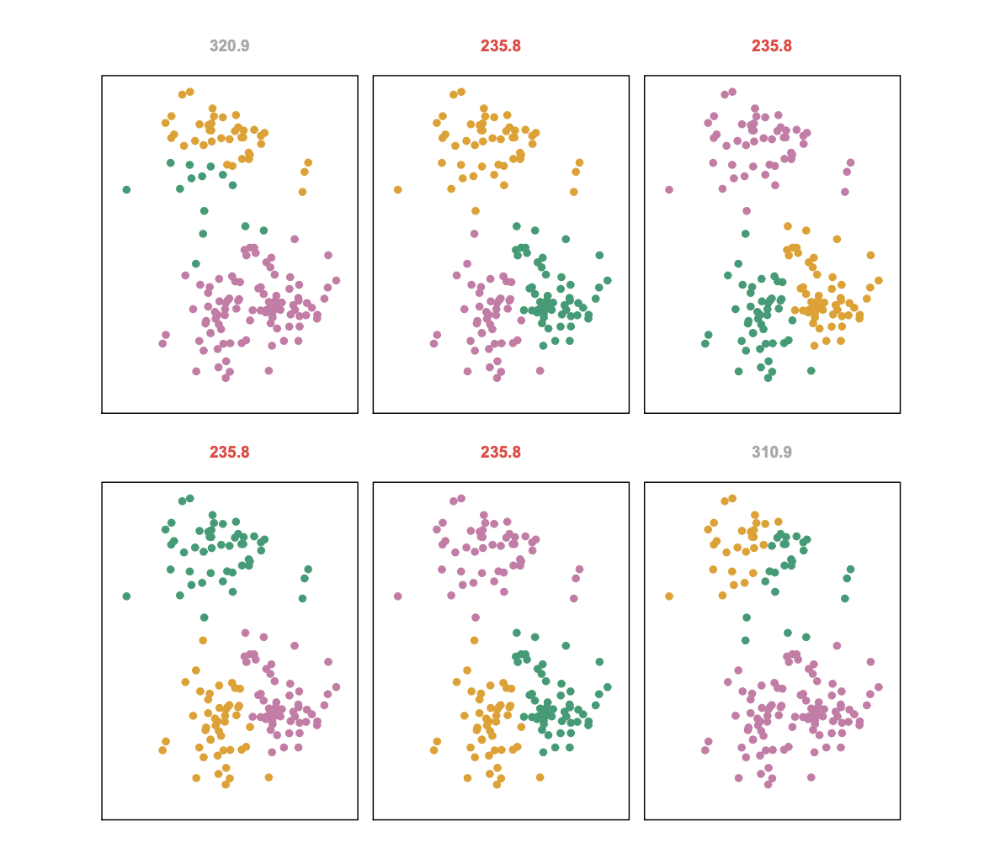
</td>
</tr>
<tr>
<td align="center"> K-means clustering was executed six times with K = 3, each with a different initial random centroid assignment. The plots show three distinct local optima; one had the lowest objective value, indicating the best cluster separation. The red-labeled results all reached the same optimal solution with an objective value of 235.8.</td>
</tr>
</table>

---

Q. What does within-cluster variation depicts? 

<b>Answer</b>

The *within-cluster variation* for cluster $C_k$ is a measure $W(C_k)$ of the amount by which the observations within a cluster differ from each other.

$$W(C_k) = \frac{1}{|C_k|}\sum_{i, i'\epsilon C_k}\sum_{j=1}^{p}(x_{ij} - x_{i'j})^2$$

---

Q. What is the convergence criteria in K-means?

<b>Answer</b>

In K-means clustering, convergence is typically achieved when one of the following criteria is met:

1. **Centroid Stabilization**: The centroids stop changing (or change very little) between iterations.
2. **No Change in Cluster Assignments**: No data points change clusters between iterations.
3. **Maximum Iterations**: The algorithm reaches a pre-set maximum number of iterations.
4. **Minimal WCSS Improvement**: The decrease in within-cluster sum of squares (WCSS) falls below a set threshold.

These criteria ensure the algorithm stops when clusters are stable and further iterations provide minimal benefit.

---

Q. What is Silhouette score, and How do we calculate it?

<b>Answer</b>

The Silhouette score is a measure used to evaluate the quality of clustering by quantifying how similar each data point is to its own cluster compared to other clusters.

We can calculate it using following expressions:

1. Find average inter-cluster distance:

    - For a given data point $i$, compute the average distance of all other points within the same cluster.

    $$a(i) = \frac{1}{|C_i| - 1}\sum_{j\epsilon C,j!=i}d(i, j)$$

    where, $C_i$ is the cluster to which point $i$ belongs, and $d(i, j)$ is the distance between $i$ and $j$.

2. Find average nearest cluster distance 
    - For the same data point $i$, compute the average distance to all points in the nearest neighboring cluster.

    $$b(i) = \min_{C \ne C_i}(\frac{1}{|C|}\sum_{j \epsilon C}d(i, j))$$

    where, $C$ is a cluster different from $C_i$ and $d(i, j)$ is the distance between points $i$ and $j$ in the nearest cluster.

3. Compute Silhouette score for each data point

    - Calculate the Silhouette score for each data point $i$ using values of $a(i)$ and $b(i)$

    $$s(i) = \frac{b(i) - a(i)}{max(a(i),b(i))}$$

    - Note the score ranges from -1 to 1
        
        - $-1$ means data point is misclassified 
        - $0$ means data point is on or very close to the decision boundary between two neighboring clusters
        - $1$ means data point is well clustered   

4. Calculate average Silhouette score

    - Calculate average silhouette score across all data points to get measure of overall cluster quality

    $$ \text{Average Silhouette Score} = \frac{1}{n} \sum_{i=1}^{n}s(i)$$

    where $n$ is the number of data points.

---

Q. What are some applications of K-means clustering?

<b>Answer</b>

Here are some application of K-Means clustering:

- Customer segmentation
- Fraud detection
- Predicting account attrition
- Image compression

---

Q. Can K-means handle categorical data?

<b>Answer</b>

The standard K-means algorithm is not directly applicable to categorical data because it relies on Euclidean distance, which is not meaningful for discrete, non-numeric categories. Unlike continuous data, categorical data lacks a natural origin and does not support Euclidean distance measurements. As a result, traditional K-means, which computes distances based on mean values, is not suitable for such data.

We can use a variation of K-means called K-modes. It uses *Hamming distance* as a distance metric and update centroids by mode instead of mean, making it more subtle for discrete attributes.

---

Q. How do you evaluate the quality of K-means clusters?

<b>Answer</b>

We can use following metrics to evaluate the K-means clusters:

- Elbow Method
- Silhouette Score

---

Q. k-means and GMM are both powerful clustering algorithms.
1. Compare the two.
1. When would you choose one over another?

<b>Answer</b>

---

Q. What are the key parameters in DBSCAN, and what do they represent?

<b>Answer</b>

---

Q. What is the difference between core points, border points, and noise points in DBSCAN?

<b>Answer</b>

---

Q. How does DBSCAN handle clusters of different shapes?

<b>Answer</b>

---

Q. What are the advantages of using DBSCAN over other clustering algorithms, such as K-means?

<b>Answer</b>

---

## Dimensionality Reduction

Q. Why do we need dimensionality reduction?

<b>Answer</b>

We may need dimensionality reduction for following reasons:

- **Mitigate Curse of Dimensionality**: Improve model performance by simplifying the data space.
- **Enhance Visualization**: Facilitate the visualization of high-dimensional data in 2D or 3D.
- **Improve Model Performance**: Reduce overfitting and improve generalization by removing noisy or irrelevant features.
- **Simplify Models**: Make models more interpretable by focusing on key features.

---

Q. List down the two main approaches for dimensionality reduction?

<b>Answer</b>

Dimensionality reduction can be achieved through two main approaches:

- *Feature Selection* : It involves choosing a subset of the most informative features from the original data-set to reduce dimensionality while maintaining interpretability.

- *Feature extraction* : A method where new, lower-dimensional features are derived from the original data to capture essential patterns and relationships.

---

Q. What are some linear techniques of dimensionality reduction?

<b>Answer</b>

We can use following linear feature extraction techniques that can transform the original data into a lower-dimensional representation:

- Factor Analysis(FA)
- Linear Discriminant Analysis(LDA)
- Principal Component Analysis(PCA)
- Non-negative Matrix Factorization

---

Q. What is the benefit of using linear methods for dimensionality reduction?

<b>Answer</b>

- Straight forward and computationally effective 
- Interpretable results
- Effective when relationship in data are approximately linear

---

Q. What is the benefit of using linear methods for dimensionality reduction?

<b>Answer</b>

- Straight forward and computationally effective 
- Interpretable results
- Effective when relationship in data are approximately linear

---

Q. What are the drawbacks of using linear methods for dimensionality reduction?

<b>Answer</b>

- Linear methods capture only global correlations, leading to information loss, especially when the data has non-linear relationships or complex feature interactions.
- They are sensitive to outliers, which can distort the results.
- These methods can be computationally intensive, especially when applied to high-dimensional datasets.
- They face interpretability challenges in high-dimensional spaces due to the curse of dimensionality.

---

Q. What are the benefits of using nonlinear methods in dimensionality reduction?

<b>Answer</b>

- Nonlinear methods use transformations to generate new features that capture complex patterns and relationships in the data, which linear methods might miss.
- By mapping data into a higher-dimensional space, nonlinear techniques can uncover hidden structures even when the original feature set is large relative to the number of samples.
- These methods do not require domain knowledge or assumptions about the data, allowing them to automatically discover intricate relationships between features and outputs.
- Nonlinear dimensionality reduction often results in better predictive performance due to its ability to model complex data interactions effectively.

---

Q. What are some non-linear techniques of dimensionality reduction?

<b>Answer</b>

Manifold based techniques:

- ISOMAP 
- Locally Linear Embedding(LLE)
- t-SNE(t-stochastic neighbor embedding)

Deep learning technique:

- Autoencoders

---

Q. Eigen decomposition is a common factorization technique used for dimensionality reduction. Is the eigen decomposition of a matrix always unique?

<b>Answer</b>

---

Q. Name some applications of eigenvalues and eigenvectors.

<b>Answer</b>

---

Q. We want to do PCA on a dataset of multiple features in different ranges. For example, one is in the range $0-1$ and one is in the range $10 - 1000$. Will PCA work on this dataset?

<b>Answer</b>

Yeah, PCA will work in this scenario but it may not provide optimal principal components.

It is important to scale the data points such that they are centered to have mean zero and standard deviation of $1$. Because PCA is basically variance maximizing exercise. It projects the original data onto directions which maximize the variance. 

*Impact of scaling on PCA*

<table align='center'>
<tr>
<td align="center">
    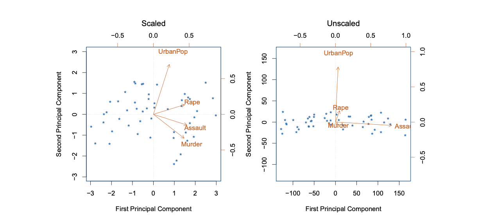
</td>
</tr>
<tr>
<td align="center"> Impact of Scaling the features on PCA </td>
</tr>
</table>

---

Q. Under what conditions can one apply eigen decomposition? What about SVD?
1. What is the relationship between SVD and eigen decomposition?
1. What’s the relationship between PCA and SVD?

<b>Answer</b>

---

Q. How does $t-SNE$ (T-distributed Stochastic Neighbor Embedding) work? Why do we need it?

<b>Answer</b>

---

Q. Is it good to use PCA as a feature selection method?

<b>Answer</b>

No, PCA is not a good way to do feature selection as it does not consider response while calculating the principal components. A feature having less variance does not mean it is providing less or no information.

---

Q. Is PCA a linear model or non-linear model?

<b>Answer</b>

PCA is a linear model. Because, PCA works by finding new axes (principal components) that are linear combinations of the original features. These components are created by finding the directions in the data that maximize variance while ensuring that these directions are orthogonal (uncorrelated) to each other.

---

Q. What is the importance of eigenvalues and eigenvectors in PCA?

<b>Answer</b>

---

Q. How do you decide the number of principal components to retain in PCA?

<b>Answer</b>

We use different approaches to get optimal number of principal components in PCA.

Certainly! Here are the main points summarized:

1. **Explained Variance (Cumulative Variance):** Retain enough components to explain a desired percentage (e.g., 90-95%) of the total variance.

<table align='center'>
<tr>
<td align="center">
    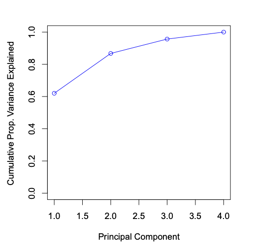
</td>
</tr>
<tr>
<td align="center"> cumulative proportion of variance explained by the principal components </td>
</tr>
</table>

2. **Kaiser Criterion (Eigenvalue > 1):** Keep components with eigenvalues greater than 1, as they explain more variance than individual original variables.

3. **Scree Plot:** Identify the "elbow" in the plot of eigenvalues to decide the number of components to retain.

<table align='center'>
<tr>
<td align="center">
    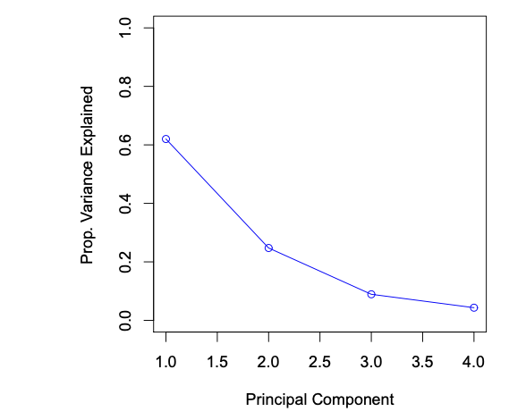
</td>
</tr>
<tr>
<td align="center"> A scree plot depicting the proportion of variance explained by each of the principal components  </td>
</tr>
</table>

4. **Cross-Validation:** Select components that optimize the performance of a predictive model through cross-validation if we are using PCA as a feature extraction tool.

---

Q. What is the difference between PCA and Linear Discriminant Analysis (LDA)?

<b>Answer</b>

- PCA is unsupervised while LDA is supervised in training
- PCA focus on capturing maximum variance in the data without considering class labels, while LDA focus on maximizing class separability, taking class labels into the account.
- PCA outputs the principal components that capture variance while LDA output linear discriminants that enhance class separability.

---

Q. What are the limitations of PCA?

<b>Answer</b>

Here are main limitations of PCA:

1. **Linearity Assumption:** PCA assumes linear relationships between variables, making it less effective for capturing non-linear patterns in the data.

2. **Loss of Interpretability:** The principal components are linear combinations of the original features, which can make them difficult to interpret.

3. **Variance-Based Selection:** PCA prioritizes components based on variance, not necessarily on their relevance to the target variable, which may not always lead to better predictive performance.

4. **Sensitivity to Scaling:** PCA is sensitive to the scale of the features, requiring careful standardization or normalization of data before applying the method.

---

Q. Explain the concept of whitening in PCA.

<b>Answer</b>

PCA Whitening is a processing step for mainly image based data that makes input less redundant.

The goal of whitening is:

- the features are less correlated with each other
- the features all have the same variance.

Whitening has two simple steps:

- Project the dataset onto the eigenvectors. This rotates the dataset so that there is no correlation between the components.

- Normalize the the dataset to have a variance of 1 for all components. This is done by simply dividing each component by the square root of its eigenvalue.

---

## Recommendation Engines

Q. Given this directed graph.
    
1. Construct its adjacency matrix.
1. How would this matrix change if the graph is now undirected?
1. What can you say about the adjacency matrices of two isomorphic graphs?

<b>Answer</b>

---

Q. What is a recommendation system?

<b>Answer</b>

A recommendation system is a subclass of information filtering system that seeks to predict the rating or preference a user would give to an item. These systems analyze data about user preferences and behaviors to suggest products, services, or content that users are likely to find valuable.

---

Q. What is the importance of recommendation system?

<b>Answer</b>

A good recommendation system can help in
- Personalization: Enhances user experience by providing personalized suggestions.
- Engagement: Increases user engagement and time spent on the platform.
- Revenue Growth: Drives sales and conversions by showcasing relevant items.
- User Retention: Improves customer satisfaction and loyalty.

---

Q. Define Items, Queries and Embedding in context of recommendation system?

<b>Answer</b>

- Items(also known as documents) : The entities a system recommends. For google play store, the items are apps to install. For YouTube, the items are videos.
- Query(also known as context) : The information a system uses to make recommendation.
    - User information
        - the id of the user
        - Items that user previously interacted with
    - Additional Context
        - Time of the day
        - The user's device
- Embedding: A mapping from discrete set(set of queries or set of items to recommend) to a vector space called the embeddings space.

---

Q. What are the main components of a recommendation system?

<b>Answer</b>

Recommendation systems consists of the following components:
- Candidate generation
- Scoring
- Re-ranking

---

Q. What is candidate generation in a recommendation system, and what are the main approaches to accomplish it?

<b>Answer</b>

Candidate Generation is the initial phase in a recommendation system where a subset of potentially relevant items (called candidates) is retrieved from the entire item catalog for a user.

There are two main approaches in candidate generation:
- Content based filtering: Uses similarity between items to recommend items similar to what the user likes. For example - If user A watches two cute cat videos, then the system can recommend cute animal videos to that user.
- Collaborative filtering: Uses similarities between queries and items simultaneously to provide recommendations. For example - If user A is similar to user B, and user B likes video 1, then system can recommend video 1 to user A

---

Q. How do content-based and collaborative filtering methods utilize embedding spaces to represent items and queries?

<b>Answer</b>

Both content-based and collaborative filtering techniques employ embedding spaces to map items (such as products, movies, or videos) and user queries into numerical vectors within a common, low-dimensional space $E = \mathbf{R}^d$. This embedding space is significantly smaller than the size of the entire item corpus, enabling efficient computation and storage. It captures some latent structure of the item or query set. Similar items, such as YouTube videos that are usually watched by the same user, end up close together in the embedding space.

---

Q. Define similarity measures in context of recommendation system?

<b>Answer</b>

A similarity measures is a function $s : E \times E \rightarrow \mathbf{R}$ that takes a pair of embeddings and returns a scaler measuring their similarity. The embeddings can be used candidate generation as follows:
- Given a query embedding $q \in E$
- System looks for item embeddings $x \in E$ that are close to $q$
- Get the embeddings with high similarity $s(q, x)$

---

Q. What are different methods to measure degree of similarity?

<b>Answer</b>

To determine the degree of similarity, most recommendation systems rely on one or more of the following:

*Cosine*

This is simply the cosine angle between two vectors, $s(q, x) = cos(q, x)$

*Dot product*

The dot product of two vectors is $s(q, x) = <q, x> = \sum_{i=1}^{d}q_{i}x_{i}$. It is also given by $s(q, x) = ||x|||q||cos(q, x)$. Thus, if the embeddings are normalized, then dot-product and cosine coincide.

*Euclidean distance*

Distance in euclidean space, $s(q, x) = ||q - x|| = [sum_{i=1}^{d}(q_i - x_i)^2]^{\frac{1}{2}}$. A smaller distance means higher similarity. Note that when the embeddings are normalized, the squared Euclidean distance coincides with dot-product (and cosine) up to a constant, since in that case $\frac{1}{2}||q-x||^2 = 1 - <q, x>$

---

Q. How should one choose the appropriate similarity metric for candidate generation in recommendation systems?

<b>Answer</b>

Choosing the right similarity metric for candidate generation in recommendation systems depends on how the metric handles the norms of the embeddings, which impacts the type of items recommended:

1. Dot Product Similarity:
   - Sensitivity to Norms: The dot product similarity takes into account the magnitude (norm) of the embeddings. Items with larger norms tend to have higher similarity scores.
   - Use Case: If the goal is to factor in the popularity of items—where popular items often have larger norms due to frequent updates during training—dot product similarity is advantageous.
   - Consideration: Care must be taken as very popular items could overshadow less popular but relevant items.
2. Adjustments for Popular Items:
   - Modifications: To prevent popular items from dominating, consider using modified similarity metrics that normalize or scale down the influence of the norm. For example, \( \text{similarity} = \text{dot product} / \text{norm}^\alpha \), where \( \alpha \) is a parameter that adjusts the influence of the norm.
   - Alternative Metrics: Metrics like cosine similarity inherently normalize the embeddings, making them less sensitive to the magnitudes and focusing purely on the direction (angle) of the vectors.
3. Handling Rare Items:
   - Challenges: Items that rarely appear may have embeddings that are not frequently updated, potentially making them less representative. If these embeddings are initialized with large norms, it could skew recommendations toward these less relevant items.
   - Solutions: Ensure that embedding initialization and updates during training are managed carefully. Regularization techniques can be applied to prevent the norms of these embeddings from becoming too large.

---

Q. How can we utilize content-based filtering in the candidate generation process?

<b>Answer</b>

Content-based filtering recommends items by analyzing item features and matching them with what a user has previously liked or interacted with. For example, in a Google Play store scenario, each app is represented by a feature matrix with attributes like categories or publishers. Similarly, the user's preferences are represented in the same feature space, based on explicit choices (e.g., selecting "Entertainment apps") or implicit behavior (e.g., previously installed apps). To recommend relevant apps, the system uses a similarity metric, such as dot product, to score each item, ensuring the recommendations are personalized and specific to that user without considering other users' data.

<table align='center'>
<tr>
<td align="center">
    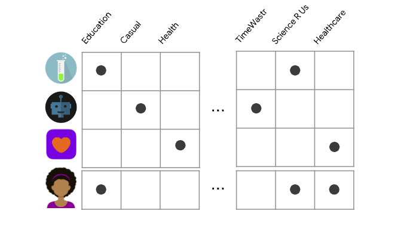
</td>
</tr>
<tr>
<td align="center"> Sample data in case of content-based filtering  </td>
</tr>
</table>

---

Q. State the advantages and disadvantages of content-based filtering?

<b>Answer</b>

**Advantages**

- The model doesn't need any data about other users, since the recommendations are specific to this user. This makes it easier to scale to a large number of users.
- The model can capture the specific interests of a user, and can recommend niche items that very few other users are interested in.

**Disadvantages**

- Since the feature representation of the items are hand-engineered to some extent, this technique requires a lot of domain knowledge. Therefore, the model can only be as good as the hand-engineered features.
- The model can only make recommendations based on existing interests of the user. In other words, the model has limited ability to expand on the users' existing interests.

---

Q. What is the cold start problem in recommendation systems, and how can you address it?

<b>Answer</b>

It occurs when a recommendation system has insufficient data about new users or items, making it challenging to provide accurate recommendations.

We can address cold start problem as follows

- For new users
    - Implement onboarding surveys to gather initial preferences
    - Use demographic information to make initial recommendations
- For new items
    - Leverage content-based filtering using item attributes
    - Encourage initial reviews or ratings through promotions

---

Q. State explicit and implicit feedback with examples?

<b>Answer</b>

- Explicit — users specify how much they liked a particular movie by providing a numerical rating.
- Implicit — if a user watches a movie, the system infers that the user is interested.

---

Q. How does collaborative filtering work?

<b>Answer</b>

Collaborative filtering uses similarities between users and items simultaneously to provide recommendations. This allows for serendipitous recommendations; that is, collaborative filtering models can recommend an item to user A based on the interests of a similar user B.

1. User-based Collaborative Filtering: 

This method focuses on finding users with similar tastes or behaviors. For example:
- The system identifies users who have rated or interacted with items similarly to the target user. It then recommends items that these similar users have liked but that the target user has not interacted with yet.
- Example: If User A and User B have both liked several of the same movies, and User B has liked a movie that User A hasn’t seen yet, the system might recommend that movie to User A.

2. Item-based Collaborative Filtering: 

This method focuses on the similarity between items, rather than users. It looks at how users have rated or interacted with items and finds items that are frequently rated similarly.
- How it works: The system identifies items that are similar to those the user has liked in the past, based on how other users have interacted with them. It recommends items that are highly correlated with the ones the user has shown interest in.
- Example: If many users who liked a specific book also liked another book, then that second book might be recommended to someone who enjoyed the first book.

---

Q. What are the advantages and disadvantages of collaborative filtering?

<b>Answer</b>

**Advantages**

- No domain knowledge necessary: We don't need domain knowledge because the embeddings are automatically learned.
- Serendipity: The model can help users discover new interests. In isolation, the ML system may not know the user is interested in a given item, but the model might still recommend it because similar users are interested in that item.
- Great starting point: To some extent, the system needs only the feedback matrix to train a matrix factorization model. In particular, the system doesn't need contextual features. In practice, this can be used as one of multiple candidate generators.

**Disadvantages**

- Cannot handle fresh items/users
- Hard to include side features for query/item: For movie recommendations, the side features might include country or age. Including available side features improves the quality of the model.

---

Q. How can user and item embeddings be learned using matrix factorization in collaborative filtering?

<b>Answer</b>

In collaborative filtering, user and item embeddings can be learned through matrix factorization by decomposing the user-item interaction matrix into two lower-dimensional matrices. Here’s how it works:

1. Interaction Matrix: First, create a matrix where rows represent users and columns represent items. Each cell in the matrix contains an interaction score (e.g., a rating or a binary interaction like a purchase) between a user and an item.

<table align='center'>
<tr>
<td align="center">
    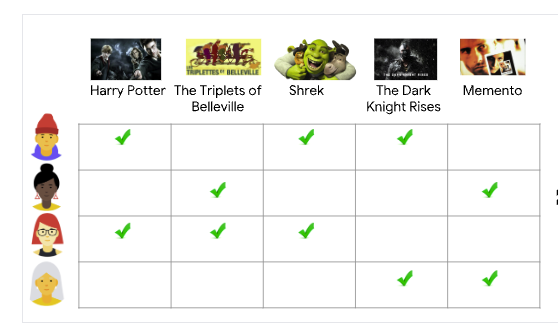
</td>
</tr>
<tr>
<td align="center"> User Item Interaction matrix  </td>
</tr>
</table>

2. Matrix Factorization: Matrix factorization techniques, such as Singular Value Decomposition (SVD) or Alternating Least Squares (ALS), break down this interaction matrix into two lower-dimensional matrices:
- A user embedding matrix: Each row corresponds to a user and represents the user in a lower-dimensional latent space.
- An item embedding matrix: Each row corresponds to an item, similarly represented in the same latent space.

<table align='center'>
<tr>
<td align="center">
    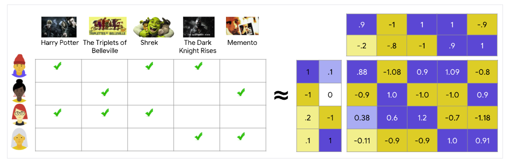
</td>
</tr>
<tr>
<td align="center"> User Item Interaction matrix factorization  </td>
</tr>
</table>

3. Learning Embeddings: The goal of matrix factorization is to minimize the difference between the actual interaction values (from the original matrix) and the predicted values (from the dot product of the user and item embeddings). This process is often optimized using gradient descent or alternating least squares (ALS).
4. Recommendations: Once the embeddings are learned, the system can make recommendations by computing the dot product of a user’s embedding with the embeddings of all items. Items with the highest scores (i.e., closest embeddings) are recommended to the user.

---

Q. What is the issue with learning embeddings using matrix factorization?

<b>Answer</b>

Some limitations of matrix factorization include:

- The difficulty of using side features (that is, any features beyond the query ID/item ID). As a result, the model can only be queried with a user or item present in the training set.
- Relevance of recommendations. Popular items tend to be recommended for everyone, especially when using dot product as a similarity measure. It is better to capture specific user interests

---

Q. How can we use Deep Neural Network model for recommendation?

<b>Answer</b>

Possible DNN model is softmax, which treats the problem as a multiclass prediction problem in which:
- The input is the user query.
- The output is a probability vector with size equal to the number of items in the corpus, representing the probability to interact with each item; for example, the probability to click on or watch a YouTube video.

Here the user query can be
- dense features (for example, watch time and time since last watch)
- sparse features (for example, watch history and country)

<table align='center'>
<tr>
<td align="center">
    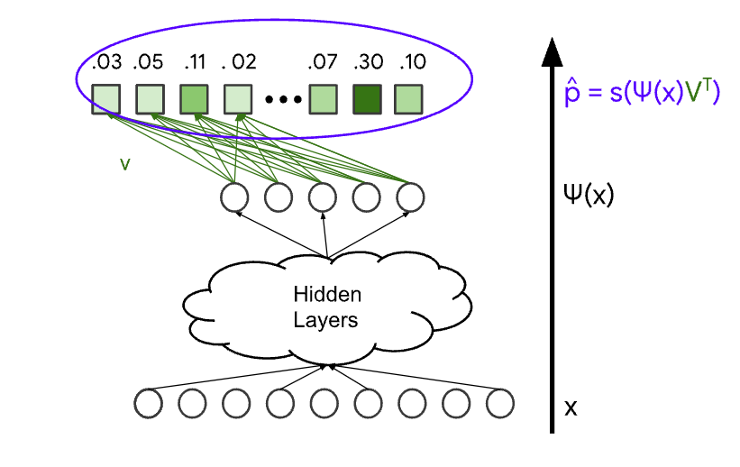
</td>
</tr>
<tr>
<td align="center"> Softmax DNN for recommendation  </td>
</tr>
</table>

---

Q. What is the benefit of using matrix factorization to learn embeddings over softmax DNN?

<b>Answer</b>

Matrix factorization is usually the better choice for large corpora. It is easier to scale, cheaper to query, and less prone to folding.

---

Q. What is the benefit of using softmax DNN over matrix factorization for learning embeddings?

<b>Answer</b>

DNN models are preferable to matrix factorization for scoring because DNN models can use more features to better capture relevance. Also, it is usually acceptable for DNN models to fold, since you mostly care about ranking a pre-filtered set of candidates assumed to be relevant.

---

Q. What strategies can be employed to efficiently compute the nearest neighbors in the embedding space of a recommendation system, and how do they work?

<b>Answer</b>

When dealing with large corpora in recommendation systems, finding the nearest neighbors in the embedding space efficiently is a significant challenge due to the computational demands of exhaustive scoring.

**Offline Exhaustive Scoring**

- If the query embeddings are known statically, the system can compute the scores for all potential candidates offline, before any user interaction occurs. 
- Once scored, the system precomputes and stores a ranked list of the top candidates for each query.
-  During actual user queries, the system simply retrieves the precomputed list of top candidates, significantly reducing the computation required at runtime.

**Approximate Nearest Neighbors (ANN)**

- Implements algorithms such as Locality-Sensitive Hashing (LSH), KD-trees, or vector quantization to find the nearest neighbors approximately rather than exactly.
- Builds an index of the item embeddings that allows for quicker approximate searches.
- During runtime, the system queries this index to find items that are "close enough" to the target embedding, trading off a bit of accuracy for speed and efficiency.

---

Q. Why should we avoid using candidate generators to rank items in a recommendation system, and what are the benefits of separating candidate generation from the ranking process?

<b>Answer</b>

While candidate generators compute a score (e.g., similarity in the embedding space), they should not be used to rank items for several important reasons:

- Multiple Candidate Generators:
    - In many recommendation systems, several candidate generators (e.g., content-based, collaborative filtering, popularity-based models) are used to produce a diverse pool of candidates. Each generator may compute scores differently, and these scores are often not directly comparable across models. If you let the candidate generators handle ranking, the system may end up mixing scores that are incompatible, leading to suboptimal or biased recommendations.
- Complexity of Ranking:
    - Once you have a smaller pool of candidates, the system can afford to use a more complex ranking model with additional features (such as user behavior patterns, real-time context, or item attributes) to better capture the nuances of user preferences. 

---

Q. How does the choice of scoring function affects the ranking of items and quality of recommendations?

<b>Answer</b>

The choice of scoring function can dramatically affect the ranking of items, and ultimately the quality of the recommendations.

- Maximize Click Rate: If the scoring function optimizes for clicks, the systems may recommend click-bait videos. This scoring function generates clicks but does not make a good user experience. Users' interest may quickly fade.
- Maximize Watch Time: If the scoring function optimizes for watch time, the system might recommend very long videos, which might lead to a poor user experience. Note that multiple short watches can be just as good as one long watch.

---

Q. What is the benefit of re-ranking in recommendation system?

<b>Answer</b>

Re-ranking is crucial because it allows for more personalized, context-aware, and business-oriented recommendations. It refines the initial list of candidates by considering a broader range of features, improving the overall relevance and quality of the recommendations, and addressing factors such as diversity, business goals, and user context that might not be considered during candidate generation.

---

Q. Imagine we build a user-item collaborative filtering system to recommend to each user items similar to the items they’ve bought before.
1. You can build either a user-item matrix or an item-item matrix. What are the pros and cons of each approach?
1. How would you handle a new user who hasn’t made any purchases in the past?

<b>Answer</b>

1. 
**User-Item Matrix:**
- Pros
    - Direct Modeling of User Preferences: Directly represents individual user behavior by logging interactions between users and items, facilitating personalized recommendations based on individual user patterns.
    - Flexibility for User-Based Methods: Effective for implementing user-based collaborative filtering, which finds similar users to recommend items they have liked.
- Cons
    - Scalability Issues: As the number of users and items grows, the matrix can become extremely large and sparse, which may lead to performance and storage issues.
    - Cold Start Problem for New Users: Lacks information on new users, making it challenging to provide accurate recommendations without prior data.

**Item-Item Matrix:**
- Pros
    - Stability Over Time: Items typically do not change their intrinsic properties as frequently as user preferences might change, leading to a more stable matrix that doesn’t need to be updated as often.
    - Efficiency with Fewer Users than Items: When there are fewer items than users, an item-item matrix can be more efficient to compute and store, as it's smaller.
- Cons
    - May Ignore Nuance in User Preferences
    - Cold Start Problem for New Items: Similar

2. Handling Cold Start Problem
    - Use Demographic Information
    - Item Popularity
    - Ask for Preferences

---

## Autoencoders

Q. What is an autoencoder? 

<b>Answer</b>

An autoencoder is a specific type of a neural network, which is mainly designed to encode the input into a compressed and meaningful representation, and then decode it back such that the reconstructed input is similar as possible to the original one.

The network maybe viewed as consisting of two parts:

- Encoder function $h = f(x)$ and,
- Decoder that produces a reconstruction $r = g(h)$

<table align='center'>
<tr>
<td align="center">
    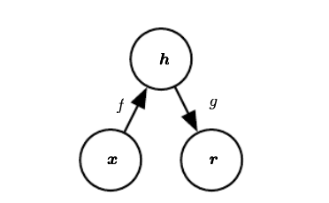
</td>
</tr>
<tr>
<td align="center"> The general structure of an autoencoder, mapping an input x to an output(called reconstruction) r through an internal representation or code h. The autoencoder has two components: the encoder f(mapping x to h) and the decoder g(mapping h to r) </td>
</tr>
</table>

---

Q. Is an autoencoder example of semi-supervised or self-supervised learning?

<b>Answer</b>

True, It sort-of is supervised learning because we give the system explicit goal data (the output should be the same as the input), and it sort-of isn’t supervised learning because we don’t have any manually determined labels or targets on the inputs.

---

Q. Why do we need autoencoders?

<b>Answer</b>

- Map high-dimensional data to two dimensions for visualization
- Compression (i.e reducing the file size)
- Learn abstract features in an unsupervised way so that we can apply them to a supervised task

---

Q. What is the expression of a linear autoencoder? Is it similar to PCA?

<b>Answer</b>

A simple linear autoencoder can be defined as follows:

**Encoder:**

$$
h = f(x) = Wx + b
$$

**Decoder:**

$$
\hat{x} = g(h) = W^{*}h + c
$$

where \( W \in \mathbb{R}^{K \times D} \), \( b \in \mathbb{R}^{K \times 1} \), \( W^* \in \mathbb{R}^{D \times K} \), and \( c \in \mathbb{R}^{D \times 1} \). 

If we learn the functions \( f \) and \( g \) to minimize the squared reconstruction error \( ||\hat{x} - x||^2 \), and set \( W^* = W^T \), the linear autoencoder becomes optimal and is equivalent to Principal Component Analysis (PCA).

---

Q. What are the common loss functions used in training autoencoders?

<b>Answer</b>

The choice of loss function depends on the type of data being used:

- **Continuous Input Data**: Mean Squared Error (MSE) is typically used to measure the reconstruction error.

$$
  L_{AE}(X, X') = \min(||X - X'||_{F}^2)
$$

- **Binary Input Data**: Binary Cross-Entropy (BCE) is used when the input data is binary (values of 0 or 1).

$$
  L_{AE}(X, X') = -\sum_{i=1}^n (x_i \log(x_i^') + (1 - x_i) \log(1 - x_i^'))
$$

---

Q. Can backpropagation be used to train autoencoders?

<b>Answer</b>

Yes, the standard backpropagation technique can be used to train the parameters of autoencoders.

---

Q. What is the bottleneck layer in autoencoders, and what is its significance?

<b>Answer</b>

The bottleneck layer is the central, smallest hidden layer in an autoencoder that compresses the input data into a lower-dimensional representation. Its significance lies in forcing the model to learn the most essential features and patterns of the data, effectively reducing dimensionality and eliminating redundant information. This compressed representation is crucial for tasks like feature extraction, anomaly detection, and noise reduction.

<table align='center'>
<tr>
<td align="center">
    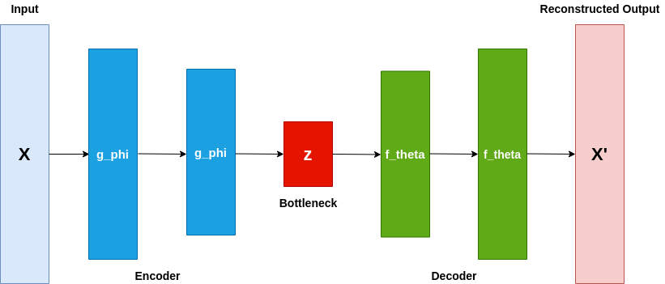
</td>
</tr>
<tr>
<td align="center"> Bottleneck layer in Autoencoders </td>
</tr>
</table>

---

Q. Should the encoder and decoder have the same size in an autoencoder? Which one is typically deeper?

<b>Answer</b>

The encoder and decoder in an autoencoder do not need to have the same size or architecture. The encoder is often designed to be deeper than the decoder, as its primary goal is to learn a compressed, meaningful representation of the input data. A deeper encoder can capture more complex patterns and features, making the compression more effective. The decoder, on the other hand, is generally simpler and reconstructs the input from the compressed representation, focusing on mapping the low-dimensional features back to the original space.

---

Q. What issues might arise if the decoder is deeper than the encoder in an autoencoder?

<b>Answer</b>

Having a deeper decoder than the encoder can lead to potential issues. A powerful decoder might learn to reconstruct the data by memorizing specific patterns or data points, rather than learning meaningful and generalizable features from the encoder's compressed representation. This can result in the model relying on the decoder’s ability to reconstruct from minimal encoded information, reducing the effectiveness of the encoder in learning compact, valuable features. In contrast, a deeper encoder and simpler decoder help avoid this problem by focusing on robust feature extraction.

---

Q. What is the benefit of using tied weights in autoencoder model?

<b>Answer</b>

Autoencoders with tied weights have some important advantages:

- Fewer parameters so better generalization
- It's easier to learn
- In linear case it's equvialent to PCA - this may lead to more geometrically adequate coding
- Tied weights are sort of regularisation

---

Q. What is an undercomplete and overcomplete autoencoders?

<b>Answer</b>

*Undercomplete Autoencoders*

An undercomplete autoencoder has a bottleneck layer (latent space) with fewer neurons than the input layer. 

$$dim(h) < dim(x_{input})$$

*Overcomplete Autoencoders*

An overcomplete autoencoder has a bottleneck layer with more neurons than the input layer, creating a latent representation that is higher-dimensional than the input.

$$dim(h) >= dim(x_{input})$$

<table align='center'>
<tr>
<td align="center">
    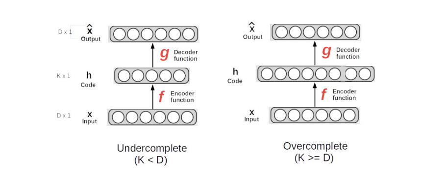
</td>
</tr>
<tr>
<td align="center"> Undercomplete and Overcomplete Autoencoders </td>
</tr>
</table>

---

Q. Why are overcomplete autoencoders less commonly used in practice?

<b>Answer</b>

Overcomplete autoencoders have a latent space dimension larger than the input dimension. This can lead to the autoencoder learning a trivial identity mapping, where it simply copies the input directly to the latent space and then reconstructs it without extracting meaningful features, undermining the purpose of learning compact and useful representations.

---

Q. Why do we need to regularize the autoencoders?

<b>Answer</b>

In undercomplete autoencoders suppose  latent dimension $K=1$ and very powerful encoder $f(x)$ and decoder $g(x). In this case we can achieve very small reconstruction error but learned values will not capture any interesting properties.

In overcomplete autoencoder, suppose encoder $f(x)$ and decoder $g(x)$ are trivial(identity) functions. In this case also we can achieve even zero construction error but learned values will not capture any interesting properties.

In both cases we need to control the capacity of encoder and decoder. Therefore we need to regularize the functions as well as the learned code, not just reconstruction error.

---

Q. What are different ways to regularize autoencoders?

<b>Answer</b>

There are several ways to regularize autoencoders:

- Sparse Autoencoders : Make the learned code sparse
- Denoising Autoencoders : Make the model robust against noisy/incomplete inputs
- Contractive Autoencoders : Make the model robust against small changes in the input

---

Q. What do you mean by deep/stacked autoencoders?

<b>Answer</b>

Autoencoders having more than one hidden layer are called deep autoencoders.

<table align='center'>
<tr>
<td align="center">
    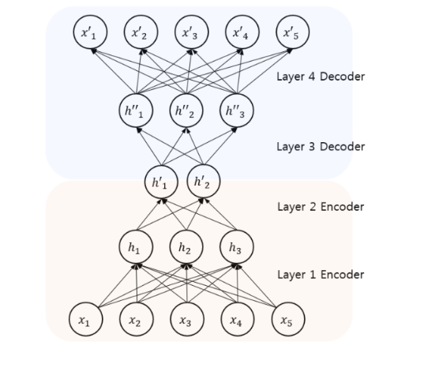
</td>
</tr>
<tr>
<td align="center"> Deep/Stacked Autoencoders </td>
</tr>
</table>

---

Q. Why do we need sparsity in autoencoders?

<b>Answer</b>

- It introduces an information bottleneck without requiring a reduction in the number of nodes at our hidden layers
- It allows our network to sensitize individual hidden layer nodes toward specific attributes of the input data
-  improves generalization, and prevents the autoencoder from simply copying the input to the output
- Sparsity promotes feature selection, reduces overfitting

<table align='center'>
<tr>
<td align="center">
    
</td>
</tr>
<tr>
<td align="center"> Sparse Autoencoders </td>
</tr>
</table>

---

Q. In sparse encoders do we regularize weights or activations of the network?

<b>Answer</b>

We regularize the activations of a network not the weights

---

Q. How can we introduce sparsity constraint in autoencoders?

<b>Answer</b>

There are two main ways by which we can impose sparsity constraint 

- L1 Regularization: We can add a term to our loss function that penalizes the absolute value of the vector of the activations $a$ in layer $h$ for observation $i$, scaled by a tuning parameter $\lambda$.

$$

L(x, \hat{x}) + \lambda \sum_{i}|a_i^{(h)}|

$$

- KL-Divergence: KL-divergence is a measure of the difference between two probability distributions. 

$$
L(x, \hat{x}) + \sum_{j}KL(\rho || \hat{\rho_j})
$$

Where $\rho$ is sparsity parameter and $\hat{\rho}$ is mean activation of a neuron over a collection of samples.

$$
\hat{\rho_j} = \frac{1}{m}\sum_{i}[a_i^{(h)}(x)]
$$

where the subscript $j$ denotes the specific neuron in layer $h$

In essence, by constraining the average activation of a neuron over a collection of samples we're encouraging neurons to only fire for a subset of the observations. 

---

Q. What is denoising method in autoencoders?

<b>Answer</b>

Denoising autoencoders are a type of autoencoder designed to make the learned representations robust to noise and variations in the data. The key idea is to introduce noise to the input data during training, such as by randomly corrupting some input features, and then train the autoencoder to reconstruct the original, clean version of the data from the noisy input.

<table align='center'>
<tr>
<td align="center">
    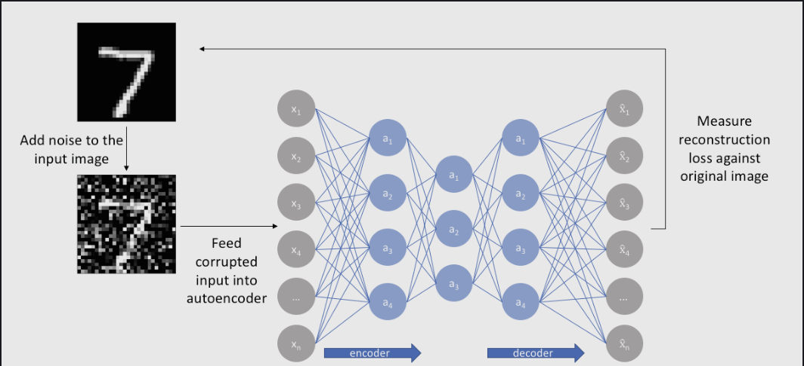
</td>
</tr>
<tr>
<td align="center"> Denoising Autoencoders </td>
</tr>
</table>

---

Q. What are the benefits of denoising encoders?

<b>Answer</b>

Advantages of denoising encoders:

- **Improves Robustness:** Makes the model more resilient to noisy or incomplete data.
- **Enhances Feature Learning:** Encourages the autoencoder to learn more meaningful and invariant features.
- **Prevents Overfitting:** Forces the autoencoder to generalize better by not simply memorizing the input data.

---

Q. Define Contractive Autoencoders?

<b>Answer</b>

Contractive Autoencoders (CAE) are a type of autoencoder designed to learn robust and invariant features by encouraging the model to learn a representation that is less sensitive to small variations in the input data. 

---

Q. What is the loss function in contractive autoencoders?

<b>Answer</b>

Loss function in contractive autoencoders:

$$
\text{Loss} = \text{Reconstruction Loss} + \lambda \sum_{i=1}^{n}\|\frac{\partial h}{\partial x_i}\|^2
$$

The penalty is Contractive penalty and, it is penalizes the Ferbenius norm (squared sum of all elements) of the Jacobian matrix of the encoder’s activations with respect to the input. 

This forces the encoder to produce stable representations that are less sensitive to small changes in the input.

$$
\sum_{i=1}^{n} \left\| \frac{\partial h}{\partial x_i} \right\|^2
$$

- Here, \( h \) represents the hidden layer activations (latent representation), \( x_i \) is the input, and \( \lambda \) is a regularization parameter controlling the importance of the contractive term.

---

Q. State the difference between contractive autoencoders and denoising autoencoders.

<b>Answer</b>

Contractive autoencoders and denoising autoencoders both aim to make the model robust to noise, but they achieve this in different ways. Denoising autoencoders introduce finite-sized noise to the input and train the decoder to reconstruct the original, clean input, making the *reconstruction function* robust to these perturbations. In contrast, contractive autoencoders focus on the encoder by penalizing the sensitivity of the learned representation to infinitesimal changes in the input, ensuring that the *feature extraction process* itself is resistant to small variations.

---

Q. Is Variational Autoencoder(VAE) kind of Stochastic Autoencoders?

<b>Answer</b>

True, VAE is popular example of stochastic autoencoders.

---

Q. State the difference between standard autoencoders and variational autoencoder(VAE)?

<b>Answer</b>

Standard autoencoders output a single value for each encoding dimension. The decoder network then subsequently takes these values and attempts to recreate the original input. While variation autoencoder(VAE) provides a probabilistic manner for describing an observation in latent space. In VAE the encoder model output parameters describing a distribution for each dimension in the latent space

<table align='center'>
<tr>
<td align="center">
    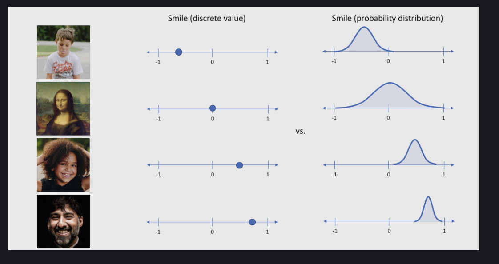
</td>
</tr>
<tr>
<td align="center"> Standard AE has discrete values while VAE has probability distribution in latent space </td>
</tr>
</table>

---

Q. What reconstruction function do we use in stochastic autoencoders?

<b>Answer</b>

Negative log-likelihood:

$$-\log\rho_{decoder}(\frac{x|h})$$

---

Q. What is reparameterization trick in VAE?

<b>Answer</b>

The Reparameterization Trick in Variational Autoencoders (VAEs) is a technique used to enable the backpropagation of gradients through stochastic/random nodes, allowing the model to be trained end-to-end using gradient-based optimization.

---

Q. Why do we need reparameterization trick in VAE?

<b>Answer</b>

In VAE decoder randomly samples from from true posterior $Z ~ q(z | \phi, x)$. To implement encoder and decoder as a neural network and use gradient descent for training we need to backpropogate through random sampling and that is the issue since backpropogation simply can't flow through random node; to overcome this issue we use reparameterization trick.

<table align='center'>
<tr>
<td align="center">
    
</td>
</tr>
<tr>
<td align="center"> Reparameterization trick in VAE </td>
</tr>
</table>

---

Q. What loss function we use in Variational Autoencoder(VAE)?

<b>Answer</b>

The loss function in VAE combines two key components

*Reconstruction loss*

Measures how well the VAE can reconstruct the input data from the latent representation

$$
L_{\text{reconstruction_loss}} = \text{MSE} = \frac{1}{n} \sum_{i=1}^{n} (x_i - \hat{x}_i)^2
$$

*KL Divergence loss*

Measures the difference between the learned latent distribution $q(z|x)$ and a prior distribution $p(z)$, typically a standard normal distribution $\mathcal{N}(0, 1)$.

It encourages the latent space to be well-structured and similar to the prior, enabling smooth interpolation and generation of new data.

$$
\text{KL Divergence} = D_{KL}(q(z|x) \| p(z))
$$

*Loss Function*

$$
\text{Loss} = \text{Reconstruction Loss} + \beta \dot \text{KL Divergence}
$$

Balancing Parameter $\beta$

The parameter $\beta$ controls the trade-off between reconstruction accuracy and the regularization effect on the latent space. Setting $\beta = 1$ is typical, but variations (like $\beta$-VAE) allow tuning this balance.

Here, reconstruction loss makes sure decoder accurately reconstruct the input data and, KL divergence loss encourages the latent space to be well-structured and similar to the prior, enabling smooth interpolation and generation of new data.

---

Q. How can we use autoencoders for classification task?

<b>Answer</b>

Autoencoders can be used for classification by leveraging their ability to learn compressed, informative representations of data:

1. **Feature Extraction**: Train the autoencoder to learn lower-dimensional features of the input. Use the encoder part to extract these features, which capture the most relevant information.

2. **Classification Head**: Attach a classification layer (e.g., softmax) to the encoder output. Fine-tune the entire model with labeled data using a combined loss function that includes both reconstruction loss (to maintain feature quality) and classification loss (e.g., cross-entropy) to optimize for accuracy.

---

Q. What are the limitations of autoencoders?

<b>Answer</b>

- Sensitive to hyperparameters (e.g., layer size, learning rate), requiring careful tuning.
- Vulnerable to noisy data and outliers, affecting representation quality.
- Prone to overfitting, especially with limited training data.
- May not preserve spatial or temporal structures needed for specific tasks like image segmentation.
- Struggle to capture complex, higher-order relationships in the data.

---